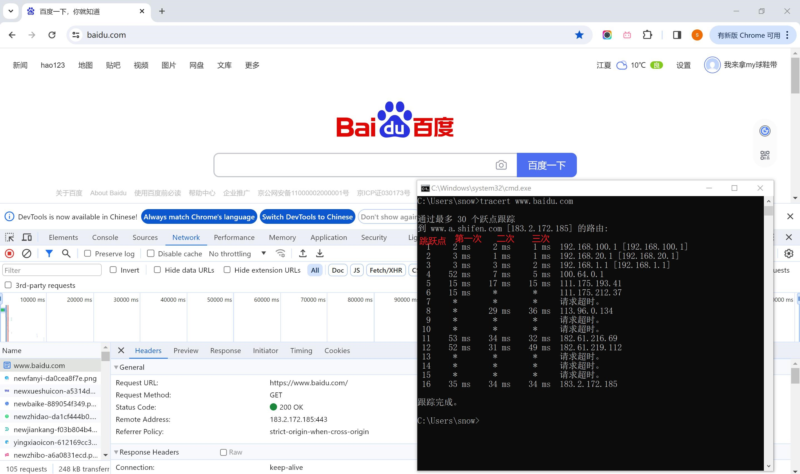

# 1, 概述

## 1.1 网络概述(补充)

### 1.1.1 网络的发展

>在1946世界上第一台计算机ENIAC诞生之后的20多年里,计算机技术一直在寻找关于与通信技术相结合方面的道路,在之后的一些时间里,美国在本土和加拿大境内,建立了一个半自动地面防控系统,简称SAGE(赛其)系统(始于1942年,并在1959年由Rand的一个独立子公司SDC继续开发),可以说是网络的雏形。
>
>受美苏争霸的影响, 美国在1958年2月组建了ARPA(Advanced Research Project Agency/美国国防部高级研究计划局)科研部门。1961年美国国防部授权 APRA 研究一种 **“分布式“ **的指挥系统。它由无数的节点组成,当若干节点被摧毁后,其它节点仍能相互通信。
>
>```C
>// 分布式: 多个服务分布在不同的地方, 这多个服务之间又可以通过某些途径相互关联 
>```
>
>经过ARPA下的信息处理技术办公室/IPTO(Information Processing Techniques Office)不断推动和探索, 并且在建立一系列设计概念和基础理论之后,1968年,美国国防部高级研究计划局/ARPA对ARPANET /阿帕网建设进行招标; 在1969年BBN公司中标之后, 在加州大学洛杉矶分校和斯坦福研究所的协同下, 进行互联的落地实现和测试,随后扩展为四校,加入加州大学圣巴巴分校,犹他大学。随后发展成15个站点,23台主机, 人类社会开始进入 “网络时代”。
>
>```C
>// 网络协议就是两个计算机进行网络通信的时候, 一些信息的约定
>// 网络协议存在的意义: 给两个计算机间传输的数据, 增加自我描述性 -> 让信息自己能描述自己
>
>```
>
>在运行ARPANET不久后,为了在不同主机上实现通信数据信号的操作规范统一(用协议来规范信息传输): 拉里·罗伯茨&史蒂夫·克罗克实现了最初的ARPANET通信协议,称为NCP。
>
>1973年,针对NCP协议存在的诸多问题(只能在同构环境中运行,即:网络上的所有计算机都运行着相同的操作系统, 并且NCP支持的主机数量有限,等等...),鲍伯·卡恩和温顿.瑟夫一起试图研究一个更具有通用性的协议标准,并在不久就共同提出了**TCP传输协议**。并且在1977 年,APRA改建的DARPA(美国国防部高级研究计划局)与BBN公司、斯坦福大学和伦敦大学学院签订商业合同,正式开始在不同的CPU硬件和软件平台上开发TCP协议的验证版本：TCPV1 和 TCPV2。
>
>1978 年,温顿·瑟夫、鲍伯·卡恩、丹尼·科恩(Danny Cohen)和约翰·普斯特尔(Jon Postel)合力将 TCP 协议从分层思想的角度划分为2个协议,即：**1,传输层的TCP协议,负责可靠传输。** **2,网络层的IP协议,负责在不同的网络之间进行互联。**并且不久之后将其演进为稳定版本 TCP/IPv4。
>
>1981年,DARPA资助BBN公司和加州大学伯克利分校,把TCP/IP协议实现到UNIX操作系统。加州大学伯克利分校的学生Bill Joy在BSD UNIX发行版中实现了一个高性能的TCP/IP协议栈(BSD Socket)。
>
>1982年,ARPANET开始采用TCP/IP协议替代NCP协议。1984年,TCP/IP协议得到美国国防部的肯定,成为计算机领域共同遵守的一个主流标准。至此, 基于IP协议标准的Internet诞生了。
>
>值得一提的是,  其中TCP/IP最大的竞争对手就是国际标准化组织(ISO)。ISO在制定国际化标准上经验十足,在1981年提出了OSI七层模型,并大力推广。面对挑战温顿.瑟夫劝说 IBM、DEC、HP 等主机大厂支持TCP/IP协议,但都遭到了拒绝。因为在他们看来 TCP/IP未来将无力与在商业社会中获得过巨大成功的 ISO 抗衡。这种情况下, 美国国防部将 TCP/IP 协议与 UNIX 系统、C 语言捆绑在一起,并由 AT&T 向美国各个大学发放非商业许可证。迫使这些跟 UNIX 系统有紧密联系的企业转向TCP/IP。这为 UNIX 系统、C 语言、TCP/IP 协议的发展拉开了序幕,它们分别在操作系统、编程语言、网络协议这 3 个关键领域影响至今。
>
>1985之后, 几乎所有的操作系统都开始支持TCP/IP协议。经典的TCP/IP五层模型已成实际网络标准。
>
>1986年, 由美国国家科学基金会(NSF)自己出资, 并且基于 TCP/IP 协议,建立完全属于自己的NSFnet广域网。NSFnet 的快速发展非常迅速的占领市场。1990 年 6 月 1 日,ARPANET 正式退出历史舞台。
>
>1990 年 9 月,由 Merit、IBM 和 MCI 公司联合建立了一个非盈利的组织 ANS(Advanced Network&Science Inc,先进网络科学公司)。ANS 的目的是建立一个全美范围的 T3 级**主干网**,1991 年底,NSFnet 主干网与 ANS T3 级主干网进行互联互通。
>
>1989 年,当时在瑞士日内瓦CERN(核子研究中心)工作的Tim Berners-Lee(蒂姆·伯纳斯·李)构建超链接文档的技术,即HTTP/Web技术。
>
>>
>>
>>```C
>>// 1990年之前:  网络和普通人没什么关系
>>
>>// Tim Berners-Lee :  浏览器   网页
>>
>>// 借用电话线 -> 拨号上网
>>```
>>
>>
>
>1994 年,举办互联网大会。Tim Berners-Lee 推动创建了非营利性的 W3C(World Wide Web Consortium,万维网联盟),邀集 Microsoft、 Netscape、 Sun、Apple、IBM 等共 155 家互联网上的著名公司。致力推动 WWW 协议的标准化,并进一步推动 Web 技术的发展。 标志着广义上民用互联网产生了.
>
>```C
>万维网产生: 三个要素
>// HTML:  -> 论文在互联网上的传输格式  --> 浏览器市场争夺战 
>// HTTP:  -> 资源怎么在网络传输
>// URL:   -> 统一资源定位符, 指示资源在互联网上的位置
>
>互联网本质: 就是为了访问远程的资源 (早期网络的线路复用问题)
>```
>
>1997年4月，中国建设了四大网络(中国公用互联网，中国教育科研网，中国科学技术网，中国金桥网)。
>
>1998 年,美国成立非营利性民间组织 ICANN(Internet Corporation for Assigned Names and Numbers,互联网名称与数字地址分配机构),它由商务部的国家电信和信息管理局监督,负责全球互联网域名系统、根服务器系统、IP 地址资源的协调、管理和分配。由 ICANN 的下属机构 IANA(Internet Assigned Numbers Authority,互联网号码分配机构)负责管理全球互联网域名的根服务器。
>
>...

### 1.1.2  网络的基础

>**从组成部分上看:** 一个完整的计算机网络主要由`硬件、软件、协议`三部分构成。硬件是网络互联的物理构成(双绞线/光纤/路由器/交换机/网卡/主机...);  软件是硬件正常运行的驱动(操作系统/聊天软件/APP...); 协议是数据传输时, 数据在硬件之间流转的约定和规范。

>**从范围分类上:** 计算机网络的构成有 广域网、城域网、局域网、...

>**从拓扑结构上:** 计算机中的网络节点和线路的集合关系, 有常见的总线、星型、环状、网状...

### 1.1.3  网络通信的物理实体

>我们说一个完整的计算机网络主要由硬件、软件、协议三部分构成。
>
>那么在硬件组成方面到底有那些常见的硬件构成?
>
>```C
>// 网卡：网卡可以完成帧的封装和解封装，工作在数据链路层。
>// 中继器：中继器以比特方式将网络信号进行再生和重定时，使其能够传输更长的距离。
>// 放大器
>// 集线器：集线器实际上就是一个多端口的中继器。
>// 网桥/桥接器：连接两个局域网的一种存储转发设备，可以将一个大的LAN分割为多个网段，或者将两个以上的LAN互联为一个逻辑LAN。
>// 交换机：交换机有一张交换表，可以记录MAC帧和对应端口。(相当于网桥+集线器)
>// 路由器：路由选择、存储转发、连接外部网络。
>```

>参考图示
>
>
>
>- 计算机中存在网卡,  网卡可以完成帧的封装和解封装，其对应数据链路层的功能。
>- 网线、网卡和协议栈构成了最小的网络单元。网线起着物理介质的作用，以传输比特流/电信号。网卡将信号/比特流转换数据，例如，它将计算机存储的数据转换为网线的比特流/电信号, 或者网线上将比特流/电信号转换为数据在计算机存储。
>- 但是两个主机之间的网线不可以无线延申, 因为网线上的信号存在衰弱问题。所以我们引入放大器/中继器来重新放大信息以实现信息在网线上的更远距离传输。
>- 如果我们有多个主机需要联通, 如果以直连的方式n个主机就需要(n-1)*n/2条全双工线路。而集线器是一种多接口中继器，它不仅可以中继和放大信息，还具有多个连接端口,  集线器可以允许多条网线接入,  并且任何网线传入接口的数据都将被集线器发送到所有其他接口(广播发送)。
>- 通过集线器广播的信息只对两个通信双方的主机有意义, 而对其它主机来说是冗余信息。尤其当同一个集线器链接的主机越多, 这种情况越严重。
>- 所以我们可以通过网桥, 把两个/多个集线器隔为多个网段(一般是两个), 用以隔离冲突域。网桥的工作原理是维护一个"MAC地址和网桥接入端口"的映射表, 所有发送到网桥上的数据帧, 网桥都要从数据帧中取出目的MAC地址, 然后对照映射表, 转发到对应网段。
>- 本质上讲交换机是一个多端口的网桥(转发和路径识别性能远高于网桥), 交换机端口足够多,可以让每隔端口与单个主机相连; 并且交换机和交换机之间可以做到级联; 等....
>- 从理论上交换机可以满足一个人数有限的公司或者组织的内部通信, 但是我们为了做到更远距离和复杂链接的通信(eg:北京的zs<->深圳的ls), 我们需要引入更强大的、两个处于不同局部位置的网络的信息转发机制, 即路由器。
>- 路由器通过路由表和路由以及数据的存储转发策略, 可以让数据在`不同网络间`转发。并在多次转发之后,到达目的网络位置。
>- 而路由器的互联也构成了广义上的互联网。

### 1.1.4 网络架构模式

>在使用网络通信时，可以认为是由一端程序发起了请求而由另一端回复了一个响应。发起请求的那一端称作客户端，响应的那一端称作服务端, 这就是常见的C/S模式。在不同的网络应用，客户端和服务端的组织结构会 有一定的变化，有些应用可能会有固定的一个服务端来响应大量的客户端请求(绝大多数网络应用就是如此设计的), 类似的还有B/S架构，有些的应用可以让程序既充当客户端也充当服务端(比如P2P下 载软件)。
>
>

## 1.2 协议&网络模型

### 1.2.1  协议的作用

>在实际的现实生活中, 计算机网络是由`不同型号的计算机主机`和`各种类型的硬件设备`组合而成,  这些主机和硬件不仅型号/类型不同, 甚至软件逻辑都可能完全不同,  为了能够在这些不同的软硬件间完成`互相通信和交换数据`，我们需要一套在**不同类型软硬件上**通用的**数据的组织方式和构成规则**来`组织数据`, 最终完成跨平台的信息传输和通信。
>
>而用来定义这个**在网络中数据传输的格式**的规范,  就是网络协议,  当然也由于网络环境和数据远距离传输过程的复杂性, 所以我们需要的网络协议是需要很多协议组合在一起使用,  这些组合中不同的协议用以应对网络传输的不同情况下的问题。
>
>我们要求这种**数据的组织方式**被各个机器识别, 也就意味着, 即使各个厂商生产的网络硬件在构成上, 以及软件驱动上可能各不相同, 但是在逻辑上都要遵循协议所规定的**数据构成和传输标准**。
>
>遵守协议, 是当先互联网各个主机进行信息通信的基石。

### 1.2.2 网络模型

>在互联网的发展和演进中, 各个标准化组织和计算机产业相关的软硬件机构,  他们都意识到了互联网需要制定一套具有通用标准的网络数据传输协议。
>
>但在实际发展中和探索中, 在不同的规范体系中，也延伸出了层次结构不同的网络标准模型。比较经典的即`TCP/IP四层模型`和`OSI七层模型`。(虽然TCP/IP成为了事实网络标准, 但是OSI的历史指导意义也不可忽视)

>无论是`OSI参考模型`还是`TCP/IP参考模型`都把他们各自的协议栈设计理念,  按照层级划分:
>
>
>
>注意:
>
>```C
>需要注意的是, OSI的七层协议体系结构，概念清楚，理论完整，但是它既复杂又不实用(书面/实际)。
>TCP/IP四层体系结构，它得到了广泛的应用，不过实际上，TCP/IP本身在最下面的网络接口层并没有定义什么具体内容。
>因此我们一般在学习计算机网络的原理时采用折中的办法，即综合OSI和TCP/IP的优点，采用一种只有五层协议的体系结构, 来对照现实世界网络标准。
>```
>
>为什么要有这么多层级设计:(了解)(类似寄快递:自己检查地址, 收获贴条封装, 司机选车选路.....假如全都自己一个人做, 效率问题,通用性问题)
>
>```C
>降低复杂性：每个层级只关注一部分功能，可以降低问题的复杂性，便于开发和维护。
>模块化设计：每个层级都可以看作是一个独立的模块，具有明确的功能和接口，这种模块化设计可以提高代码的可重用性和可扩展性。
>提高可移植性：由于各层的功能被抽象和封装，所以网络模型具有良好的可移植性，可以适应不同的应用场景和设备。
>简化实现：通过将通信问题分解为多个层级，可以简化每个层级的实现，提高开发效率。
>标准化和统一规范：多层级的设计使得网络协议得以标准化和统一规范，不同厂商和设备可以实现互操作。
>更灵活：多层级的设计使得网络协议可以根据情况适应不同网络环境和通信需求。
>```
>
>在上述网络模型中每一层的意义是什么:(了解)
>
>```C
>OSI参考模型
>//物理层：任务是透明的传输二进制比特流. 物理层主要用来定义数据终端设备和数据通信设备之间物理链接的方法, eg:网络设备接口的机械形状(例如网线接口)、交换电路的数量和排列、信号的电器特征(例如光信号/电信号)、等....
>// 数据链路层: 任务是将网络层的数据组装程帧,进行差错、流量控制,传输管理等。
>// 网络层：负责数据的路径选择和逻辑地址寻址，以确保数据能够在不同的网络节点之间正确传输。它还负责数据包的路由和转发。
>// 传输层：负责建立和维护端到端的连接，并提供可靠的数据传输服务，如数据的顺序控制、差错控制等。它还提供了拥塞控制和流量控制机制。
>// 会话层：会话层负责建立、管理和终止会话，控制数据交换的方式和步骤，以及同步和对话控制等。
>// 表示层：表示层负责对数据进行编码和解码，以确保发送方和接收方之间的数据格式一致。它还负责对数据进行加密和解密、压缩和解压缩等转换操作。
>// 应用层：应用层负责处理特定的应用程序数据，如电子邮件、Web浏览器等应用程序的数据处理和传输。
>TCP/IP参考模型
>// 应用层：为用户提供访问Internet的接口，提供了应用协议。
>// 传输层：提供端到端的数据传输服务，主要功能有格式化信息流、提供可靠传输以及解决不同应用进程的识别问题。
>// 网络层：负责相邻计算机之间的通信，主要功能有处理输入数据报、寻径、流量控制、拥塞控制等。
>// 网络接口层：这一层的功能是将数据从主机发送到网络上，相当于OSI模型中的物理层和数据链路层。
>```

### 1.2.4 数据单元转换

>我们前面讲, 计算机网络从逻辑上按照层级进行划分, 每一个层级都在数据在网络上传输具有独立的意义.  那么我们以发送信息的主机和接收信息的目标主机为例,  在这两个主机上, 每一个层级具体做了什么事情? 每一网络层级对一份在网络上传输的数据到底执行力什么操作?
>
>
>
>当数据从上层转移到下层时，下层的数据单元会把上层数据单元的所有内容包含进来，作为下层协议数据单元的<span style="color:red">有效载荷</span>，除此还可能在头部或者是尾部增加控制信息。这些层级对信息做做的处理, 以及增加的信息, 有各种各种的作用, 整体来说是为了信息能在网络上有效的、准确的、迅速的传输到目的地。(每一个层级对信息的进一步处理意义和作用在1.3中展开)。

### 1.2.3 网络实体和模型对照

>对照数据报文的转化, 物理硬件又在其中起到什么作用哪?
>
>
>
>物理层
>
>```C
>//通常指实际传输的物理设备，比如线缆、放大器、中继器、调制解调器等设备，数据在这些设备中以比特流的形式就行传播。
>```
>
>数据链路层
>
>```C
>//以网卡接收信息为例。网卡将从网线上接收到的比特流转换成包含MAC地址的数据帧, 并且对转换好的数据帧做数据效验和MAC匹配, 然后把数据存储到网卡缓冲区中并给操作系统发送中断做进一步的数据上传处理(操作系统会对数据帧进一步处理)。
>//网桥连接两个局域网用来存储转发数据帧。
>//以及相比较网桥更通用的交换机设备, 相当于多端口网桥。
>```
>
>网络层
>
>```C
>//典型设备路由器, 网络层使用IP地址来描述主机在网络层的位置, 路由器可以根据IP地址在网络层用逐机跳转的通信方式, 在网络层协助数据报转发到更远的网络位置中。(而交换机设备只能工作在网络接口层，它能让数据帧传播到更远的链路上。)
>```

### 1.2.3 常见的协议

>在实际的网络数据传输中, 数据传输需求类型繁多、网络情况也诸多变化, 所以产生了很多协议约定以供用户在不同情况下使用。在网络编程的学习过程中，最重要的参考资源是RFC文档。 RFC文档是一系列草案的集合， 所有的互联网协议和其他相关的内容都位于其中。访问rpc-editor网站([www.rfc-editor.org](http://www.rfc-editor.org/)) 可以比较方便地查阅所有的RFC文档。
>
>eg:
>
> 
>
>| 协议名                 | 层          | 协议功能                                | 占用端口 号 |      |      |
>| :--------------------- | ----------- | --------------------------------------- | ----------- | ---- | ---- |
>| HTTP 超文本传输协议    | 应用层      | 传输Web网站网页和其他资源               | 80          |      |      |
>| FTP文件传输协议        | 应用层      | 文件上传和下载                          | 20/21       |      |      |
>| Telnet 远程连接协议    | 应用层      | 远程登录（无加密）                      | 23          |      |      |
>| SSH安全外壳协议        | 应用层      | 远程登陆(加密)                          | 22          |      |      |
>| SMTP 简单邮件传输协 议 | 应用层      | 电子邮件（邮件在服务器之间提交和传 送） | 25          |      |      |
>| POP3 邮局协议版本3     | 应用层      | 电子邮件（邮件最终交付协议）            | 110         |      |      |
>| TCP                    | 传输层      | 可靠的面向连接的传输层协议              |             |      |      |
>| UDP                    | 传输层      | 不可靠的基于数据报的传输层协议          |             |      |      |
>| IP                     | 网络层      | 网际互联协议                            |             |      |      |
>| ICMP                   | 网络层      | 网络控制消息协议                        |             |      |      |
>| IGMP                   | 网络层      | 网络组管理协议                          |             |      |      |
>| ARP                    | 数据链路 层 | 地址转换协议                            |             |      |      |
>| RARP                   | 数据链路 层 | 反向地址转换协议                        |             |      |      |
>
>注意:
>
>```C
>在不同网络模型中, 协议并不是一成不变的, 比如: ARP协议在TCP/IP模型设计中属于网络层，在OSI模型设计中属于链路层。
>```

# 2, 网络

>我们仅重点关注: 应用层的HTTP协议、传输层TCP/UDP协议、网络层IP协议、数据链路层的数据帧组装和ARP协议...

## 2.1 应用层

>应用层在网络通信中扮演着至关重要的角色，为`用户提供了与网络通信服务交互的接口`。应用层允许开发者根据`具体的应用需求实现特定的逻辑和功能`，使得网络服务在封装了底层网络服务复杂性的情况下,  可以被`定制化以`满足各种特定场景的需求。
>
>应用层存在各种高级网络通信协议，如HTTP(网页浏览)、SMTP(电子邮件发送)、FTP(文件传输)等。这些协议定义了数据交换的格式和规则，使不同的系统和程序能够以标准化的方式进行通信。`而其中在开发中最常遇到的就是HTTP协议`。

### 2.1.1 HTTP

#### 2.1.1.1 HTTP的概述

>1989 年,当时在瑞士日内瓦CERN(核子研究中心)工作的Tim Berners-Lee(蒂姆·伯纳斯·李)构建了超链接文档的技术,即HTTP/Web技术。随后在1994 年的互联网大会上推动W3C(World Wide Web Consortium,万维网联盟)的建立更加剧了互联网的繁荣。
>
>而作为互联网资源访问的三要素之一(HTTP, HTML, URL)。HTTP协议是学习 WEB开发的基石，不了解HTTP协议，就不能说理解了WEB。
>
>作为一个及其重要的应用层协议,  HTTP的核心功能就是在网络上的客户端和服务器之间传输超文本数据, 而这个传输过程最重要的就是构建HTTP请求和响应报文。(客户端发送给服务器的信息，称之为请求信息；服务器返回给客户端的信息称之为响应信息。一般情况下，我们也将发送的信息称之为报文。即HTTP请求报文和HTTP响应报文)
>
>
>
>> ```C
>> http是一个协议: 应用层协议, 端到端的, 比较灵活
>> 一个完整的http:  请求过去, 响应回来
>> http请求:  用户某些行为触发网络请求, 应用层如果http协议, 给用户的数据加一个http头部 -> http请求报文(字符串)
>>            请求行
>>            请求头/消息头
>>            空行
>>            正文
>> 
>> http请求的头部信息 -> 给目标主机看的 (目标主机通过解析这个信息, 得到关键的信息, 对应做操作)
>>     
>>     
>> 看一个http请求应该重点关注什么?
>> 1, 请求的url是否正确
>> 2, 请求方式是否正确
>> 3, 请求携带参数是否正确
>> 4, 是否有响应回来
>> 5, 响应的状态码是多少
>> 6, 响应的正文数据是否正确
>> ```
>>

#### 2.1.1.2 HTTP请求

> 发送的HTTP请求一般称之为`HTTP请求报文`，分为`请求行`、`请求头`、`空行`、`请求体/请求正文`四部分.其中的一些消息头和正文都是可选的，消息头和正文内容之间要用空行隔开.
>
> ```java
> GET / HTTP/1.1
> Host: www.cskaoyan.com
> Connection: keep-alive
> Upgrade-Insecure-Requests: 1
> User-Agent: Mozilla/5.0 (Windows NT 10.0; Win64; x64) AppleWebKit/537.36 (KHTML, like Gecko) Chrome/110.0.0.0 Safari/537.36
> Accept: text/html,application/xhtml+xml,application/xml;
> Accept-Encoding: gzip, deflate
> Accept-Language: zh-CN,zh;q=0.9,en;q=0.8
> Cookie: __yjs_duid=1_94c0d6c26a48d04ztHBDp1OrzJxavJbibLH2u7JlFEirZPMlmtowns; 
> 
> 请求正文/请求体
> ```
>
> ```C
> GET /forum.php?k=v&k1=v1 HTTP/1.1
> Accept: text/html,application/xhtml+xml,application/xml;q=0.9,image/avif,image/webp,image/apng,*/*;q=0.8,application/signed-exchange;v=b3;q=0.7
> Accept-Encoding: gzip, deflate
> Accept-Language: zh-CN,zh;q=0.9,en;q=0.8
> Cache-Control: max-age=0
> Connection: keep-alive
> Cookie: cZBD_2132_saltkey=khv7XrhX; cZBD_2132_lastvisit=1711412144; Hm_lvt_5f3c4e32676aacc710ede84276010d9b=1710550720,1711415747,1711440679; cZBD_2132_sid=mvlLkN; cZBD_2132_lastact=1711440771%09forum.php%09; Hm_lpvt_5f3c4e32676aacc710ede84276010d9b=1711440771
> Host: cskaoyan.com
> Upgrade-Insecure-Requests: 1
> User-Agent: Mozilla/5.0 (Windows NT 10.0; Win64; x64) AppleWebKit/537.36 (KHTML, like Gecko) Chrome/123.0.0.0 Safari/537.36
> 
> 正文
> ```

##### 请求行

>请求行的构成:` 请求方法` `请求资源` `请求协议`
>
>```java
>GET / HTTP/1.1
>```

>请求方法
>
>```java
>请求方法，顾名思义就是以何种请求方法向当前的地址发起请求。常见的请求方法有GET和POST两种。GET和POST请求方法主要的区别在于语义上面的不同。
>	//1, GET主要用来进行查询数据，POST主要用来进行提交数据。这才是GET和POST本质上的区别
>	//2, 至于请求参数的位置不同，不是GET和POST之间的本质区别，仅仅是浏览器的默认行为。对于浏览器来说，浏览器在发送GET请求时，会将请求参数附着在地址栏，也就是请求报文的请求资源后；发送POST请求时，请求参数会位于请求体中，但是这仅仅是浏览器的行为，不是两者之间的本质区别。
>```
>
>了解: (除了GET和POST以外的请求方法)
>
>```java
>PUT请求: 上传资源/数据
>DELETE请求: 删除资源/数据
>HEAD请求: 获取相应头信息
>OPTIONS请求: 获取请求方式/测试链接
>```

>URL
>
>```C
>// URL: 协议 ,  域名OR IP+端口,  服务器内部路径 ,  参数
>https://www.baidu.com/s?rsv_idx=2&hisfilter=1
>http://101.43.69.31:8080/#/login?redirect=%2Fdashboard
>
>// 服务器内部路径(并不是真实存在的路径, 只是个标识)+ 参数: 给目标服务器看的 -> 让目标服务根据这个信息, 分析用户想要什么
>```
>
>请求资源
>
>```java
>// 访问两个不同页面时，主要的区别在于请求资源不同。它是一个给目标服务器的重要标识.
>```

>请求协议
>
>```java
>// 目前HTTP协议的版本是HTTP/1.1，之前的一个版本是HTTP/1.0。1.0和1.1之间最大的区别在于是否支持长连接。长连接就是在一个TCP连接内发送多个HTTP请求。HTTP/1.1默认支持长连接；HTTP/1.0不支持长连接。所以1.1相较于1.0，网络访问速度会有明显提升。
>```

##### 请求头

>请求头是HTTP请求的客户端要告诉服务端的一些请求信息
>
>```C
>// 在HTTP协议中, 请求头/消息头, 有很多很多, 但是常用的只有很少的一部分(只需要知道常用的).
>```
>
>- Accept: 浏览器可接受的`MIME类型`写法为` (大类型)/(小类型)`。 MIME就是使用一种大类型/小类型的方式将互联网上面的资源进行分类。比如text/html，text/txt，image/jpeg，image/png，video/mp4，video/mp3等。因为客户端和服务器在相互通讯时，需要知晓对方传递的资源类型。
>
>```C
>Accept: text/html,application/xhtml+xml,application/xml;q=0.9,image/avif,image/webp,image/apng,*/*;q=0.8,application/signed-exchange;v=b3;q=0.7
>```
>
>- Referer:  包含一个URL，用户从该URL代表的页面出发访问当前请求的页面 (防盗链); 比如用户直接访问B页面，以及通过访问A页面，进而跳转至B页面，这两种方式都进入到B页面，那么两种方式在HTTP请求报文中有没有区别呢？(eg: http://www.cskaoyan.com/forum-280-1.html )
>
>```C
>// 从A网页发起一个http请求,   referer携带的就是A网页的URL 
>```
>
>- Content-Type:  一般就是MIME类型，因为服务器和客户端在相互传递数据时，需要让对方知晓资源的类型，是文本文件或者是二进制文件等。(用到不多) 
>
>- Content-Length: 表示请求消息正文的长度。也就是请求体的长度
>
>```C
>// 准备在正文携带一些信息给服务器
>// Content-Length: 可以描述正文里有多少个字节
>```
>
>- User-Agent: 浏览器类型
>
>- If-Modified-Since:  Wed, 02 Feb 2011 12:04:56 GMT 服务器利用这个头与服务器的文件进行比对，如果一致，则告诉浏览器从缓存中直接读取文件 
>
>```C
>// 时间一致: 说明自从用户拿到这个文件, 服务器没有对这个文件继续做修改, 所以服务器再给用户一个重复的文件, 既无意义, 又增加带宽, 所以让用户读自己的缓存(肯定有这个缓存)
>```
>
>- Cookie: 这是最重要的请求头信息之一 
>
>```C
>// 保存登陆信息: 是一种更安全的方式
>```
>
>- Host: 初始URL中的主机和端口。
>
>​		Host: www.cskaoyan.com  ( 这句话, 代表找一个叫Host的主机 ,  在这  主机 != 服务器/电脑)
>
>```C
>// Host: 用来指明要访问目标服务器上的哪一个虚拟主机
>```

##### 空行

>仅做标识使用

##### 请求正文/请求体

>请求体中一般用来传输客户端需要传递给服务器的数据信息等。该部分可以大量的存放数据，比如当客户端需要提交一个文件到服务器时, 比如用户需要传输给服务器一些安全保密的信息，那么就可以将文件的数据放置在请求体中。

#### 2.1.1.3 HTTP响应

> 服务器发送的HTTP响应一般称之为HTTP`响应报文`，分为`响应行`、`响应头`、`空行`、`响应体`四部分.其中的一些消息头和正文都是可选的，消息头和正文内容之间要用空行隔开.
>
> ```java
> HTTP/1.1 200 OK
> Date: Mon, 06 Mar 2023 13:21:40 GMT
> Content-Type: text/html; charset=gbk
> Content-Length: 7111
> Connection: keep-alive
> Set-Cookie: cZBD_2132_lastact=1678108900%09forum.php%09; 
> Vary: Accept-Encoding
> Content-Encoding: gzip
> YJS-ID: c39171ed0b3336b2-140
> Server: yunjiasu
> 
> ?      韂鸖W桛9蠶?;柩?僐?癞_k3;揑エVw#5H轁?B鍙q让?3?丶尡?c懒@釺jf抣矙<v2轞Jj瞎凞?└?u奉=鬓餅筝s谓倴?ut縫笅I?s睇鱱0>0鴽HG0刭萆?6b?N?CRd.v?緮aū`0
> ```

##### 响应行

```java
//协议    状态码   原因短语
HTTP/1.1  200     OK
```

>版本协议: HTTP/1.1
>
>状态码:  比较常见的: 200   400段   500段 
>
>```java
>// 100: 临时响应(基本相当于废弃状态)
>// 200: 状态正常(请求响应成功)
>// 300: 重定向(http://bing.com/)
>// 404: 未找到(资源不存在)
>// 500: 服务器内部错误
>```
>
>原因短语
>
>```java
>// 成功或者失败(不重要,从语法上可以随意写)
>```

##### 响应头

>- Location: http://www.cskaoyan.com/指示新的资源的位置。要搭配着重定向状态码一起使用。指引浏览器往改地址再次发起请求。
>
>```C
>// 和300段状态码: 重定向配合使用, 服务器告诉客户端, 我没有某个资源, 但是我知道你要的资源在哪. 返回300段, 以及指明Location新地址
>```
>
>- Content-Type: text/html;  服务器发送的内容的MIME类型
>- Content-Length: 80 告诉浏览器正文的长度。响应体的长度。
>
>- Last-Modified: Tue, 11 Jul 2000 18:23:51 GMT文件的最后修改时间
>
>```C
>// 假设返回的文件, 指示最后的修改时间
>```
>
>- Refresh: 1;url=http://www.cskaoyan.com指示客户端刷新频率。单位是秒
>
>```C
>// 服务器返回给客户端一个刷新的行为, 要求客户端按照指定时间, 向指定位置发起请求
>```
>
>- Content-Disposition: attachment; filename=aaa.zip指示客户端保存文件
>
>````C
>// 出现在下载文件的行为中
>````
>
>- Set-Cookie: SS=Q0=5Lb_nQ; path=/search服务器端发送的Cookie
>
>```C
>// 服务器产生一个cookie, 用来标识用户信息,  返回用户, 要求用户下次访问这个域名位置, 携带该cookie
>```
>

##### 空行

>标识使用

##### 响应正文/响应体

> 也叫作响应正文。可以是文本数据也可以是二进制类型数据。其中响应头中Content-Type指示了该资源的类型，比如文本类型资源时，Content-Type:text/html;图片资源时Content-Type:image/png;Content-Length指示了响应体的长度。

#### 2.1.1.4 HTTPS:拓展

> HTTP协议具有非常优秀的一面，但是也有很多不足之处，具体体现如下：
>
> ```C
> //通讯使用明文(未加密)，内容可能会被窃听
> //不验证通讯方的身份，可能遭遇伪装
> //无法验证报文的完整性，内容可能被篡改
> ```
>
> HTTPS分别引入了加密算法、证书、完整性保障来解决对应的问题

#### 2.1.14 抓包: 重要/非常重要

><span style="color: red; font-size:100px">抓包</span>通过分析一个网络请求, 获得一些关键信息
>
>```C
>如果给我们一个http请求, 我们要重点追踪那些信息?
>// 1, 这个请求有没有成功: -> 状态码 -> 200
>// 2, 请求方式是不是想要的方式: get post
>// 2, IP地址对不对? -> 是不是你期望的地址
>// 3, 端口对不对? -> 端口是不是你预期的要发请求的端口
>// 4, 服务器内部路径/资源路径对不对? ->  是不是你预期的要发请求的路径
>// 5, 携带参数对不对? -> 是否符合你的预期 
>// 6, 返回的参数对不对
>```

>抓包: 就是通过分析用户发起的所有请求, 获得一些关键信息
>
>使用Chrome浏览器OR抓包工具进行抓包非常重要.

## 2.2 传输层

>在网络数据传输中传输层向他上面的应用层提供通信服务, 它属于面向通信部分的最高层,同时也是用户功能中的最底层。
>
>在传输层中, 包含若干及其重要的协议(TCP、UDP、SPX、STCP、SCTP),  其中最重要的就是**TCP（传输控制协议）和UDP（用户数据报协议）**。TCP是一种面向连接的协议，提供`可靠的`、`有序的`和`错误校验`的数据传输方式，但传输效率相对较低。而UDP则是一种无连接的协议，传输效率较高但无法保证数据的可靠传输。

### 2.2.1 TCP

#### 2.2.1.1 TCP的特点

>传输控制协议（TCP）是整个四层模型当中最重要的协议，它工作在传输层，其目标是在不可靠的逐跳传输的网络层之上，构建一个可靠的 、面向连接的 、全双工的端到端协议。

>为什么说是TCP是端到端的: 因为对于传输层协议而言, 通信的双方是两台主机之间的通信,  是两台主机的逻辑上的直达信息(这是其逻辑上和`网络层路由传递`以及`数据链路层的帧转发`不同的点)。
>
>

#### 2.2.1.2 TCP报文头部

>当应用层数据从上面转移到传输层时，下层的数据单元会把上层数据单元的所有内容包含进来，作为下层协议数据单元的<span style="color:red">有效载荷</span>。
>
>
>
>以应用层TCP协议为例，当应用层数据从上面转移到传输层，TCP协议会在应用层数据的基础上拼接一个TCP头部信息，封装成一个TCP报文段。
>
>

>TCP头部格式
>
>
>
>各字段意义：(拓展)
>
>```C
>源端口
>//记录发送请求的主机的发送端口
>目的端口
>//记录目标主机接收请求端口
>序号Seq
>//在一个完整的TCP请求中， TCP给整个传输过程中的数据流中每一个字节从小到大开始编号（起始编号来自于三次握手建立连接时第一次握手时随机生成的Seq编号，后续的握手请求，以及握手完成之后的数据传输请求， 都是以这个编号为起始不断向后排序增加），这个序号Seq指的是本报文段所发送的数据的第一个字节的编号。
>//比如某一报文段的序号Seq值是301，它携带的数据共有100个字节，则表明报文段的数据的第一个字节序号编号为301，最后一个字节的序号为400； 那么下一个报文段的序号Seq值就是401
>//占4字节，共有2^32个序号，超出表示范围循环回到0。
>确认号Ack
>//确认号是我们接收到一个请求之后，并且经过对数据检测给对方表示确认这个数据合法的标识。
>//确认号只有在确认位（确认位ACK）为1的时候，才有效，才具有实际意义。（比如第一次握手时ACK为0，确认号无意义）
>//并且，确认号是以期望收到对方的下一个报文段数据的第一个字节序号作为标识的。
>//比如主机A向主机B发送了一个报文段，此次报文段序号Seq为185，携带数据50字节。主机B收到这个报文段并检测合法无误之后，应该要给A回复一个确认报文（未必一定会回复，存在累积确认问题），在这个B回复给A的确认报文中，确认位ACK为1， 确认号Ack位235（=185+50）， 表示B已经收到了字节编号为185~234的正确数据， 期望收到A的标号为235的数据。（因为A已经给B发送了序号从185~234的数据了，下一次A如果要再给B发数据， 数据编号就要从235开始了）
>数据偏移   
>//表示TCP报文段的数据起始处（即：TCP首部后面的应用层数据起始位置）距TCP报文段的起始处有多远，即TCP首部长度。
>//由于占4位，可以表示到2^4为16，能够表示的最大十进制数字是15，因此数据偏移的最大值为60字节(=15*4,因为TCP首部是4字节对齐)。
>//也就是说TCP报文首部最小为20字节，最大为60字节，也就意味这可选 “选项+填充” = “0~40字节”。
>保留位
>//保留为今后使用，目前置为0。
>紧急位URG
>//占用1位， URG=1表示后面的紧急指针有效（它告诉系统报文段有紧急数据，告诉目标主机应当尽快处理）（当接收端的TCP层检测到一个设置了URG位的报文段，它会立即将这部分数据传递给上层的应用程序，而不是按照正常的队列顺序排队。这使得应用程序能够快速响应紧急情况），URG=0表示后面的紧急指针无效。
>确认位ACK
>//占用1位， ACK=1表示前面确认位有效，ACK=0表示前面确认位无效。
>推送位PSH
>//占用1位， 当一台主机接收到PSH=1的报文段，表示应尽快交付给接收该请求的应用进程，而不是等到整个缓存都存满之后再向上交付。（一般接收端的TCP会等待其缓冲区填满或接近填满时再将数据传递给应用程序OR应用程序主动读OR其它小众策略）
>复位位RSH
>//占用1位， 当RSH=1表示TCP链接中出现严重差错（eg：主机崩溃），必须释放链接，然后进行重建连接
>同步位SYN
>//占用1位， 当SYN=1表示这是一个建立连接的请求（eg：SYN=1，ACK=0请求连接第一次握手， SYN=1，ACK=1响应连接请求第二次握手）
>终止位FIN
>//占用1位， 当FIN=1用来释放一个连接，表明此报文段发送方的数据已经发送完毕，并要求释放运输连接（第1和3次挥手）
>窗口大小
>//表示发送端的接收窗口所能允许接受到对方发送的数据量的大小，比如说确认号Ack为701，窗口为1000，则表示下一次接收，从701序号开始，发送报文段的一方还有接收1000个字节数据的缓存空间。在接收数据的时候动态变化（即使当接收方缓存为0，发送方也会定期发送小的探测报文段探测缓存大小）。
>效验和
>//检验的范围包括首部和数据部分（拼接12字节伪首部和效验方式问题，有兴趣可以去了解，不重要）
>紧急指针
>//紧急指针仅指在URG=1时才有意义，它指出本报文段中紧急数据的字节数。当所有紧急数据都处理完毕，TCP就告诉应用程序恢复到正常操作。值得注意的是，即使窗口为0也可以发送紧急数据。
>选项
>//长度可变0~40字节
>//最常见的选项是最大 段大小（MSS）, 用来描述后续希望接收到的报文段的最大值，(这个数值通常受限于(数据帧)MTU，比如MTU为1500，IP数据报头部为20字节， TCP头部为20字节，则MSS是1460)
>```

**可靠传输：**TCP协议的可靠性和可靠传输是靠序号和确认机制，以及重传机制保证的。(拓展)

>```C
>序号机制：
>//TCP将整个数据流分成一个个的字节，并为每个字节分配一个序列号。
>//连接建立时，TCP随机生成一个初始序列号（ISN）。这个序列号随着握手连接和数据传输逐字节递增。
>//每个TCP报文段的序号代表了该报文段中第一个字节的序列号。
>确认机制：
>//TCP使用累积确认机制。当接收方收到一个报文段后，它会发送一个ACK报文段/确认报文，确认号设置为下一个期望接收的字节的序列号。eg： 如果接收方收到序号为N的报文段，并且该报文段包含100个字节的数据，则它会发送一个确认号为N+100的ACK报文段。
>重传机制：
>//如果发送方没有在超时时间内收到对某个报文段回传的确认报文段，发送方会假定该报文段已丢失或在网络中延迟，并重新发送该报文段。
>//TCP也使用快速重传机制。即当发送方收到目标主机回传的对同一数据包的三个重复确认报文段时，它会立即重新发送该数据包，而不是等待超时。
>```

**累积确认**

>累积确认意味着一个ACK报文段/确认报文， 会确认该确认号序号之前直到该序列号为止的所有字节。

**快速重传&窗口机制**

>```C
>窗口大小和流量控制：
>//发送端维护了一个发送窗口，接收端维护了一个接收窗口，这有助于数据传输的效率提升（相比较线性的一问一答方式）。
>//ACK报文段/确认报文包含一个窗口大小字段，告诉发送方接收方还能接收多少字节的数据。这是流量控制的一部分，确保发送方不会溢出接收方的缓冲区。
>//当发送方接收到某部分数据的确认报文， 把这部分数据从发送端口缓存移除
>```
>
>```C
>//我们假设发送窗口发送了4个报文，假设每个报文段携带数据有100字节，序号编号分别是100，200，300，400；表示四份报文分别携带的数据编号是100-199，200-299，300-399，400-499
>//但是在网络传输中100-199被收到（接收此段数据，目标服务器可能会回复确认，也可能此时不回复确认），200-299在网络中丢失
>//紧接着，目标服务器收到了300-399数据， 但是此时目标服务器需要的编号数据是200-299，所以此时目标服务器会直接回传给发送端一个对100-199的确认报文（确认号为200），表示接下来需要编号为200的数据， 而非是对300-399进行确认
>//如果，目标服务器又收到了400-499数据，标服务器还是会直接回传给发送端一个对100-199的确认报文（确认号为200），表示接下来需要编号为200的数据， 而非是对400-499进行确认
>//而从发送端的角度， 如果发送端连续收到了目标主机回传对某个字节编号的重复确认（冗余ACK， 比如上面例子中的发送端将收到连续确认号200）（三次），那么即使在发送报文未超过设置的超时时间，该报文也会重传。 
>```

#### 2.2.1.3 TCP连接的建立和断开

>TCP是面向连接的协议：所以每个TCP连接都有三个阶段：建立连接，数据传送，连接释放。

##### 建立TCP连接：三次握手

>TCP的三次握手流程，如图所示
>
>
>
>```C
>第一次握手：SYN发送
>//发起：客户端向服务器发送一个SYN（同步）报文段，SYN位被设置为1。
>//序列号：客户端在报文段中生成一个序列号x。这个序列号也用于后续的数据传输。
>//目的：这一步的目的是通知服务器客户端想要建立连接，并且客户端准备好了接收数据。
>第二次握手：SYN和ACK的发送
>//确认接收：服务器接收到客户端的SYN（同步）报文后。服务器向客户端发送一个确认报文，ACK（确认）位都被设置为1。确认号为发送报文x加上1。
>//并且，携带自己的序号Seq=y，和同步字段SYN=1.(为了建立双工通信)
>//目的：这一步的目的是服务器同意建立连接，并且准备好接收客户端发送的数据。
>第三次握手：ACK的发送
>//最终确认：客户端接收到服务器的SYN（同步）-ACK（确认）报文后，发送一个ACK（确认）报文作为响应。这个ACK报文只设置ACK位为1。
>//确认号：客户端将确认号设置为服务器的初始序列号加1，确认服务器的SYN。
>//数据准备：从这一步开始，客户端和服务器都确认了对方的初始序列号，准备好了进行数据传输。
>```

##### 释放TCP连接：四次挥手

>TCP的四次挥手流程，如图所示
>
>
>
>```C
>第一次挥手：FIN发送
>//发起关闭：当客户端完成数据发送后，它需要终止连接。客户端发送一个FIN（终止）报文段给服务器。这个报文段中FIN位被设置为1，表明客户端没有更多的数据发送。
>//序列号：这个报文段中的序号Seq为客户端的当前序列号。
>第二次挥手：ACK发送
>//确认接收：服务器接收到客户端的FIN报文后，发送一个ACK报文段作为响应。设置ACK=1，确认号设置为客户端的序列号加1。
>//半关闭状态：此时，客户端到服务器的连接被关闭，但服务器仍然可以向客户端发送数据。这个状态被称为半关闭（half-close）。
>第三次挥手：FIN发送
>//服务器完成发送：一旦服务器也完成了数据发送，它需要向客户端发送一个FIN报文段，来通知客户端它也没有更多的数据要发送。设置FIN=1
>//序列号：这个FIN报文段包含服务器的当前序列号。
>第四次挥手：ACK发送
>//最终确认：客户端接收到服务器的FIN报文后，发送一个ACK报文作为响应。设置ACK=1，序列号为客户端当前的序列号，确认号设置为服务器的序列号加1。
>```

>思考，为什么是三次握手， 而不是四次握手？为什么是四次挥手，而不是三次挥手？

#### 2.2.1.4 TCP的状态转换

>TCP连接在建立连接、通信和关闭连接的过程中，随着通信双方的报文交换， TCP连接的状态也在一直变化。
>
>
>
>ps: TIME_WAIT=2MSL: 什么是MSL？为什么客户端最后还要等待2MSL？
>
>```C
>什么是MSL
>//MSL是指TCP传输中，TCP报文段在网络中存在的最大生存时间。（MSL的主要目的是定义一个时间限制，以确保TCP报文段在网络中不会无限期地存在。是TCP允许不同的实现可以设置不同的MSL值）
>
>为什么客户端最后还要等待2MSL
>//确保对方收到最终ACK：TIME_WAIT状态确保连接的另一方（服务器）有足够的时间接收到最后一个ACK。因为如果服务器没有收到这个ACK，并且第三次挥手超时， 服务端可能认为它发送的第三次挥手失败（迷失在网络中）， 服务器它会重新发送FIN报文段（第三次挥手）。客户端在TIME_WAIT状态可以处理这种情况，确保连接的可靠终止。
>//端口和资源的正确释放：这个等待期还允许操作系统正确地清理和释放用于连接的资源，如端口号。在2MSL结束后，相同的端口号可以安全地被新的连接使用，不会受到旧连接残留数据的影响。
>```

### 2.2.2 UDP

#### 2.2.2.1 UDP的特点

>UDP是一种保留消息边界的简单的面向数据报的传输层协议。
>
>1. **无连接**：UDP是一种无连接协议。这意味着在数据包发送之前，发送方和接收方之间不需要建立连接。每个数据包之间独立发送，彼此之间没有依赖关系。
>2. **低开销**：UDP协议头部较小，只有8字节，相比之下，TCP协议头部最少20字节。UDP的简单性使得它在传输数据时增加的开销更少。
>3. **不可靠传输**：UDP不提供数据到达的保证。因为它不进行错误检查或者纠正，意味着网络上的数据包可能会丢失、重复或乱序到达，且发送方不会得到通知。
>4. **无拥塞控制**：UDP不实现拥塞控制机制。它以相同的速度发送数据，不论网络条件如何。这可能导致在网络质量较差时数据包被丢弃。
>5. **快速传输**：由于缺乏连接建立、确认响应、流量控制等机制，UDP可以更快速地传输数据（能不能到目的地是另外一件事）。
>
>由于其特性，UDP通常用于那些对实时性要求高但对可靠性要求不高的应用，例如视频流、VoIP（语音通信）、在线游戏、早期的聊天软件等。

#### 2.2.2.2 UDP报文头部

>当应用层数据从上面转移到传输层时，下层的数据单元会把上层数据单元的所有内容包含进来，作为下层协议数据单元的<span style="color:red">有效载荷</span>。
>
>
>
>以应用层UDP协议为例，当应用层数据从上面转移到传输层，UDP协议会在应用层数据的基础上拼接一个UDP头部信息，封装成一个UDP报文段。
>
>

>UDP头部格式
>
>
>
>ps: 这个UDP长度 = UDP头部长度+数据长度

## 2.3 网络层

>网络层是计算机网络体系结构中的第三层，负责处理在多个网络之间发送数据包的任务。这一层解决了`不同网络间的通信问题`，确保数据能从源点到达目的地。
>
>网络层的主要协议有ICMP、IGMP以及最重要的IP协议。

### 2.3.1 IP协议概述

>IP协议是四层模型中的核心协议,  TCP、UDP协议都是基于IP协议的,   TCP和UDP数据都通过IP数据报传输。 IP提供一种尽力而为（即不可靠）、无连接的数据报交付服务。不可靠意味着如传递过程中出现差错， IP层可以选择丢弃数据， 而无重传机制；无连接意味着IP协议不会记录传递过程中的路径，那同样的两端发送的不同数据报可能会走不同的路径，并且有可能不按顺序到达。

### 2.3.2 IP地址:拓展

>IP协议规定网络上所有的设备都必须有一个独一无二的IP地址, 一个IP地址共由32比特构成/4字节，IP地址是`一个主机在计算机网络上的位置标识`。
>
>当数据在网络上传输时,   数据包根据指定的IP地址,  才在互联网上的茫茫主机中能找到目标主机。

#### ipconfig&ifconfig

>`ipconfig`和`ifconfig`都是用于配置和查看网络接口的工具。
>
>在Windows系统中，我们可以通过ipconfig是用于显示当前主机的配置:   包括IP地址、子网掩码、默认网关等重要网络配置信息。
>
>在Linux系统中，对应的工具是ifconfig: 可以查看主机的IP地址、掩码、广播地址、网关等。

#### IP地址分类

>我们按照IPv4为例, IP的地址长度为32位，为了方便描述，通常将其按8位一组分隔，并用.号隔开，这种就是点分十进制，比如`255.255.255.255` 、`210.168.10.2`、`150.168.11.111`、`117.32.255.100`、`43.117.6.15`、`0.0.0.0`...。
>
>IP地址的组成是由两部分构成:    <网络号>.<主机号>
>
>```C
>eg: 
>210.168.10.2:   <210.168.10>.<2>	
>150.168.11.111: <150.168>.<11.111>	
>43.117.6.15:	<43>.<117.6.15>		
>```
>
>我们可以把IP地址可分为五大类:
>
>
>
>```C
> A类地址：1.X.X.X~126.X.X.X 
>// 网络号占用1字节 (网络号的字节构成位0XXX XXXX )
>// 每一个网络下可以包含主机1677214台 (2^24 - 2) (24次方是因为主机号占用3字节, 主机号占用1字节)(-2是因为网络本身、广播IP)
>B类地址：128.0.X.X~191.255.X.X
>// 网络号占用2字节 (网络号的字节构成位10XX XXXX XXXX XXXX  )
>// 每一个网络下可以包含主机65534台 (2^16 - 2) 
>C类地址：192.0.0.X~223.255.255.X
>// 网络号占用3字节 (网络号的字节构成位110X XXXX XXXX XXXX  )
>// 每一个网络下可以包含主机254台 (2^8 - 2) 
>D类地址：(224-239)是多播地址，主要用于多路广播用户, 非常用IP(D类地址没有划分为网络号和主机号)。
>E类地址：(240-255)保留地址，目前尚未定义具体的用途。  
>```
>
>广播IP:   专门用于向该IP所在网络中所有IP主机进行发送广播数据行为的一个IP地址。广播地址的主机号全为1。 
>
>网络本身IP: 用于标识该网络号的网络本身, 主机号全为0。 

>认知练习: 如下各个IP地址的类型,网络号和主机号各是多少?
>
>```C
>210.168.10.2:   
>// C类地址
>// 网络号<210.168.10>
>// 主机号<2>	
>150.168.11.111: 
>// B类地址
>// 网络号<150.168>
>// 主机号<11.111>	
>43.117.6.15:
>// A类地址
>// 网络号<43>
>// 主机号<117.6.15>	
>118.255.255.255
>// A类地址
>// 网络号<118>
>// 118网络的广播地址
>214.0.0.0
>// C类地址
>// 网络号<214.0.0>
>// 214.0.0网络的网络本身编号
>```

#### 子网掩码&CIDR

>随着Internet逐渐发展，以上述ABCDE类的形式划分IP, 这种死板的分类方式已经不适应人们的需求。 更新的子网和子网掩码以及CIDR(无分类域间路由选择)的出现逐渐取代了传统的ABC类划分IP.
>
>子网掩码划分:
>
>```C
>两级IP划分(即:<网络号>.<主机号>)地址空间利用率有时很低(假设一个X组织申请了一个A类地址, 但是实际上这个组织根本没有1677214台主机, 或者每一个主机都使用公网IP太过于浪费资源); 并且不够灵活.
>    
>自1985年起, 在IP地址中新增加了一个"子网号字段",让IP地址变为三级结构, IP=<网络号><子网号><主机号>
>    
>而识别一个IP地址子网络地址的方式就是通过子网掩码:
>// 子网掩码是一个32位的二进制, 它是由一串连续的1跟着一串连续的0组成. 1的位数对应IP地址中的网络号和子网号.而0对应主机号, 计算机只需要将IP地址和其对应子网掩码逐位"与", 就可以得出响应的网络地址.
>```
>
>```C
>eg: 假设一个IP地址位43.141.6.15, 子网掩码为255.192.0.0, 那么这个IP地址属于哪类地址,子网号多少, 主机号多少?
>
>//确定IP地址的类别:
>		IP地址 43.141.6.15 的第一个字节是43，落在 1.0.0.0 到 126.255.255.255 的范围内，所以它是A类地址。
>//计算子网号:
>		子网掩码 255.192.0.0 转换为二进制是: 11111111.11000000.00000000.00000000。
>		将IP地址 43.141.6.15 转换为二进制是：00101011.10001101.00000110.00001111。
>		将IP地址与子网掩码进行逐位逻辑与运算来获取子网号:
>										 00101011.10000000.00000000.00000000            							  
>//计算主机号:
>		主机号是IP地址中未被子网掩码覆盖的部分,让我们进行计算。
>                                         00000000.00001101.00000110.00001111
>
>// 结论:对于IP地址 43.141.6.15 和子网掩码 255.192.0.0：
>	属于A类地址
>    子网号为 43.128.0.0
>    主机号为 0.13.6.15
>```
>
>CIDR
>
>```C
>CIDR:无分类域间路由选择, 它在子网掩码的基础上消除了传统A、B、C类网络划分.
>		IP地址 = <网络前缀>,<主机号>
>// 网络前缀生成的方式如上子网掩码方式
>// 并且CIDR还是用斜线法,记录网络前缀所占二进制位数.
>```
>
>```C
>eg: 128.14.33.5/20 
>
>子网掩码20位长度: 11111111.11111111.11110000.00000000
>128.14.33.5   : 10000000.00001110.00100001.00000101
>    
>网络前缀	   : 10000000.00001110.00100000.00000000 -> 128.14.32.0
>主机号			: 00000000.00000000.00000001.00000101 -> 0.0.1.5
>```

#### 一些特殊的IP地址

>下面是一些常见的用于特殊用途的IP地址：
>
>| 前缀                              | 用途                                                       |
>| --------------------------------- | ---------------------------------------------------------- |
>| 0.0.0.0                           | 作为源地址时表示本地主机\|\|作为目的地址时，表示任意IP地址 |
>| 127.X.X.X   (127.0.0.0 127.0.0.1) | 回环地址(127.0.0.1是最常见以及最广泛的支持的回环地址)      |
>| 169.254.0.0                       | 链路本地地址，通常出现在DHCP自动分配IP未完成时             |
>| 255.255.255.255                   | 本地网络广播地址                                           |
>| 10.X.X.X                          | 局域网IP地址                                               |
>| 172.16.X\.X~172.31.X.X            | 局域网IP地址                                               |
>| 192.168.0.X~192.168.255.X         | 局域网IP地址                                               |

#### 局域网

>局域网是指在一个较小的范围内,将各个主机通过网络连接起来, 局域网有诸多好处(eg: 高带宽,低延时,方便广播....), 而我们如果从IP地址分配这个角度来看, 其中一个非常重要的好处就是节省IP地址. **而这个地方涉及到NAT地址转换.**
>
>| 前缀                      | 用途         |
>| ------------------------- | ------------ |
>| 10.X.X.X                  | 局域网IP地址 |
>| 172.16.X\.X~172.31.X.X    | 局域网IP地址 |
>| 192.168.0.X~192.168.255.X | 局域网IP地址 |

#### IPv4和IPv6

>IPv4（Internet Protocol version 4）和IPv6（Internet Protocol version 6）是互联网使用的两个主要版本的互联网协议：
>
>```C
>//地址长度:
>		IPv4地址是32位的，通常以点分十进制格式表示，例如 `192.168.1.1`。
>		IPv6地址是128位的，通常以点分十六进制格式表示，例如 `2001:0db8:85a3:0000:0000:8a2e:0370:7334`。
>//地址空间:
>		IPv4提供大约43亿个唯一地址，这在现今互联网规模下已经显得不足。
>		IPv6拥有极大的地址空间，提供了几乎无限数量的唯一地址，解决了IPv4地址耗尽的问题。
>// 其他(还有不少区别, 有兴趣可以去了解, 上面两个是比较重要的区别)
>```
>
>总的来说，IPv6是对IPv4的一种改进和扩展，它提供了更大的地址空间、更高的安全性、更简单的网络配置和管理以及改进的其他特性，以满足不断增长的互联网需求。

### 2.3.3 IP数据报格式

>当应用层数据从上面转移到网络时，下层的数据单元会把上层数据单元的所有内容包含进来，作为下层协议数据单元的<span style="color:red">有效载荷</span>。
>
>
>
>以网络层IP协议为例，当传输层数据(UDP报文/TCP报文)从上面转移到网络层，IP协议会在传输层数据(UDP报文/TCP报文)的基础上拼接一个IP头部信息，封装成一个IP数据报/IP分组。
>
>

>IPv4头部格式
>
>
>
>各字段意义：(拓展)
>
>```C
>版本
>//值为4时代表IPV4；值为6时代表IPV6, 目前广泛使用版本为4.
>首部长度
>//IP首部的长度, IP首部最小20字节, 最大60字节(4位表示最大数值: 2^4-1=15, 15*4字节对齐=60), (也就意味着可选字段长度+填充=0字节~40字节)
>区分服务  
>//只有在有`QoS差分服务/服务质量`要求时这个字段才起作用。(暂时忽略)
>总长度
>//总长度表示大小0~65535, 单位字节; 表示着整个首部+数据长度.
>标识
>//当IP报文长度超过传输网络的MTU(以以太网为例以太网帧限制位:1500字节)时需要分片，在分片的时候, 把这个标识字段的值复制给所有数据分片的标识字段中，使得这些分片在达到最终目的地时可以依照标识字段的内容重新组成原先的数据。
>标志
>//标志位（3比特位）,用来标识是否分片.（低位MF=1标识后面还有分片，MF=0表示后续无分片）（中间位DF=0不允许切片，DF=1允许切片）
>片偏移
>//该字段表示当前分片在原数据报中的相对位置，也就是相对偏移量。需要注意的是，偏移量的单位是8字节，(因为: 偏移量最大为2^13=8192,   65536/8192 = 8  ) 。
>生存时间
>//该字段表示当前报文还能生存多久。每经过一个路由器，这个值减1，当减到0时，数据报被丢弃，并返回一个ICMP超时消息给发送方。
>协议
>//该字段指出IP报文携带的数据使用的是那种协议(UDP?TCP?)，以便目的主机的IP层能知道要将数据报上交到哪个协议处理。
>首部效验和
>//首部效验
>源地址IP
>//该数据报来自那个IP主机
>目的地址IP
>//该数据报发往那个IP主机
>```

### 2.3.3 IP报文的分片重组

>需要注意的是我们通过IP协议组装的IP数据报是网络层的行为，当我们把IP数据包交给数据链路层， 数据链路层在还需要把IP数据报组装程`数据帧`. 
>
>
>
>但是需要注意的是， 一个数据链路层数据帧能承载的数据部分（仅仅数据部分，不包含帧头部和CRC）最大传送单元（即MTU）， 是有大小限制的。 （以以太网标砖来讲一般是1500字节）。
>
>所以当一个IP数据报过大（帧内的IP数据报>1500）， 我们需要把IP数据报进行拆分、分片发送，以满足数据在链路层传输要求；并且每隔经过分片的IP数据报在网络之间独立传输。 一旦到达 终点的目的主机之后（中间不会重组），目的主机的网络层会将分片重组/还原成一个大IP数据报。
>
>Eg：如下图
>
>

>了解：拓展
>
>```C
>//在实际现实中， 一般来说，当一个请求中数据实在过长, 超过MTU， 在组装TCP报文段的时候会根据TCP协议进行数据拆分， 拆分成多个TCP报文段； 而非是等到TCP报文段组装完毕， 发现IP数据报过长的时候分片
>//同时需要注意的是：UDP与TCP不同，它不像TCP一样提供分段、重传、确认或连接管理等特性。当使用UDP发送数据时, 如果数据长度超过MTU，那么数据拆分发生在IP层而不是UDP层。
>//如果任何分片在到达目的地之前丢失或损坏，目标主机将无法正确重组原始数据包。在这种情况下，除非应用层有自己的恢复机制(一般没有)，否则整个数据包会被丢弃。
>```

### 2.3.4 路由器&路由表&路由转发

>在计算机网络上路由器具有多重重要的功能， 路由器之间的`相互连通`和`路由中转`是构建互联网联通的基石。
>
>路由器维护一个路由表，路由表存储着指向特定网络地址的路径， 当路由器收到一个数据包时，它检查该数据包的目的IP地址，并在路由表中查找一个路由器觉得最适合的路径，然后把这个数据包转发给下一个路由器或者主机， 这种逐跳传输信息的方式又被称为`多跳`。也就是一个路由器实际上只能决定数据报下一跳能转发到哪一个邻居，而不能直接和最终的目的地建立连接。在这种逐跳通信的网络之中寻找来源和目的之间一条合适的通路过程以及最终生成的通路称为`路由`。
>
>而路由器可以充当一个端到端通信系统当中的中间结点。部分主机也支持路由功能。
>
>

**路由表**:(拓展,可以不用了解)

>路由表是路由器或任何可以执行路由功能的网络设备中的一个关键组成部分。它是一个路由信息的集合，它提供了数据包转发决策所需的信息。
>
>了解: 查看主机上的路由表(部分主机也支持路由功能) (以Linux为例route -n ) (比如windows: route print)
>
>
>
>路由器中路由表中一般包括：
>
>```C
>Destination：目的地址，用来标识IP包的目的地址或者目的网络。
>Mask：网络掩码，与目的地址一起标识目的主机或者路由器所在的网段的地址。
>Pre：标识路由加入IP路由表的优先级。(可能到达一个目的地有多条路由，但是优先级的存在让他们先选择优先级高的路由进行利用。)
>Cost：路由开销(不同路由协议计算Cost的算法不一样)。
>Interface：输出接口，IP包将从该路由器哪个接口转发。
>NextHop：下一跳IP地址，说明IP包所经过的下一个路由器。
>```
>
>路由器的路由表信息来源
>
>```C
>路由信息可以通过直连、静态、动态路由学习到.
>直连路由:
>//和路由器直接连接的每个网络自动添加路由条目。即: 如果路由器有一个接口直接连接到特定网络，那么该网络的路由会自动出现在路由表中。
>静态路由:
>//网络管理员手动配置路由信息，指定网络目的地及其对应的下一跳地址或接口。
>动态路由:
>//通过动态路由协议（如RIP, OSPF, BGP等）进行路由交换信息获得的路由信息。
>```
>
>路由器怎么根据路由表转发
>
>```C
>//当路由器接收到一个数据包, 从数据包中取出目的IP地址, 和目的网络进行匹配.
>//目的网络: 来自路由表中, 目的地址和其网络掩码的计算得到
>	eg:一个路由表项: 目的地址112.48.32.50, 网络掩码255.255.128.0
>				得到该表项代表的->目的网络为112.48.0.0
>//遍历路由表, 从数据报中取出的目的IP地址, 和路由每一项路由目的网络地址匹配, 如果该目的IP是在该网络中, 并且最匹配,则取出该项的下一跳的地址, 把数据向下一跳发送.
>	最匹配: 匹配的网络前缀越长, 则为越匹配; 匹配网络前缀最长, 则为最佳匹配
>//如果没有找到匹配项，路由器将使用默认路由进行转发.
>```
>
>路由器会修改MAC地址
>
>```C
>//路由器在转发数据的时候, 会重组数据帧, 会修改数据帧的源MAC地址以及目的MAC地址.
>//在NAT时,甚至会修改源IP地址和源端口
>```

### 2.3.5 NAT简述

>NAT/Network Address Translation技术是在网络之间进行网络地址转化的一种网络技术, 而对于我们来讲, 这个技术比较常用的地方在与路由器进行局域网IP端口和公网IP端口的转换.
>
>```C
>//IPv4地址空间有限，而且在全球范围内已经枯竭。由于大量设备需要连接到互联网，IP地址短缺成为一个问题。NAT允许多个设备在局域网内使用相同的私有IP地址，只在路由器上使用一个公有IP地址来访问互联网。NAT有效地延长了可用的IPv4地址。
>安全性：
>```
>
>路由器具有NAT功能:
>
>```C
>// 当局域网内的设备发送数据包到互联网时，NAT路由器会修改数据包的源IP地址。它会将源IP地址从局域网内的私有IP地址更改为NAT路由器的公有IP地址。
>// 因为局域网内多个不同私有IP的主机共享同一个公有IP地址，在进行NAT数据包转发的时候, 只把局域网IP转化为公网IP, 当数据响应回来的时候, 将无法区分时那个局域网主机发送的.
>// 所以NAT还会执行端口转换PAT/Port Address Translation操作。NAT设备会分配不同的端口号给不同的局域网设备端口，以便唯一标识它们。 
>// 这就意味着,从局域网中发出的包, 传输层的报文头部(TCP/UDP)的`源端口`将会被修改, 网络层的报文头部(IP)的源IP地址将会被修改
>// NAT设备除了进行数据替换, 它会维护一个转发表，用于跟踪内部设备的私有IP地址、端口号和相应的公有IP地址及端口号。用以, 当对应的数据包返回到NAT设备时, 能将它们正确路由回到发送设备。
>```

### 2.3.6 DHCP&ICMP:拓展

#### DHCP

>DHCP/动态主机配置协议/Dynamic Host Configuration Protocol;  实际上是个基于UDP的应用层协议,  用于给加入网络的主机动态分配IP地址.
>
>```C
>// 当一个主机接入网络的时候(Eg:插上网线OR连接WIFI), 主机主机会主动在连接上的网络上发送一条广播报文信息/DHCP报文, 该所在网络上所有主机都能收到该信息(如果没有隔离的话), 但是只有DHCP服务器才能回答/响应次广播报文(在常见的家庭OR日常网络中, 一般很少专门配置专用DHCP服务器, 很多家用路由器都内置了DHCP服务功能),  DHCP服务器在回答(其实也是广播回答)的时候, 在自己维护的DHCP记录中查找该主机的IP地址, 若找到,则返回找到的IP地址, 若没找到,则从该服务器的IP地址池中取出一个IP地址分配给该主机.
>```
>
>ps: DHCP服务器分配给DHCP客户主机的IP地址是临时的。这是因为DHCP服务器通常会为每个客户分配一个租约期，当租约期到期时，客户需要重新申请IP地址才能继续使用 (当然, DHCP也可以在自己的请求IP地址的报文里提出租期要求)。

#### ICMP

>ICMP/报文控制协议/Internet Control Message Protocol;   用以提供与IP协议的诊断和控制信息; 以ICMP差错报文为例, 它可以让到达目标主机的路径上的路由器向源主机报告差错和异常情况.。 ICMP一般认为是网络层的一部分，但是它的实现却需要基于IP，
>
>ICMP数据包是放置在IP数据报之中， 所以可以认为ICMP是一种位于网络层和传输层之间的 协议。
>
>
>
>比如Ping就使用ICMP协议的请求和回答报文,分析连通性等信息.
>
>比如traceroute操作(在Windows下为tracert),  就基于ICMP协议用来跟踪数据报的经过的路由.
>
>

## 2.4 以太网

>TCP/IP协议套件主要集中在网络层(Eg:IP协议)和传输层(Eg:TCP和UDP协议)的定义上，以实现端到端的数据传输和路由。它假定底层的数据链路和物理层已经由底层的标准和技术定义好了，如以太网、Wi-Fi、光纤、电缆等。TCP/IP协议套件没有完整定义数据链路和物理层。
>
>所以我们研究物理层和数据链路层, 就要参考`以太网标准`:  因为数据链路层和物理层通常由完全不同类型的硬件和驱动组成，这些硬件和驱动在不同类型的物理介质上提供了不同的连接和传输方法,  IEEE 802.3这组以太网/Ethernet标准技术，它定义了局域网的数据传输, 比如数据链路层以太网帧格式, 比如物理层规范，包括传输媒体、电缆类型、传输速率和连接方式.

### 2.4.1 交换机

>早期以太网的结构通常是共享的：多个主机共享一个网络介质传播数据，如果多个主机同时发送数据，则需要采用一些算法来避免碰撞。随着网络速度不断提升，共享以太网逐渐被一个星形拓扑接口的网络取代了:主机通过一条独享的网线和交换机连接，由交换机负责在为每个主机提供全双工通信。 
>
>网桥和交换机（就是高性能版网桥）是工作在数据链路层上的设备，它们可以用来将多个链路层网络连接起来，从而构成一个拓展的局域网。交换机拥有自己的MAC地址，并且有许多对外连接的接口，通过一段时间的“学习” ，交换机可以构建一个列表(`端口地址表`)，里面存储了MAC地址和接口编号的对应关系。
>
>
>
>交换机有效的拓展了网络的范围,隔离冲突域, 提升数据传输速度.

### 2.4.2 以太网帧

>当应用层数据从上面转移到网络时，下层的数据单元会把上层数据单元的所有内容包含进来，作为下层协议数据单元的<span style="color:red">有效载荷</span>。
>
>

>以太网中处理的协议数据单元是以太网帧。一个典型以太网帧如下图所示：
>
>
>
>各字段意义：(拓展)
>
>```C
>目的地址
>//数据帧发往的目的主机的MAC地址(MAC地址6字节, eg: 3c:9c:0f:16:0e:f9  OR    3c-9c-0f-16-0e-f9  )
>目的地址
>//数据帧来源的主机的MAC地址
>类型
>//指出数据帧中的数据, 应该交给那个协议处理(用于标识上一层使用的协议) (eg: 0x0800 IP协议,  0x86DD IPv6)
>数据
>//最短46字节,不够则填充0  (整个帧最小64字节,   64字节-6-6-2-4 = 46)
>//最大1500字节
>FCS
>//帧校验序列, 用以效验数据是否出现比特跳变
>```
>
>前导码:
>
>
>
>```C
>//为了使接收端和发送端时钟同步, 前面插入8字节的前导码
>//同步码: 实现帧的比特同步, 交替1010
>//定界符: 表示后面就是`数据帧`, 10101011
>//前导码不计入数据帧
>```

### 2.4.3 ARP协议

>在网络传输中，我们使用IP地址来定位主机的位置，通常来说IP地址并不是固定的(容易产生变化)，但是网络设备在链路层上的MAC地址是由生产厂商分配是固定的。当我们为了传输数据构建以太网帧时，我们需要知道目的地址的MAC地址,   但是一开始我们可能仅具有目的地址的IP地址。
>
>我们需要使用一种协议来执行地址解析，即`IP`地址和  `MAC`地址之间的映射转换 — —这就是`ARP/地址解析协议/Address Resolution Protocol`协议。` ARP协议`可以将32位的IPv4地址映射成48位的MAC地址。
>
> Eg:
>
>```C
>假设IP地址为192.168.1.5的主机A,  向IP地址为192.168.1.9的主机B上发送`数据帧`
>//1, 首先, A主机会检测自己的ARP缓存 (eg: Windows Linux: arp -a ),  看其中是否存储有B主机的IP地址对应的MAC, 有则使用
>//2, 在本机缓存没有找到, A主机会在当前网络上,发送一个ARP广播, 该广播的目的MAC设置为FF-FF-FF-FF-FF-FF(即:广播帧), A主机所在网络中, 都收到这个广播,  但是只有B主机进行匹配发现是根据自己的IP地址询问自己的MAC地址,  所以B向A响应一个数据帧, 帧中包含自己的MAC地址和IP地址,  A收到B的响应后, 将B的MAC地址和IP地址, 写入自己的缓存, 然后接着发送本来要发送的数据帧.
>```

### 2.4.4 网络回环设备

>在有些情况，通信的服务端和客户端会位于同一台主机之上，操作系统提供了一种环回网络接口来实现同一主机上两端通信，环回设备是一种虚拟的网络设备，通常来说环回数据会通过内核协议栈的部分层次， 一般是指传输层和网络层，但是不会走到物理层设备（网 卡）上。通常来说环回设备的通信不会受到MTU的限制。

### 2.4.5 网卡:拓展

>当操作系统封装好以太网帧之后, 操作系统会把以太网帧发送给网卡, 交由网卡把数字信号转换为电信号,并通过物理媒介(如网线)发送出去。而对于一个主机而言,  封装数据帧和之后发送数据的整个过程，是由操作系统和网卡协同工作的。并且DMA`(直接内存访问/DMA, DMA允许网卡直接从系统内存读取数据，而无需CPU的介入，这极大地提高了数据传输的效率)`在这个过程中起着关键作用，因为它允许快速且高效的数据传输，减少了CPU的负担。
>


>必须知道
>
>```C
>// 1, 网络协议是干什么的?  给信息在网络上传输指定标准的
>//                      给数据加头部, 让数据具有自我描述性 (口语)
>// 2, 网络从逻辑上是有层级概念的, 为什么要有层级?  每一个层级都在解决/定义信息在网络传输的不同问题
>// 3, 有哪些网络模型? 有哪些层级?   tcp/ip  osi  ->  
>// 4, 每一层有很多协议?  为什么每一层有很多协议?    网络数据传输的时候, 不同类型的数据传输有不同诉求,所以每一个层级有不同协议, 不同协议偏重解决不同的问题
>// 5, 有哪些比较常见的协议?   TCP, UDP, IP, HTTP
>// 6, HTTP:协议 ->  请求方式问题,  状态码问题, http大体结构  (http -> 浏览器;  http-> 广泛)
>// 7, HTTPS: 更安全,  加密保证安全
>// 8, TCP: 三次握手, 四次挥手( 干什么怎么回事),  (四次挥手-> time_wait),  面向链接
>// 9, TCP怎么保证可靠传输的?  面向链接, 应答机制, 重传机制, 拥塞控制机制 
>// 10, UDP 和 TCP区别
>// 11, IP地址-> 典型的问题: 局域网ip, 公网ip,  特殊的ip
>// 12, (知道) net转换的问题
>//  .... 了解
>
>
>
>( 应用层协议,和下层协议具有截然不同的变现,  应用层协议很灵活,  下层协议比较固定:    -> 应用层是端到端的 , 在发出端和目的端被解析;   下层协议不一样, 需要被网络硬件观察,以做到能正常完成数据转发的任务 )
>
>
>```
>
>