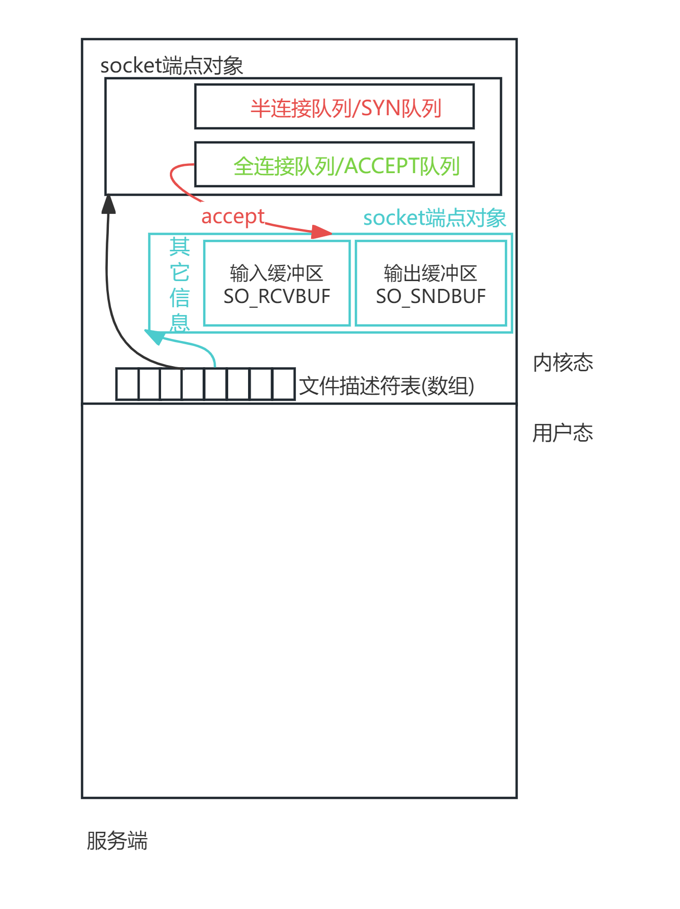

# 网络编程

# 1, 前言

>`TCP/IP协议族标准`只规定了网络模型中`各个层次`的`设计和规范`，具体实现则需要由各个操作系统厂商完成。最出名的网络库由BSD 4.2版本最先推出，所以称作伯克利套接字/Socket，这些API被各大Unix操作系统厂商学习,  随后被移植到各大操作系统中，并成为了网络编程的事实标准。
>
>
>
>Socket 即套接字是指网络中 一种用来建立连接、网络通信的设备，用户创建了Socket之后，可以通过其发起或者接受TCP连接、可以向TCP的发送和接收缓冲区当中读写TCP数据段，或者发送UDP文本。
>
>

# 2, 地址处理

## 2.1 大端地址和小端地址

### 大端法和小端法

>`大端法和小端法`是两种定义了`多字节数据`在计算机`内存`中的`存储顺序`。
>
>大端法/Big-Endian: 是指`高位字节`存储在内存的`低地址`端,而低位字节存储在内存的高地址端。
>
>小端法/Little-Endian: 和大端法相反,`低位字节`存储在内存的`低地址`端,高位字节存储在内存的高地址端。

>而TCP/IP协议规定,当数据在网络中传输的时候,一律使用`网络字节序即大端法`。而"一般"主机比较多的用小端法存储数据(以x86,x64架构为例,  即大多数个人电脑和服务器，包括 Intel 和 AMD 的处理器)。
>
>Eg: 网络字节序
>
>
>
>Eg: 以Linux为例我们可以同`lscpu`命令, 查看主机存储顺序。
>
>

### 大小端转化

>根据上面所述: 网络字节序使用大端法, 主机字节序使用小端法, 我们需要对大小端进行转化。
>
>在Linux中定义了相关转化的函数。( man  htonl )
>
>```C
>#include <arpa/inet.h>
>//convert values between host and network byte order
>uint32_t htonl(uint32_t hostlong);
>uint16_t htons(uint16_t hostshort);
>uint32_t ntohl(uint32_t netlong);
>uint16_t ntohs(uint16_t netshort);
>
>// uint32_t: 无符号 int
>// uint16_t: 无符号 short int
>```
>
>Eg: 代码示例
>
>```C
>#include <testfun.h>
>//  高字节存低地址: 大端法
>//  低字节存低地址: 小端法
>//  htonl: 主机->网络;  小端->大端
>//  ntohl: 网络->主机;  大端->小端
>int main()
>{
>        // int 4字节, 字节位从高到底分别为:  0x75,  0x76, 0x77, 0x78
>        // 因为主机采用小端法, 低字节/低位  -> 低地址
>        // 所以: 按照地址从低到高, 依次存储: 0x78, 0x77, 0x76, 0x75 
>        int num = 0x75767778;
>    
>        // &num: 取地址, 取的是首地址/低地址, 即0x78的地址
>        // 把存储了0x78的地址, 用*c保存, *c指向了0x78
>        char *c = (char *) &num;
>        // 打印0x78, 按照字符打印;  我们知道0x78 对应的二进制为0111 1000 十进制即120,   而字符x所对应的ascii码值为120, 所以打印x
>        printf("the first char : %c \n", *c);
>
>        // htonl: 可以把主机顺序转化为网络序;  即小端转大端
>        // 如果按照大端存储 0x75767778, 即高数字/字节位存小地址/低地址,  则按照地址从低到高, 依次存储0x75, 0x76, 0x77, 0x78 
>        int res = htonl(num);
>        // &res, 代表数字的首地址/低地址,  而低地址的第一个字节存储的是 0x75 
>        // 等价于*c2, 指向0x75所在的字节
>        char *c2 = (char *) &res;
>        // 已知0x75的二进制为 0111 0101, 十进制为117,  117对应的ascii为u,  所以按照字符打印0x75,打印出来的是字符u
>        printf("the first char : %c \n", *c2);
>
>        return 0;
>}
>```

## 2.2 点分十进制转化: 要用结构体类型

>在Socket编程中POSIX 套接字接口设计上提供了多个结构体, 以供我们适用在不同的情况。
>
>比如`sockaddr` 结构体, 这是一种通用的地址结构，它可以通用的描述IPv4和IPv6的结构，<span style="color:red">而且基本上所有涉及到地址的接口都使用了该类型作为参数</span>。(比如: 上面`addrinfo`结构体中,  `sockaddr *ai_addr` 参数, 就使用`sockaddr`类型 )
>
>但是由于它定义的过于通用, 它直接把一个具体的IP地址和端口信息混在一起,  使用起来过于麻烦; 我们需要更具体的IPV4和IPV6类型, 所以POSIX标准又更进一步的定义了`sockaddr_in` 和 `sockaddr_in6`分别用于描述IPV4和IPV6类型。 <span style="color:red">并且, 在需要通用地址参数的函数调用中（例如，`bind()`、`connect()`、`accept()`等, 他们需要`sockaddr`类型的参数），我们可以直接将 `sockaddr_in` 或 `sockaddr_in6` 结构体的指针转换为 `sockaddr` 类型使用,  这种转换是安全的。</span>


>在日常生活中我们更习惯与把IP地址书写成点分十进制, eg: 192.168.10.100...; 当我们需要通过Socket进行网络交互的时候, 我们怎么把它转化为合适的类型?
>
>在POSIX 套接字接口设计上提供了结构体`in_addr`和`in6_addr`, 分别用来存储`IPv4和IPv6类型`的IP地址( man  inet_aton)。以IPv4为例。(man 7 ip)
>
>```C
>struct sockaddr_in {
>       sa_family_t    sin_family; // 地址类型: AF_INET (IPv4)
>       in_port_t      sin_port;   // 端口号: 注意in_port_t实际类型short int   (网络字节序)
>       struct in_addr sin_addr;   // IP地址:  internet address
>};
>
>struct in_addr {
>   	in_addr_t   s_addr;  // in_addr_t -> uint32_t -> 无符号int
>}
>```
>
>这也就意味着, 我们需要一套把`点分十进制`的IP地址, 转为`无符号int`的手段。POSIX 套接字接口同时也设计了一套函数来实现该问题。(man    inet_aton)
>
>```C
>#include <sys/socket.h>
>#include <netinet/in.h>
>#include <arpa/inet.h>
>// 将一个点分十进制的IP地址字符串  -> 转换为网络字节序的32位整型数表示。
>in_addr_t inet_addr(const char *cp);
>// 将一个点分十进制的IP地址字符串  -> 转换为网络字节序的32位整型数表示。
>int inet_aton(const char *cp, struct in_addr *inp);
>// 将网络地址  -> 转换为点分十进制IP地址的字符串形式。
>char *inet_ntoa(struct in_addr in);
>```
>
>EgCode1:
>
>```C
>#include <testfun.h>
>//使用inet_addr, 把点分十进制转化为网络字节序int(说白了就是把字符串直接转为二进制大端存储 )
>int main()
>{
>   char *ip = "116.162.172.51";
>   printf("ip: %s \n", ip);
>
>
>   //    116         162        172        51
>   // 0111 0100   1010 0010  1010 1100  0011 0011
>   // inet_addr的作用是转化为网络字节序int 存储(即大端法: 高字节位存低地址)
>   // 即:
>   //     0111 0100 低位 高字节
>   //     1010 0010 
>   //     1010 1100
>   //     0011 0011 高位 低字节
>   in_addr_t  ip_int = inet_addr(ip);
>
>   // 由于主机是小端存储, 主机认为按照上面内存排序的存储, 你这个数据真实应该是:
>   // 0011 0011  1010 1100  1010 0010  0111 0100
>   // 主机认为这四个字节存储的数值, 十进制是: 866951796
>   printf("ip: %d \n", ip_int);
>
>   // &ip_int 取首地址, 相当于拿到地位: 0111 0100的地址
>   // 0111 0100 -> 十进制116 -> 转成字符 -> 对应ascii码为字符t
>   // 将输出t
>   char *chr = (char *)&ip_int;
>   printf("char:  %c \n", *chr);  
>   return 0;
>}
>```
>
>
>
>EgCode2:
>
>```C
>#include <testfun.h>
>//使用inet_aton, 把点分十进制转化为网络字节序int
>int main()
>{
>    char *ip = "116.162.172.51";
>    printf("ip: %s \n", ip);
>
>    struct in_addr inp; 
>    inet_aton(ip, &inp);
>    printf("ip: %d \n", inp.s_addr );// ip: 866951796
>
>    char *chr = (char *)&inp.s_addr;
>    printf("char:  %c \n", *chr);//char: t  
>    return 0;
>}
>```
>
>EgCode3:
>
>```C
>#include <testfun.h>
>// 使用inet_ntoa:将网络IP  -> 转化为点分十进制IP
>int main(int argc,char*argv[])
>{
>    char *ip1 = "192.168.10.1";
>    struct in_addr inp;
>    inet_aton(ip1, &inp);//将字符串转化成网络IP
>
>    char * ipStr = inet_ntoa(inp);//将网络IP转化成字符串
>    printf("ip: %s \n", ipStr);// 输出: 192.169.10.1
>
>    return 0;
>}
>```

## 2.3  DNS: 记住理论

>我们已知域名和IP地址的关系, 显然我们需要一种机制去建立域名和IP地址的映射关系, 一种方法是修改本机的hosts文件/etc/hosts,但是更加通用的方案是利用DNS协议，去访问一个DNS服务器，服务器当中存储了域名和IP 地址的映射关系。与这个操作相关的函数是`gethostbyname和getaddrinfo`。(man getaddrinfo) (gethostbyname我们认为属于过时状态, 有兴趣同学可以了解: man 3 gethostbyname )
>
>```C
>nslookup  www.baidu.com
>```
>
>```C
>#include <sys/types.h>
>#include <sys/socket.h>
>#include <netdb.h>
>// network address and service translation
>int getaddrinfo(
>    			const char *node, //主机名/域名/点分十进制IPv4/16进制IPv6
>    			const char *service,//服务名/端口(忽略:NULL)
>				const struct addrinfo *hints,//设置期望返回的信息类型(忽略:NULL)
>				struct addrinfo **res//获取符合条件的网址信息
>);
>
>struct addrinfo {
>    int              ai_flags;      // 控制函数行为的标志位(忽略)
>    int              ai_family;     // "指定地址族":AF_INET(IPv4), AF_INET6(IPv6), AF_UNSPEC(协议无关))
>    int              ai_socktype;   // 套接字类型:SOCK_STREAM, SOCK_DGRAM(忽略)
>    int              ai_protocol;   // 使用的协议(忽略)
>    size_t           ai_addrlen;    // 地址的长度，以字节为单位(忽略)
>    struct sockaddr *ai_addr;       // "指向IP地址的指针"
>    char            *ai_canonname;  // 主机的规范名称(忽略)
>    struct addrinfo *ai_next;       // "指向下一个结构体的指针"
>};
>
>指向地址的指针: (使用如下2.4章节)
>struct sockaddr{
>        //...
>} 
>
>指向下一个结构体的指针: (eg: getaddrinfo获得的是一个addrinfo链表, 会返回多个结果)
>```
>
>```C
>void freeaddrinfo(struct addrinfo *res);// addrinfo使用完毕后，应使用 freeaddrinfo 函数释放 
>```

>EgCode:
>
>```C
>#include <testfun.h>
>// 通过getaddrinfo: 把域名变成ip
>int main()
>{
>        struct addrinfo *res;
>        // DNS请求,获得结果
>        getaddrinfo("cskaoyan.com", NULL, NULL, &res);
>        //遍历res  
>        for (struct addrinfo *p = res; p != NULL; p = p->ai_next) {  
>     
>            struct sockaddr  *ipTag = p->ai_addr;
>     
>            if (p->ai_family == AF_INET) { // 判断获得的是否是IPv4地址
>                // 类型转换
>                struct sockaddr_in *socketTagV4 = (struct sockaddr_in *) ipTag;
>                // 获取IP地址
>                struct in_addr ipTagV4 = socketTagV4->sin_addr;
>                // 把网路IP转成点分十进制字符串
>                char * strIp = inet_ntoa(ipTagV4);
>                printf("IPv4,  ip = %s  \n",  strIp);
>            }
>        }  
>        // 释放
>        freeaddrinfo(res);
>        return 0;
>}
>```

# 3, TCP

## 3.1 基于TCP的Socket通信流程

>基于TCP通信的Socket基本流程:
>
>

### 3.1.1 Socket

>初始化Socket:  调用Socket函数创建一个Socket通信端点   (参考: man 2 socket)
>
>```C
>#include <sys/types.h>          
>#include <sys/socket.h>
>//create an endpoint for communication
>int socket(
>        int domain, // 协议:AF_INET (IPv4)、AF_INET6 (IPV6)....
>        int type, 	// 套接字类型: SOCK_STREAM (TCP)、SOCK_DGRAM (UDP)....
>        int protocol// 协议:IPPROTO_TCP (TCP)、IPPTOTO_UDP (UDP)...; 当protocol为0时，会自动选择type类型对应的默认协议。
>);
>// 返回值:  返回值是一个非负整数, 代表一个文件描述符，用于标识创建的套接字，并通过这个描述符进行后续的网络I/O操作。
>```
>
>- 实际上,  socket函数本质是在内核态中创建了一个`对象`。这个函数虽然返回一个文件描述符来标识这个对象 但是它并不是通俗意义上的`文件对象`.
>
>- 在这个socket对象中,  包含了进行网络通信所需要的各种信息和状态(Eg:  地址族/Address Family,  类型/Type,  协议/Protocol,  地址/Socket Address ...)。 <span style="color:red">除了这些信息以外,  这个对象中还维护了两个极其重要的缓冲区`输入缓冲区/SO_RCVBUF`和`输出缓冲区/SO_SNDBUF`, 这两个缓冲区分别用于临时存储从网络接收的数据和待发送到网络的数据。</span>
>

>

> ps: 关于缓冲区的默认大小:   (由 /proc/sys/net/core/rmem_default和/proc/sys/net/core/wmem_default文件指定)

### 3.2.2 Bind

>绑定地址:  使用`bind函数`给`socket端点`绑定端口和IP   (函数参考: man 2 bind)
>
>```C
>#include <sys/types.h> 
>#include <sys/socket.h>
>//bind a name to a socket
>int bind(
>        int sockfd,					// socket端点文件描述符
>        const struct sockaddr *addr,// 要绑定的IP地址和端口号
>        socklen_t addrlen			// 指定的addr代表结构体长度,确保bind函数可以正确解析给定的地址信息:sizeod(addr)
>);
>//返回值: 成功时返回0。失败返回-1
>```
>
>- const struct sockaddr *addr参数:    该参数用于提供给socket端点IP和端口信息,  但是`sockaddr`是一个通用的地址结构，实际使用的时候还是要使用`sockaddr_in  (IPv4)`，`sockaddr_in6  (IPv6)`。
>
>- 在选择端口号设置时,  建议应当避开知名端口号的范围(<1024)。
>
>- 使用bind 函数时要注意其地址是大端法描述的，可能需要执行强制类型转换。
>
>- IP设置:
>
>  ```C
>  当服务端设置监听IP地址时，对于IPv4，有几个特殊的IP地址可以使用:
>  
>  0.0.0.0
>  // 表示服务端愿意接受指向服务器主机的任何IP地址的连接。
>  自己主机IP
>  // 无需赘述, 最正常操作
>  127.0.0.1
>  // 这个地址用于测试和开发，仅允许接收来自本机的回环连接。
>  ```

>ps1:  一般我们都是给服务端`bind`,  那么客户端也可以`bind`吗?  
>
>- 正常来讲客户端不需要bind;   客户端不bind操作系统都会分配一个临时的随机端口, 这已经足够使用了。
>- 当然如果有特殊需求, 也可以对客户端进行bind,  用以指明发送和接收数据的IP和端口。
>
>ps2: 服务端可不可以不bind?
>
>- 如果服务端不进行bind操作,   一般操作系统都会分配一个临时的随机端口以供使用,   但是从逻辑上完全没有任何意义, 不允许这样操作。

### 3.1.3 Listen

>设置监听: 使用`listen函数`对设置好端口和IP的服务端`socket端点`监听外部连接请求   (函数参考: man 2 listen)
>
>```C
>#include <sys/types.h>         
>#include <sys/socket.h>
>//listen for connections on a socket
>int listen(
>        int sockfd, 	// socket端点文件描述符
>        int backlog		// 这个参数指定了套接字可以挂起的最大连接数
>);
>//返回值: 成功返回0, 失败返回-1
>```
>
>- 一旦启用了listen之后，操作系统就知道该套接字是服务端的套接字，操作系统内核就不再启用其发送和接收缓冲区(回收空间)，转而在内核区维护两个队列结构： 半连接队列和全连接队列。
>
>  ```C
>  // 半连接队列用于管理成功第一次握手的连接
>  // 全连接队列用于管理已经完成三次握手的队列。
>  ```
>

>

>- `backlog`参数实际上是用来设置Socket的ACCEPT队列/全连接队列的最大长度(在有的操作系统上backlog指的是`半连接队列`和`全连接队列`的长度之和) ,  给一个一般性的正数即可。
>
>- 需要注意的是, 如果队列已经满了，那么服务端受到任何再发起的连接都会直接丢弃（大部分操作系统中服务端不会回复，以方便客户端自动重传）

>ps:  可以使用 netstat -an 命令可以查看主机上某个端口的监听情况 (eg: netstat -an|grep 12345)
>
>

### 3.1.4 Connect

>建立连接:  使用`connect函数`使`客户端`向`服务器`发送建立连接请求,初始化一个连接  (man 2 connect)
>
>```C
>#include <sys/types.h>
>#include <sys/socket.h>
>//initiate a connection on a socket
>int connect(
>        int sockfd,					// socket端点文件描述符
>        const struct sockaddr *addr,// 目标服务器的地址和端口信息
>        socklen_t addrlen			// 指定的addr代表结构体长度,确保bind函数可以正确解析给定的地址信息
>);
>// 返回值: 成功0, 失败-1
>```
>
>- 客户端在调用connect可以不使用bind来指定本地的端口信息，这客户端就会随机选择一个临时端口号来作为源端口。
>- 调用connect预期是完成TCP建立连接的三次握手。 如果服务端未开启对应的端口号或者未监听，则只能收到一个RST回复，并且报错返回的内容 是"Connection refused"。

### 3.1.5 Accept

>获取连接: 使用`accept函数`从`服务端`的`socket端点`的全连接队列中取出一个连接  (man 2 accept)
>
>```C
>#include <sys/types.h> 
>#include <sys/socket.h>
>// accept a connection on a socket
>int accept(
>        int sockfd,				// socket端点文件描述符
>        struct sockaddr *addr,	// 用来获取连接对端/客户端的地址信息。如果不需要对端的地址信息, 可设参数为NULL
>        socklen_t *addrlen		// 用来获取addr结构体的大小。如果使用addr/非NULL,那么addrlen必须设置addr的大小/sizeof(addr);  如果addr是NULL，addrlen也必须是NULL。
>);
>// 返回值: 成功则返回一个新的套接字文件描述符,用于与客户端通信。失败返回-1。
>```
>
>- 需要特别注意的是， addrlen参数是一个传入传出参数，所以使用的时候(非NULL)需要主调函数提前分配好内存空间:sizeof(addr)
>- accept 函数由服务端调用，用于从全连接队列中取出下一个已经完成的TCP连接（三次握手）。如果全连接队列为空（没有新的客户端成功三次握手），那么accept会陷入阻塞。  一旦全连接队列中到来新的连接，此时accept操作就会就绪 (注意: <span style="color:red">这种就绪是`读就绪`</span>)。
>- 当accept执行完了之后，内核会创建一个新的套接字文件对象，该文件对象关联的文件描述符是accept的返回值，文件对象当中最重要的结构是一个发送缓冲区和接收缓冲区，可以用于服务端通过TCP连接发送和接收TCP段。    
>
>
>
>ps:   注意区分两个套接字对象:   通过把旧的管理连接队列的套接字称作`监听套接字`，而新的用于发送和接收TCP段的套接字称作`已连接套接字`。通常来说，监听套接字会一直存在，负责建立各个不同的TCP连接(只要源IP、源端口、目的IP、目的端口四元组任意一个 字段有区别，就是一个新的TCP连接)，而某一条单独的TCP连接则是由其对应的`已连接套接字`进行数据通信的。

### 3.1.6 Send和Recv

>发送和获取数据:  客户端OR服务端使用 `Send和 Recv`用于发送和接收TCP数据。 (man 2 send) (man 2 recv)
>
>```C
>#include <sys/types.h>
>#include <sys/socket.h>
>// send a message on a socket
>ssize_t send(
>        int sockfd, 		// socket端点文件描述符
>        const void *buf, 	// 指向要发送数据的缓冲区的指针
>        size_t len, 		// buf中数据的长度，以字节为单位
>        int flags			// 用于指定发送操作的额外选项: MSG_OOB(发送紧急数据)、MSG_DONTROUTE(不经过路由器直接发送到本地网络上的目的地)...大多数情况下，flags参数设置为0。
>);
>// 返回值: 成功返回实际发送的字节数。失败返回-1
>```
>
>```C
>#include <sys/types.h>
>#include <sys/socket.h>
>// receive a message from a socket
>ssize_t recv(
>        int sockfd, 	// socket端点文件描述符
>        void *buf, 		// 指向读出数据存放的缓冲区的指针
>        size_t len, 	// buf的长度，以字节为单位
>        int flags		// 定接收行为的标志位:MSG_PEEK(查看数据但不从系统缓冲区中移除)、MSG_WAITALL(等待所有请求的数据才返回)...大多数情况下，flags设置为0。
>);
>// 返回值: 成功时返回实际读取的字节数。如果连接已经关闭返回0(对方close: 四次挥手)。读取失败返回-1
>```
>
>- 需要注意的是,  `Send和 Recv`函数只是将数据在用户态空间和内核态的缓冲区之间进行传输。
>- `send时`将数据拷贝到内核态并不意味着会马上传输，而是由`操作系统`决定根据合适的时机,  再由内核协议栈按照协议的规范进行分节发送。(通常缓冲区如果数据过多会分节成 MSS的大小，然后根据窗口条件传输到网络层之中)
>- 对于发送和接收数据, 使用`Read和Write函数`可以实现同样的效果(本质是相同的)，相当于flags 参数为0。
>
>
>
>注意: 
>
>```C
>需要特别注意的是， send和recv的次数和网络上传输的TCP数据段的数量没有关系，多次的send和recv可能只需要一次TCP段的传输。另外一方面， TCP是一种流式的通信协议，消息是以字节流的方式在信道中传输，这就意味着一个重要的事情， 消息和消息之间是没有 边界的。在不加额外约定的情况下，通信双方并不知道发送和接收到底有没有接收完一个消息，有可能多个消息会在一次传输中被发送和接收（江湖俗称"粘包"），也有有可能一个消息需要多个传输才能被完整的发送和接收(江湖俗称"半包")。
>```

### 3.1.7 close

>关闭连接: `客户端`或者`服务器`使用`close函数`关闭服务器. (man 2 close)
>
>```C
>#include <unistd.h>
>// close a file descriptor
>int close(
>    	int fd	// socket端点文件描述符
>);
>// 返回值: 关闭成功返回0, 失败返回-1
>```
>
>-  `客户端`或者`服务器`使用`close函数`关闭连接的时候,  可能还有数据留在发送缓冲区中未被发送, `close`操作会试图发送这些数据。
>- `close函数`给连接的对端发送`FIN包`用于断开连接的四次挥手,  等待连接的另一端也发送FIN包，并且本端回应ACK确认关闭。
>- 释放端口等资源。

## 3.2 TCP通信代码示例

### 3.2.1 客户端

>EgCode
>
>```C
>#include <testfun.h>
>
>int main()
>{
>    char *sourceIP = "192.168.106.129";
>    char *sourcePort = "8080";
>
>    int socketFd = socket(AF_INET, SOCK_STREAM, 0);
>
>    // 方式一: inet_addr 
>    // 把 点分十进制, 转成in_addr_t类型(网络IP),  把其存储到结构体in_addr类型中
>    //in_addr_t addrTIP = inet_addr(sourceIP);
>    //struct in_addr inAddr;
>    //inAddr.s_addr = addrTIP;
>
>    // 方式二: inet_aton
>    struct in_addr inAddr;
>    inet_aton(sourceIP, &inAddr);
>
>    // 把端口转为int类型
>    int sourcePortInt = atoi(sourcePort);
>    // 把端口号: 有主机字节序, 转为网络字节序
>    int sourcePortNet = htons(sourcePortInt);
>
>    // 构建"struct sockaddr"类型
>    struct sockaddr_in socketAddr;
>    socketAddr.sin_family = AF_INET;
>    socketAddr.sin_addr = inAddr;
>    socketAddr.sin_port = sourcePortNet;
>
>    // 客户端向服务器发起建立连接请求
>    int res_connect = connect(socketFd, (struct sockaddr *)&socketAddr, sizeof(socketAddr));
>    ERROR_CHECK(res_connect, -1, "connect");
>
>    // 
>    while(1){
>        char buf[60] = {0};
>        
>        // 读取标准输入 
>        read(STDIN_FILENO, buf, sizeof(buf)-1);
>
>        // 把标准输入, 发送给服务器
>        int res_send = send(socketFd, buf, sizeof(buf), 0);
>        ERROR_CHECK(res_send, -1, "send");
>
>        char buf2[60] = {0}; 
>        // 读取对方输入
>        int res_recv = recv(socketFd, buf2, sizeof(buf2), 0);
>        ERROR_CHECK(res_recv, -1, "res_recv");
>        ERROR_CHECK(res_recv, 0, "other close");
>
>        // 打印到标准输出
>        write(STDOUT_FILENO, buf2, sizeof(buf2));
>    }
>    close(socketFd); 
>
>    return 0;
>}
>```

### 3.2.2 服务端

>EgCode
>
>```C
>#include <testfun.h>
>
>int main()
>{
>    char *sourceIP = "192.168.106.129";
>    char *sourcePort = "8080";
>
>    int socketFd = socket(AF_INET, SOCK_STREAM, 0);
>
>    // 方式一: inet_addr 
>    // 把 点分十进制, 转成in_addr_t类型(网络IP),  把其存储到结构体in_addr类型中
>    //in_addr_t addrTIP = inet_addr(sourceIP);
>    //struct in_addr inAddr;
>    //inAddr.s_addr = addrTIP;
>
>    // 方式二: inet_aton
>    struct in_addr inAddr;
>    inet_aton(sourceIP, &inAddr);
>
>    // 把端口转为int类型
>    int sourcePortInt = atoi(sourcePort);
>    // 把端口号: 有主机字节序, 转为网络字节序
>    int sourcePortNet = htons(sourcePortInt);
>
>
>    // 构建"struct sockaddr"类型
>    struct sockaddr_in socketAddr;
>    socketAddr.sin_family = AF_INET;
>    socketAddr.sin_addr = inAddr;
>    socketAddr.sin_port = sourcePortNet;
>
>    // bind:绑定端口
>    int res_bind = bind(socketFd,(struct sockaddr *)&socketAddr, sizeof(socketAddr));
>    ERROR_CHECK(res_bind, -1, "bind");
>
>    // listen:监听端口
>    listen(socketFd, 10);
>
>    // accept: 获取连接
>    int connectFd = accept(socketFd, NULL, NULL);
>
>    while(1){
>
>        char buf2[60] = {0}; 
>        // 读取对方输入
>        int res_recv = recv(connectFd, buf2, sizeof(buf2), 0);
>        ERROR_CHECK(res_recv, -1, "recv");
>        ERROR_CHECK(res_recv, 0, "other close");
>        
>        // 打印到标准输出
>        write(STDOUT_FILENO, buf2, sizeof(buf2));
>
>        char buf[60] = {0};
>        // 读取标准输入 
>        read(STDIN_FILENO, buf, sizeof(buf)-1);
>
>        // 把标准输入, 发送给服务器
>        int res_send = send(connectFd, buf, sizeof(buf), 0);
>        ERROR_CHECK(res_send, -1, "send");
>    }
>    close(socketFd); 
>
>    return 0;
>}
>```

## 3.3 结合Select通信

### 3.3.1 Select简单回顾

>select函数
>
>```C
>#include <sys/select.h>
>#include <sys/time.h>
>int select(
>        int maxfd,					// 最大文件描述符的值加一
>        fd_set *readset,			// 结构中包含待检查是否有可读数据的文件描述符集合
>        fd_set *writeset,			// 结构中包含待检查是否可以非阻塞写入的文件描述符集合
>        fd_set *exceptionset,		// 结构中包含待检查是否有异常条件发生的文件描述符集合
>        struct timeval * timeout	// 表示select调用的最长等待时间
>);
>// 返回值:正数表示就绪的文件描述符数量, 0表示超时时间到了但没有文件描述符就绪, -1表示发生错误
>
>//集合的相关操作如下：
>void FD_ZERO(fd_set *fdset); // 将所有fd清零
>void FD_SET(int fd, fd_set *fdset); // 增加一个fd
>void FD_CLR(int fd, fd_set *fdset); // 删除一个fd
>int FD_ISSET(int fd, fd_set *fdset); // 检查fd是否在fdset中被标记为“就绪”; 不在集合中返回零, 在则非零。
>
>ps注意: 在调用select函数之后，文件描述符集合会被修，集合中只保留了那些已经就绪的文件描述符。所以每次调用select前都需要重新初始化和设置这些集合，除非你明确只关心一次select调用的结果。
>```
>
>```C
>#include <testfun.h>
>// 使用select监听标准输入
>int main(){
>    fd_set read_fd_set;
>    // init 文件描述符集合
>    FD_ZERO(&read_fd_set);
>    // 将stdin加入到集合中
>    FD_SET(STDIN_FILENO, &read_fd_set);
>
>    char buf[1024];
>    while(1){
>        int res = select(STDIN_FILENO+1, &read_fd_set,NULL,NULL,NULL);
>        ERROR_CHECK(res, -1, "select");
>
>        bzero(buf, sizeof(buf));
>        read(STDIN_FILENO, buf, sizeof(buf));
>        printf("input str = %s \n", buf);
>    } 
>    return 0;
>}
>```

### 3.3.2 Select通信示例

>**EgCode: 客户端**
>
>```C
>#include <testfun.h>
>int main(){
>    char *sourceIP = "192.168.106.129";
>    char *sourcePort = "8080";
>
>    int socketFd = socket(AF_INET, SOCK_STREAM, 0);
>
>    // 方式一: inet_addr 
>    // 把 点分十进制, 转成in_addr_t类型(网络IP),  把其存储到结构体in_addr类型中
>    //in_addr_t addrTIP = inet_addr(sourceIP);
>    //struct in_addr inAddr;
>    //inAddr.s_addr = addrTIP;
>
>    // 方式二: inet_aton
>    struct in_addr inAddr;
>    inet_aton(sourceIP, &inAddr);
>
>    // 把端口转为int类型
>    int sourcePortInt = atoi(sourcePort);
>    // 把端口号: 有主机字节序, 转为网络字节序
>    int sourcePortNet = htons(sourcePortInt);
>
>    // 构建"struct sockaddr"类型
>    struct sockaddr_in socketAddr;
>    socketAddr.sin_family = AF_INET;
>    socketAddr.sin_addr = inAddr;
>    socketAddr.sin_port = sourcePortNet;
>
>    // 客户端向服务器发起建立连接请求
>    int res_connect = connect(socketFd, (struct sockaddr *)&socketAddr, sizeof(socketAddr));
>    ERROR_CHECK(res_connect, -1, "connect");
>
>    fd_set read_fd_set;
>    while(1){
>        FD_ZERO(&read_fd_set);
>        FD_SET(socketFd, &read_fd_set);
>        FD_SET(STDIN_FILENO, &read_fd_set);
>
>        select(socketFd+1, &read_fd_set, NULL, NULL, NULL);
>
>        if(FD_ISSET(STDIN_FILENO, &read_fd_set)){
>            char buf[60] = {0};
>            // 读取标准输入 
>            int res_read = read(STDIN_FILENO, buf, sizeof(buf)-1);
>            if(res_read == 0){
>                // 用户输入了EOF字符：在大多数UNIX和Linux系统上，EOF字符默认是Ctrl+D
>                break;
>            }
>            // 把标准输入, 发送给服务器
>            int res_send = send(socketFd, buf, sizeof(buf), 0);
>            ERROR_CHECK(res_send, -1, "send");
>        }
>        if(FD_ISSET(socketFd, &read_fd_set)){
>            char buf2[60] = {0}; 
>            // 读取对方输入
>            int res_recv = recv(socketFd, buf2, sizeof(buf2), 0);
>            ERROR_CHECK(res_recv, -1, "res_recv");
>            if(res_recv == 0){
>                printf("对方结束 \n");
>                break;
>            }
>            // 打印到标准输出
>            write(STDOUT_FILENO, buf2, sizeof(buf2));
>        }
>    }
>    close(socketFd); 
>    return 0;
>}
>```
>
>**EgCode: 服务端**
>
>```C
>#include <testfun.h>
>int main(){
>    char *sourceIP = "192.168.106.129";
>    char *sourcePort = "8080";
>
>    int socketFd = socket(AF_INET, SOCK_STREAM, 0);
>
>    // 方式一: inet_addr 
>    // 把 点分十进制, 转成in_addr_t类型(网络IP),  把其存储到结构体in_addr类型中
>    //in_addr_t addrTIP = inet_addr(sourceIP);
>    //struct in_addr inAddr;
>    //inAddr.s_addr = addrTIP;
>
>    // 方式二: inet_aton
>    struct in_addr inAddr;
>    inet_aton(sourceIP, &inAddr);
>
>    // 把端口转为int类型
>    int sourcePortInt = atoi(sourcePort);
>    // 把端口号: 有主机字节序, 转为网络字节序
>    int sourcePortNet = htons(sourcePortInt);
>
>    // 构建"struct sockaddr"类型
>    struct sockaddr_in socketAddr;
>    socketAddr.sin_family = AF_INET;
>    socketAddr.sin_addr = inAddr;
>    socketAddr.sin_port = sourcePortNet;
>
>    // bind:绑定端口
>    int res_bind = bind(socketFd,(struct sockaddr *)&socketAddr, sizeof(socketAddr));
>    ERROR_CHECK(res_bind, -1, "bind");
>
>    // listen:监听端口
>    listen(socketFd, 10);
>
>    // accept: 获取连接
>    int connectFd = accept(socketFd, NULL, NULL);
>
>    fd_set read_fd_set;
>    while(1){
>        FD_ZERO(&read_fd_set);
>        FD_SET(connectFd, &read_fd_set);
>        FD_SET(STDIN_FILENO, &read_fd_set);
>        select(connectFd+1, &read_fd_set, NULL, NULL, NULL);
>
>        if(FD_ISSET(connectFd, &read_fd_set)){
>            char buf2[60] = {0}; 
>            // 读取对方输入
>            int res_recv = recv(connectFd, buf2, sizeof(buf2), 0);
>            ERROR_CHECK(res_recv, -1, "recv");
>            // 判断对方是否已经关闭连接
>            if(res_recv == 0){
>                printf("对方结束 \n");
>                break;
>            }
>            // 打印到标准输出
>            write(STDOUT_FILENO, buf2, sizeof(buf2));
>        }
>        if(FD_ISSET(STDIN_FILENO, &read_fd_set )){
>            char buf[60] = {0};
>            // 读取标准输入 
>            int res_read = read(STDIN_FILENO, buf, sizeof(buf)-1);
>            // 用户输入了EOF字符：在大多数UNIX和Linux系统上，EOF字符默认是Ctrl+D
>            if(res_read == 0){
>                break;
>            }
>            // 把标准输入, 发送给服务器
>            int res_send = send(connectFd, buf, sizeof(buf), 0);
>            ERROR_CHECK(res_send, -1, "send");
>        }
>    }
>    close(connectFd); 
>    close(socketFd); 
>    return 0;
>}
>```

##### 端口占用:拓展

>当我们关闭正在运行的服务端之后, 在短时间内尝试重启服务端有可能失败, 这个错误发生的原因是当重启服务端时, 服务端在尝试bind一个网络地址(IP 地址和`端口号`)到套接字上时，`端口号`已经被另一个套接字占用。如图: 
>
>
>
>```C
>// 在上一个TCP连接被关闭后，该连接的端口会进入TIME_WAIT状态。TIME_WAIT状态持续2倍的最大报文段生存时间/MSL/Maximum Segment Lifetime,  
>// 在这段时间内，即使原来的连接已经关闭，操作系统仍然保留着连接使用的端口号，不允许其他进程绑定到同一个地址和端口上。
>// 当新启动的服务端, 在尝试bind同一个未被释放的端口时，显示`端口号已经被占用`
>```

>而在实际工作当中， TIME_WAIT状态的存在虽然有可能会提高连接的可靠性，但是一个服务端当中假如存在大量的TIME_WAIT状态，那么服务端的工作能力会极大地受到限制，而取消TIME_WAIT状态其实对可靠性的影响比较小，所以用户可以选择使用`setsockopt 函数`修改监听套接字的属性，使其可以在TIME_WAIT状态下依然可以bind重复的地址, 重新接收用户端握手请求。 (man 2 setsockopt)
>
>```C
>#include <sys/types.h> 
>#include <sys/socket.h>
>//set options on sockets
>int setsockopt(
>       int sockfd,			// 套接字文件描述符
>       int level,			// 参数指定控制选项的代码层: SOL_SOCKET/套接字层, IPPROTO_TCP, IPPROTO_IP ....
>       int optname,			// 设置socket的那个行为: SO_REUSEADDR/重新绑定正在使用中或等待关闭的地址
>                             //					SO_KEEPALIVE/保持连接活跃，检测长时间无数据交换的连接
>                            // ...(后面还有一些其它项)
>       const void *optval,	// 指向包含新选项值的缓冲区的指针。对于布尔SO_REUSEADDR，非零值表示启用，零值表示禁用。
>       socklen_t optlen	//  optval缓冲区的长度, 确保函数能正确解释optval指向的值。
>);
>// 返回值: 成功返回0, 失败返回-1。
>```
>
>ps:  `setsockopt 函数`需要在`bind函数`之前执行,  socket函数之后

>EgCode:
>
>```C
>socket(...)
>// ...
>int reuse = 1;
>setsockopt(socketFd, SOL_SOCKET, SO_REUSEADDR, &reuse, sizeof(reuse));
>// ...
>bind(...);
>```

### 3.3.4 Select断开重连

>客户端和服务器之间的连接可能由于各种原因断开。为了维持一个持久的会话和提供不间断的服务体验，当客户端软件尝试重新建立连接的时候。服务器应该启动重连机制，重新连接服务器。我们可以通过Select和Socket模拟这个过程。
>
>```C
>// 每次重新调用select之前应该要重置文件描述符, 因为在调用select函数之后，文件描述符集合会被修，集合中只保留了那些已经就绪的文件描述符。
>// select的第一个参数应当足够大，从而避免无法监听到新的已连接套接字的文件描述符。
>// 从socket的全连接队列中获取一个新连接,即accept。它本质上是一种读就绪, 可用Select监听Socket。
>```
>
>EgCode:
>
>```C
>#include <testfun.h>
>int main(){
>    char *sourceIP = "192.168.106.129";
>    char *sourcePort = "8080";
>
>    int socketFd = socket(AF_INET, SOCK_STREAM, 0);
>
>    // 方式一: inet_addr 
>    // 把 点分十进制, 转成in_addr_t类型(网络IP),  把其存储到结构体in_addr类型中
>    //in_addr_t addrTIP = inet_addr(sourceIP);
>    //struct in_addr inAddr;
>    //inAddr.s_addr = addrTIP;
>
>    // 方式二: inet_aton
>    struct in_addr inAddr;
>    inet_aton(sourceIP, &inAddr);
>
>    // 把端口转为int类型
>    int sourcePortInt = atoi(sourcePort);
>    // 把端口号: 有主机字节序, 转为网络字节序
>    int sourcePortNet = htons(sourcePortInt);
>
>    // 构建"struct sockaddr"类型
>    struct sockaddr_in socketAddr;
>    socketAddr.sin_family = AF_INET;
>    socketAddr.sin_addr = inAddr;
>    socketAddr.sin_port = sourcePortNet;
>
>    int reuse = 1;
>    setsockopt(socketFd, SOL_SOCKET, SO_REUSEADDR, &reuse, sizeof(reuse));
>
>    // bind:绑定端口
>    int res_bind = bind(socketFd,(struct sockaddr *)&socketAddr, sizeof(socketAddr));
>    ERROR_CHECK(res_bind, -1, "bind");
>
>    // listen:监听端口
>    listen(socketFd, 10);
>
>    int connectFd;
>
>    fd_set read_fd_set_base;
>    FD_ZERO(&read_fd_set_base);
>    FD_SET(socketFd, &read_fd_set_base);
>    FD_SET(STDIN_FILENO, &read_fd_set_base);
>
>    while(1){
>        fd_set read_while;
>        memcpy(&read_while, &read_fd_set_base, sizeof(read_fd_set_base));
>
>        select(10, &read_while, NULL, NULL, NULL);
>
>        if(FD_ISSET(connectFd, &read_while)){
>            char buf2[60] = {0}; 
>            // 读取对方输入
>            int res_recv = recv(connectFd, buf2, sizeof(buf2), 0);
>            ERROR_CHECK(res_recv, -1, "recv");
>            // 判断对方是否已经关闭连接
>            if(res_recv == 0){
>                printf("--连接断开-- \n");
>                 // 增加新连接监听; 去除连接和标准输入监听
>                FD_CLR(connectFd, &read_fd_set_base);
>                FD_CLR(STDIN_FILENO, &read_fd_set_base);
>                FD_SET(socketFd, &read_fd_set_base);
>                close(connectFd);
>                continue;
>            }
>
>            // 打印到标准输出
>            write(STDOUT_FILENO, buf2, sizeof(buf2));
>        }
>        if(FD_ISSET(socketFd, &read_while)){
>            // accept: 获取连接
>            connectFd = accept(socketFd, NULL, NULL);
>            // 增加连接和标准输入监听; 去除新连接监听
>            FD_SET(connectFd, &read_fd_set_base);
>            FD_SET(STDIN_FILENO, &read_fd_set_base);
>            FD_CLR(socketFd, &read_fd_set_base);
>            printf("--对方上线-- \n");
>        }
>        if(FD_ISSET(STDIN_FILENO, &read_while)){
>            char buf[60] = {0};
>            // 读取标准输入 
>            int res_read = read(STDIN_FILENO, buf, sizeof(buf)-1);
>            // 用户输入了EOF字符：在大多数UNIX和Linux系统上，EOF字符默认是Ctrl+D
>            if(res_read == 0){
>                printf("服务端: 断开连接 \n");
>                break;
>            }
>            // 把标准输入, 发送给服务器
>            int res_send = send(connectFd, buf, sizeof(buf), 0);
>            ERROR_CHECK(res_send, -1, "send");
>        }
>    }
>    close(connectFd); 
>    close(socketFd); 
>    return 0;
>}
>```

## 3.4 其它: 了解

### 3.4.1 tcpdump操作

>tcpdump: connect时可以使用tcpdump命令可以查看包的状态
>
>解决网络问题的一般流程
>
>````C
>观察连接的状态
>// ss -tn
>// netstat -tn
>tcpdump 保存抓包数据 （用wireshark打开抓包数据分析）
>// sudo tcpdump -w a.txt
>````

### 3.4.2 DDOS

>利用半连接队列的设计思路，网络攻击者想到了一种恶意攻击的方法。他们伪造一些SYN请 求但是并不打算建立连接，这些请求的源地址随机构建的，或者是感染其他计算机来发起请求，服务端内核就会维持一个很大的队列来管理这些半连接。当半连接足够多的时候，就会导致新来的正常连接请求得不到响应，  也就是所谓的DDOS攻击。
>
>当然也可以通过减SYN+ACK重传次数、增加半连接队列长度、 启用syncookie 等手段防御DDOS，不过在高强度攻击面前，调整tcp_syn_retries 和 tcp_max_syn_backlog并不能解决根本问题。更有效的防御手段是激活tcp_syncookies — —在连接真正创建起来之前，它并不会立刻给请求分配数据区存储连接状态，而是通过构建一个带签名的序号来屏蔽伪造请求。

# 4, UDP

## 4.1 UDP通信流程

>基于UDP通信的Socket基本流程:
>
>

### 4.1.1 Socket

>- 函数定义和使用同TCP(`3.1.1`)。
>- Socket函数的type: SOCK_STREAM (TCP)、SOCK_DGRAM (UDP)。

### 4.1.2 Bind

>- 函数定义和使用同TCP(`3.1.2`)。

### 4.1.3 Sendto和Recvfrom

>发送和获取数据:  客户端OR服务端使用 `Sendto和 Recvfrom`用于发送和接收UDP数据。 (man 2 sendto) (man 2 recvfrom)
>
>```C
>#include <sys/types.h>
>#include <sys/socket.h>
>// send a message on a socket
>ssize_t sendto(
>        int sockfd, 	// socket端点文件描述符
>        const void *buf,// 指向要发送数据的缓冲区的指针
>        size_t len, 	// buf中数据的长度，以字节为单位
>        int flags,		// 发送操作的额外选项: 紧急发送、直发...大多数情况下，flags参数设置为0。
>        const struct sockaddr *dest_addr,	// 要发送的目的地址的IP地址和端口号
>        socklen_t addrlen					// 指定的dest_addr代表结构体长度,确保bind函数可以正确解析给定的地址信息:sizeod(dest_addr)
>);
>// 返回值: 成功时返回实际发送的字节数。这个数值可能会小于在length参数中指定的数值，表示只有部分数据被发送。失败时，返回-1。
>```
>
>```C
>#include <sys/types.h>
>#include <sys/socket.h>
>//receive a message from a socket
>ssize_t recvfrom(
>        int sockfd,		// socket端点文件描述符
>        void *buf,		// 指向读出数据存放的缓冲区的指针
>        size_t len,		// buf中数据的长度，以字节为单位
>        int flags,		// 接收行为的标志位, 默认0
>        struct sockaddr *src_addr,	// 用于存储发送方的地址信息
>        socklen_t *addrlen			// 指定的src_addr代表结构体长度,确保bind函数可以正确解析给定的地址信息: &sizeod(src_addr)
>);
>// 返回值: 成功时，返回接收到的字节数; 失败时返回-1。
>```
>
>- 和基于`TCP`的`send和recv函数`不同的是, 基于`UDP`的`sendto和recvfrom函数`携带了地址信息, 用于确定目的地址和获取接收的信息的来源地址。
>- 这也就意味着,  在使用UDP进行无连接的通信时,  因为没有建立连接的过程，所以必须总是由客户端先调用sendto发送消息给服务端，这样服务端才能知道对端的地址信息，从进入后续的通信。
>- 在使用UDP进行无连接的通信时,  因为是无连接的,  所以客户端或服务端关闭, 对方无法直接感知。
>- 需要注意的是类型和参数:  socklen_t  *addrlen  (非int) (socklen_t  本身是unsigned int)

### 4.1.4 Close

>- 函数定义和使用同TCP(`3.1.7`)。

## 4.2 UDP通信代码示例

### 4.2.1 客户端

>EgCode:
>
>```C
>#include <testfun.h>
>int main(){
>    char *ip = "192.168.106.129";
>    char *port = "8080";
>
>    struct sockaddr_in socket_addr;
>    socket_addr.sin_family = AF_INET;
>    // 字符串-> int -> 大端
>    socket_addr.sin_port = htons(atoi(port));
>    // 点分十进制 -> 大端ip
>    socket_addr.sin_addr.s_addr = inet_addr(ip);
>
>    int socket_fd = socket(AF_INET, SOCK_DGRAM, 0);
>
>    fd_set  read_set_base;
>    while(1){
>        FD_ZERO(&read_set_base);
>        FD_SET(STDIN_FILENO, &read_set_base);
>        FD_SET(socket_fd, &read_set_base);
>
>        select(socket_fd+1, &read_set_base, NULL, NULL, NULL);
>        if(FD_ISSET(STDIN_FILENO, &read_set_base)){
>            char buf[60] = {0};
>            int res_read = read(STDIN_FILENO, buf, sizeof(buf));
>
>            int res_send = sendto(socket_fd, buf, sizeof(buf),0,(struct sockaddr *) &socket_addr, sizeof(socket_addr));
>            ERROR_CHECK(res_send, -1, "send");
>        }
>        if(FD_ISSET(socket_fd, &read_set_base)){
>            char buf[60] = {0};
>            struct sockaddr_in recv_addr;
>            socklen_t len = sizeof(recv_addr);
>            int res_recvfrom = recvfrom(socket_fd,buf,sizeof(buf),0,(struct sockaddr *)&recv_addr,&len);
>            printf("from %s: %s \n",inet_ntoa(recv_addr.sin_addr), buf);
>        }
>    }
>    close(socket_fd);
>    return 0;
>}
>```

### 4.2.2 服务端

>EgCode:
>
>```C
>#include <testfun.h>
>int main(){
>    char *ip = "192.168.106.129";
>    char *port = "8080";
>    struct sockaddr_in socket_addr;
>    socket_addr.sin_family = AF_INET;
>    socket_addr.sin_port = htons(atoi(port));
>    socket_addr.sin_addr.s_addr = inet_addr(ip);
>
>    int socket_fd = socket(AF_INET, SOCK_DGRAM, 0);
>    bind(socket_fd,(struct sockaddr *)&socket_addr, sizeof(socket_addr));
>
>    struct sockaddr_in client_addr; 
>    memset(&client_addr, 0, sizeof(client_addr));
>    fd_set read_set_base;
>    while(1){
>        FD_ZERO(&read_set_base);
>        FD_SET(STDIN_FILENO, &read_set_base);
>        FD_SET(socket_fd, &read_set_base);
>        
>        select(socket_fd+1, &read_set_base, NULL, NULL, NULL);
>
>        if(FD_ISSET(STDIN_FILENO, &read_set_base)){
>            char buf[60] = {0};
>            read(STDIN_FILENO, buf, sizeof(buf));
>            if(!client_addr.sin_port){
>                printf("暂时未知客户端,等待客户端连接重新输入 \n");
>            }else{
>                int res_send = sendto(socket_fd, buf, sizeof(buf),0,(struct sockaddr *)&client_addr,sizeof(client_addr));
>                printf("res_send: %d \n", res_send);
>            }
>        }
>        if(FD_ISSET(socket_fd, &read_set_base)){
>            char buf[60] = {0};
>            socklen_t len = sizeof(client_addr);
>            recvfrom(socket_fd, buf, sizeof(buf), 0, (struct sockaddr *)&client_addr, &len);
>            printf("from %s:%d 的数据: %s \n",inet_ntoa(client_addr.sin_addr),ntohs(client_addr.sin_port), buf);
>        }
>    }
>    close(socket_fd);
>    return 0;
>}
>```

### 4.2. 3 练习

> 模拟群聊实现
>
> ```C
> #include <testfun.h>
> // 聊天室客户端
> int main(int argc,char*argv[])
> {
> // 启动socket函数, 获得对应的socket_fd描述符
> int sofd = socket(AF_INET, SOCK_STREAM, 0);
> 
> // 创建服务端的地址和端口
> struct sockaddr_in sockaddr;
> sockaddr.sin_family = AF_INET;
> sockaddr.sin_addr.s_addr = inet_addr("192.168.106.129");
> sockaddr.sin_port = htons(atoi("8080"));
> 
> // 建立socket链接
> connect(sofd, (struct sockaddr *)&sockaddr, sizeof(sockaddr));
> 
> // 构建select监听的集合: fd_set类型
> fd_set set;
> // 清空set: 初始化set
> FD_ZERO(&set);
> 
> while(1){
>   // 添加socket监听
>   FD_SET(sofd, &set);
>   // 添加标准输入监听集合
>   FD_SET(STDIN_FILENO, &set);
>   // select开始监听有没有就绪事件
>   select(10, &set, NULL, NULL, NULL);
>   
>   // 判断标准输入是否就绪
>   if(FD_ISSET(STDIN_FILENO, &set)){
>       // 读取标准输入
>       char buf[60] = {0};
>       int res_read = read(STDIN_FILENO, buf, sizeof(buf));
>       // 用户输入EOF(Ctrl+D), 准备挂断链接
>       if(res_read == 0){
>           printf("已退出群聊 \n");
>           break;
>       }
>       // 把读取的标准输入, 发送给服务器
>       send(sofd, buf, sizeof(buf), 0);
>   }
>   // 判断是否有socket数据达到:即socket就绪
>   if(FD_ISSET(sofd, &set)){
>       char buf[60] = {0};
>       // 从socket的缓冲区中, 读取到达数据
>       int res_recv = recv(sofd, buf, sizeof(buf), 0);
>       // 如果recv返回值为0, 表示对方断开链接
>       if(res_recv == 0){
>           printf("--服务器断开链接OR服务端踢出链接------");
>           break;
>       }
>       // 打印读取的数据到控制台
>       printf("msg: %s \n", buf);
>   }
> }
> close(sofd);
> return 0;
> }
> ```
>
> ```C
> #include <testfun.h>
> // 聊天室服务端
> typedef struct conn_s{
>     int netfd;
>     int isalive;
> } conn_t;
> 
> int main(int argc,char*argv[])
> {
>     // 启动socket函数, 获得对应的socket_fd描述符
>     int sofd = socket(AF_INET, SOCK_STREAM, 0);
> 
>     // 创建服务端的地址和端口
>     struct sockaddr_in sockaddr;
>     sockaddr.sin_family = AF_INET;
>     sockaddr.sin_addr.s_addr = inet_addr("192.168.106.129");
>     sockaddr.sin_port = htons(atoi("8080"));
> 
>     // 绑定端口ip
>     bind(sofd, (struct sockaddr *)&sockaddr, sizeof(sockaddr));
>     // 监听端口
>     listen(sofd, 10);
> 
>     // 构建select监听的集合: fd_set类型
>     fd_set set;
>     // 清空set: 初始化set
>     FD_ZERO(&set);
>     FD_SET(sofd, &set);
> 
>     // 客户端的存在个数
>     int index;
>     // 客户端数组: 用于保存所有链接服务器的客户端
>     conn_t list[1024] ;
>     memset(list, 0 , sizeof(list));
> 
>     while(1){
>       // 构建此次的监听集合
>       fd_set temp_set;
>       // 把set记录复制到本次监听集合
>       memcpy(&temp_set, &set, sizeof(set));
> 
>       // select开始监听有没有就绪事件
>       select(10, &temp_set, NULL, NULL, NULL);
> 
>       // 判断是否有socket数据达到:即socket就绪
>       if(FD_ISSET(sofd, &temp_set)){
>           // 获得一个新的客户端链接
>           int netfd = accept(sofd, NULL, NULL);
>           // 保存到""客户端""链接数组中
>           list[index].isalive = 1;
>           list[index].netfd = netfd;
>           // 下一次增加监听这个客户端
>           FD_SET(netfd, &set);
> 
>           index++;
>       }
>       // 遍历客户端列表 
>       for(int i=0; i<index; i++){
>           // 当前遍历的客户端
>           conn_t con = list[i];
>           // 判断这个客户端是否存活, 以及是否就绪: 即是否有消息到来
>           if(con.isalive == 1 && FD_ISSET(con.netfd, &temp_set)){
>               // 该客户端存活, 且处于就绪状态
>               // 读取客户端的到达信息
>               char buf[60] = {0};
>               int res_recv = recv(con.netfd, buf, sizeof(buf), 0);
>               // 如果返回值为0, 说明这个客户端已经断开
>               if(res_recv == 0){
>                   // 把客户端数组中该标记置为0: 即非存活状态
>                   list[i].isalive = 0;
>                   // 取消后续对次客户端的select监控
>                   FD_CLR(con.netfd, &set);
>                   // 关闭这个客户端
>                   close(list[i].netfd);
>               }else{
>                   // 把读取到的数据, 分发给别的客户端
>                   // 遍历所有客户端
>                   for(int j=0; j<index; j++){
>                       if(list[j].isalive == 0|| j == i){
>                           // 跳过断开链接的客户端, 跳过发信息过来的客户端
>                           continue;
>                       }
>                       // 发送信息
>                       send(list[j].netfd, buf, sizeof(buf), 0);
>                   }
>               }
>           }
> 
>       }
>     }
>     close(sofd);
>     return 0;
> }
> ```
>
> 超时踢出群聊: 10s
>
> ```C
> #include <testfun.h>
> // 聊天室服务端: 沉默超过10秒踢出
> typedef struct conn_s{
>     int netfd;
>     int isalive;
>     time_t tagActiveTime;
> } conn_t;
> 
> int main(int argc,char*argv[])
> {
>     // 启动socket函数, 获得对应的socket_fd描述符
>     int sofd = socket(AF_INET, SOCK_STREAM, 0);
> 
>     // 创建服务端的地址和端口
>     struct sockaddr_in sockaddr;
>     sockaddr.sin_family = AF_INET;
>     sockaddr.sin_addr.s_addr = inet_addr("192.168.106.129");
>     sockaddr.sin_port = htons(atoi("8080"));
> 
>     // 绑定端口ip
>     bind(sofd, (struct sockaddr *)&sockaddr, sizeof(sockaddr));
>     // 监听端口
>     listen(sofd, 10);
> 
>     // 构建select监听的集合: fd_set类型
>     fd_set set;
>     // 清空set: 初始化set
>     FD_ZERO(&set);
>     FD_SET(sofd, &set);
> 
>     // 客户端数组: 用于保存所有链接服务器的客户端
>     conn_t list[1024] ;
>     memset(list, 0 , sizeof(list));
>     // 客户端的存在个数
>     int index;
> 
>     while(1){
>       // 构建此次的监听集合
>       fd_set temp_set;
>       // 把set记录复制到本次监听集合
>       memcpy(&temp_set, &set, sizeof(set));
> 
>       // select开始监听有没有就绪事件
>        struct timeval timev;
>          timev.tv_sec = 1;
>          timev.tv_usec = 0;
>         select(100, &temp_set, NULL, NULL, &timev);
> 
>       // 判断是否有socket数据达到:即socket就绪
>       if(FD_ISSET(sofd, &temp_set)){
>           // 获得一个新的客户端链接
>           int netfd = accept(sofd, NULL, NULL);
>           // 保存到""客户端""链接数组中
>           list[index].isalive = 1;
>           list[index].netfd = netfd;
>           //list[index].tagActiveTime = time(NULL);
>           time(&list[index].tagActiveTime);
>           // 下一次增加监听这个客户端
>           FD_SET(netfd, &set);
> 
>           index++;
>       }
>       // 遍历客户端列表 
>       for(int i=0; i<index; i++){
>           // 当前遍历的客户端
>           conn_t con = list[i];
>           // 判断这个客户端是否存活, 以及是否就绪: 即是否有消息到来
>           if(con.isalive == 1 && FD_ISSET(con.netfd, &temp_set)){
>               // 该客户端存活, 且处于就绪状态
>               // 读取客户端的到达信息
>               char buf[60] = {0};
>               int res_recv = recv(con.netfd, buf, sizeof(buf), 0);
>               // 如果返回值为0, 说明这个客户端已经断开
>               if(res_recv == 0){
>                   // 把客户端数组中该标记置为0: 即非存活状态
>                   list[i].isalive = 0;
>                   // 取消后续对次客户端的select监控
>                   FD_CLR(con.netfd, &set);
>                   // 关闭这个客户端
>                   close(list[i].netfd);
>               }else{
>                   // 把读取到的数据, 分发给别的客户端
>                   // 遍历所有客户端
>                   for(int j=0; j<index; j++){
>                       if(list[j].isalive == 0|| j == i){
>                           // 跳过断开链接的客户端, 跳过发信息过来的客户端
>                           continue;
>                       }
>                       // 发送信息
>                       send(list[j].netfd, buf, sizeof(buf), 0);
>                   }
>                   // 更新这个客户端的活跃时间标记
>                   // list[i].tagActiveTime = time(NULL);
>                   time(&list[i].tagActiveTime);
>               }
>           }
>       }
>       // 判断那个活跃的链接, 已经沉默超过5秒了
>       for(int i=0; i<index; i++){
>           // 获得当前时间
>           time_t now;
>           time(&now);
>           // 判断活跃时间是否超过10秒
>           if(list[i].isalive == 1 && now - list[i].tagActiveTime > 10){
>               // 踢出链接
>               close(list[i].netfd);
>               // 标记不活跃
>               list[i].isalive = 0;
>               // 下次不在监听
>               FD_CLR(list[i].netfd, &set);
>           }
>       }
>     }
>     close(sofd);
>     return 0;
> }
> ```

# 5, Epoll

>IO多路复用:  select   epoll 
>
>epoll: 监听集合和就绪集合分离: 不需要重置监听集合, 监听集合不需要在用户态和内核态来回拷贝
>
>epoll: 没有1024的文件描述符监听的大小限制
>
>epoll: 不像select需要反复调用cpu一直轮询是否就绪,  只是那个文件状态变化被动通知epoll, epoll再判断 
>
>效率差异: epoll效率更高, select效率略低

## 5.1 Select的缺陷

>我们在前面实现I/O多路复用的时候, 选择通过`select函数`监听文件描述符的方式，以便知道它们在何时变为可读/都就绪或者可写/写就绪状态。这使得程序能够在单个线程或进程中同时管理多个I/O操作，而无需为每个I/O操作分别使用阻塞调用或者为每个操作分配独立的线程或进程。
>
>但是,  在面临大量文件描述符或要求更高性能的场合时，我们可能需要考虑更好的替代方案(epoll)。

>这是因为select在使用的时候, 有一些明显的缺点:
>
>- select的最大限制是它支持的文件描述符数量有限(`fd_set大小1024`),  对于大型服务器来说可能不够用。
>- 每次调用select 时，都需要把整个`文件描述符集合`从`用户空间/用户态`复制到`内核空间/内核态`，当在内核态检查完就绪,   又需要把`就绪描述符集合`从`内核空间/内核态`复制到用`户空间/用户态`。 随着监听集合大小增加，这个操作变得越来越低效。
>- select函数使用的时候，每次调用完select都需要重新设置`文件描述符集合`，这是因为在select中`文件描述符集合`的输入输出未分离，返回的fd_set会将未就绪的`文件描述符`清空。
>- ....

## 5.2 Epoll特点

>为了解决select函数的一些缺点，Linux内核提供了一种具有更好的扩展性和性能的I/O多路复用技术，即`epoll`。尤其是在处理大量并发网络连接时，`epoll`是专门为高性能网络服务器设计的，可以有效地管理成千上万的并发连接。(需要注意的是`epoll`属于Linux内核提供I/O多路复用技术, 在Windows或者MAC系统上, 我们我们可以使用其对应IOCP或者Kqueue)

>epoll具有以下显著的特点:
>
>- 相比较select而言,  epoll没有对文件描述符数量进行限制。(它会随着内存的增大而导致上限变化,  可以参考:  /proc/sys/fs/file-max  )
>
>- epoll函数创建的`epoll文件对象`常驻内核态;  并且在该对象内部实现中把`监听集合`和`就绪集合`拆开维护。其中监听集合使用红黑树,  在管理`大量`的文件描述符,   可以做到高效的查找、添加和删除对应的文件描述符;  就绪集合使用线性表。
>
> ```C
> 监听事件集合用来存储所有需要关注的设备（即文件描述符）和对应操作（比如读、写、挂起和异常等等），当监听的设备有事件产生时，比如网卡上接收到了数据并传输到了缓冲区当中时，硬件会采用中断等方式通知操作系统，操作系统会将就绪事件拷贝到就绪事件队列中，并且找到阻塞在epoll_wait的线程，让其就绪。
> ```
>
>- 在内核态`epoll`只检测那些变为活跃状态的文件描述符就绪与否,    而不是像select一样对需要监听的文件描述符集合进行轮询检测。显著减少CPU的负担，提高应用程序的性能。(基于epoll的“回调机制”,  epoll注册的文件描述符,其自身状态发生变换, 内核会触发epoll为其预设的“回调函数,” 通知epoll其处于活跃状态)
>
>- 当应用程序调用 `epoll_wait` 时，内核会检查这个就绪列表，然后将`就绪列表`复制到用户空间提供的缓冲区中，以通知应用程序哪些文件描述符上的事件已经就绪。并且在这个过程中,  原`文件监听集合`是没有被修改的, 也就意味着它不需要像select一样反复初始化监听集合,  不需要像select一样每次调用完select都重新设置`文件描述符集合`。
>
>- ...
>
>
>
>```C
>// epoll效率比较高
>// epoll创建对象, 在epoll对象中监听集合和就绪集合分离
>// epoll对象直接在内核态
>// 每次添加epoll监听, 都直接把文件描述符的相关信息, 放到内核态的epoll对象的监听集合中
>// 所以epoll对象的监听集合, 不需要反复型用户态拷贝到内核 (甚至他都不需要拷贝)
>// 监听集合使用红黑树(比较适合大量监听),  就绪集合使用线性表(比较适合,少量就绪)
>// 监听完毕, 需要把就绪集合从内核态拷贝回用户态, 以供用户使用
>// epoll监听的文件描述符个数不像select有1024限制, 而是随着内存的变化而变化
>// epoll是一种被动通知机制, 不需要像select一样反复遍历询问是否就绪
>```

## 5.3 Epoll函数

>(man 7 epoll)

### 5.3.1 函数定义

>创建epoll对象: (man 2 epoll_create)
>
>```C
>#include <sys/epoll.h>
>// open an epoll file descriptor
>int epoll_create(
>    	int size	// 历史遗留参数, 已无任何意义, 大于0即可
>);
>// 返回值: 成功返回epoll文件对象的文件描述符,  失败返回-1
>```
>
>调整监听事件集合: (man 2 epoll_ctl )
>
>```C
>#include <sys/epoll.h>
>// control interface for an epoll file descriptor
>int epoll_ctl(
>        int epfd,	// epoll的文件描述符
>        int op,		// 操作类型:EPOLL_CTL_ADD、EPOLL_CTL_MOD、EPOLL_CTL_DEL, 分别表示添加、修改和删除事件
>        int fd,		// 要被监听对应操作的文件描述符
>        struct epoll_event *event	// 指定对监听的文件描述符的监听事件。只有在添加、修改文件描述符时，这个参数才是必需的；在删除操作时，通常设置为NULL
>);
>// 返回值: 
>```
>
>```C
>// (man 2 epoll_ctl )
>
>struct epoll_event {
>        uint32_t     events;	// 事件:  EPOLLIN/读取操作、EPOLLOUT/写入操作、...、EPOLLET/边缘触发模式 (其他不重要)
>        epoll_data_t data;		// 上述事件的对应的文件描述符
>};
>```
>
>```C
>// (man 2 epoll_ctl )
>
>typedef union epoll_data {
>        void        *ptr;
>        int          fd;	// 文件描述符
>        uint32_t     u32;
>        uint64_t     u64;
>} epoll_data_t;
>```
>
>进入阻塞状态，直到监听的设备就绪或者超时:  ( man 2 epoll_wait  )
>
>```C
>#include <sys/epoll.h>
>// wait for an I/O event on an epoll file descriptor
>int epoll_wait(
>        int epfd,	// epoll的文件描述符
>        struct epoll_event *events,	// 用于接收就绪集合的数组
>        int maxevents,				// 最大就绪集合长度
>        int timeout	// 超时时间(毫秒), -1则一直等待
>);
>// 返回值: 成功返回就绪个数, 失败返回-1
>```

### 5.3.2 代码示例

>客户端:
>
>```C
>#include <testfun.h>
>int main()
>{
>        // 创建socket
>        int sofd = socket(AF_INET, SOCK_STREAM, 0);
>        // 端口IP
>        char *ip = "192.168.106.129";
>        char *port = "8080";
>        // 构建sockaddr
>        struct sockaddr_in  sockaddr;
>        sockaddr.sin_addr.s_addr = inet_addr(ip);
>        sockaddr.sin_family = AF_INET;
>        sockaddr.sin_port = htons(atoi(port));
>        // 建立socket连接
>        connect(sofd, (struct sockaddr *)&sockaddr, sizeof(sockaddr));
>        // 创建epoll文件对象
>        int epollfd = epoll_create(1);
>        // 添加监听事件: 标准输入
>        struct epoll_event event;
>        event.events = EPOLLIN;
>        event.data.fd = STDIN_FILENO;
>        epoll_ctl(epollfd, EPOLL_CTL_ADD, STDIN_FILENO, &event );
>        // 添加监听事件: socket的接收数据(读就绪)
>        event.data.fd = sofd;
>        epoll_ctl(epollfd, EPOLL_CTL_ADD, sofd, &event );
>    
>        while(1){
>            // 构建就绪接收数组
>            struct epoll_event events[10];
>            // 开始监听
>            int num = epoll_wait(epollfd, events, 10, -1);
>            // 遍历就绪集合
>            for(int i = 0; i < num; i++){
>                // 就绪fd
>                int cfd = events[i].data.fd;
>                if(cfd == STDIN_FILENO){
>                    // 标准输入就绪
>                    char buf[60] = {0};
>                    // 读标准输入
>                    read(STDIN_FILENO, buf, sizeof(buf));
>                    // 发送对端
>                    send(sofd, buf, strlen(buf), 0);
>                }else if(cfd = sofd){
>                    // 对端数据到达, socket读就绪
>                    char buf[60] = {0};
>                    //读数据
>                    int res_recv = recv(sofd, buf, sizeof(buf), 0);
>                    if(res_recv == 0){
>                        printf("对方断开 \n");
>                        goto end;
>                    }
>                    write(STDOUT_FILENO, buf, sizeof(buf));
>                }
>            }
>
>        }
>    end:
>        close(sofd);
>        return 0;
>}
>```
>
>服务端:
>
>```C
>#include <testfun.h>
>int main()
>{
>        // 创建socket
>        int sofd = socket(AF_INET, SOCK_STREAM, 0);
>        // 端口IP
>        char *ip = "192.168.106.129";
>        char *port = "8080";
>        // 构建sockaddr
>        struct sockaddr_in sockaddr;
>        sockaddr.sin_addr.s_addr = inet_addr(ip);
>        sockaddr.sin_port = htons(atoi(port));
>        sockaddr.sin_family = AF_INET;
>        // 绑定端口
>        bind(sofd, (struct sockaddr *)&sockaddr, sizeof(sockaddr));
>        // 监听请求
>        listen(sofd, 100);
>        // 获取连接
>        int netfd = accept(sofd, NULL, 0);
>
>        // 创建epoll对象
>        int epollfd = epoll_create(1);
>        // 设计监听集合
>        struct epoll_event event;
>        event.events = EPOLLIN;
>        event.data.fd = netfd;
>        epoll_ctl(epollfd, EPOLL_CTL_ADD, netfd, &event);
>
>        event.data.fd = STDIN_FILENO;
>        epoll_ctl(epollfd, EPOLL_CTL_ADD, STDIN_FILENO, &event);
>
>        while(1){
>            // 构建就绪接收数组
>            struct epoll_event events[2];
>            // 监听
>            int num = epoll_wait(epollfd, events, 2, 0);
>            // 遍历就绪集合
>            for(int i = 0; i < num; i++){
>                int cfd = events[i].data.fd;
>                if(cfd == STDIN_FILENO){
>                    //读取标准输入
>                    char buf[60] = {0};
>                    read(STDIN_FILENO, buf, sizeof(buf));
>                    //发送
>                    send(netfd, buf, strlen(buf), 0);
>                }else if(cfd == netfd){
>                    // 读取socket数据
>                    char buf[60] = {0};
>                    int res_recv = recv(netfd, buf, sizeof(buf), 0); 
>                    if(0 == res_recv){
>                        printf("对方断开 \n");
>                        goto end;
>                    }
>                    // 打印数据
>                    write(STDOUT_FILENO, buf, sizeof(buf));
>                }
>            }
>        }
>    end:
>        close(netfd);
>        close(sofd);
>        return 0;
>}
>```

## 5.4 触发模式

>在epoll_wait 的两种就绪触发方式中： 一种是`默认`的水平触发方式(Level-triggered)，另一 种是边缘触发模式(Edge-triggered) 。

### 5.4.1 水平触发

>水平触发是 `epoll` 的默认工作模式。在这种模式下，只要被监视的文件描述符上有待处理的事件，`epoll_wait` 就会通知应用程序。以读事件为例子, 这意味着：
>
>- 如果某个文件描述符变得可读，`epoll_wait` 会通知你这个文件描述符可读，即使你没有一次读完取缓冲区当中存在数据 ，下一次调用 `epoll_wait` 时还会再次通知你就绪。

>EgCode:
>
>```C
>// ...
>    }else if(cfd == netfd){
>        // 读取socket数据
>        char buf[2] = {0}; // 数组长度设置为2
>        int res_recv = recv(netfd, buf, sizeof(buf), 0); 
>        if(0 == res_recv){
>            printf("对方断开 \n");
>            goto end;
>        }
>        // 打印数据
>        write(STDOUT_FILENO, buf, sizeof(buf));
>        printf("-- \n");
>    }
>// ...
>```

### 5.4.2 边缘触发

>边缘触发它只在文件描述符状态变化时通知应用程序，即从不可用变为可用。以读事件为例子，在边缘触发模式下：
>
>-  如果缓冲区中存在数据，但是数据一直没有增多，那么epoll_wait就不会就绪，只有缓冲区的数据增多的时候，才能使epoll_wait就绪。
>- 边缘触发的设置,  是在`epoll_ctl`的时候, 给`struct epoll_event *event`参数的`events`设置`EPOLLET`

>EgCode:
>
>```C
>//...
>
>    int epollfd = epoll_create(1);
>    struct epoll_event event;
>    event.events = EPOLLIN|EPOLLET; // 设置边缘触发
>    event.data.fd = netfd;
>    epoll_ctl(epollfd, EPOLL_CTL_ADD, netfd, &event);
>
>    // ...
>
>    }else if(cfd == netfd){
>        char buf[2] = {0};// 数组长度为2
>        int res_recv = recv(netfd, buf, sizeof(buf), 0); 
>        if(0 == res_recv){
>            printf("对方断开 \n");
>            goto end;
>        }
>        write(STDOUT_FILENO, buf, sizeof(buf));
>        printf("-- \n");
>    }
>// ...
>```
>
>在上述案例中, 假设对方发送10个字符, 上面的recv操作只能读取其中2个字符, (即使在剩余8个字符的情况下);  当下一次对方又发送10个字符,  recv是在缓冲区18个字符的基础上, 再读取两个字符。

>如果我们想一次读完对方发送过来的10个字符: 可以配合while循环读取:
>
>EgCode:
>
>```C
>// ...
>     }else if(cfd == netfd){
>         while(1){
>             // 读取socket数据
>             char buf[2] = {0};
>             int res_recv = recv(netfd, buf, sizeof(buf), 0); 
>             if(0 == res_recv){
>                 printf("对方断开 \n");
>                 goto end;
>             }
>             // 打印数据
>             write(STDOUT_FILENO, buf, sizeof(buf));
>         }
>         printf("-- \n");
>     }
>// ....
>```
>
>通过改进之后,  我们确实可以再一次就绪中把所有字符读取出来;   但是新的问题出现了, 我们将没有办法跳出次while循环, 原因是revc操作是一个阻塞方法, 当我们通过while循环读取10个字符以后,  下一次循环执行到recv操作, 即没有字符可以读取,   recv会阻塞在这里, 等待用户下一次输入。

### 5.4.3 非阻塞模式的recv

>在上述问题中, 为了让while循环读取的时候, 在读取完毕跳出循环, 我们可以把 recv从阻塞方法改为非阻塞方法。
>
>```C
>#include <sys/types.h>
>#include <sys/socket.h>
>// receive a message from a socket
>ssize_t recv(
>        int sockfd,
>        void *buf,
>        size_t len,
>        int flags// 接收行为的标志位:MSG_PEEK(查看数据但不从系统缓冲区中移除)、MSG_DONTWAIT(非阻塞状态)
>);
>// 返回值: 成功时返回实际读取的字节数。如果连接已经关闭返回0(对方close: 四次挥手)。读取失败返回-1
>```
>
>我们可以把flags设置为`MSG_DONTWAIT`, 即非阻塞状态。在这种模式下，如果在调用时没有可用的数据可读取，`recv` 不会阻塞当前线程，而是立即返回-1。

>EgCode:
>
>```C
>// ....
>    }else if(cfd == netfd){
>        while(1){
>            // 读取socket数据
>            char buf[2] = {0};
>            int res_recv = recv(netfd, buf, sizeof(buf), MSG_DONTWAIT); 
>            if(res_recv == -1){
>                break;
>            }
>            if(0 == res_recv){
>                printf("对方断开 \n");
>                goto end;
>            }
>            // 打印数据
>            write(STDOUT_FILENO, buf, sizeof(buf));
>        }
>        printf("- \n");
>    }
>// ....
>```
>

## 4.6 其他

### 4.6.1 修改socket的属性: 仅作了解

>使用函数 setsocketopt可以调整套接字的属性(man 7 socket)(man 2 setsocketopt)
>
>```C
>#include <sys/types.h>
>#include <sys/socket.h>
>// get and set options on sockets
>int getsockopt(int sockfd, int level, int optname, void *optval, socklen_t *optlen);
>int setsockopt(int sockfd, int level, int optname, const void *optval, socklen_t optlen);
>```

**optname参数:**

>- SO_RCVBUF和SO_SNDBUF, 用来获取和调整接收/发送缓冲区的大小。(注意到 setsockopt之后再getsockopt 的结果会和之前传入的参数不一致)
>
>```C
>int bufsize;
>socklen_t buflen = sizeof(int);
>ret = getsockopt(sfd,SOL_SOCKET,SO_RCVBUF,&bufsize,&buflen);
>printf("bufsize=%d\n",bufsize);
>
>bufsize = 8192;
>ret = setsockopt(sfd,SOL_SOCKET,SO_RCVBUF,&bufsize,sizeof(int)); 
>ret = getsockopt(sfd,SOL_SOCKET,SO_RCVBUF,&bufsize,&buflen); 
>printf("bufsize2=%d\n",bufsize);
>//...
>```

>-  SO_RCVLOWAT和SO_SNDLOWAT：这个参数说明一个缓冲区的下限, 用以设置缓冲区的灵敏度。( 以SO_RCVLOWAT为例:  如果你设置了一个较高的值，那么读操作将等待直到缓冲区中积累了足够多的数据才返回，这可能有助于减少处理数据的次数，提高效率。)
>
>```C
>//...
>else if(events[i].data.fd == sfd)
>{
>    newFd = accept(sfd,NULL,NULL);
>    printf("newFd=%d\n",newFd);
>    
>    int buflowat= 10;
>    //设置接收缓冲区下限
>    ret = setsockopt(newFd,SOL_SOCKET,SO_RCVLOWAT,&buflowat,sizeof(int));
>    flag = 1;//表示有客户端登录
>    event.data.fd = newFd;
>    event.events = EPOLLIN;
>    ret = epoll_ctl(epfd,EPOLL_CTL_ADD,newFd,&event); ERROR_CHECK(ret,-1,"epoll_ctl");
>}
>//...
>//这样修改了之后，发送方的数据量如果比较少，将不会触发epoll_wait的读就绪
>```


