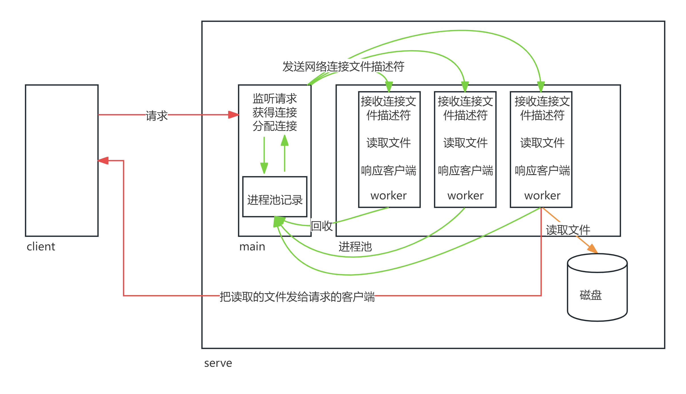

# 线程池

## 1.1, 第一版

>在前面我们谈到过, 进程池设计和线程池设计的一些适用场景。
>
>进程池设计:
>
>-  每个进程有独立的内存空间, 增加进程间的隔离性。一个进程崩溃不会影响到其它进程。
>-  进程间存在隔离性, 这种解耦促使业务逻辑方便书写。
>-  进程的创建和销毁比线程开销大, 占用的内存空间也比线程大。
>-  上下文的调度切换时间长。
>-  适合并发量低(IO请求数少), 业务复杂(CPU密集), 任务执行事件长的系统设计。
>
>线程池设计:
>
>- 线程之间共享资源, 隔离新差, 一个线程极容易影响到另一个线程(数据同步和一致性)。
>- 但是隔离性差, 使得线程间通信比进程间通信要更方便。
>- 线程较轻量，创建和销毁的开销较小。
>- 适合并发量高(I/O密集型),内存使用要求高, 业务简单, 可以大量快速、轻量级任务处理的场景。
>
>那么当我们真正在设计线程池的时候又该怎么实现那?  其实线程池的设计本质逻辑上和进程池并无太多异常, 只不过我们在线程间通信的是时候, 要远比进程池要简单的多.
>
>

### 1.1.1 设计逻辑

### 1.1.2 CODE

#### head

>head.h
>
>```C
>#ifndef __THREADPOOL__
>#define __THREADPOOL__
>
>#include <55header.h>
>#include "queue.h"
>
>// 定义线程池
>typedef struct pool_s{
>        // 所有子线程id
>        pthread_t *threadIds;
>        // 子线程的数量
>        int threadNum;
>        // 任务队列
>        queue_t queue;
>        // 锁
>        pthread_mutex_t pool_lock;
>        // 条件遍历
>        pthread_cond_t cond;
>}pool_t;
>
>// 根据指定数量创建线程池
>int initPool(pool_t *pPool, int num);
>// 定义线程的入口函数
>void *threadMain(void *p);
>
>// 初始化连接
>int initTcpSocket(int *socketfd, char *ip, char *port);
>
>// 添加epoll监听
>int epoll_addfd(int epollfd, int filefd);
>
>// 传送文件
>int sendFile(int net_fd);
>#endif
>```

#### mian

>mian.c
>
>```C
>#include "head.h"
>
>int main(int argc,char*argv[])
>{
>        pool_t pool;
>        initPool(&pool, 3);
>
>        int socket_fd;
>        initTcpSocket(&socket_fd, "192.168.106.129", "8080");
>
>        int epoll_fd = epoll_create(1);
>        epoll_addfd(epoll_fd, socket_fd);
>
>        while(1){
>
>            struct epoll_event list[1024];
>            int epoll_num = epoll_wait(epoll_fd, list, 1024, -1);
>
>            for(int i=0; i<epoll_num; i++){
>
>                if(list[i].data.fd == socket_fd){
>                    // 有连接进来
>                    int net_fd = accept(socket_fd, NULL, NULL);
>
>                    pthread_mutex_lock( &pool.pool_lock);
>                    enQueue(&pool.queue, net_fd);
>                    pthread_cond_signal(&pool.cond);
>                    pthread_mutex_unlock(&pool.pool_lock);
>                }
>            }
>        }
>    
>        return 0;
>}
>```

#### pool

>pool.c
>
>```C
>#include "head.h"
>
>int initPool(pool_t *pPool, int num){
>        // 给子线程id开辟空间
>        pPool->threadIds = (pthread_t *)calloc(num, sizeof(pthread_t)); 
>        // 创建线程
>        for(int i=0; i<num; i++){
>            pthread_create(&pPool->threadIds[i], NULL, threadMain, pPool);
>        }
>
>        // 记录子线程个数
>        pPool->threadNum = num;
>        // 初始化任务队列
>        bzero(&pPool->queue, sizeof(queue_t));
>        // 初始化锁
>        pthread_mutex_init(&pPool->pool_lock, NULL);
>        // 初始化条件变量
>        pthread_cond_init(&pPool->cond, NULL);
>
>        return 0;
>}
>```

#### tcpInit

>tcpInit.c
>
>```C
>#include "head.h"
>
>int initTcpSocket(int * socketfd, char *ip, char *port){
>        *socketfd = socket(AF_INET, SOCK_STREAM, 0);
>
>        int reuse = 1;
>        setsockopt(*socketfd, SOL_SOCKET, SO_REUSEADDR, &reuse, sizeof(reuse));
>
>        struct sockaddr_in addr;
>        addr.sin_family = AF_INET;
>        addr.sin_addr.s_addr = inet_addr(ip);
>        addr.sin_port = htons(atoi(port));
>
>        bind(*socketfd, (struct sockaddr *) &addr, sizeof(addr));
>        listen(*socketfd, 10);
>        return 0;
>}
>```

#### epoll

>epoll.c
>
>```C
>#include "head.h"
>
>int epoll_addfd(int epollfd,  int filefd){
>        struct epoll_event event;
>        event.data.fd = filefd;
>        event.events = EPOLLIN;
>        epoll_ctl(epollfd,EPOLL_CTL_ADD, filefd, &event);
>
>        return 0;
>}
>```

#### worker

>worker.c
>
>```C
>#include "head.h"
>
>void *threadMain(void *p){
>        pool_t *pPool = (pool_t *)p;
>
>        while(1){
>     
>            pthread_mutex_lock(&pPool->pool_lock );
>            int net_fd;
>
>            while(pPool->queue.size <= 0){
>                pthread_cond_wait(&pPool->cond, &pPool->pool_lock);
>            }
>            net_fd = pPool->queue.head->net_fd;
>
>            deQueue(&pPool->queue);
>            pthread_mutex_unlock(&pPool->pool_lock);
>
>            sendFile(net_fd);
>            close(net_fd);
>        }
>        return NULL;
>}
>```

#### transFile

>transFile.c
>
>```C
>#include <sys/sendfile.h>
>
>typedef struct train_s {
>        int len;
>        char buf[1000];
>} train_t;
>
>int sendFile(int netFd){
>        char *file_name = "file.txt";
>        // 需要O_RDWR,避免mmap权限不足
>        int file_fd = open(file_name, O_RDWR);
>        train_t train;
>        bzero(&train, 0);
>    
>        // 获得文件信息
>        struct stat stat_file;
>        fstat(file_fd, &stat_file);
>        // 发送文件长度
>        send(netFd, &stat_file.st_size, sizeof(off_t), MSG_NOSIGNAL);
>
>        // 发送文件长度和名字
>        bzero(&train, 0);
>        train.len = strlen(file_name);
>        memcpy(train.buf, file_name, train.len);
>        send(netFd, &train,sizeof(int)+train.len, MSG_NOSIGNAL);
>
>        sendfile(netFd, file_fd,NULL, stat_file.st_size);
>        printf("over \n");
>
>        close(file_fd);
>        return 0;
>}
>```

#### queue

>queue.h
>
>```C
>#ifndef __THREADQUEUE__
>#define __THREADQUEUE__
>
>#include <55header.h>
>
>// 定义队列结点
>typedef struct node_s{
>        int net_fd;
>        struct node_s *pNext;
>}node_t;
>// 定义队列
>typedef struct queue_s{
>        node_t *head;
>        node_t *end;
>        int size;
>}queue_t;
>
>int enQueue(queue_t *pQueue, int net_fd);
>int deQueue(queue_t *pQueue);
>
>#endif
>```
>
>queue.c
>
>```C
>#include "queue.h"
>
>int enQueue(queue_t *pQueue, int net_fd){
>
>        // 构建新节点
>        node_t *pNew = (node_t *)calloc(1, sizeof(node_t));
>        pNew->net_fd = net_fd;
>
>        if(pQueue->size == 0){
>            // 队列为空
>            pQueue->head = pNew;
>            pQueue->end = pNew; 
>        }else{
>            pQueue->end->pNext  = pNew;
>            pQueue->end = pNew;
>        }
>
>        pQueue->size++;
>
>        return 0;
>}
>
>int deQueue(queue_t *pQueue){
>        if(pQueue->size == 0){
>            return -1;
>        }
>
>        node_t *p = pQueue->head ;
>        pQueue->head = p->pNext ;
>
>        if(pQueue->size == 1){
>            pQueue->end = NULL;
>        }
>
>        pQueue->size--;
>        free(p);
>
>        return 0;
>}
>```

## 1.2 第二版

### 1.2.1 线程池的退出: 异步拉起同步

>我们不适合在多线程中使用信号(不适合), 因为信号是基于进程设计的, 我们无法确定代码在实际运行过程中, 到底进程中的那个线程收到并且执行了这个信号的处理逻辑,  这可能会导致一些异常问题. 总的来说, 信号的设计和线程的设计从某种程度上是不具有良好的相互适配性.
>
>为了解决上面的问题, 我们可以通过异步拉起同步的方式:
>
>```C
>// 既然多线程的程序, 不适合处理信号, 那可以让一个专门的进程(只有一个主线程)的进程, 获取信号, 当这个进程获取到信号之后, 再通过进程间通信的方式, 给最终想根据信号做某些操作的多线程进程发送信息(非信号信息).
>```

#### 1.2.2.1 CODE

##### main

>main.c
>
>```C
>#include "head.h"
>
>int pipe_fd[2];
>void func(int num){
>        // 信号触发: 写管道, 随便写点什么
>        write(pipe_fd[1], "1", 1);
>        return ;
>}
>int main(int argc,char*argv[])
>{
>        pipe(pipe_fd);
>        if(fork() != 0){
>            // 父进程
>            // 设置对2号信号的监听
>            signal(2, func);
>            wait(NULL);
>
>            close(pipe_fd[0]);
>            close(pipe_fd[1]);
>            exit(0);
>        }
>        // 子进程
>        close(pipe_fd[1]);
>
>        pool_t pool;
>        initPool(&pool, 3);
>
>        int socket_fd;
>        initTcpSocket(&socket_fd, "192.168.106.129", "8080");
>
>        int epoll_fd = epoll_create(1);
>        epoll_addfd(epoll_fd, socket_fd);
>
>        // 监听管道: 是否有信号
>        epoll_addfd(epoll_fd, pipe_fd[0]);
>    
>        while(1){
>
>            struct epoll_event list[1024];
>            int epoll_num = epoll_wait(epoll_fd, list, 1024, -1);
>
>            for(int i=0; i<epoll_num; i++){
>
>                if(list[i].data.fd == socket_fd){
>                    // 有连接进来
>                    int net_fd = accept(socket_fd, NULL, NULL);
>
>                    pthread_mutex_lock( &pool.pool_lock);
>                    enQueue(&pool.queue, net_fd);
>                    pthread_cond_signal(&pool.cond);
>                    pthread_mutex_unlock(&pool.pool_lock);
>                }
>
>                // 判断是否有信号触发
>                if(list[i].data.fd == pipe_fd[0]){
>                    printf("信号触发 \n");
>
>                    char buf[60] = {0};
>                    read(pipe_fd[0], buf, sizeof(buf));
>                }
>            }
>        }
>    
>        return 0;
>}
>```

### 1.2.2 线程退出: pthread_cancel

>当主线程监听到父进程发过来的信号触发信息, 之后, 我们可以让主线从, 通过pthread_cancel函数,让子线程被动退出.

#### 1.2.2.1 CODE

##### main

>mian.c
>
>```C
>#include "head.h"
>
>int pipe_fd[2];
>void func(int num){
>    write(pipe_fd[1], "1", 1);
>    return ;
>}
>int main(int argc,char*argv[])
>{
>    pipe(pipe_fd);
>    if(fork() != 0){
>        signal(2, func);
>        wait(NULL);
>
>        close(pipe_fd[0]);
>        close(pipe_fd[1]);
>        exit(0);
>    }
>    close(pipe_fd[1]);
>
>    pool_t pool;
>    initPool(&pool, 3);
>
>    int socket_fd;
>    initTcpSocket(&socket_fd, "192.168.106.129", "8080");
>    
>    int epoll_fd = epoll_create(1);
>    epoll_addfd(epoll_fd, socket_fd);
>    epoll_addfd(epoll_fd, pipe_fd[0]);
>    while(1){
>
>        struct epoll_event list[1024];
>        int epoll_num = epoll_wait(epoll_fd, list, 1024, -1);
>
>        for(int i=0; i<epoll_num; i++){
>
>            if(list[i].data.fd == socket_fd){
>                int net_fd = accept(socket_fd, NULL, NULL);
>                pthread_mutex_lock( &pool.pool_lock);
>                enQueue(&pool.queue, net_fd);
>                pthread_cond_signal(&pool.cond);
>                pthread_mutex_unlock(&pool.pool_lock);
>            }
>
>            // 判断是否有信号触发
>            if(list[i].data.fd == pipe_fd[0]){
>                printf("信号触发 \n");
>                char buf[60] = {0};
>                read(pipe_fd[0], buf, sizeof(buf));
>
>                // 通过pthread_cancel, 取消所有子线程
>                for(int i=0; i<pool.threadNum; i++){
>                    pthread_cancel(pool.threadIds[i]);
>                }
>                
>                for(int i=0; i<pool.threadNum; i++){
>                    pthread_join(pool.threadIds[i], NULL);
>                }
>                exit(0);
>            }
>        }
>    }
>    
>    return 0;
>}
>```
>
>但是当我们真正在代码执行的时候, (ps -elLf)我们发现好像子线程并没有完全退出
>
>```C
>// 原因是因为, 无论pthread_cond_wait是被pthread_cond_signal唤醒或者广播唤醒, 或者被进程要求被动退出唤醒, 只要被唤醒第一件事情就是获取锁
>// 又因为pthread_cond_wait是取消点函数, 这回导致进程带锁死亡, 导致别的进程醒来无法获取锁, 产生死锁
>```

#### 1.2.2.2 CODE: 改进方案

>在上面的问题的基础上, 我们可以优化资源清理行为. 我们知道pthread_cancel函数导致线程退出, 会自动执行被退出线程的清理函数, 所以我们可以在加锁的时候, 增加清理函数, 防止死锁

##### worker

>worker.c
>
>```C
>#include "head.h"
>
>void cleanLock(void *arg){
>        pool_t *pPool = (pool_t *) arg;
>
>        pthread_mutex_unlock(&pPool->pool_lock);
>}
>void *threadMain(void *p){
>        pool_t *pPool = (pool_t *)p;
>
>        while(1){
>     
>            int net_fd;
>            pthread_mutex_lock(&pPool->pool_lock );
>            // 调用清理函数
>            pthread_cleanup_push(cleanLock, pPool);
>
>            while(pPool->queue.size <= 0){
>                pthread_cond_wait(&pPool->cond, &pPool->pool_lock);
>            }
>            net_fd = pPool->queue.head->net_fd;
>
>            deQueue(&pPool->queue);
>            //pthread_mutex_unlock(&pPool->pool_lock);
>            pthread_cleanup_pop(1);    
>
>            sendFile(net_fd);
>            close(net_fd);
>        }
>        return NULL;
>}
>```

### 1.2.3 更好的退出方式: 标记位退出

>虽然我们上面想了一些办法, 可以使线程退出, 但是上面的退出方式本质上是一种被动退出的方式, 某种程度上这不是一个良好的退出方式, 因为子线程没有办法到底在那个代码运行节点退出, 这可能导致有些资源没有正常释放或者某些必要的逻辑进行了一半, 就使得线程退出.
>
>所以在上述逻辑的基础上, 我们可以取消被动退出的方式, 转而使用一种, 以标志位标记的主动退出模式.

#### 1.2.3.1 CODE

##### head

>head.h: 增加退出标记位
>
>```C
>#ifndef __THREADPOOL__
>#define __THREADPOOL__
>
>#include <55header.h>
>#include "queue.h"
>
>// 定义线程池
>typedef struct pool_s{
>    // 所有子线程id
>    pthread_t *threadIds;
>    // 子线程的数量
>    int threadNum;
>    // 任务队列
>    queue_t queue;
>    // 锁
>    pthread_mutex_t pool_lock;
>    // 条件遍历
>    pthread_cond_t cond;
>    // 退出标记
>    int exitFlag;
>}pool_t;
>
>// 根据指定数量创建线程池
>int initPool(pool_t *pPool, int num);
>// 定义线程的入口函数
>void *threadMain(void *p);
>
>// 初始化连接
>int initTcpSocket(int *socketfd, char *ip, char *port);
>
>// 添加epoll监听
>int epoll_addfd(int epollfd, int filefd);
>
>// 传送文件
>int sendFile(int net_fd);
>#endif
>```

##### main

>main.c
>
>```C
>
>int pipe_fd[2];
>void func(int num){
>write(pipe_fd[1], "1", 1);
>return ;
>}
>int main(int argc,char*argv[])
>{
>pipe(pipe_fd);
>if(fork() != 0){
>   signal(2, func);
>   wait(NULL);
>
>   close(pipe_fd[0]);
>   close(pipe_fd[1]);
>   exit(0);
>}
>setpgid(0, 0);
>close(pipe_fd[1]);
>
>pool_t pool;
>initPool(&pool, 3);
>
>int socket_fd;
>initTcpSocket(&socket_fd, "192.168.106.129", "8080");
>
>int epoll_fd = epoll_create(1);
>epoll_addfd(epoll_fd, socket_fd);
>epoll_addfd(epoll_fd, pipe_fd[0]);
>while(1){
>
>   struct epoll_event list[1024];
>   int epoll_num = epoll_wait(epoll_fd, list, 1024, -1);
>
>   for(int i=0; i<epoll_num; i++){
>
>       if(list[i].data.fd == socket_fd){
>           int net_fd = accept(socket_fd, NULL, NULL);
>           pthread_mutex_lock( &pool.pool_lock);
>           enQueue(&pool.queue, net_fd);
>           pthread_cond_signal(&pool.cond);
>           pthread_mutex_unlock(&pool.pool_lock);
>       }
>
>       // 判断是否有信号触发
>       if(list[i].data.fd == pipe_fd[0]){
>           printf("信号触发 \n");
>           char buf[60] = {0};
>           read(pipe_fd[0], buf, sizeof(buf));
>
>           // 修改标志位
>           pthread_mutex_lock(&pool.pool_lock);
>           pool.exitFlag = 1;
>           pthread_cond_broadcast(&pool.cond);
>           pthread_mutex_unlock(&pool.pool_lock);
>           
>           for(int i=0; i<pool.threadNum; i++){
>               pthread_join(pool.threadIds[i], NULL);
>           }
>           exit(0);
>       }
>   }
>}
>
>return 0;
>}
>```

##### worker

>worker.c
>
>```C
>#include "head.h"
>
>void *threadMain(void *p){
>    pool_t *pPool = (pool_t *)p;
>
>    while(1){
>        
>        int net_fd;
>        pthread_mutex_lock(&pPool->pool_lock );
>
>        while(pPool->queue.size <= 0 && pPool->exitFlag ==0 ){
>            pthread_cond_wait(&pPool->cond, &pPool->pool_lock);
>        }
>        if(pPool->exitFlag == 1){
>            printf("son thread exit \n");
>            pthread_mutex_unlock(&pPool->pool_lock);
>            pthread_exit(NULL);
>        }
>        net_fd = pPool->queue.head->net_fd;
>
>        deQueue(&pPool->queue);
>        pthread_mutex_unlock(&pPool->pool_lock);
>
>        sendFile(net_fd);
>        close(net_fd);
>    }
>    return NULL;
>}
>```