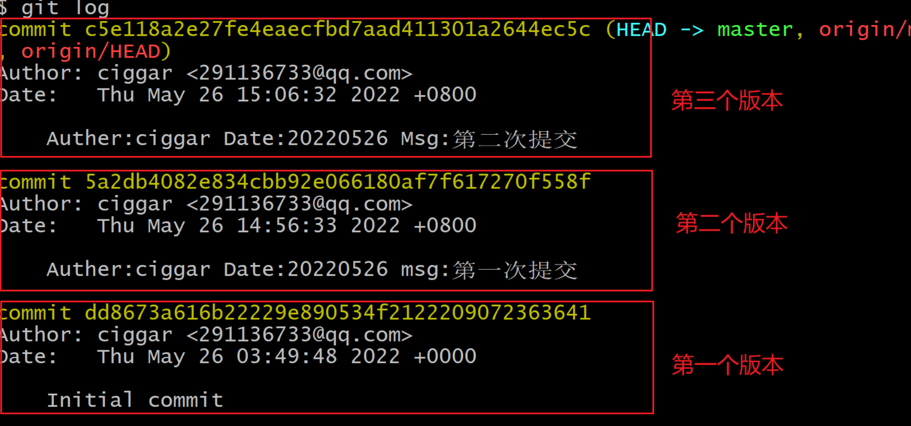

# Git

>git: 如果面试问到, git的分支逻辑设计
>
>git: 以后工作每天都要使用 (  每天用很简单: git add .   git commit -m,     git pull  git  push)

>版本:  (代码的版本的概念)
>
>​           代码版本: (技术角度)
>
>​           项目版本: (开发的流程) 
>
>    ```C
>项目开发流程:
>// 确定需求(不是完全这样) (干什么事情): 至少有一个大致要做的事情
>// 周一: 需求列表(哪些事情要做), 讨论(合理性, 大致的代码实现思路, 谁来做)  -> 甘特图(排期)
>// 回去: 思考,  疑问点, 不合理 -> 单独产品经理,领导 讨论, 确认需求的细节 -> 明白要干什么
>//        设计代码逻辑(偷懒) -> 定义类图(详细的代码调用关系, 函数的实现功能)
>//        实现: 写代码
>// 写代码: 测试
>// 周五: 合并到一起,  整体的测试 -> 通过
>//      bug -> 修改 -> 重新测 -> 修改 -> 测
>// 产生一个版本(项目版本)
>    ```
>
>```C
> 代码版本:
>//  上午: 9:00 -> 12:00
>//  git 产生一个版本
>//  下午: ...
>//  
>// git是个版本控制工具: git管理代码, 以版本来推动代码演变, 以版本来追踪代码的变化  (以版本为单位)
>```

## 1. 介绍

> Git 是一个版本控制工具。可以<span style='color:red;background:yellow;font-size:文字大小;font-family:字体;'>**记录和追踪**</span> 某个文件 在某一个时刻的内容和状态。
>
> ```java
> // 版本控制(Revisioncontrol)是维护工程蓝图的标准做法，能追踪工程蓝图从诞生一直到定案的过程。是 一种记录若干文件内容变化，以便将来查阅特定版本修订情况的系统。
> // Git 可以记录某个文件夹下的 不同文件 在不同时间节点的不同状态。Git可以去记录这些文件产生的变化
> // 说白了其实就是记录某个目录下的文件不在时间点下的不同状态, 以版本为单位
> ```

>如果没有版本控制:
>
>```java
>// 备份多个版本费空间，费时间
>// 难以恢复至正确版本
>// 代码管理混乱，容易引发冲突和Bug
>// 无法进行权限控制
>```

>Git的历史
>
>```java
>// Linus出品.2005年由于BitKeeper软件公司对Linux社区停止了免费使用权。  Linus迫不得己自己开发了一个分布式版本控制工具，从而Git诞生了。据说Linus花了两周时间自己用C写了一个 分布式版本控制系统，这就是Git！一个月之内，  Linux系统的源码已经由Git管理了！
>```

>Git的特点
>
>```java
>//  离线可用: (SVN不行)
>//  可以回退
>```
>
>

>主流的管理工具对比: Git 80% 上;    SVN 10%
>
>```java
>// Git：分布式版本控制工具
>// SVN：集中式版本控制工具 离线不可用
>```
>
>

## 2. 安装Git

### 2.1 Linux

>**正常来就那个我们在日常配置Linux其它代码开发环境的时候, 在安装某些工具的时候, 其中可能自动安装了git工具. 我们可以通过命令来确定Linux环境中是否已经具备git工具.**
>
>```shell
>git --version
>// 如果通过上述命令, 显示git的版本号, 则表明当前环境中已经具有急用git工具的能力
>```
>
>**如果我们在通过上述命令检测的时候, 发现没有git工具:(如图)**
>
>
>
>**我们可以通过命令来安装git工具:**
>
>```C
>sudo apt install git
>```
>
>
>
>**建议在安装git之后设置一些内容**
>
>```C
>// 建议设置有效的邮箱和用户名
>git config --global user.email 222@qq.com
>git config --global user.name youname
>
>// 编辑工具
>git config --global core.editor vim 
>```

### 2.2 Windows

#### 2.2.1 下载

> [官方下载地址](https://git-scm.com/downloads)
>
> 

#### 2.2.2 安装

> 直接傻瓜式(一路默认, 唯一需要注意如下图)安装即可。
>
> 
>
> 安装的时候，要注意 让Windows 记住登录凭证

**判断是否安装成功**

>如果在Windows的**任何路径下**都可以出现如下图所示的命令选项, 既是安装成功
>
>

## 3. Git的使用

### 3.1 Git核心流程

>Git的工作流程
>
>

### 3.2 Git 命令

#### 3.2.1 注册相关网站

>在不同Git仓库注册的时候, 一定要记住账号和密码和邮箱
>
>````java
>以Gitee为例。记住注册的时候:
>// 用户名
>// 密码
>// 邮箱
>````

#### 3.2.2 建立远程仓库

>建立远程仓库
>
>

#### 3.2.3 clone

>下载仓库内容
>
>```cmd
># 下载远程仓库的内容，并且在本地创建一个和远程仓库名同名的文件夹
># 下载的时候, 路径在哪, 就直接下载到那个地方
>git clone https://gitee.com/snow/code100th.git
>
># 下载到指定的文件夹中(完全不建议)
>git clone https://gitee.com/snow/code100th.git dirName
>```

>注意: 如果是私有仓库,会在clone的时候要求输入账号密码(此账号密码为你的git远程仓库上的账号密码) (下图以Linux为例,要求在命令行输入账号密码)(而在Windows中账号密码会出现弹框提示你输入)
>
>
>
>注意: 正常来讲, git工具会自动记住账号和密码, 下次使用就不需要输入了(和远程仓库交互的时候), 如果密码输错, 则可能需要修改系统的记录凭证(windows中比较方便的操作). 或者清空缓存重置账号密码(Linux删除家目录下的  .git-credentials 文件). **建议还是不要输错了**
>
>注意: (如果老是每次都和中央仓库交互都需要输入账号密码:  windows:  **git config --global credential.helper manager** ) (Linux:     **git config --global credential.helper store**) 
>
>(或者各个系统的通用配置在用户名路径下的.gitconfig中 配置 : [credential]     helper = store)

#### 3.2.3 status

> status状态命令:
>
> 这个命令可以帮助我们查看`工作区`和`缓冲区`和`本地仓库`中的变化。
>
> 

#### 3.2.4 add

> add: 这个命令可以帮助我们把工作区中的变化提交到缓冲区。
>
> ```cmd
> # 所有文件: 把所有文件的变化都从工作空间提交到缓冲区
> git add .
> 
> # 文件的名字:  把指定的文件名文件在工作空间发生的变化提交到缓冲区
> git add fileName
> 
> # 文件的类型: *通配符
> git add *.java  // 把所有以.java结尾的文件的变化, 从工作空间提交到缓冲区
> ```

#### 3.2.5 commit

> commit命令: 帮助把缓冲区变化内容提交到本地仓库。
>
> ```cmd
> # 提交
> git commit -m "备注/注释"
> 
> ## msg:msg信息一般要有统一的格式和意义(参照公司怎么写), 反正不建议乱写和简写(一定要注意) 
> ## 例如：Auther:ciggar Date:20220528 msg:xxx
> ```
>
> ```java
> 注意:
> // 这一步会产生一个文件的版本号
> // 如果是第一次commit，需要设置用户名和邮件地址(建议设置真实的)
> // 只会把缓冲区中的变化提交到本地仓库，不会把工作区中的变化提交到本地仓库
> // commit的时候需要指定提交的信息, 也就是注释(要重视注释的书写)
> ```
>

>设置方式一: 直接文件设置
>
>```java
>// 去用户目录下(无论是Linux还是Windows都在家目录下)，设置 .gitconfig文件,假如没有这个文件，就创建一个
>```
>
>```properties
>[user]
>	email = 1111@qq.com
>	name = snow
>[credential]
>	helper = store
>```
>
>设置方式二: 命令设置
>
>```cmd
>git config --global user.email 222@qq.com
>git config --global user.name xxx
>```
>
>设置完之后，就可以提交了，会产生一个版本信息
>
>

#### 3.2.9 log

> log命令: 查看仓库中的所有的版本信息
>
> ```shell
> // 列出版本的详细信息
> git log
> // 列出压缩格式的所有分支的提交树 (--oneline: 每个版本压缩成一行)(--all:所有分支)(--graph:以分支树的形式展示)
> git log --oneline --all --graph
> ```
>
> ```java
> // 如果出现历史记录过长: Q回车退出
> ```
>
> 

### 3.3 分支问题

>分支是在合作开发中一个非常重要的维护代码迭代/bug修复/协作可发的重要设计结构,
>
>**需要注意的是在做分支操作之前: 确认工作空间和缓冲区干净状态, 以避免产生不必要的冲突**

#### 3.3.1 查看分支

>查看所有分支:
>
>```shell
>git branch -a
>```

#### 3.3.2 创建分支

>创建一个本地分支:
>
>```C
>git branch 分支名
>```

#### 3.3.3 切换分支

>从当前分支切换到另一个分支:
>
>```C
>git checkout 分支名
>```
>
>创建并切换分支: (等价于先创建, 再切换到创建的这个分支上)
>
>```C
>git checkout -b 分支名
>```

#### 3.3.4 删除分支

>删除分支:
>
>```shell
>// 安全的删除: (确保这个分支的内容分支已经被合并到上游)
>git branch -d 分支名
>// 强制删除分支: 
>git branch -D 分支名
>```

#### 3.3.5 合并分支

>合并一个其它分支的内容到当前分支
>
>```C
>git merge 其它分支名
>```
>
>注意: 合并分支应该要向下游版本合并, 而非向上游合并
>
>注意: Y型分支
>
>```C
>假设存在A和B两个Y型分支:
>// 如果让在A上合并了B分支, 则A产生并演进到新的分支下游版本
>// 如果想让B的版本进度也演进到刚才A产生的下游版本, 只需要把分支切回B, 并且对A进行merge, 则可以让AB都指向同一个版本
>
>// 需要注意的是: 如果在合并过程中产生了无法自动merge的内容冲突, 需要手动处理冲突
>// 当B分支被合并到A分支上, 如果不想继续使用B分支, B分支可被删除, B的删除不影响git记录保存B曾经产生的修改
>```

### 3.4 冲突问题

>冲突: 更多时候是指在一个Git项目管理追踪中, 用户在更新和提交的代码中, 对同一个文件发生了修改
>
>
>
>1, 版本冲突: git会自动合并版本冲突, 产生一个合并版本, 最常见, 但是git会自动合并产生合并版本
>
>2, 如果某个文件产生了冲突 (并且内容的变化本身是兼容的:eg创建两个同名无内容文件, 或者内容变化的本身无关性的:eg分别修改同一个文件1行和20行):  不常见, 会自动合并产生合并版本
>
>3, 修改同一个文件,**导致内容冲突**: 需要手动合并(git对这种情况就无法自动合并产生合并版本了), 如果进行手动的冲突合并, 一定要记得需要重新add -> commit -> push
>
>```java
>结论:
>// 如果产生冲突, git能自动合并的的冲突不用做任何处理, 合并之后别忘了push
>// 需要处理的是git不能自动合并的冲突, 比如第三种情况: 重新先pull 再add commit 再push 
>```
>
>```java
>注意: 冲突的约定俗成规则
>// 1.  先push的人不处理冲突，后push的人要处理冲突(谁遇到冲突, 谁解决)
>// 2.  和组员一起开发的时候，尽量不要开发同一个文件，很容易产生冲突
>// 3.  准备提交代码之前最好先pull一下
>// 4.  - 早上上班之后，第一件事情，拉取最新的代码（pull）
>//     - 晚上下班之前，最后的一件事情，把最新的本地代码推送上去（push）
>//     如果今天下班了, 代码没写完, 要不要push, 不要push
>```

### 3.5 提交和更新

>在合作开发中, 多个用户基于远程仓库的代码合并本质上是一种Y型分支的问题.

#### 3.5.1 push

>push命令: 可把本地仓库中的版本变化推送到远程仓库。
>
>```C
>// 把本地"当前所在的分支"的"版本变化"推送到"跟踪/关联"的"远程分支"上  (但是易受git的设置的影响改变推送规则)
>git push
>// 把本地"当前所在的分支"的"版本变化"推送到"显示指明"的"远程分支"上  (不意味着可以乱推送)
>git push origin 分支名
>
>    
>// 值得注意的是: 如果远程分支创建了一个名为a的分支, 本地自己也创建了一个a的分支, 当本地处于a分支上时, 无论使用git push还是 git push origin a 都可以让本地分支a自动和远程的a分支建立追踪/关联关系(根据分支名字相同的原因)(版本也要存在匹配: 即本地为下游版本, 远端为上游版本, 否则要是存在冲突(比如虽然同时a分支, 但是之前没有关联, 并且非线性的上下游版本)要先建立关联:pull origin a 并且merge(有可能需要手动merge) ), 并且可以直接把本地的a的版本内容推送到远程分支上
>
>// 如果本地创建了一个分支, 而远程不具有这个分支, 也可以通过命令的方式把它推送到远程上, 让远程多一个新分支   
>// 提交分支: 在创建分支后第一次push的时候需要建立本地分支和远程分支之间的联系
>git push --set-upstream origin 分支名 
>
>// 因为本地分支的删除, 并不会影响到远程的关联分支删除, 所以要删除远程分支, 除了远程仓库直接删除, 也可以在本地通过命令删除
>// 可以通过命令删除远程分支
>git push origin --delete 分支名
>```
>
>```java
>注意1:
>// 这一步在第一次操作的时候，需要去填写对应用户名和密码 (如果在clone私有仓库则在clone已经填过了, 或者之前某些时候使用过git已经填过账号密码, 则忽略这个问题)
>注意2: 
>// push的时候，能不能指定只对某个文件去push呢？ 不能, 因为push是以版本为单位的    
>注意3:
>// 只有当本地仓库中的版本领先于远程仓库的时候，才可以push
>```
>
>

#### 3.2.7 pull

> pull命令: 拉取远程仓库中的所有的版本变化到本地。
>
> ```C
> // 获取远程仓库的更改(这个命令的本质: 是将远程分支的最新状态下载到本地仓库, 作为本地对远程版本的信息追踪记录)
> git fetch  origin 分支名
> (git fetch origin 分支名:分支名  ->  从远程仓库中获取指定分支的最新内容到本地仓库对应的分支,不存在分支则创建  )
>  
> // 把fetch下来的远程分支版本, 合并到当前版本中(要以分支命名和版本做匹配/关联分支, 不要乱merge) (注意斜杠, 不是空格)
> git merge origin/分支名  
>  
> // 把远端的关联的分支fetch下来,并且merge到当前所在分支上 
> git pull origin 分支名
> 
> // 如果之前已经建立关联分支, 等价于(git pull origin 分支名)
> git pull
> ```
>
> ```java
> 注意:
> // 当本地仓库中的版本落后于远程仓库的时候，就要pull
> // 落后就要pull (工作中一定要注意)
> ```
>
> 

### 3.6  协作开发

#### 3.6.1 邀请成员加入仓库

> 不管是 开源的仓库，还是私有的仓库，都是 只有仓库中的成员才能去修改仓库中的代码。
>
> ```java
> // 开源：所有人都可以访问到
> // 私有：只有仓库指定的成员才能看到
> ```
>
> 

#### 3.6.2 怎么在项目中组织分支

><span style="color:red;">在公司中写代码, 一定要去问一下分支结构(git branch -a查看), 合并逻辑</span>

>组织GIT的分支体系有很多种模式:  怎么设计没有标准的定式. (举例...)

### 3.7 回退问题

> 慎重: 覆盖 (紧急情况:  master生产环境紧急回退->clone->本地回退->  修改代码 -> 覆盖muster_bug)

>
>
>回退工作空间的变化: (参考git status提示)
>
>```C
>// 回退某个被追踪文件在工作空间的修改 (未进行add和commit) (回退的内容，是找不回来的，要慎用)
>git checkout 文件名  
>    
>// (注意:git status提示): git restore 文件名
>```
>
>把缓冲区中的变化，回退到工作空间:
>
>```C
>git reset 文件名
>    
>// git restore --staged 文件名    
>```
>
>回退本地版本
>
>```C
>git reset --hard  版本号
>```
>
>永远不要手动回退远程仓库的代码

### 3.8 忽略文件

> Git在做版本控制的时候，可以让我们忽略一些文件，不去追踪这个仓库中这些文件的变化。
>
> ```java
> // 可以在Git仓库的根目录下 添加一个.gitignore这个名字的文件，可以在这个文件中声明哪些文件不被git追踪版本信息
> 
> eg:
> # 单个文件
> xxx.txt
> # 配置文件夹
> .idea
> # 配置文件的类型
> *.iml
> target/*.class
> 
> out
> ```

> 注意事项：
>
> ```java
> // 忽略文件最好是在创建仓库的时候，就应该先创建出来
> // 一旦一个文件已经被追踪并且提交到远程仓库中去了，那么再在.gitignore 这个文件中去忽略它的变化，是无效的 (要想起效果, 要先删除这个文件, 提交一个版本, 再把这个文件加进来:  不建议,有点繁琐)
> ```

### 3.3 本地项目提交

>场景
>
>```java
>// 假设我本地已经有一些需要管理(但是从来没有通过Git管理)的代码, 我想提交到Git仓库管理起来.一般有两种方式
>```
>
>方式一:
>
>```java
>// 通过上述流程:
>1, 手动创建远程仓库
>2, 创建本地仓库(git clone): 产生本地仓库, 工作空间, 缓冲区
>3, 把文件移到  工作空间 目录
>4, 管理文件(git add .)
>5, 产生版本(git commit -m '注释')到本地仓库
>6, 提交到远程仓库git push
>7, 正常使用
>```
>
>方式二:
>
>```java
>1, 在代码文件所属目录, 创建本地仓库(git init)(还创建了缓冲区 和 工作空间)
>2, 管理文件(git add .)
>3, 产生版本(git commit -m '注释')到本地仓库
>4, 创建远程仓库: 不要选择任何模板和初始化  (创建了一个全空的远程仓库)
>5, 关联远程仓库: git remote add origin https://gitee.com/snow-lee/lalala.git
>6, 提交到远程仓库: git push -u origin "master"
>7, 正常使用
>```


https://learngitbranching.js.org/?locale=zh_CN

