# 数据库

# 1, 数据库的安装和配置

## 1.1 数据库的概念

### 数据库的定义: 了解

>**1, Database**：**A database is an organized collection of data,stored and accessed electronically. **
>
>2, 数据库(Database)是按照数据结构来组织、存储和管理数据的仓库。
>
>3, 数据库(Database)是一种结构化信息或数据的有组织的集合。
>
>4, 在现实中，`数据`以及`[数据库管理系统 (DBMS)](Database Management System)`  一起被称为数据库系统，通常简称为数据库。

### 数据库的历史: 了解

>自 20 世纪 60 年代初诞生至今，数据库已经发生了翻天覆地的变化。最初，人们使用分层数据库（树形模型/一对多）和网络数据库（图模型/多对多）这样的导航数据库来存储和操作数据。这些早期系统是很简单的，同时也缺乏灵活性。
>
>20 世纪 80 年代，[关系数据库]()开始兴起.
>
>20 世纪 90 年代，[面向对象的数据库]()开始成为主流。
>
>最近，随着互联网的快速发展，为了更快速地处理非结构化数据，[NoSQL 数据库]()应运而生。

## 1.2 数据库的分类

### 数据库分类

注: [数据库热度](https://db-engines.com/en/ranking)  [数据库市场份额](https://www.datanyze.com/market-share/databases--272) 


>- **关系型数据库：**关系数据库在 20 世纪 80 年代成为主流。关系数据库中的`数据项`被组织为一系列具有`列和行`的表。关系数据库为访问`结构化信息`提供了有效和灵活的方法.
>- **非关系型数据库：**又被称为NoSQL数据库，它支持存储和操作`非结构化`及`半结构化`数据。而且随着 Web 应用的日益普及和复杂化，NoSQL 数据库得到了越来越广泛的应用.
>- **等...**

注: 区别 <span style="color:red">注意</span>

>SQL标准/SQL语言:  1986年定义了一个SQL标准:  SQL标准语言 (SQL语言操作数据, 是以数据和数据之前的关系去操作数据的)
>
>SQL语句:  select * from user; 从user表中查出所有信息
>
>关系型数据库和非关系型数据库, 虽然区别很多,  但是`最本质的区别`是: 关系型数据库以`数据和数据之间存在的关系`维护数据, 而非关系型数据库是指存储数据的时候`数据和数据之前没有什么特定关系`.
>
>大家要注意的是, 虽然数据库有种类的区别，但是这是一个无关孰优孰劣的问题(没有谁好谁差之分)，主要取决于企业希望如何使用数据.从本质上讲, 他们都是用来存储数据的. (而对于我们一个后端开发来讲, 我们在实际工作中基本上是以关系型数据库为主, 非关系型数据库为辅的用法)

注: 关于NoSQL的SQL解释

>SQL：结构化查询语言（Structured Query Language）简称SQL，是一种专门用来和数据库通信的标准语言，**用于向数据库存取数据以及查询、更新和管理关系数据库系统**.  每个`关系型数据库`都支持SQL语言/SQL标准.

### 一些数据库: 了解

MySQL

>是一个由瑞典MySQLAB公司开发，属于Oracle旗下产品。MySQL是最流行的关系型数据库管理系统之一
>

Oracle

>又名Oracle RDBMS，或简称Oracle。是甲骨文公司的一款关系数据库管理系统。它是在数据库领域一直处于领先地位的产品。可以说Oracle数据库系统是世界上流行的关系数据库管理系统，系统可移植性好、使用方便、功能强，适用于各类大、中、小微机环境。它是一种高效率的、可靠性好的、适应高吞吐量的数据库方案.

SQLServer

>SQLServer是由`微软公司`开发的一种关系型据库管理系统，它已广泛用于电子商务、银行、保险、电力等行业。SQLServer提供了对XML和Internet标准的支持，具有强大的、灵活的、基于Web的应用程序管理功能。而且界面友好、易于操作，深受广大用户的喜爱，但它只能在Windows平台上运行(2017年开始支持Linux系统)，并对操作系统的稳定性要求较高，因此很难处理日益增长的用户数量。

DB2数据库

>DB2数据库是由IBM公司研制的一种关系型数据库管理系统，主要应用于OS/2、Windows等平台下，具有较好的可伸缩性，可支持从大型计算机到单用户环境。
>
>DB2支持标准的SQL，并且提供了高层次的数据利用性、完整性、安全性和可恢复性，以及从小规模到大规模应用程序的执行能力，适合于海量数据的存储，但相对于其他数据库管理系统而言，DB2的操作比较复杂。

MariaDB

>MariaDB数据库管理系统是MySQL的一个分支，主要由开源社区在维护，采用GPL授权许可 MariaDB的目的是完全兼容MySQL，包括API和命令行，使之能轻松成为MySQL的代替品。在存储引擎方面，使用XtraDB来代替MySQL的InnoDB。 MariaDB由MySQL的创始人Michael Widenius主导开发，他早前曾以10亿美元的价格，将自己创建的公司MySQL AB卖给了SUN，此后，随着SUN被甲骨文收购，MySQL的所有权也落入Oracle的手中。MariaDB名称来自Michael Widenius的女儿Maria的名字。
>
>MariaDB基于[事务]()的Maria存储引擎，替换了[MySQL]()的[MyISAM]()存储引擎，它使用了Percona的 XtraDB，InnoDB的变体，分支的开发者希望提供访问即将到来的MySQL 5.4 InnoDB性能。这个版本还包括了 PrimeBase XT (PBXT) 和 FederatedX[存储引擎]()。

PostgreSQL

>是以[加州大学伯克利分校]()计算机系开发的 Postgres 版本 4.2 为基础的对象关系型数据库管理系统（ORDBMS）。和MySQL一样是开源数据库。POSTGRES 领先的许多概念只是在非常迟的时候才出现在[商业数据库]()中。

MongoDB数据库

>MongoDB是由10gen公司开发的一个`介于关系数据库和非关系数据库`之间的产品，是非关系数据库当中功能最丰富，最像关系数据库的。它支持的数据结构非常松散，是类似JSON的bjson格式，因此可以存储比较复杂的数据类型。
>
>Mongo数据库管理系统最大的特点是它支持的查询语言非常强大，其语法有点类似于面向对象的查询语言，可以实现类似关系数据库单表查询的绝大部分功能，而且还支持对数据建立索引。不仅如此，它还是一个开源数据库，并且具有高性能、易部署、易使用、存储数据非常方便等特点。对于大数据量、高并发、弱事务的互联网应用，MongoDB完全可以满足Web2.0和移动互联网的数据存储需求。

Redis

>Remote Dictionary Server(Redis) 是一个由 Salvatore Sanfilippo 写的 key-value 存储系统，是跨平台的非关系型数据库。
>Redis 是一个开源的使用 ANSI C 语言编写、遵守 BSD 协议、支持网络、可基于内存、分布式、可选持久性的键值对(Key-Value)存储数据库，并提供多种语言的 API。

## 1.3 数据库的安装

1.数据库安装

>安装数据库: 安装的是一个具有监听端口/分析SQL语句/存储数据/组织数据/响应数据为一体的数据库服务器

>```c
>// 更新包列表
>sudo apt update
>    // 安装mysql:    安装mysql的服务,  安装了mysql的客户端
>sudo apt install mysql-server mysql-client
>// 安装客户端依赖包(编程需要)
>    sudo apt install libmysqlclient-dev
>    // 查看mysql状态
>netstat -tap | grep mysql
>// 设置账号密码相关的信息 (选项选Y)(密码级别选0)
>    sudo mysql_secure_installation 
>    // 查看mysql状态
>systemctl status mysql.service
>// 也可用于查看mysql状态
>sudo service mysql status
>// ---------------------------------------------------------------------------
>// 访问mysql 
>    sudo mysql -u root -p
>    
>// 设置密码长度 (SHOW VARIABLES LIKE 'validate_password%';)
>set global validate_password.length=6;
>// 修改用户的认证方式和密码
>alter user 'root'@'localhost' identified with mysql_native_password by '123456';
>    // 刷新
>    flush privileges;
>// 退出mysql客户端
>exit;
>
>// 重启mysql
>service mysql restart
>//或者
>systemctl restart mysql
>```
>

2.客户端连接数据库

3.Navicat连接数据库

## 1.4 数据库构成

### 客户端和服务器

>在互联网的网络交互和数据访问中,一般常见两种网络架构模式: B/S结构或者C/S结构.
>
>B/S:   Browser-Server即浏览器和服务器, 即通过浏览器和服务器发起网络交互的数据请求.
>
>C/S:   Client-Server即客户端和服务器, 即通过客户端和服务器发起网络交互的数据请求.

>而我们上面安装的Navicat以及MySQL, 这两者的关系是一个标准的C/S结构.

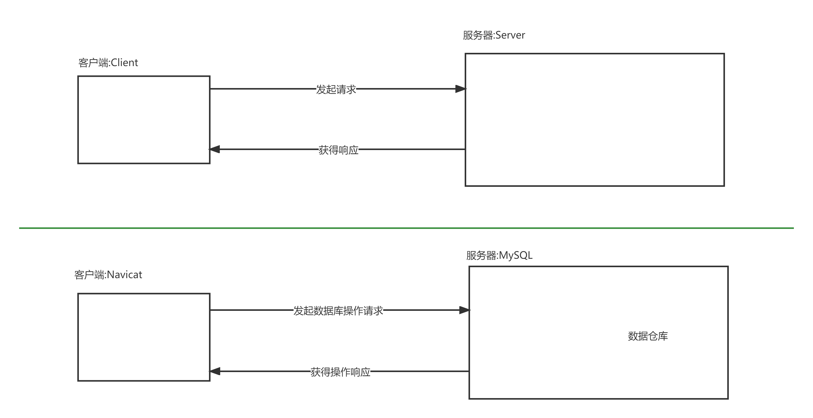


### MySQL的内部数据组织方式

>在MySQL中, 我们对数据的组织逻辑上是按照`库`/`表`/`数据` 这种三级结构组织的.
>
>数据库: 表示一份完整的数据仓库, 在这个数据仓库中分为多张不同的表.
>
>表:  表示某种特定类型数据的的结构化清单, 里面包含多条数据.
>
>数据: 表中数据的基本单元. 

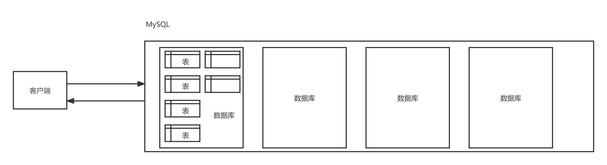

# 2, SQL语法

## 2.1 SQL语言

SQL语言

>SQL：结构化查询语言（Structured Query Language）简称SQL，是一种专门用来和关系型数据库通信的标准语言，**用于向数据库存取数据以及查询、更新和管理关系数据库系统**。
>
>与其他语言(Java, C++...)不同的是, SQL由很少的词构成,  这是希望从数据库读写数据时能以更简单有效的方法进行. 

SQL有如下优点

>SQL语言不是某个特定的数据库提供的语言, 它是一种数据库标准语言.(最初由美国国家标准局 ANSI于1986年完成第一版SQL标准的定义,即SQL-86).这也就意味着每个关系型数据库都支持SQL语言.
>
>SQL简单易学, 是由多个描述性很强的单词构成, 并且这些单词数量不多.
>
>SQL尽管看上去很简单, 但是非常强有力; 灵活的使用SQL, 可以进行比较复杂的和高级的数据库操作.
>
>SQL不区分大小写(除非在某些数据库使用的时候做了特殊设置-不建议这种行为).

## 2.2 SQL的基本操作

### 2.2.1 登录数据库

> mysql -u root -p      [回车]
>
> 输入密码

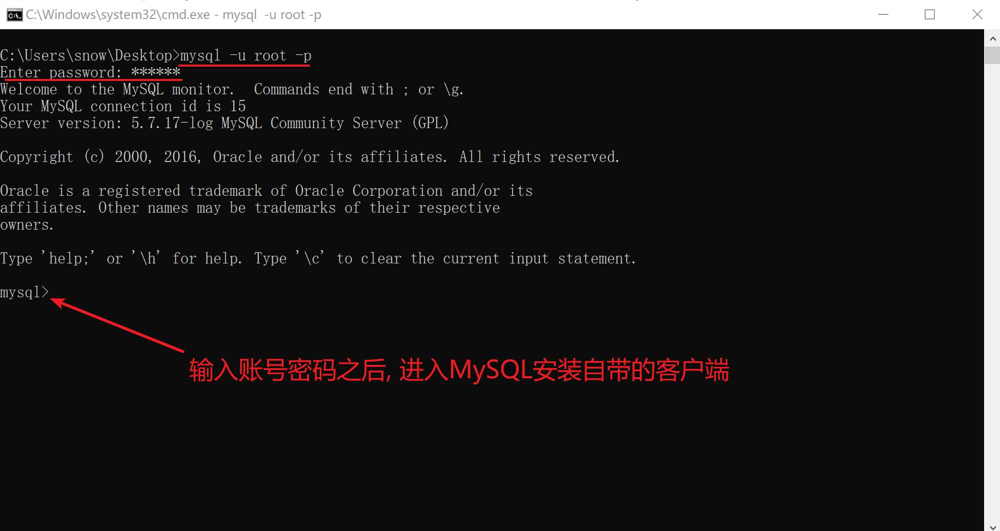

注1 :   注释

>```SQL
>-- <注释>; # 注释语句
># <注释>;  # 注释语句
>/*
>	<注释>   # 注释语句
>*/    
>```
>
>注意: 
>
>​		在数据库语句中如果我们需要注释某些内容, 一般有三种方式
>
>​		`--` 注释符(要注意的是`--`之后要有一个空格再接着书写注释内容)
>
>​		`#` 注释符 (之后不需要空格)
>
>​		`/* */` 注释符 (一般用于多行注释)

注2:   分号

>SQL语句应该要以分号作为结束

### 2.2.2 库操作

#### 查看数据库

>  show databases;  # 查看所有数据库 
>
>  show databases like '%数据库名%'; # 查看和期望命名相匹配的数据库
>
>  show create database 数据库名; # 查看数据库创建信息
>
>  ```java
>  // show databases like '%数据库名%'; 
>  // %代表是一个通配符: 通配0-n个字符
>  ```

``` sql
 show databases like 'test'; -- 指明就找test
 show databases like '%n';  -- 一个以n字符结束的数据库
 show databases like '%n%'; --  数据库名字中, 有一个n字符 

show create database test; -- 查看之前怎么创建的test数据库(sql语句是什么)
```

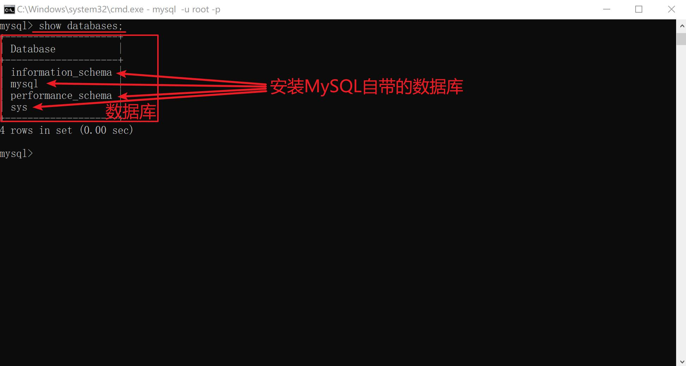

注: 了解(不需要专门记忆)

>- information_schema：主要存储了系统中的一些`数据库对象信息`，比如用户表信息、列信息、权限信息、字符集信息和分区信息等。
>
>- mysql：MySQL 的核心数据库，主要负责存储数据库`用户、用户访问权限`等 MySQL 自己需要使用的控制和`管理信息`。常用的比如在 mysql 数据库的 user 表中修改 root 用户密码。
>
>   update mysql.user set authentication_string=password('123456') where user='root';
>
>   flush privileges; 
>
> - performance_schema：主要用于`收集数据库服务器性能参数`。
>
>- sys：sys 数据库主要提供了一些视图，数据都来自于 performation_schema，主要是让开发者和使用者更`方便地查看性能`问题。

#### 创建数据库

> ```sql
> CREATE DATABASE [IF NOT EXISTS] <数据库名>
> [[DEFAULT] CHARACTER SET <字符集名>] 
> [[DEFAULT] COLLATE <校对规则名>];
> 
> eg:  
> 
> --  创建一个db47的数据库, 有可能创建失败直接报错(假如数据库服务里面已经有一个db47的数据库了)
> create database db47;
> -- 创建一个叫test数据库, 并且要求编码格式是utf8,  还要求排序规则utf8_bin
> create database test character set utf8 collate utf8_bin; 
> -- 如果不存在名字为db47的数据库, 就创建db47, 如果已经存在了db47的数据库, 就不创建(也不报错)
> create database if not exists db47; 
> -- 创建一个指定字符编码格式的和指定排序规则的数据库
> create database if not exists test character set utf8 collate utf8_bin; 
> ```
>
> - `[ ]`  可选。
> - <数据库名>：创建数据库的名称。
> - IF NOT EXISTS：在创建数据库之前进行判断，只有该数据库目前尚不存在时才能执行操作; 如果这个数据库存在, 就不创建/不执行这个sql。
> - [DEFAULT] CHARACTER SET：指定数据库的字符集。
> - [DEFAULT] COLLATE：指定字符集的默认校对规则。

注:一些注意事项

>* 注意我们MySQL创建数据库的时候, 如果没有指明编码格式, 那么创建出了数据库在存储字符串的时候, 很多系统默认使用latin1的编码格式 (latin1存储一个字符的时候一个字符占用1个字节, 并且不能存储中文, 中文没有办法用一个字节表示: 所以在实际工作的时候, 我们更应该使用utf8  or   utf8mb4)
>* MySQL中字符集:  UTF8 和UTF8MB4的区别
>
>```Java
>// (1)  5.5.3 版本以后的才支持UTF8MB4
>// (2)  UTF8MB4是 UTF8 的超集并完全兼容UTF8。
>// (3)  UTF8(也称UTF8MB3)，1汉字字符使用3字节存储。 
>// (4)  UTF8MB4，1表情字符使用4字节存储。(专门用来兼容4字节的UNICODE编码-平面设计-Emoji问题)。
>```
>
>* MySQL中几个了解的校对规则: 了解(不用记具体的排序规则, 只需要知道排序规则是干什么,是对谁起效果的)
>
>```Java
>校对规则/排序规则也可以称为排序规则，是指在字符与字符之间的比较规则。一个字符集有多种校对规则，每个字符集都有一个默认的校对规则。
>   
>eg: UTF8MB4: 下面只是用来举例说明, 不用记
>// (1) UTF8MB4_GENERAL_CI:  (默认规则),字符之间逐个比较,不区分大小写，在排序和比较效率更高。
>		//  一些特殊字符不能做到精准排序。
>		//  其实就是没有实现Unicode排序规则, 影响上实际并无所谓。
>// (2) UTF8MB4_UNICODE_CI:  基于标准的Unicode来排序和比较,精确排序, 不区分大小写。
>// (3) UTF8MB4_BIN: 字符直接用二进制数据编译存储，区分大小写，而且可以存二进制的内容。
>```
>

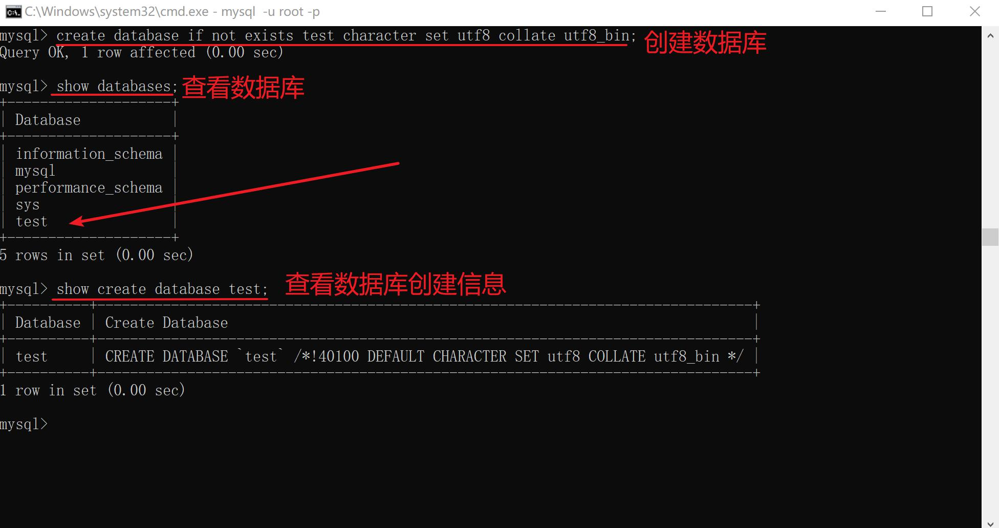

#### 删除数据库

>在工作中不要删除数据库, 哪怕这个数据库已经没有任何用处了 ( 任何数据都是有价值的, 哪怕是错的数据)
>
>```sql
>DROP DATABASE [IF EXISTS]  <数据库名>;  # 删除数据库
>
>eg:   drop database test; # 删除test数据库
>```

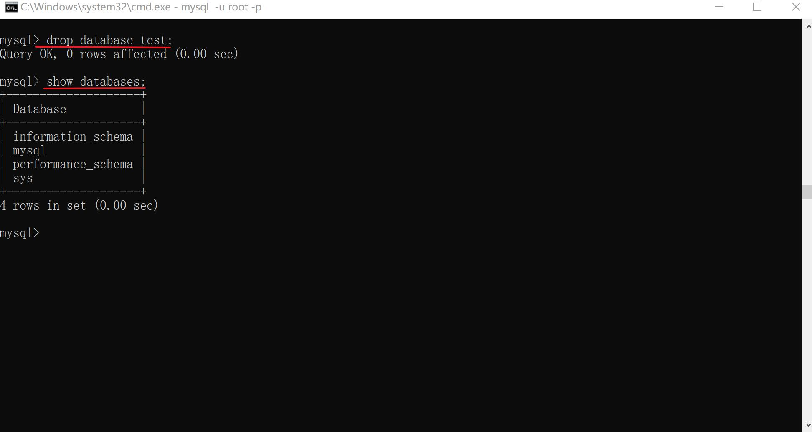

#### 修改数据库

>在工作中不要修改数据库, 因为没有任何意义
>
>```SQL
>ALTER DATABASE [数据库名] 
>{  [ DEFAULT ] CHARACTER SET <字符集名> | [ DEFAULT ] COLLATE <校对规则名>  }
>
>
>eg:  alter database test character set utf8 collate utf8_bin;  # 把test数据库的编码改成utf8, 校对规则改为utf8_bin
>```
>
>数据库中只提供了对数据库使用的字符集和校对规则修改操作。
>
>```java
>假设一种场景: 举个例子
>// 第一步: 先创建了一个数据库: create database th54 character set utf8;
>//        编码格式是utf8
>// 第二步: 在这个数据库th54中创建一个表: studnets->utf8. (如果在创建表的时候没有指明编码格式, 默认跟随数据库的编码格式)
>// 第三步: 修改了th54的编码格式: alter database th54 character set utf8mb4;
>//         th54的编码格式已经修改为utf8mb4
>//         studnets编码格式会不会跟着变? 默认不会, 还是utf8
>// 第四步: 创建一个全新的User表 : User -> utf8mb4
>```

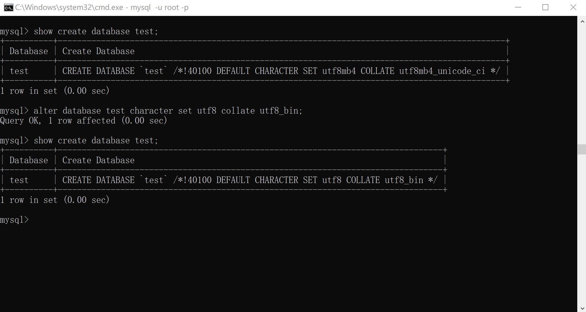

#### 选择数据库

>```SQL
>USE <数据库名>;  # 选择数据库
>
>eg: 
>use test; # 选择test数据库
>```
>
>一个MySQL系统中, 管理多个数据库。  我们只有进入对应的数据库中, 才能进一步操作数据库中的表和数据。

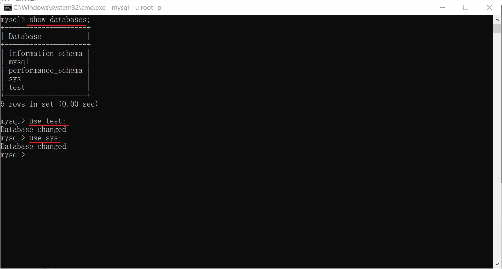

### 2.2.3 表操作

#### 常见的数据类型

>数据类型（DATA_TYPE）是指数据库所允许的数据的类型。
>
>[MySQL]()是一个数据存储容器,  数据类型定义了可以存储什么类型数据的规则。
>
>数据库是由多张表构成。其中每个表中对应的数据列,  都应该有适当的数据类型，用于限制或允许该列中存储的数据。

##### (1) 整数

| MySQL的整数类型 | 占用字节 |                有符号                | 无符号                 | 说明       |
| :-------------- | -------- | :----------------------------------: | ---------------------- | ---------- |
| TINYINT(M)      | 1        |             -128  ~  127             | 0  ~  255              | 很小的整数 |
| INT/INTEGER(M)  | 4        | -2<sup>31</sup>  ~  2<sup>31</sup>-1 | 0  ~  2<sup>32</sup>-1 | 普通整数   |
| BIGINT(M)       | 8        | -2<sup>63</sup>  ~  2<sup>63</sup>-1 | 0  ~  2<sup>64</sup>-1 | 大整数     |

>注意1:
>
>​    INT和INTEGER   在MySQL中并无区别, 仅是缩略写法.[link](https://dev.mysql.com/doc/refman/5.6/en/integer-types.html)。   
>
>注意2:  关于`整数`设置'长度/宽度'问题。
>
>​	第一原则:无论给整数设置什么长度都不违背上述'有/无符号'表示的存储范围(上述范围表示是一切基本标准)。
>
>​	第二原则: 设置长度之后, 如果存储的整数长度小于指定长度, 会默认在数字位前自动补空格, 以满足指定长度(但是补的空格这是不可见的), 也可以选择经过设置使用0填充;  设置长度之后, 如果存储的整数长度大于指定长度, 如果在表示范围内, 不做切割/不做处理(不补0, 也不补空格), 直接存储。
>
>```SQL
>CREATE TABLE `tb_test`  (
>`id` int NOT NULL,
>`age` int ZEROFILL NULL, -- zerofill: 填充0
>`height` int(3) unsigned NOT NULL,
>PRIMARY KEY (`id`)
>);
>```
>

##### (2) 浮点数

| MySQL的浮点数 | 占用字节 | 说明   |
| ------------- | -------- | ------ |
| FLOAT(M, D)   | 4        | 单精度 |
| DOUBLE(M, D)  | 8        | 双精度 |

>* M: 精度, 表示总数据位数。 取值范围为(1～255)。 
>* D: 标度, 表示小数位的位数。 取值范围为(1～30，且不能大于 M-2)。 
>* 需要注意的是: int类型设置宽度只是要不要填充空格和0的问题, 在float double中这个设置参数超过总位数会报错, 超过小数位限制舍弃
>* FLOAT 和 DOUBLE 在不指定精度时，默认会按照实际的精度(由计算机硬件和操作系统决定)。
>
>```SQL
> -- FLOAT 类型的取值范围如下：
> 有符号的取值范围：-3.402823466E+38～-1.175494351E-38。
> 无符号的取值范围：0 和 -1.175494351E-38～-3.402823466E+38。
> 
> -- DOUBLE 类型的取值范围如下：
> 有符号的取值范围：-1.7976931348623157E+308～-2.2250738585072014E-308。
> 无符号的取值范围：0 和 -2.2250738585072014E-308～-1.7976931348623157E+308。
> ```

##### (3) 日期

| MySQL日期                               | 字节 | 日期格式            | 表示范围                                  |
| --------------------------------------- | ---- | ------------------- | ----------------------------------------- |
| YEAR                                    | 1    | YYYY                | 1901 ~ 2155                               |
| TIME                                    | 3    | HH:MM:SS            | -838:59:59 ~ 838:59:59                    |
| DATE                                    | 3    | YYYY-MM-DD          | 1000-01-01 ~ 9999-12-31                   |
| <span style="color:red">DATETIME</span> | 8    | YYYY-MM-DD HH:MM:SS | 1000-01-01 00:00:00 ~ 9999-12-31 23:59:59 |
| TIMESTAMP                               | 4    | YYYY-MM-DD HH:MM:SS | 1970-01-01 00:00:01 ~ 2038-01-19 03:14:07 |

>* year/YEAR范围:   1901~ 2155包含255个年份, 对应一个字节表示范围。
>
>* time/TIME范围:   11111111111111111111111(23位剩余一位符号位)--> 8388607(十进制)
>
> ​					8388607:  838(小时位) xx(描述分钟) xx(描述秒)。 (计算方式不用记)
>
>* timestamp/TIMESTAMP范围:  (时间戳) (一般用于一些计时, 倒计时, 数据传输 ......) (秒数1)
>
> ​					1970年1月1日作为UNIX TIME的纪元时间(开始时间)。
>
>```C
>--
>create table user(
>	id int,
>    name varchar(5),
>    height float(5, 2),
>    birthday datetime,
>    tag_time timestamp
>)
>--
>insert into user4 values(1, 'zs', 188.01, '2000-11-12 55:30:12', '2000-01-01 00:00:00');
>insert into user4 values(1, 'zs', 188.01, '2000-11-12 10:30:12', now());
>```

##### (4) 字符串

| MySQL字符串 | 内存占用                        | 说明             |
| ----------- | ------------------------------- | ---------------- |
| CHAR(M)     | (M * 单个字符占用字节)          | 固定长度字符串   |
| VARCHAR(M)  | L+1字节 or L+2字节 。           | 变长字符串       |
| TEXT(M)     | L+2字节 。  L: 0~2<sup>16</sup> | 变长文本字符串   |
| LONGTEXT(M) | L+4字节 。  L: 0~2<sup>32</sup> | 变长大文本字符串 |

>L:  存储字符的实际长度。
>
>M:  列的指定长度。
>
>- CHAR (M不设置默认为1) 范围可以设置最大255 。
>- VARCHAR(M不设置会报错) 最大长度为 65,535.
>- TEXT 最大长度为 65535字符
>- LONGTEXT 最大长度长度为 4294967295 字符。

>1, 数据库中的char可以正常存储字符串: eg: "zs", "我爱学习" ....; (但是一般我们用到的char的时候, 更多是为了存储类似性别这种具有固定长度和格式的短字符串)
>
>2, 创建表的时候, 如果使用char类型, 不加宽度/长度, 长度默认为1;   如果使用varchar不加长度/宽度, 创建的时候会报错, text/longtext同样建议指明长度(有些版本中不指明会报错)
>
>3, 在数据库中, 只要是字符串, 都有长度限制, 在字符串列存储数据的时候, 不能超出既定的长度限制 (字符串的长度限制是一个严格限定).
>
>4, 如果使用char类型(`定长字符串`), 它是一个固定长度字符串: 如果我们常见char的时候指明的宽度为m, 每一个这个char列的数据, 最终开辟的内存空间为: 单个字符占用空间 * M;  和实际存储了几个字符无关
>
>5, 我们使用varchar这种`变长字符串`存储数据的的时候, 字符串实际占用的内存空间和我们给varchar设置的宽度/长度没有任何关系, 只和这个varchar列实际存储的字符个数有关.

#### 查看表

>```SQL
>SHOW TABLES;			 # 查看该数据库中所有表
>SHOW CREATE TABLE <表名>;	# 查看表的创建语句
>DESCRIBE <表名>;			# 查看表结构
>DESC <表名>;				# 查看表结构
>```

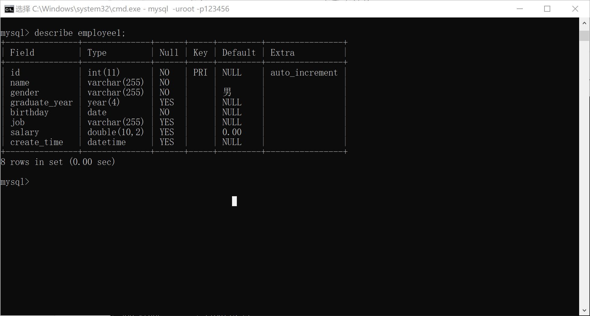

#### 创建表

>```SQL
>CREATE TABLE <表名>  (
><列名1> <类型1> ,
>[…] ,
><列名n> <类型n>
>)   [表选项] [分区选项];
>
>eg1:
>create table employee(
>	id int ,
>       name varchar(20),
>       gender char,
>       birthday date,
>       job varchar(20),
>       salary double(10,2)
>)character set utf8 collate utf8_bin;
>-- 不推荐专门给一个表设置编码格式(没什么用, 只会让一个数据库编码格式不统一)(建议不设编码格式: 表的编码格式遵从数据库设置的编码格式)
>
>eg2: 仅仅是个完善的写法示例, 一些写法完全没有必要(比如重复设置字符编码格式), 比如注释
>CREATE TABLE  employee1  (
>    id int(11) NOT NULL AUTO_INCREMENT COMMENT 'id',
>    name varchar(255) CHARACTER SET utf8mb4 COLLATE utf8mb4_general_ci NOT NULL DEFAULT '' COMMENT '姓名',
>    gender varchar(255) CHARACTER SET utf8mb4 COLLATE utf8mb4_general_ci NOT NULL DEFAULT '男' COMMENT '性别',
>    graduate_year year NULL DEFAULT NULL COMMENT '毕业时间',
>    birthday date NOT NULL COMMENT '生日',
>    job varchar(255) CHARACTER SET utf8 COLLATE utf8_bin NULL DEFAULT NULL COMMENT '职位名称',
>    salary double(10, 2) NULL DEFAULT 0.00 COMMENT '薪资',
>    create_time datetime NULL DEFAULT NULL COMMENT '信息创建时间',
>    PRIMARY KEY (id) USING BTREE
>) ;
>```
>

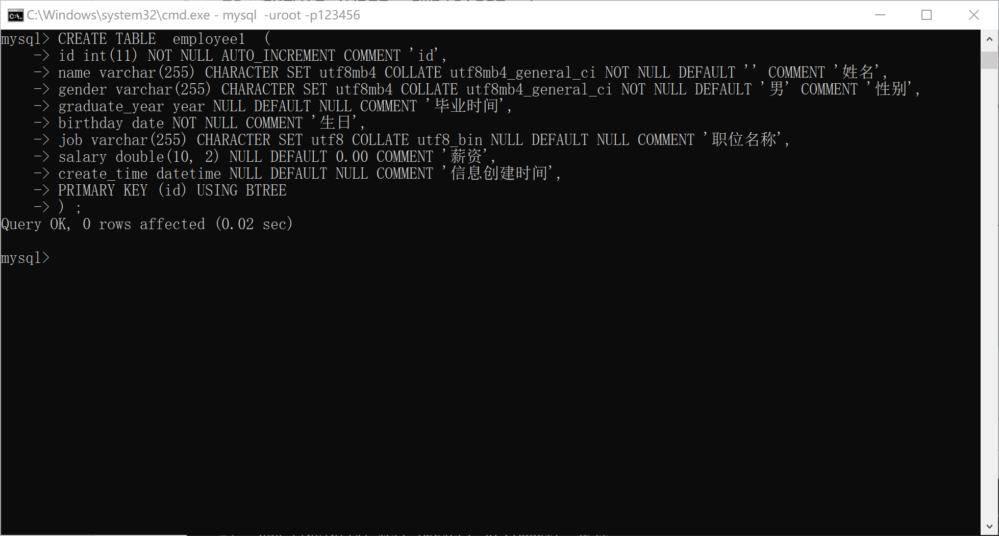

##### 主键和自增问题

>主键（PRIMARY KEY）又被称为''主键约束''，是 MySQL中使用非常频繁的约束。它有诸多作用(唯一标识, 查找效率...)。
>
>注意1:
>
>```SQL
>-- 主键: 如果一个表中给某一列设置了主键, 那么这一列强制不能重复, 如果存储重复的主键会自动报错
>-- 主键: 不允许是null, 存储null主键, 报错
>-- 每个表只能定义一个主键。
>-- 主键值必须唯一标识表中的每一行，且不能为 NULL，即表中不可能存在有相同主键值的两行数据。
>
>ps: 如果用户没有定义主键，也没有定义索引，那么InnoDB引擎会在创建表的时候, 自动生成一个不可见的ROW_ID的列名的聚簇索引，该列是一个6字节的自增数值，随着插入而自增, 来起到主键的作用。
>```
>
>主键分类:
>
>```SQL
>主键分为单字段主键和多字段联合主键
>-- 单字段主键: 既将表中的一个字段设置主键; 通过 PRIMARY KEY 关键字来指定主键.
>CREATE TABLE table_primary1(
>    id INT(11) PRIMARY KEY , -- 主键
>    name VARCHAR(25),
>    job VARCHAR(25),,
>    salary FLOAT
>);
>CREATE TABLE table_primary2(
>    id INT(11),
>    name VARCHAR(25),
>    job VARCHAR(25),
>    salary FLOAT,
>    PRIMARY KEY(id)
>);
>
>-- 如果一个表表在创建的时候没有主键, 增加主键的sql -- 使用上: 没有任何意义
>-- alter table 表名 add primary key (主键列);
>alter table user add primary key (id);
>
>-- 联合主键: 复合主键(不建议)。这意味着id和name的组合在table_primary3表中表示主键。
>CREATE TABLE table_primary3(
>        id INT(11),
>        name VARCHAR(25),
>        job VARCHAR(25),
>        salary FLOAT,
>        PRIMARY KEY(id, name)
>);
>```
>
>注意2: 唯一键: 仅了解
>
>```C
>// 唯一键(Unique Key)是数据库中的一个约束，用于确保表中的所有记录在指定的一列或列组合上是唯一的。即:组合唯一。
>// 与主键不同的是，唯一键允许有空值(NULL)。
>// 表中可以有多个唯一键约束。
>// 在某些情况下，唯一键也可以作为主键的一部分。
>
>CREATE TABLE table_primary3(
>        id INT(11),
>        name VARCHAR(25),
>        job VARCHAR(25),
>        salary FLOAT,
>        primary KEY(id),
>        unique key (job, salary)
>);
>```
>
>注意3: 自增问题 AUTO_INCREMENT
>
>```SQL
>CREATE TABLE table_primary1(
>id INT(11) PRIMARY KEY AUTO_INCREMENT , -- 主键
>name VARCHAR(25),
>job VARCHAR(25),,
>salary FLOAT
>);
>-- AUTO_INCREMENT 的初始值是 1，数据增加一条，该字段值自动加 1。
>-- 建议: 一个表中应该只有一个字段使用 AUTO_INCREMENT 约束，且该字段一般位为作为索引/主键的id字段。
>-- AUTO_INCREMENT 字段应该要设置 NOT NULL 属性。
>-- AUTO_INCREMENT 约束的字段只能是整数类型。
>-- AUTO_INCREMENT 上限为所约束的类型的数值上限。
>
>-- 如果一个表表在创建的时候某些列没有自增, 设置自增
>-- alter table 表名 modify 列名 int auto_increment;
>alter table user modify id int auto_increment;
>
>
>```

#### 修改表

>```SQL
>ALTER TABLE <表名> ADD COLUMN <列名> <类型>; # 添加列
>ALTER TABLE <表名> ADD <新字段名> <数据类型> FIRST; # 头位置添加列
>ALTER TABLE <表名> ADD <新字段名> <数据类型> AFTER <已经存在的字段名>; # 指定位置添加列
>ALTER TABLE <表名> MODIFY COLUMN <列名> <类型>;  # 修改某列类型
>ALTER TABLE <表名> CHANGE COLUMN <旧列名> <新列名> <新列类型>; # 修改列及类型
>ALTER TABLE <表名> ALTER COLUMN <列名> SET DEFAULT <默认值>; # 修改某列默认值
>ALTER TABLE <表名> ALTER COLUMN <列名> DROP DEFAULT; # 删除某列默认值
>ALTER TABLE <表名> DROP COLUMN <列名>; # 删除某列
>ALTER TABLE <表名> RENAME TO <新表名>; # 修改表名
>ALTER TABLE <表名> RENAME AS <新表名>; # 修改表名
>ALTER TABLE <表名> RENAME <新表名>; # 修改表名
>RENAME TABLE <表名> TO <新表名>; # 修改表名
>ALTER TABLE <表名> CHARACTER SET <字符集名>; # 修改表字符集
>ALTER TABLE <表名> COLLATE <校对规则名>; # 修改表排序规则
>ALTER TABLE <表名> [DEFAULT] CHARACTER SET <字符集名> [DEFAULT] COLLATE <校对规则名>;
>
>eg:
>alter table employee  add column height  float(5,2);
>alter table employee  add column height  float(5,2) first;
>alter table employee  add column height  float(5,2) after name;
>alter table employee modify  column age float(5, 0);
>alter table employee  change column age age1 float(5, 0);
>alter table employee alter column age set default 20;
>alter table employee alter column age drop default;
>alter table employee drop column height;
>alter table employee rename to aaa;
>alter table aaa rename as employee;
>alter table employee rename  aaa;
>rename table aaa to employee;
>alter table employee character set utf8mb4;
>alter table employee collate utf8mb4_unicode_ci;
>alter table employee character set gbk collate gbk_bin;
>```
>

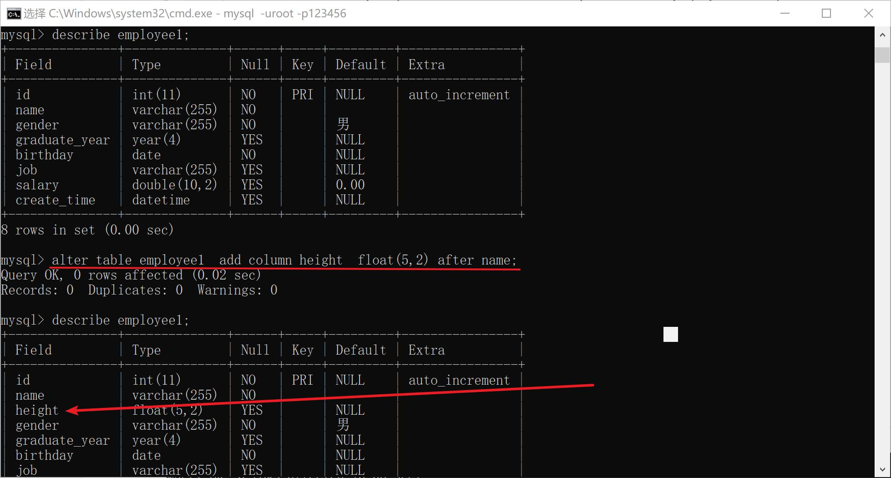

#### 删除表

>不允许在工作直接删除表

>更不建议: 任何数据都是有意义的

>```SQL
>DROP TABLE [IF EXISTS] 表名1 [ ,表名2, 表名3 ...]
>
>eg:
>drop table if exists table_a, table_b, table_c;
>```
>

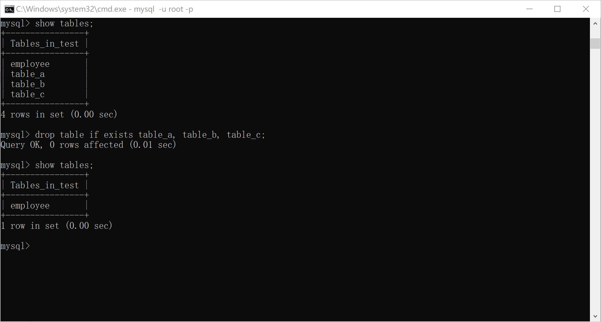

### 2.2.4 数据操作

#### 添加数据

>```SQL
>INSERT INTO <表名> [ (<列名1>, … <列名n> )]  VALUES (值1, … 值n), … (值1, … 值n);
>INSERT INTO <表名> SET <列名1>=<值1>, … <列名n>=<值n>;
>
>eg:
>insert into employee1 (id, name, gender, graduate_year, birthday, job, salary, create_time) values(1, 'zs', '男', 2022, '1999-01-01', '程序员',  100.2, '2022-09-09 16:51:49');
>
>insert into employee1 (id, name, gender, graduate_year, birthday, job, salary, create_time) values(1, 'zs', '男', 2022, '1999-01-01', '程序员',  100.2, '2022-09-09 16:51:49'),(2, 'ls', '男', 2020, '1997-01-01', '程序员',  10000.2, '2022-09-09 16:51:50');
>
>insert into employee1  set id=4, name='ls', gender='男', graduate_year=2022, birthday='1999-01-01', job='程序员', salary=220.05,  create_time='2022-09-09 16:55:49';
>```
>
>* 如果values中包含数据和表列数据一一对应(无省略),  那么在插入语句中可以省略表名之后表列的一一列举。eg: insert   into  表名  values (值1, … 值n);
>* values中的内容应该要与对应插入字段对应。
>* 数据中字符串和日期应该包含在引号中。

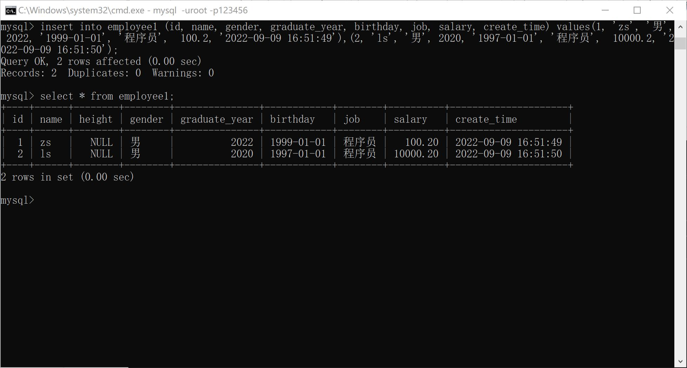

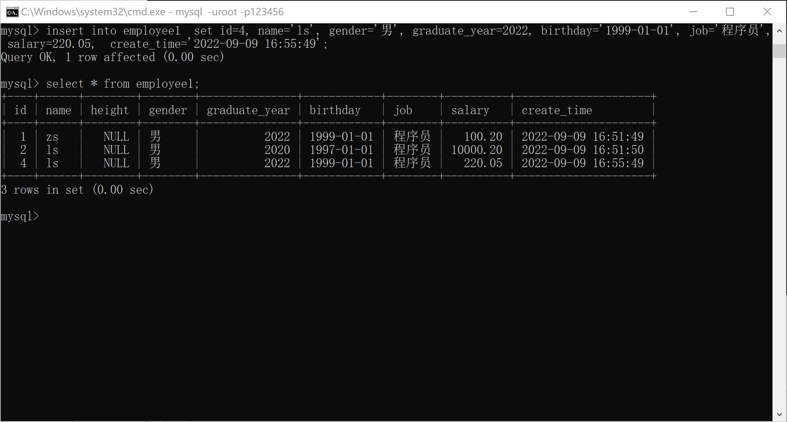

#### 查询数据

>```SQL
>SELECT  *  FROM <表名字>  [ WHERE  <条件> ];
>SELECT  <列名1>, …<列名n>  FROM <表名字>  [ WHERE  <条件> ];
>
>eg:
>select * from employee1;
>select * from employee1 where id<20;
>select name from employee1 where id>1;
>select name, job, salary from employee1 where salary> 200;
>```
>
>* 查询的结果是一个新的临时表。
>* 在MySQL中 `select * from 表名 where 1;` 表示查询所有数据。

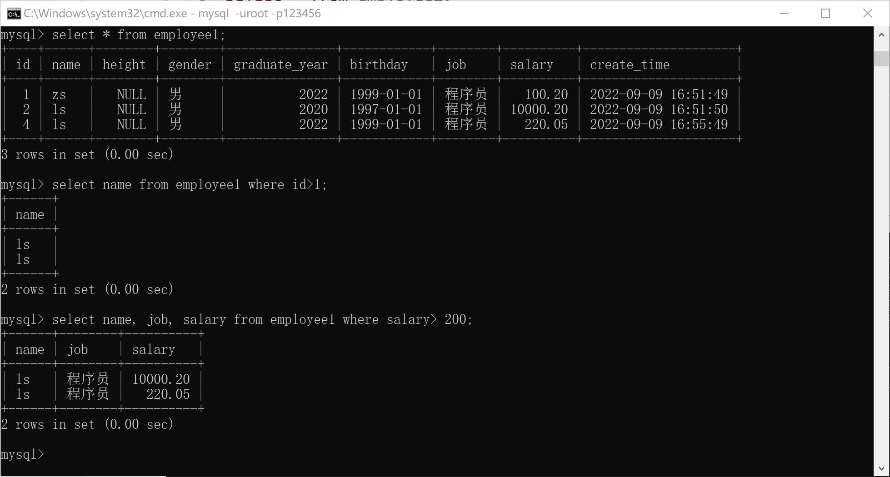

#### 修改数据

>```SQL
>UPDATE <表名> SET 列1=值1 [, 列2=值2 … ] [WHERE <条件> ]
>
>eg:
>update employee1 set job='老程序员' where salary >10000;
>```
>
>* 注意如果没有where子句指明条件, 那么修改就是对所有行的修改。
>* 修改一行数据的多个列值时，SET 子句的每个值用逗号分开即可。

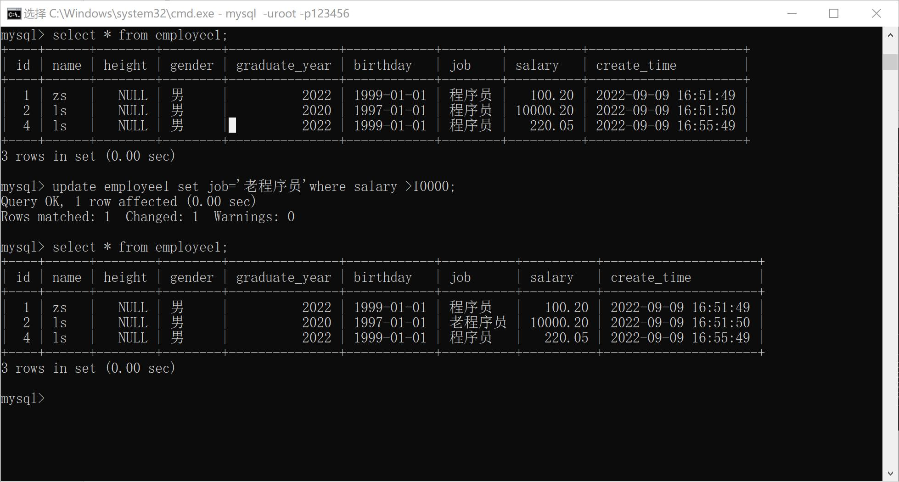

#### 删除数据

>在工作中删除数据, 一般是逻辑删除

>```SQL
>DELETE FROM <表名> [WHERE <条件>]
>
>ag:
>delete from employee;
>delete from employee where id=4;
>```
>
>* 如果没有where以及条件, 默认删除是表中所有数据。
>* delete不能单独只删除某一列数据, delete删除数据的最小单元为行。
>* delete语句仅删除数据记录, 删除的不是表, 如果要删除表需要使用drop table语句。

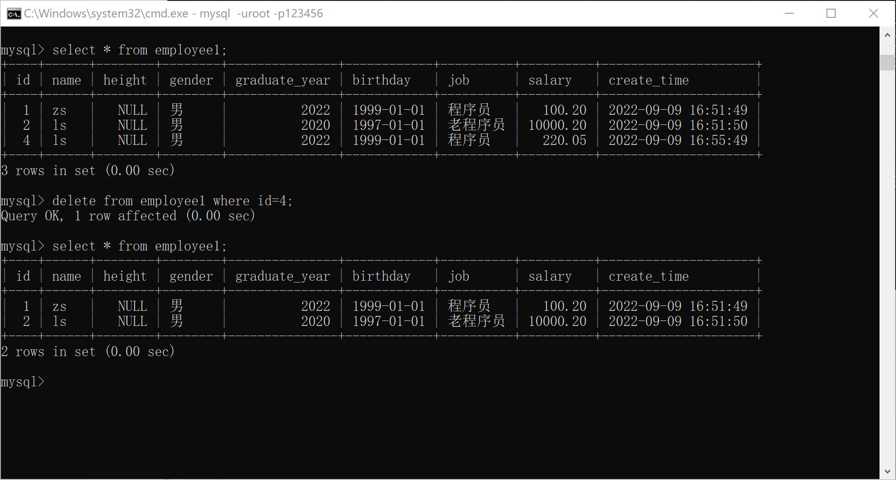

## 2.3 特殊关键字

>数据基础
>
>```SQL
>CREATE TABLE `students`  (
>  `id` int(11)  PRIMARY KEY  AUTO_INCREMENT,
>  `name` varchar(255)   ,
>  `class` varchar(255)  ,
>  `chinese` float  ,
>  `english` float  ,
>  `math` float  
>) ;
>```
>
>```SQL
>INSERT INTO students (id, name, class, chinese, english, math) VALUES (1, '武松', '一班', 70, 90, 60);
>INSERT INTO students VALUES (2, '林冲', '一班', 70, 90, 90);
>INSERT INTO students VALUES (3, '松江', '一班', 90, 90, 20);
>INSERT INTO students VALUES (4, '贾琏', '二班', 60, 60, 60);
>INSERT INTO students VALUES (5, '贾宝玉', '二班', 95, 80, 5); 
>INSERT INTO students VALUES (6, '贾环', '二班', 25, 25, 5); 
>INSERT INTO students VALUES (7, '曹操', '三班', 90, 90, 90); 
>INSERT INTO students VALUES (8, '曹丕', '三班', 90, 80, 80); 
>INSERT INTO students VALUES (9, '曹植', '三班', 98, 90, 80); 
>INSERT INTO students VALUES (10, '刘备', '三班', 95, 90, 80); 
>INSERT INTO students VALUES (11, '诸葛亮', '三班', 98, 95, 95); 
>INSERT INTO students VALUES (12, '孙权', '三班', 80, 90, 80); 
>INSERT INTO students (id) VALUES (13);
>```
>
>

### 2.3.1 Where

>```SQL
>SELECT <查询内容|列等> FROM  <表名字> WHERE <查询条件|表达式>
>
>eg:
>select id, name from students where id > 10;
>```
>
>使用 WHERE 关键字并指定`查询/删除/修改的条件`, 让操作在`满足条件`的情况下执行 数据操作.

><b>在构建Where的`条件`的过程中, 我们可能需要了解到一些重要的`SQL运算符`</b>
>
>1, 算术运算符:  可以用在条件中, 也可以用在结果集中
>
>| 运算符 | 作用 |
>| ------ | ---- |
>| +      | 加   |
>| -      | 减   |
>| *      | 乘   |
>| /      | 除   |
>| %      | 取余 |
>
>```SQL
>eg:
>select * from students where (chinese + english + math) < 180; 
>select * from students where (chinese - math) > 30; 
>select *, (chinese*0.5 + english*0.1 + math *0.4) from students; 
>select *, (chinese*0.5 + english*0.1 + math *0.4)  from students where (chinese*0.5 + english*0.1 + math *0.4) <= 60 ;  
>select *, (chinese + english + math) /180 from students ;  
>select *, (chinese + english + math) /180 from students  where (chinese + english + math) /180  < 1.2; 
>```
>
>2, 比较和逻辑运算符
>
>| 运算符      | 作用       | 运算符      | 作用                      |
>| ----------- | ---------- | ----------- | ------------------------- |
>| =           | 等于       | <=>         | 等于(可比较null)          |
>| !=          | 不等于     | <>          | 不等于                    |
>| <           | 小于       | >           | 大于                      |
>| <=          | 小于等于   | >=          | 大于等于                  |
>| is null     | 是否为null | is not null | 是否不为null              |
>| between and | 在闭区间内 | in          | 是否在列表内              |
>| not in      | 不在列表内 | like        | 通配符匹配(%:通配, _占位) |
>| and         | 与         | &&          | 与                        |
>| or          | 或         | \|\|        | 或                        |
>
>```SQL
>select * from students where chinese = 60;
>select * from students where chinese <=> 60;
>select * from students where chinese != 60;
>select * from students where chinese <=> 60;
>select * from students where  chinese < 60;
>select * from students where  chinese > 90;
>select * from students where  chinese <= 60;
>select * from students where  chinese >= 90;
>select * from students where  chinese is null;
>select * from students where  chinese is not null;
>select * from students where  chinese between 60 and 90;
>select * from students where  chinese in (60 , 90);
>select * from students where  chinese not in (60 , 90);
>select * from students where  name = '曹操';
>select * from students where  name like '曹操';
>select * from students where  name like '曹%';
>select * from students where  name like '曹%'  and  chinese = 90;
>select * from students where  name like '曹%'  &&  chinese = 90;
>select * from students where  name like '曹%'  or  chinese = 90;
>select * from students where  name like '曹%'  ||  chinese = 90;
>```

### 2.3.2 Distinct

>使用`DISTINCT`对数据表中`一个或多个字段`重复的数据进行过滤，重复的数据只返回其`一条`数据给用户.
>
>```SQL
>SELECT DISTINCT <字段名> FROM <表名>;
>
>eg:
>select distinct chinese from students;
>select distinct chinese, english from students;
>```
>
>注意:
>
>```SQL
>-- DISTINCT 只能在SELECT语句中使用。 (对结果进行去重)
>-- 当对一个或多个字段去重时，DISTINCT 要写在所有字段的最前面。
>-- 如果 DISTINCT 对多个字段去重时，只有多个字段组合起来完全是一样的情况下才会被去重。
>```

### 2.3.3 Limit 

>使用`LIMIT`对数据表查询结果集大小进行限定.
>
>```SQL
>SELECT <查询内容|列等> FROM  <表名字> LIMIT 记录数目
>SELECT <查询内容|列等> FROM  <表名字> LIMIT 初始位置，记录数目;
>SELECT <查询内容|列等> FROM  <表名字> LIMIT 记录数目 OFFSET 初始位置;
>    
>    eg:
>    select * from students limit 3;
>select * from students limit 4, 3;
>select * from students limit 3 offset 4;
>```
>
>LIMIT 记录数目: 从第一条开始, 限定记录数目
>
>LIMIT 初始位置，记录数目: 从起始位置开始, 限定记录数目
>
>LIMIT 记录数目 OFFSET 初始位置: 从起始位置开始, 限定记录数目
>
>注意: 数据(默认下标从0开始)

### 2.3.4 As

>`AS` 关键字用来为表和字段指定别名.
>
>```SQL
><内容> AS <别名>
>
>eg:
>select  name from students;
>select  * from students as s where s.chinese < 60;
>select  s.name from students as s ;
>select  s.name from students as s where s.chinese < 60;
>select  name as username from students;
>select  * from students;
>select  *, (chinese + english + math) from students;
>select  *, (chinese + english + math) as sum from students;
>```
>

### 2.3.5 Order By

>`ORDER BY`对查询数据结果集进行排序.
>
>```SQL
>SELECT <查询内容|列等> FROM  <表名字> ORDER BY <字段名> [ASC|DESC];
>
>eg: 
>select * from students order by chinese;
>select * from students order by chinese asc;
>select * from students order by chinese desc;
>select * from students order by chinese, english;
>select * from students order by chinese desc, english desc, math desc;
>```
>
>不加排序模式: 升序排序.
>
>ASC: 升序排序.
>
>DESC: 降序排序.
>
>注意:  如上查询, 当我们进行多字段排序的时候, 会先满足第一个列的排序要求, 如果第一列一致的话, 再按照第二列进行排序, 以此类推.

### 2.3.6 Group By

>使用 GROUP BY 关键字,对数据进行分组
>
>```SQL
>SELECT <查询内容|列等> FROM  <表名字> GROUP BY  <字段名...>
>
>eg: 
>select class, group_concat(name), group_concat(chinese) from students group by class;
>select class, group_concat(name) from students where chinese > 90 group by class;
>	
>select class, group_concat(name), avg(chinese) from students group by class;
>select class, group_concat(name) from students group by class having count(*) > 3;
>select class, group_concat(name), avg(chinese) from students group by class having avg(chinese) > 60;	
>```
>
>GROUP_CONCAT()函数会把每个分组的字段值都显示出来.
>
>HAVING 可以让我们对分组后的各组数据过滤。(一般和分组+聚合函数配合使用)

### 2.3.7 聚合函数

>聚合函数一般用来计算列相关的指定值. `通常`和`分组`一起使用
>
>| 函数  | 作用   | 函数 | 作用   |
>| ----- | ------ | ---- | ------ |
>| COUNT | 计数   | SUM  | 和     |
>| AVG   | 平均值 | MAX  | 最大值 |
>| MIN   | 最小值 |      |        |

- COUNT: 计数

  >```SQL
  >SELECT <查询内容|列等> , COUNT <列|*> FROM  <表名字> GROUP BY HAVING COUNT <表达式|条件>
  >
  >eg:
  >    select count(*) from students 
  >    select count(name) from students 
  >    select class, group_concat(name), count(*) from students group by class;
  >    select class, group_concat(name), count(*) from students group by class having count(*) > 2;
  >```
  >
  >COUNT(*):  表示表中总行数
  >
  >COUNT(列): 计算除了列值为NULL以外的总行数

- SUM: 求和

  >```SQL
  >SELECT <查询内容|列等> , SUM<列> FROM  <表名字> GROUP BY HAVING SUM<表达式|条件>
  >
  >eg:
  >select sum(chinese) from students;
  >    select sum(chinese), sum(english), sum(math) from students;
  >    select class, group_concat(name), sum(chinese) from students group by class;
  >    select class, group_concat(name), sum(chinese) from students group by class having sum(chinese)>200;
  >    select class, group_concat(name), sum(chinese), sum(math) from students group by class;
  >    select class, group_concat(name), sum(chinese), sum(math) from students group by class having sum(chinese)>200 and sum(math) > 200;
  >
  >```

- AVG: 平均值

  >```SQL
  >SELECT <查询内容|列等> , AVG<列> FROM  <表名字> GROUP BY HAVING AVG<表达式|条件>
  >
  >eg:
  >select avg(chinese) from students;
  >    select avg(chinese), avg(english), avg(math) from students;
  >    select class, group_concat(name), avg(chinese) from students group by class;
  >    select class, group_concat(name), avg(chinese) from students group by class having avg(chinese)>=60;
  >    select class, group_concat(name), avg(chinese), avg(math) from students group by class;
  >    select class, group_concat(name), avg(chinese), avg(math) from students group by class having avg(chinese)>=60 and avg(math) >=60;
  >```

- MAX: 最大值

  >```SQL
  >SELECT <查询内容|列等> , MAX<列> FROM  <表名字> GROUP BY HAVING MAX<表达式|条件>
  >
  >eg: 
  >    select max(chinese) from students;
  >    select max(chinese), max(english), max(math) from students;
  >    select class, group_concat(name), max(chinese) from students group by class;
  >    select class, group_concat(name), max(chinese) from students group by class having max(chinese)>90;
  >    select class, group_concat(name), max(chinese), max(math) from students group by class;
  >    select class, group_concat(name), max(chinese), max(math) from students group by class having max(chinese)>=90 and max(math) >=70;
  >```

- MIN: 最小值

  >```SQL
  >SELECT <查询内容|列等> , MIN<列> FROM  <表名字> GROUP BY HAVING MIN<表达式|条件>
  >
  >eg:
  >    select min(chinese) from students;
  >    select min(chinese), min(english), max(math) from students;
  >    select class, group_concat(name), min(chinese) from students group by class;
  >    select class, group_concat(name), min(chinese) from students group by class having min(chinese)>60;
  >    select class, group_concat(name), min(chinese), min(math) from students group by class;
  >    select class, group_concat(name), min(chinese), min(math) from students group by class having min(chinese)>=60 and min(math) >=60;
  >```

## 2.4 SQL执行顺序

>```SQL
>(5) SELECT column_name, ... 
>(1) FROM table_name, ... 
>(2) [WHERE ...] 
>(3) [GROUP BY ...] 
>(4) [HAVING ...] 
>(6) [ORDER BY ...];
>(7)	[Limit ...]
>
>-- 计算每个班级中语文成绩大于60的同学的平均数学成绩, 获得平均数学成绩大于等于40的班级中平均语文成绩最高的那个班级的平均语文和数学成绩
>eg:
>	select class, group_concat(name), avg(chinese) as chineseA, avg(math) from students where chinese > 60 group by class having  avg(math)>=40 order by chineseA desc  limit 0, 1;
>```
>
>- 小括号中的数字代表执行顺序
>
>- having和select的执行顺序收到优化器的影响，可能会改变执行顺序

## 2.5 数据完整性

>为了在`实际工程环境中`更好的`使用和维护`数据库数据, 在我们设计和使用`数据库的库/表/数据`的时候, 一般要遵循`数据完整性`规则; `数据完整`保证在`数据库设计`和`数据存储`过程中, 对数据的`存储/处理`是做到尽可能正确; 做到`降低`用户在实际使用的时候`出错`的可能性, 尽可能提高数据库的使用效率.

>ps: **所谓数据完整性:  是在数据库中表和数据的设计的时候定制的一些约定俗成的参考规范. 是站在组织数据的角度, 目的是希望在数据库中数据存储更规整,以及希望操作数据的时候效率更高**

> 而`数据完整性`又包含: 实体完整性;   域完整性;  参照完整性

### 2.5.1 实体完整性

><span style="color:red">保证`表`中的`每一行数据`都是`表`中唯一的实体.</span>(即:一个表中每一条数据都应该是唯一的)
>
>实体完整性是为了保证表中`数据唯一`, 实体完全可由`主键`实现(通过一个主键的设置, 保证一个表中每一条信息都是唯一的).
>
>```SQL
>CREATE TABLE `students`  (
>`id` int(11)  PRIMARY KEY  AUTO_INCREMENT,
>`name` varchar(255)   ,
>`class` varchar(255)  ,
>`chinese` float  ,
>`english` float  ,
>`math` float  
>) ;
>```
>

###  2.5.2 域完整性

><span style="color:red">`域完整性`表示保证表中数据的`字段`的`取值`在`有效范围`之内`或者`符合特定的`数据类型`约束</span>
>
>1, 含义: 某一列的数据存储的类型要设计合适 (`float`, `varchar`,`NULL`, `NOT NULL`...)
>
>2, 在某一列存储数据的时候, 存储的数据的内容, 应该要符合对这个列的类型以及大小限定
>
>```SQL
>CREATE TABLE `students`  (
>`id` int(11) NOT NULL PRIMARY KEY AUTO_INCREMENT,
>`name` varchar(10)  NOT NULL DEFAULT "张飞",
>`class` varchar(5)  NULL DEFAULT NULL,
>`chinese` float NOT NULL,
>`english` float NOT NULL,
>`math` float NOT NULL
>);
>```
>

### 2.5.3  参照完整性

><span style="color:red">`参照完整性`用于确保`相关联`的表间的`数据`应该要`保持一致`.</span>
>
>避免因为一个表的数据/记录修改, 造成另一个表的内容变为无效的值. 一般来讲, 参照完整性是通过外键和主键来维护的.
>
>外键是参照完整性的一种强有力的维护手段.
>
>参照完整性  != 外键

>主键的设置和取消: (了解)
>
>```SQL
>--方式一: 在创建表的时候设置外键
>CREATE TABLE `class`  (
>`id` int NOT NULL PRIMARY KEY,
>`name` varchar(20) NULL
>);
>CREATE TABLE `student`  (
>`id` int NOT NULL PRIMARY KEY,
>`name` varchar(20) NULL,
>`class_id` int ,
>CONSTRAINT `foreign_key_name` FOREIGN KEY (class_id) REFERENCES `class`(`id`)
>);
>--方式二: 表创建完毕, 对表设置外键
>CREATE TABLE `class`  (
>`id` int NOT NULL PRIMARY KEY,
>`name` varchar(20) NULL
>);
>CREATE TABLE `student`  (
>`id` int NOT NULL PRIMARY KEY,
>`name` varchar(20) NULL,
>`class_id` int 
>);
>
>ALTER TABLE  `student` ADD CONSTRAINT `foreign_key_name` FOREIGN KEY (`class_id`) REFERENCES  `class` (`id`);
>
>--方式三: 表创建完毕, 添加新的字段列, 并且设置为外键
>CREATE TABLE `class`  (
>`id` int NOT NULL PRIMARY KEY,
>`name` varchar(20) NULL
>);
>CREATE TABLE `student`  (
>`id` int NOT NULL PRIMARY KEY,
>`name` varchar(20) NULL
>);
>alter table `student` add column `class_id` int null after `name`,
>add constraint `foreign_key_name` foreign key (`class_id`) references `class` (`id`);
>
>-- 删除外键
>ALTER TABLE `student` DROP FOREIGN KEY `foreign_key_name`;
>```
>
>外键优缺点: 重要
>
>```C
>优点：
>// 能够限制数据的增加、删除或者是修改操作，来保证数据的一致性。
>缺点：
>// 在插入/修改子表（student）的数据的时候，需要去父表（class）中找对应的数据
>// 在删除/修改父表（class）的数据的时候，需要去检查子表（student）中是否有对应的数据
>// 有了外键之后，影响了增加、删除、修改的性能
>// 使用起来也不方便
>```
>
>在公司中是否使用外键呢: 重要
>
>```c
>看具体公司内部的情况是否使用外键
>// 假如公司表中的数据量不大（外键对效率的影响比较小，甚至可以忽略），可以考虑使用外键
>// 假如公司数据库表中的数据很多，（外键对于效率的影响就会很大），不应该使用外键
>// 人为使用习惯(内心OS)
>// ...
>```

# 3, SQL和多表问题

>数据基础
>
>```SQL
>-- 班级
>CREATE TABLE `class`  (
>  `id` int(11) NOT NULL,
>  `class_name` varchar(10) ,
>  PRIMARY KEY (`id`)
>);
>-- 成绩
>CREATE TABLE `score`  (
>  `id` int(11) NOT NULL AUTO_INCREMENT,
>  `student_id` int(11) ,
>  `class_id` int(11),
>  `chinese` float ,
>  `english` float ,
>  `math` float ,
>  PRIMARY KEY (`id`) 
>);
>-- 学生信息
>CREATE TABLE `student`  (
>  `id` int(11) NOT NULL,
>  `student_name` varchar(20),
>  `nick_name` varchar(20) ,
>  `mobile` varchar(20) ,
>  `era` varchar(20),
>  `motto` varchar(30),
>  PRIMARY KEY (`id`) 
>);
>-- 剧本
>CREATE TABLE `script`  (
>  `id` int(11) NOT NULL,
>  `play_name` varchar(20),
>  `play_ location` varchar(20) ,
>  PRIMARY KEY (`id`)
>);
>-- 演出表
>CREATE TABLE `show`  (
>  `id` int(11) NOT NULL,
>  `student_id` int(11),
>  `script_id` int(11),
>  PRIMARY KEY (`id`)
>);
>```
>
>```SQL
>-- ----------------------------
>INSERT INTO `class` VALUES (1, '一班');
>INSERT INTO `class` VALUES (2, '二班');
>INSERT INTO `class` VALUES (3, '三班');
>INSERT INTO `class` VALUES (4, '四班');
>INSERT INTO `class` VALUES (5, '五班');
>-- ----------------------------
>INSERT INTO `score` VALUES (1, 1, 1, 70, 90, 60);
>INSERT INTO `score` VALUES (2, 2, 1, 70, 90, 90);
>INSERT INTO `score` VALUES (3, 3, 1, 90, 90, 20);
>INSERT INTO `score` VALUES (4, 4, 2, 60, 60, 60);
>INSERT INTO `score` VALUES (5, 5, 2, 95, 80, 5);
>INSERT INTO `score` VALUES (6, 6, 2, 25, 25, 5);
>INSERT INTO `score` VALUES (7, 7, 3, 90, 90, 90);
>INSERT INTO `score` VALUES (8, 8, 3, 90, 80, 80);
>INSERT INTO `score` VALUES (9, 9, 3, 98, 90, 80);
>INSERT INTO `score` VALUES (10, 10, 3, 95, 90, 80);
>INSERT INTO `score` VALUES (11, 11, 3, 98, 95, 95);
>INSERT INTO `score` VALUES (12, 12, 3, 80, 90, 80);
>-- ----------------------------
>INSERT INTO `script` VALUES (1, '三打祝家庄', '祝家庄');
>INSERT INTO `script` VALUES (2, '梁山聚义', '梁山');
>INSERT INTO `script` VALUES (3, '壮士落幕', '六和寺');
>INSERT INTO `script` VALUES (4, '赤壁之战', '赤壁');
>INSERT INTO `script` VALUES (5, '七步诗事件', '洛阳');
>INSERT INTO `script` VALUES (6, '白帝城托孤', '白帝城');
>INSERT INTO `script` VALUES (7, '煮酒论英雄', '许昌');
>-- ----------------------------
>INSERT INTO `show` VALUES (1, 1, 1);
>INSERT INTO `show` VALUES (2, 2, 1);
>INSERT INTO `show` VALUES (3, 3, 1);
>INSERT INTO `show` VALUES (4, 1, 2);
>INSERT INTO `show` VALUES (5, 2, 2);
>INSERT INTO `show` VALUES (6, 3, 2);
>INSERT INTO `show` VALUES (7, 1, 3);
>INSERT INTO `show` VALUES (8, 2, 3);
>INSERT INTO `show` VALUES (9, 7, 4);
>INSERT INTO `show` VALUES (10, 10, 4);
>INSERT INTO `show` VALUES (11, 11, 4);
>INSERT INTO `show` VALUES (12, 12, 4);
>INSERT INTO `show` VALUES (13, 8, 5);
>INSERT INTO `show` VALUES (14, 9, 5);
>INSERT INTO `show` VALUES (15, 11, 6);
>INSERT INTO `show` VALUES (16, 12, 6);
>INSERT INTO `show` VALUES (17, 7, 7);
>INSERT INTO `show` VALUES (18, 11, 7);
>-- ----------------------------
>INSERT INTO `student` VALUES (1, '武松', '行者', '13440996665', '宋朝', '别胡说!难道不付你钱!再筛三碗来!');
>INSERT INTO `student` VALUES (2, '林冲', '豹子头', '17383945041', '宋朝', '无');
>INSERT INTO `student` VALUES (3, '宋江', '及时雨', '15671722818', '宋朝', '他日若遂凌云志,敢笑黄巢不丈夫');
>INSERT INTO `student` VALUES (4, '贾琏', '琏二爷', '19931477852', '清朝', '无');
>INSERT INTO `student` VALUES (5, '贾宝玉', '怡红公子', '13456229050', '清朝', '我要这玉又何用');
>INSERT INTO `student` VALUES (6, '贾环', '孽障', '18900141462', '清朝', '无');
>INSERT INTO `student` VALUES (7, '曹操', '阿满', '17273083171', '三国', '宁我负人，毋人负我');
>INSERT INTO `student` VALUES (8, '曹丕', '子桓', '17180453185', '三国', '无');
>INSERT INTO `student` VALUES (9, '曹植', '陈思王', '19818008917', '三国', '无');
>INSERT INTO `student` VALUES (10, '孙权', '孙十万', '15638204123', '三国', '无');
>INSERT INTO `student` VALUES (11, '刘备', '刘皇叔', '15638204378', '三国', '惟贤惟德,能服行人');
>INSERT INTO `student` VALUES (12, '诸葛亮', '诸葛武侯,卧龙', '15119511196', '三国', '非淡泊无以明志，非宁静无以致远');
>```
>

## 3.1 多表设计/多表理论

### 3.1.1 一对一

>指两个表（或多个表之间）的数据存在一一对应的关系。
>
>```Java
>eg:
>// 用户和用户详情
>// 商品和商品详情
>```
>

### 3.1.2 一对多

>指两个表（或多个表之间）的数据，存在表A中的一条数据对应表B中的多条数据，表B中的一条数据对应表A中的一条数据.
>
>```Java
>eg:
>// 用户和订单
>// 班级和学生
>```
>

### 3.1.3 多对多 

>存在两个表表A和表B，存在表A中的一条数据对应表B中的多条数据，表B中的一条数据对应表A中的多条数据。
>
>```Java
>eg:
>// 订单和商品
>一个产品中可能有多个订单,  一个订单中可能买了多个商品 
>// 剧本和演员
>一个演员可能出演了多个剧本,  一个剧本中可能包含多个演员
>```
>

### 3.1.4 数据库设计范式

>面试有可能问道

> 和数据完整性不同: 数据库的设计范式更偏向于表设计的维度来看待数据的存储. 其存在的目的也是为了, 在维护或者操作数据库中数据:  1, 希望在数据库中数据存储更规整   2, 希望操作数据的时候效率更高

#### 第一范式: 原子性

>在设计表的时候, 应该每列保持原子性。 如果数据库中的所有字段都是不可分割的原子值，则说明该数据库满足第一范式，比如：地址。
>
>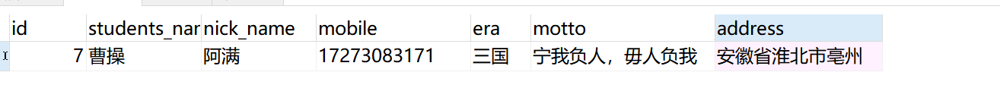
>
>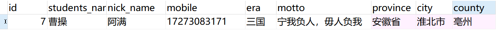
>
>第一范式：我们在设计表的时候，应该考虑之后业务的变化，来`尽量`让每一列的数据保持原子性。

#### 第二范式: 唯一性

>数据的唯一性。 要求表中数据有唯一标识，不存在部分依赖
>
>eg: 通过主键来唯一标识一个用户(满足唯一性)
>
>
>
>注意: 通过name+nickname+province+city+county组合标识一个用户(不满足唯一性)
>
>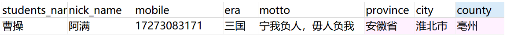

#### 第三范式: 不冗余

>字段不要冗余。(消除表中非主键字段间的依赖: 即:要求每个非主键字段只依赖于主键，而不依赖于其他非主键字段)
>
>如: 如下昵称
>
>students表中存储了昵称
>
>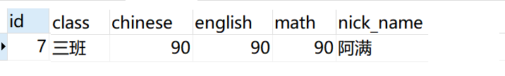
>
>students_detail表中也存储了昵称
>
>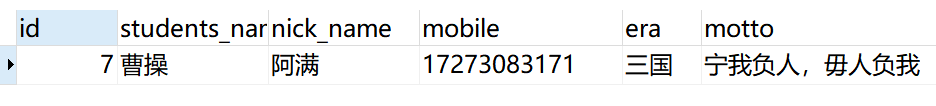

## 3.2 多表查询

<span style="color:red">查询的结果是一个新的临时表。</span>

>数据基础
>
>```SQL
>-- 装备表
>CREATE TABLE `equip`  (
>  `id` int(11) NOT NULL PRIMARY KEY,
>  `student_id` int(11) NULL DEFAULT NULL,
>  `equip_name` varchar(255) NULL DEFAULT NULL
>) ;
>```
>
>```SQL
>INSERT INTO `equip` VALUES (1, 1, '行者套账');
>INSERT INTO `equip` VALUES (2, 2, '丈八蛇矛');
>INSERT INTO `equip` VALUES (3, 5, '通灵宝玉');
>INSERT INTO `equip` VALUES (4, 7, '七星刀');
>INSERT INTO `equip` VALUES (5, 7, '绝影马');
>INSERT INTO `equip` VALUES (6, 7, '爪黄飞电马');
>INSERT INTO `equip` VALUES (7, 7, '倚天剑');
>INSERT INTO `equip` VALUES (8, 7, '青釭剑');
>INSERT INTO `equip` VALUES (9, 11, '的卢马');
>INSERT INTO `equip` VALUES (10, 11, '双股剑');
>```
>

>```sql
>select
>   sd.student_name, c.class_name,  s.chinese , group_concat(e.equip_name)
>from student sd
>inner join score s on sd.id = s.student_id
>inner join class c on c.id = s.class_id
>inner join equip e  on e.student_id = sd.id 
>where sd.student_name = "曹操"
>group by sd.student_name, c.class_name,  s.chinese  ;
>```

### 3.2.1 链接/连接查询

#### 交叉链接

>`交叉连接`其实就是求多个表的[笛卡尔积](https://baike.baidu.com/item/%E7%AC%9B%E5%8D%A1%E5%B0%94%E4%B9%98%E7%A7%AF/6323173?fromtitle=%E7%AC%9B%E5%8D%A1%E5%B0%94%E7%A7%AF&fromid=1434391&fr=aladdin)。
>
>```SQL
>SELECT <字段名> FROM <表1> CROSS JOIN <表2> [WHERE子句]
>
>
>eg: 
>	select * from student cross  join  equip;
>	select * from student cross  join  equip  where student.id = equip.student_id;
>	-- 两个表的笛卡尔积，返回结果数量就是两个表的数据行相乘。
>	-- 如果每个表有1000行，那么返回结果的数量就有1000×1000=1000000行。
>```
>
>仅`交叉连接`的结果没有太多实际的使用意义。
>
>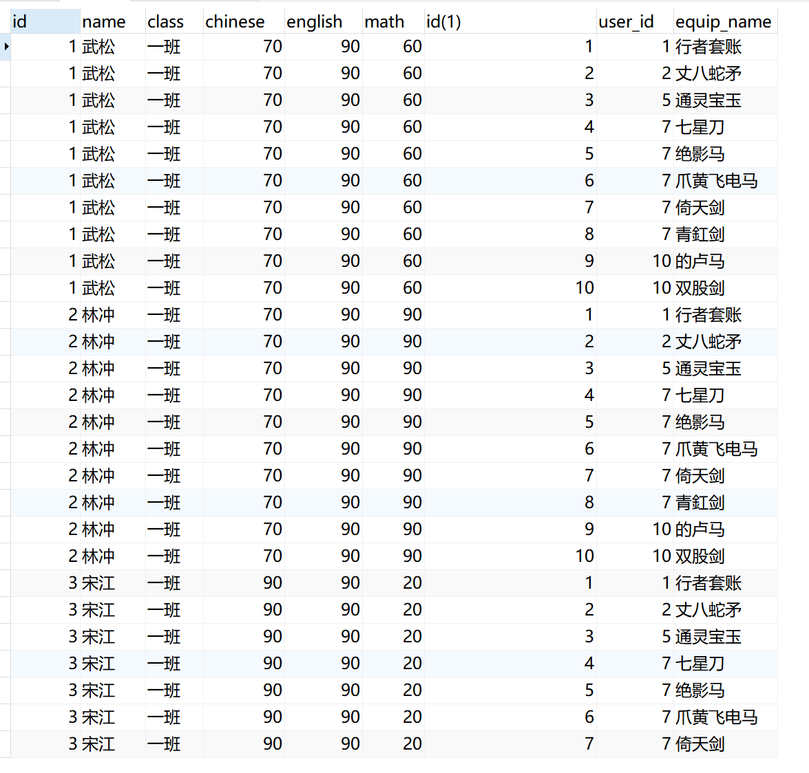
>
>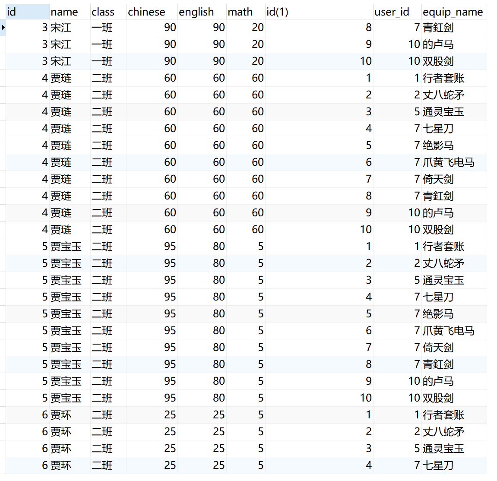
>
>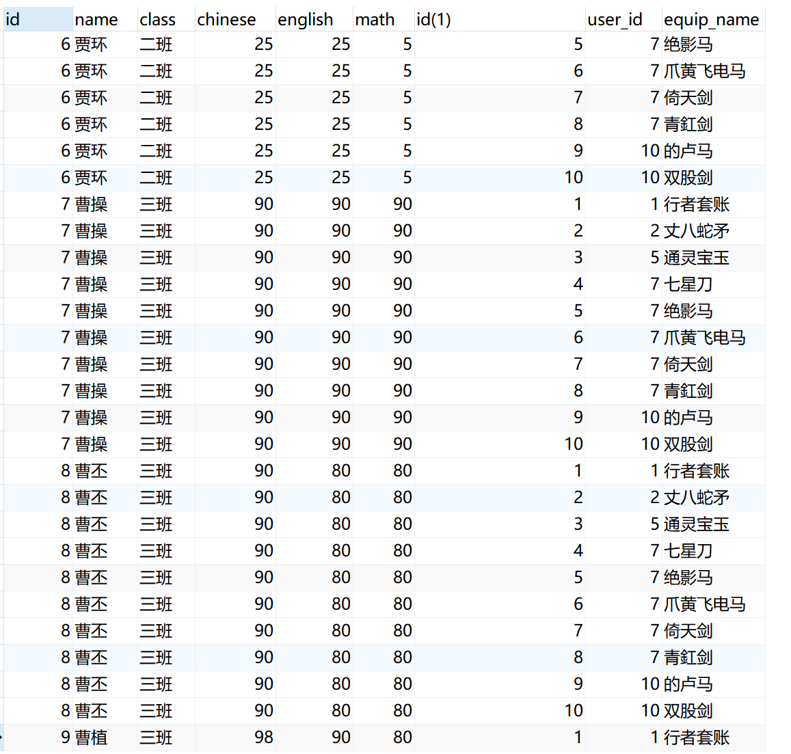

#### 自然连接

>`自然连接`: 
>
>```sql
>-- 自然连接是基于两个表之间的共同名字的列来自动匹配并组合数据。
>-- 自然连接将结果集限制为只包括两个表中`具有相同值`的列(并且在结果集中把重复的列去掉)。在使用自然连接时，不需要指定连接条件，而是根据两个表中具有相同名称和数据类型的列进行匹配。 (注意: 有些数据库不支持自然连接， 比如SQLServer )
>
>eg: 
>	select * from student natural join class
>```

#### 内连接

>`内连接`: 比较常用
>
>```SQL
>SELECT <字段名> FROM <表1> INNER JOIN <表2> [ON子句]
>
>eg:
>	-- 显示内连接
>	select * from  student inner join equip on student.id = equip.student_id;
>	-- 隐式内连接: 不建议这样写(这是早期的sql语法中内连接的一种写法)
>	select * from student , equip  where  student.id = equip.student_id;
>```
>

#### 外连接: 左右外连接

>`外连接`
>
>```SQL
>SELECT <字段名> FROM <表1> LEFT OUTER JOIN <表2> <ON子句>
>SELECT <字段名> FROM <表1> RIGHT OUTER JOIN <表2> <ON子句>
>
>eg:
>	select * from student left outer join equip on student.id = equip.student_id;
>	select * from student right outer join equip on student.id = equip.student_id;
>	select * from equip right outer join student on student.id = equip.student_id;
>	select * from equip left outer join student on student.id = equip.student_id;
>	-- outer可省略: 工作中多数人省略了outer
>	select * from student left join equip on student.id = equip.student_id;
>	select * from student right join equip on student.id = equip.student_id;
>```
>
>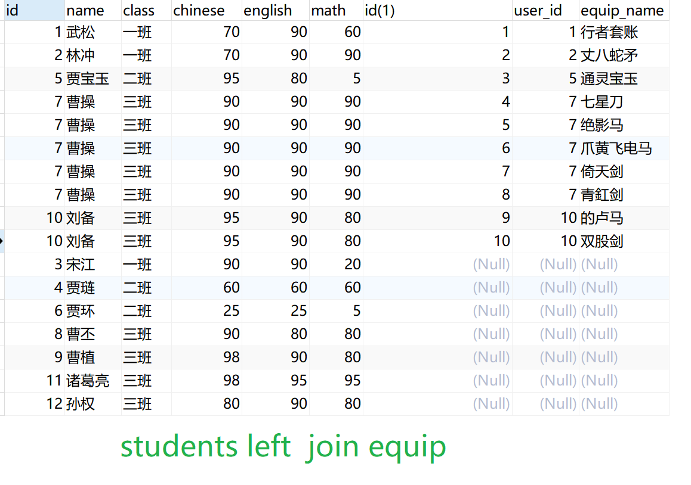
>
>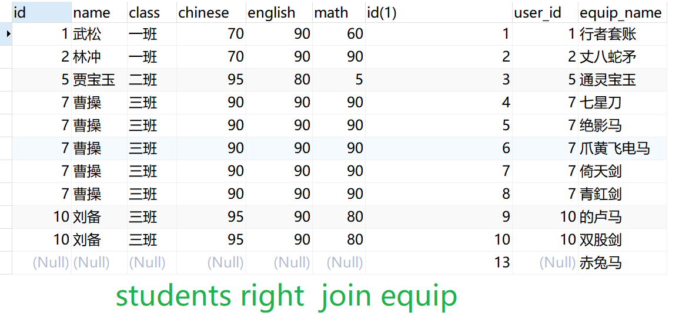

注: 主副表的问题

>假设A和B表进行连接，AB两张表一个表示主表，另一个是副表; 查询数据的时候,   以主表中的数据为基准，匹配副表对应的数据;   当副表中的数据没有能和主表对应数据相互匹配的数据，副表匹配位置自动填充null。

#### 自连接

>`自连接`
>
>```sql
>-- 自连接是指在同一个表中，使用不同的别名将它们连接到一起。
>
>eg:
>    -- 查询数学成绩低于林冲的数学成绩的人的信息
>	select t1.* from score t1,score t2 where  t2.id = 1 and  t1.chinese < t2.chinese
>```

### 3.2.2 子查询

>子查询也叫嵌套查询.( 在某个操作中(删除/修改/查找), 用到了另外一个查询的结果.  ) 
>
>是指在WHERE子句或FROM子句中又嵌入SELECT查询语句.
>
>```SQL
>SELECT <字段名> FROM <表|子查询> WHERE <IN| NOT IN | EXISTS | NOT EXISTS > <子查询>
>
>eg:
>select * from  student where  id in (select student_id from equip);
>select * from  student where  id  not in (select student_id from equip where student_id !=  "");
>
>select * from  student where exists (select * from equip where student_id = 11);
>select * from  student where not exists (select * from equip where student_id = 11);
>select * from  student where exists (select * from equip where student_id = 11)  and id = 5;
>-- 在MySQL每次查询数据的结果集都是一个新的临时表。
>```
>

### 3.2.3 联合查询

>`联合查询`合并两条查询语句的查询结果.
>
>`联合查询`去掉两条查询语句中的重复数据行，然后返合并后没有重复数据行的查询结果。
>
>```SQL
>SELECT <字段名> FROM <表> UNION  SELECT <字段名> FROM <表>
>
>eg:
>	select * from  score  where chinese >= 90 union select * from  score  where math >= 90;
>```
>


# 4, 数据库备份和恢复

## 4.1 命令行操

>通过命令行操作:
>
>```SQL
>-- 数据库备份：cmd命令下 
> 	mysqldump -u root -p 数据库名称>文件名.sql
>
>-- 数据库恢复： 
>-- 1. 创建数据库并选择该数据库 
>	create database dbName; 
>   	use dbName; 
>   -- 2. 恢复数据 
>	 source 文件名.sql
>  
>   ```
>
>备份:
>
>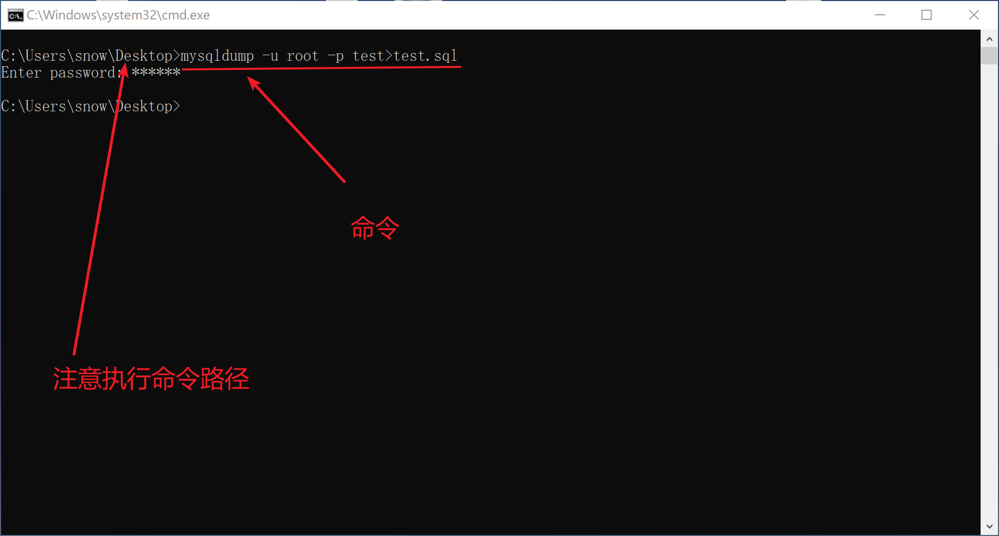
>
>恢复:
>
>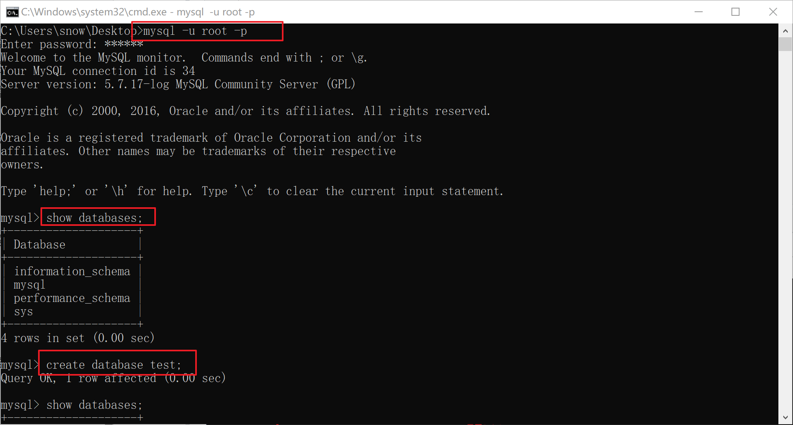
>
>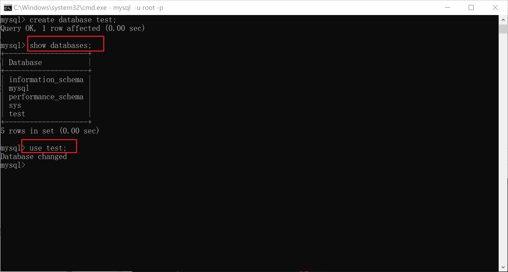
>
>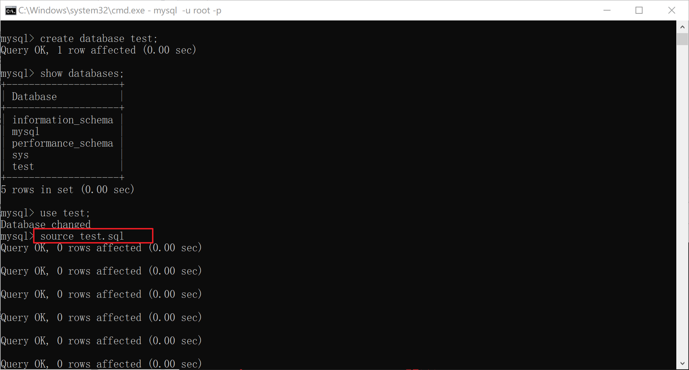

## 4.2 图形化界面

>以Navicat为例
>
>备份:
>
>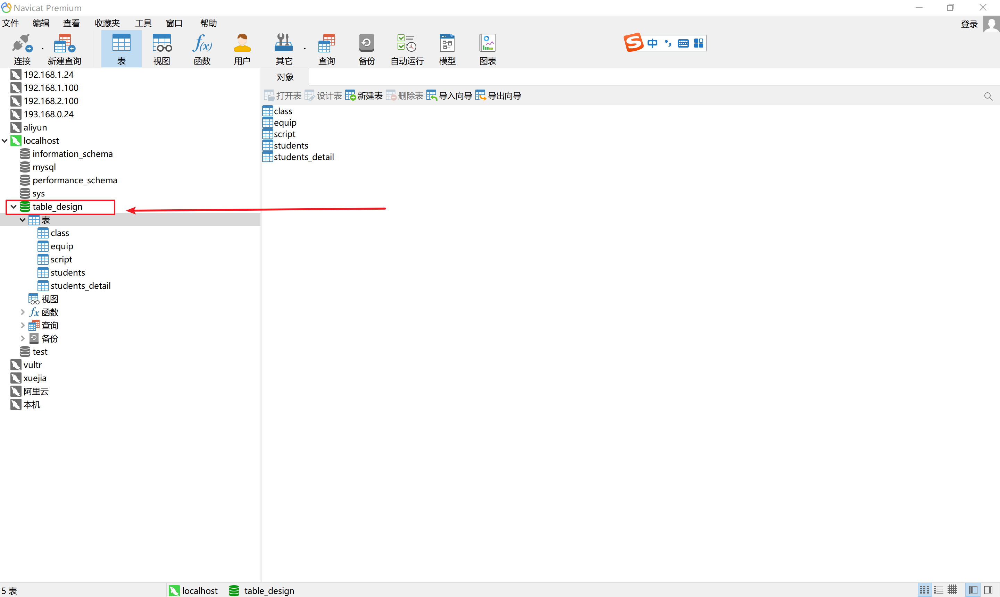
>
>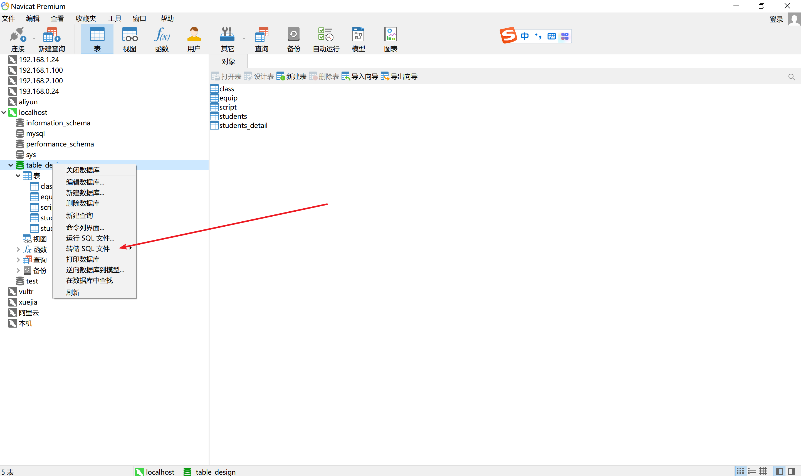
>
>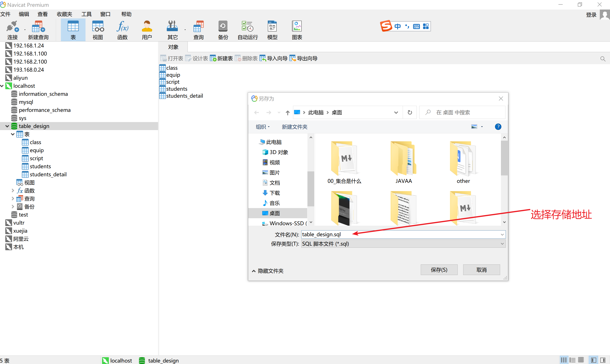
>
>导入:
>
>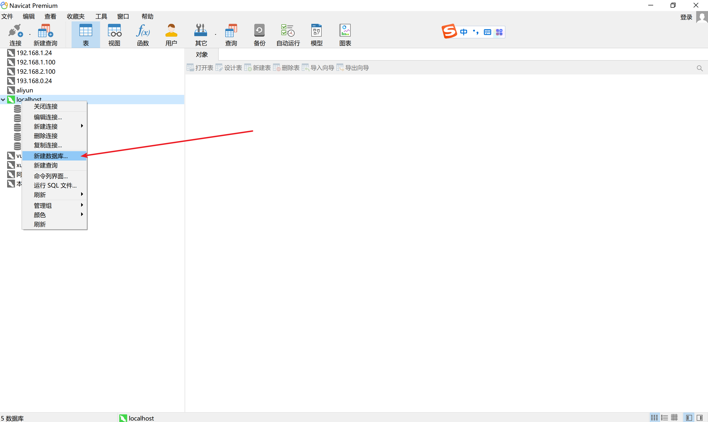
>
>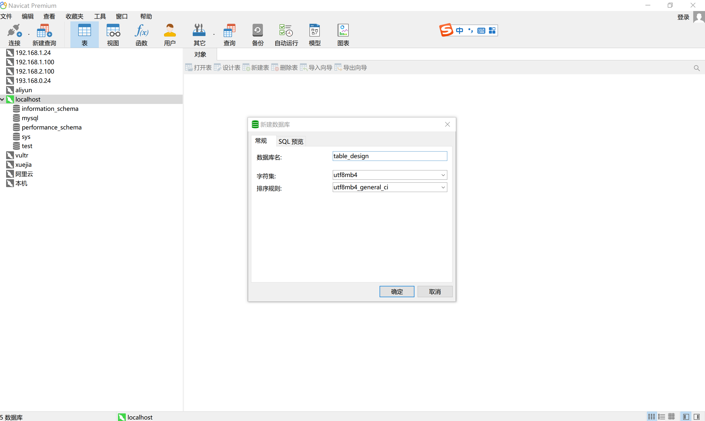
>
>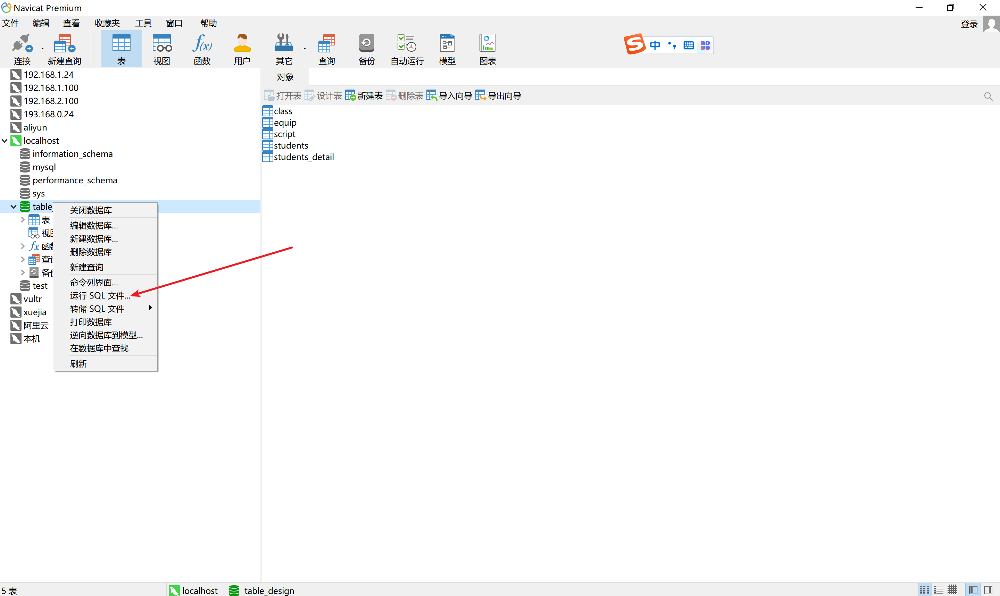


# 5, 上课sql

#### 10_16_上午

>
>
>````sql
>
>
>show create table test12;
>
>CREATE TABLE `test12` (
>  `id` int DEFAULT NULL COMMENT 'id编号',
>  `name` varchar(10) DEFAULT NULL COMMENT '姓名',
>  `x` char(1) DEFAULT NULL COMMENT '性别'
>) 
>
>show databases;
>
>
>create table test13(
>	id int,
>	name varchar(10),
>	x char(1) comment '性别'
>);
>
>show create table test13;
>CREATE TABLE `test13` (
>  `id` int DEFAULT NULL,
>  `name` varchar(10) DEFAULT NULL,
>  `x` char(1) DEFAULT NULL COMMENT '性别'
>) ENGINE=InnoDB DEFAULT CHARSET=utf8mb4 COLLATE=utf8mb4_0900_ai_ci
>
>
>show create table test14;
>CREATE TABLE `test14` (
>  `id` int NOT NULL DEFAULT '1' COMMENT 'id标识',
>  `name` varchar(255) NOT NULL DEFAULT 'zs' COMMENT '姓名',
>  `gender` char(1) DEFAULT NULL COMMENT '性别'
>) ENGINE=InnoDB DEFAULT CHARSET=utf8mb4 COLLATE=utf8mb4_0900_ai_ci
>
>-- 在一个标准, 存储数据的时候, 逻辑上我们认为一行数据是一个不可拆分的整体
>-- 要求(不是语法要求, 是约定俗成的数据库使用规范)每一行数据, 和另一行不要重复
>
>-- 所以我们在上面创建表的时候, 给了一个id, 准备用它来充当"唯一标识"
>
>-- 主键的定义: SQL语法 primary key
>--    我们可以给表中的某一列设置为主键,
>--    成为主键之后, 有两个特点, 不允许为null, 不允许在表中重复
>
>CREATE TABLE `test15` (
>  `id` int  primary key,
>  `name` varchar(255)  ,
>  `gender` char(1)  
>)
>
>CREATE TABLE `test14` (
>  `id` int ,
>  `name` varchar(255)  ,
>  `gender` char(1)  ,
>	primary key (id)
>)
>
>CREATE TABLE `test15` (
>  `test15_id` int  primary key,
>  `name` varchar(255)  ,
>  `gender` char(1)  
>)
>
>-- 
>insert into test15 values(1, 'zl', '男');
>select * from test15;
>
>-- 50W 200W 500W(分表)
>
>
>CREATE TABLE `test16` (
>  `id` int  primary key  AUTO_INCREMENT  ,
>  `name` varchar(255) ,
>  `gender` char(1)  
>);
>
>select * from test16;
>insert into test16 values(NULL, 'zl', '男');
>
>drop table test01;
>drop table test02, test03,test04,test05,test06   ;
>
>-- 工作
>-- sql: 记一下
>
>-- crud: 表中数据
>
>-- 添加数据
>create table User(
>    id int  primary key  AUTO_INCREMENT  comment "主键" ,
>		name varchar(10)  comment "姓名",
>		gender char(1) comment '性别',
>		height float(5, 2) comment '身高',
>		birthday date comment '生日',
>		create_time datetime comment '创建时间'
>		);
>		
>-- 添加数据: 
>--   1, insert into 表名 ( 列名1, 列名2, 列名3...) values (值1, 值2, 值3 ...)
>
>select * from User;
>insert into User (id, name, gender, height, birthday, create_time)          values  (NULL, 'zs', '男', 188.55, '2000-01-01', '2024-10-16 11:11:11') ;
>
>insert into User (id, name, gender, height, birthday, create_time)          values  (NULL, 'ls', '男', 188.55, '2000-01-01', now()) ;
>
>insert into User ( gender,  name,  create_time)     
>           values  ( '男', 'wu',   now()) ;
>
>
>-- 2, insert into 表名  (列省略) values( 写全所有列值, 顺序要对 )
>
>insert into User  values (NULL, 'zl', NULL, 185.55, NULL, now() );
>
>select * from User;
>
>-- 3, insert into 表名 set 列1=值1, 列2=值2, ....
>insert into User set name='sq' , birthday='1999-12-21';
>
>
>-- 批量添加数据
>-- insert into 表名 (列...) values (值...), (值....), (值...)...
>
>insert into User (name, gender) values('x', '男'), ('y', '男'),('z', '男');
>select * from User;
>
>
>-- 查询数据:
>-- 1, select 列名... from  表名
>select id,name, gender, height, birthday, create_time from User;
>select   name, gender, height from User;
>select   name  from User;
>select   *  from User;
>
>-- 查询身高大于187的人
>select   *  from User   where height>187;
>
>-- 修改操作
>-- update 表名 set 列1=值1, 列2=值2 ...;
>
>update User set gender='女', height=180.00;
>update User set gender='女', height=180.00    where id>=4 and id<=5;
>
>-- 删除操作:
>-- delete from 表名 条件
>
>delete from User where id=8;
>delete from User;
>
>select * from User;
>
>-- delete: 工作中不会使用
>--        工作中的删除都是标记位删除( 本质是修改 )
>
>update User set delete_flag=1   where id=16;
>
>select * from User   where delete_flag=0;
>
>
>````
>
>```sql
>CREATE TABLE `students`  (
>	`id` int(11)  PRIMARY KEY  AUTO_INCREMENT,
>	`name` varchar(255)   ,
>	`class` varchar(255)  ,
>	`chinese` float  ,
>	`english` float  ,
>	`math` float  
>) ;
>
>INSERT INTO students (id, name, class, chinese, english, math) VALUES (1, '武松', '一班', 70, 90, 60);
>INSERT INTO students VALUES (2, '林冲', '一班', 70, 90, 90);
>INSERT INTO students VALUES (3, '松江', '一班', 90, 90, 20);
>INSERT INTO students VALUES (4, '贾琏', '二班', 60, 60, 60);
>INSERT INTO students VALUES (5, '贾宝玉', '二班', 95, 80, 5); 
>INSERT INTO students VALUES (6, '贾环', '二班', 25, 25, 5); 
>INSERT INTO students VALUES (7, '曹操', '三班', 90, 90, 90); 
>INSERT INTO students VALUES (8, '曹丕', '三班', 90, 80, 80); 
>INSERT INTO students VALUES (9, '曹植', '三班', 98, 90, 80); 
>INSERT INTO students VALUES (10, '刘备', '三班', 95, 90, 80); 
>INSERT INTO students VALUES (11, '诸葛亮', '三班', 98, 95, 95); 
>INSERT INTO students VALUES (12, '孙权', '三班', 80, 90, 80); 
>INSERT INTO students (id) VALUES (13);
>
>select * from students;
>
>update students set name="宋江"     where id=3;
>
>-- where 条件: 跟在 查询/删除/修改 这些sql语句之后, 增加执行sql语句的限定条件
>
>-- SQL中的算数运算符: 
>--      可以用在'结果集'中, 
>--      也可以用在条件语句中
>
>select * from students;
>
>-- 统计每个人的人名, 语文数学英语
>select name, chinese, math, english from students;
>
>-- 统计每个人的人名, 每个人总成绩
>select name, chinese+math+english from students;
>
>```
>


#### 10_17_上午下午

>```sql
>
>-- where 条件: 跟在 查询/删除/修改 这些sql语句之后, 增加执行sql语句的限定条件
>
>-- SQL中的算数运算符: 
>--      可以用在'结果集'中, 
>--      也可以用在条件语句中
>
>
>select * from students;
>select * from students where id = 5;
>
>-- 查询每个人的人名, 以及每个人的总成绩
>select  name, chinese+english+math from students;
>
>
>-- 数学老师: 和语文的偏科程度: 分数差值
>select  name, chinese-math from students;
>
>-- 平均分数
>select  name, (chinese+math+english)/3 from students;
>
>-- 知道谁的平均成绩不及格 <=60
>select * from students where (chinese+math+english)/3 <= 60;
>
>-- >  遍历判断? 结果集?
>--   20   1W
>--   字节: 16kb
>
>
>-- 查询一班的同学的信息
>select * from students where class="一班";
>-- 查询数学成绩是90的同学的信息
>select * from students where math=90;
>
>select * from students where math<=>90;
>
>-- = 不能比较null ,  <=>可以比较null
>select * from students where math<=>null;
>select * from students where math=null;
>
>
>-- 查询谁的数学成绩是null
>select * from students where math is null
>
>
>-- 查询不是一班的同学的信息
>select * from students where class != "一班";
>
>
>-- 查询数学成绩大于等于80分的同学
>select * from students where math >= 80;
>
>
>-- 查询谁的数学成绩是null
>select * from students where math is null
>-- 查询谁的数学成绩不是null
>select * from students where math is not null
>
>select * from students where class is null
>
>
>-- 查询数学成绩 60 -90的同学的信息
>select * from students where math between 60 and 90;
>
>select * from students where math>=60 && math<=90;
>select * from students where math>=60 and math<=90;
>
>-- 查询: 数学成绩是 60  80  95
>select * from students where math in (60, 80, 95);
>
>select * from students where math=60 or math=80 or math=95;
>
>-- 查询: 数学成绩不是 60  80  95
>select * from students where math not in (60, 80, 95);
>
>delete from students   where id = 13; 
>
>
>-- like : 专门给字符串用的, 用来做模糊查询/匹配查询
>-- 查询一班同学的信息
>select * from students where  class="一班";
>select * from students where  class   like   "一班";
>
>-- 查询出 姓曹的人的信息:  %代表0-n个字符
>select * from students where name  like "曹%";
>
>-- 查询出 姓曹的人的信息:  _ 占位符, 代表1个字符
>select * from students where name  like "曹_";
>
>
>update students set name='曹阿瞒' where id=7;
>
>
>-- and -> &&
>-- or -> ||
>
>-- 查询一班同学, 并且数学成绩及格的人的信息
>select * from students where class="一班" and math>=60;
>
>
>-- Distinct: 用在结果集中,  去除重复字段, 每一个重复的字段, 只保留一个
>
>-- 查询所有人的人名, 以及数学成绩
>
>
>-- 统计, 有哪些类型的数学成绩
>select distinct math from students;
>
>-- 多字段去重: 数学成绩和英语成绩都一样,  保留一个
>select distinct math,english from students;
>
>
>-- as: 给某些东西(表, 列,  查询结果  )起别名
>
>-- 查询所有人的 人名 和 总成绩
>select name, math+english+chinese  as mec from students;
>
>select name as my_name, math+english+chinese  as mec from students;
>
>
>-- 查询所有人的id  和  name
>select id, name from students;  -- 单表查询
>
>
>select students.id, students.name from students; -- 多表查询
>
>
>select s.id, s.name from students  as s; -- 多表查询
>
>-- as关键字 是可以省略的
>select s.id, s.name   my_name from students   s; -- 多表查询
>
>
>
>-- order by   排序: 
>
>-- 给所有同学排序, 按照数学成绩成绩排序
>
>select * from  students order by math;
>select * from  students order by math desc;
>
>-- 多字段排序:  优先根据语文进程排序 , 语文一样, 根据英语排序, 英语一样, 再根据数学排序
>select * from  students order by chinese, english, math
>
>select * from  students order by chinese desc, english, math
>
>select * from  students order by chinese desc, english desc, math desc
>
>
>
>-- 获取  一班的  数学成绩最高  的同学的信息
>select  
>*
>from  students
>where class="一班"
>order by math desc
>limit 1
>
>-- limit 经常和排序一起使用
>-- (limit在语法上是可以不和排序一起用的)
>
>
>-- 条件: 排序  -> 分页 -> limit  :  时间排序,limit最常见的写法
>
>
>-- SELECT <查询内容|列等> FROM  <表名字> LIMIT 记录数目
>-- SELECT <查询内容|列等> FROM  <表名字> LIMIT 初始位置，记录数目;
>-- SELECT <查询内容|列等> FROM  <表名字> LIMIT 记录数目 OFFSET 初始位置;
>
>-- 
>select  
>*
>from  students
>order by math desc
>limit 0, 2
>-- 
>select  
>*
>from  students
>order by math desc
>limit 2, 2
>
>select  
>*
>from  students
>order by math desc
>limit 2 offset 5
>
>
>
>-- 了解补充:  字符串进行排序
>select
>*
>from students
>order by name;
>
>
>show create database cpp62;
>
>
>-- group by: 分组
>--  分组操作, 一般和聚合函数一起使用, 用于数据统计
>
>
>
>-- 聚合函数, 也可以单独使用, 获得统计信息
>
>
>-- 想获得students中有多少条数据
>
>select * from students;
>-- conut: 
>
>select id from students;
>select count(id) from students;
>select count(name) from students;
>select count(math) from students;
>select count(*) from students;
>
>-- 计算所有一班同学中, 语文成绩的总和
>select chinese from students where class="一班"
>
>select sum(chinese) from students where class="一班"
>
>
>-- 计算所有一班同学中, 语文平局成绩
>select avg(chinese) from students where class="一班"
>
>
>select max(chinese) from students where class="一班"
>
>select min(chinese) from students where class="一班"
>
>
>-- group by: 分组
>--  分组操作, 一般和聚合函数一起使用, 用于数据统计
>
>-- 下面报错:  新是SQL标准规定, 做了分组之后, 只能查询这个分组的组列值,聚合信息(以组为单位的聚合信息), 连接信息
>select
>*
>from students
>group by class
>
>
>
>select
>class, avg(chinese+math+english)
>from students
>group by class
>
>
>select
>class, sum(chinese+math+english) /count(id)
>from students
>group by class
>
>
>-- 获得数学成绩及格的同学,  要求对他们按照班级分组, 分组之后 要求平均语文成绩大于70, 想知道有哪些班级
>
>select
>class, avg(chinese)
>from students
>where math >= 60
>group by class
>
>
>-- 获得数学成绩及格的同学,  要求对他们按照班级分组, 分组之后 要求平均语文成绩大于70, 想知道有哪些班级
>-- sql语法上不允许先分组再where, 只能先where 再分组
>-- having关键字是专门用来给分组用, 用来解决在分组之后不能where 的问题
>select
>class, avg(chinese)
>from students
>where math >= 60  
>group by class
>having avg(chinese)> 70
>
>
>
>
>-- 获得每个班级的班级名,  平均总成绩
>select
>class, avg(chinese+math+english), count(id)
>from students
>group by class;
>
>
>-- 获得每个班级的班级名,  平均总成绩
>--  同时想知道每个组有哪些人
>-- group_concat函数: 可以对某个分组内的非分组信息进行连接成一条数据显示
>select
>class, avg(chinese+math+english), count(id),  group_concat(name)
>from students
>group by class;
>
>
>
>
>-- 计算每个班级中语文成绩大于60的同学的平均数学成绩, 获得平均数学成绩大于等于40的班级中, 平均语文成绩最高的那个班级的  平均语文和数学成绩
>
>select
>class, avg(math), avg(chinese)
>from students
>where chinese>60
>group by class
>having avg(math)> 40
>order by avg(chinese) desc
>limit 1
>
>select * from students;
>-- 实体完整性:   加主键, 保证一个表中每一条数据 和其他条目不同
>
>-- 域完整性: 
>--             设计某些列, 类型要合适范围要合适
>--             存储数据的时候, 存储的内容要符合列类型的设置
>
>-- 参照完整性:
>--    在关系型数据库中, 一个表的数据可能依赖于另一个表的数据而存在
>--    或者说, 两个表的数据存在关联
>--    我们希望这种关联/参照, 具有一致性(要修改的是同步变化)
>--      
>select * from students;
>
>select * from class;
>insert into class  values (2, '二班', '清朝');
>insert into class  values (3, '三班', '三国');
>
>-- 关系型数据库
>
>-- 参照完整性:
>--    在关系型数据库中, 一个表的数据可能依赖于另一个表的数据而存在
>--    或者说, 两个表的数据存在关联
>--    我们希望这种关联/参照, 具有一致性(要修改的是同步变化)
>
>
>select * from students;
>select * from class;
>
>-- 外键: 强制绑定两个具有参照的表的字段
>-- 全表扫描: 
>-- 3-4io: 
>
>
>-- students:假设 100W条数据: 3-4次io 比较
>select * from students where id = 10;
>
>drop table students, class;
>
>
>
>-- 班级
>CREATE TABLE `class`  (
>`id` int(11) NOT NULL,
>`class_name` varchar(10) ,
>PRIMARY KEY (`id`)
>);
>-- 成绩
>CREATE TABLE `score`  (
>`id` int(11) NOT NULL AUTO_INCREMENT,
>`student_id` int(11) ,
>`class_id` int(11),
>`chinese` float ,
>`english` float ,
>`math` float ,
>PRIMARY KEY (`id`) 
>);
>-- 学生信息
>CREATE TABLE `student`  (
>`id` int(11) NOT NULL,
>`student_name` varchar(20),
>`nick_name` varchar(20) ,
>`mobile` varchar(20) ,
>`era` varchar(20),
>`motto` varchar(30),
>PRIMARY KEY (`id`) 
>);
>-- 剧本
>CREATE TABLE `script`  (
>`id` int(11) NOT NULL,
>`play_name` varchar(20),
>`play_ location` varchar(20) ,
>PRIMARY KEY (`id`)
>);
>-- 演出表
>CREATE TABLE `show`  (
>`id` int(11) NOT NULL,
>`student_id` int(11),
>`script_id` int(11),
>PRIMARY KEY (`id`)
>);
>
>
>
>-- ----------------------------
>INSERT INTO `class` VALUES (1, '一班');
>INSERT INTO `class` VALUES (2, '二班');
>INSERT INTO `class` VALUES (3, '三班');
>INSERT INTO `class` VALUES (4, '四班');
>INSERT INTO `class` VALUES (5, '五班');
>-- ----------------------------
>INSERT INTO `score` VALUES (1, 1, 1, 70, 90, 60);
>INSERT INTO `score` VALUES (2, 2, 1, 70, 90, 90);
>INSERT INTO `score` VALUES (3, 3, 1, 90, 90, 20);
>INSERT INTO `score` VALUES (4, 4, 2, 60, 60, 60);
>INSERT INTO `score` VALUES (5, 5, 2, 95, 80, 5);
>INSERT INTO `score` VALUES (6, 6, 2, 25, 25, 5);
>INSERT INTO `score` VALUES (7, 7, 3, 90, 90, 90);
>INSERT INTO `score` VALUES (8, 8, 3, 90, 80, 80);
>INSERT INTO `score` VALUES (9, 9, 3, 98, 90, 80);
>INSERT INTO `score` VALUES (10, 10, 3, 95, 90, 80);
>INSERT INTO `score` VALUES (11, 11, 3, 98, 95, 95);
>INSERT INTO `score` VALUES (12, 12, 3, 80, 90, 80);
>-- ----------------------------
>INSERT INTO `script` VALUES (1, '三打祝家庄', '祝家庄');
>INSERT INTO `script` VALUES (2, '梁山聚义', '梁山');
>INSERT INTO `script` VALUES (3, '壮士落幕', '六和寺');
>INSERT INTO `script` VALUES (4, '赤壁之战', '赤壁');
>INSERT INTO `script` VALUES (5, '七步诗事件', '洛阳');
>INSERT INTO `script` VALUES (6, '白帝城托孤', '白帝城');
>INSERT INTO `script` VALUES (7, '煮酒论英雄', '许昌');
>-- ----------------------------
>INSERT INTO `show` VALUES (1, 1, 1);
>INSERT INTO `show` VALUES (2, 2, 1);
>INSERT INTO `show` VALUES (3, 3, 1);
>INSERT INTO `show` VALUES (4, 1, 2);
>INSERT INTO `show` VALUES (5, 2, 2);
>INSERT INTO `show` VALUES (6, 3, 2);
>INSERT INTO `show` VALUES (7, 1, 3);
>INSERT INTO `show` VALUES (8, 2, 3);
>INSERT INTO `show` VALUES (9, 7, 4);
>INSERT INTO `show` VALUES (10, 10, 4);
>INSERT INTO `show` VALUES (11, 11, 4);
>INSERT INTO `show` VALUES (12, 12, 4);
>INSERT INTO `show` VALUES (13, 8, 5);
>INSERT INTO `show` VALUES (14, 9, 5);
>INSERT INTO `show` VALUES (15, 11, 6);
>INSERT INTO `show` VALUES (16, 12, 6);
>INSERT INTO `show` VALUES (17, 7, 7);
>INSERT INTO `show` VALUES (18, 11, 7);
>-- ----------------------------
>INSERT INTO `student` VALUES (1, '武松', '行者', '13440996665', '宋朝', '别胡说!难道不付你钱!再筛三碗来!');
>INSERT INTO `student` VALUES (2, '林冲', '豹子头', '17383945041', '宋朝', '无');
>INSERT INTO `student` VALUES (3, '宋江', '及时雨', '15671722818', '宋朝', '他日若遂凌云志,敢笑黄巢不丈夫');
>INSERT INTO `student` VALUES (4, '贾琏', '琏二爷', '19931477852', '清朝', '无');
>INSERT INTO `student` VALUES (5, '贾宝玉', '怡红公子', '13456229050', '清朝', '我要这玉又何用');
>INSERT INTO `student` VALUES (6, '贾环', '孽障', '18900141462', '清朝', '无');
>INSERT INTO `student` VALUES (7, '曹操', '阿满', '17273083171', '三国', '宁我负人，毋人负我');
>INSERT INTO `student` VALUES (8, '曹丕', '子桓', '17180453185', '三国', '无');
>INSERT INTO `student` VALUES (9, '曹植', '陈思王', '19818008917', '三国', '无');
>INSERT INTO `student` VALUES (10, '孙权', '孙十万', '15638204123', '三国', '无');
>INSERT INTO `student` VALUES (11, '刘备', '刘皇叔', '15638204378', '三国', '惟贤惟德,能服行人');
>INSERT INTO `student` VALUES (12, '诸葛亮', '诸葛武侯,卧龙', '15119511196', '三国', '非淡泊无以明志，非宁静无以致远');
>-- 装备表
>CREATE TABLE `equip`  (
>`id` int(11) NOT NULL PRIMARY KEY,
>`student_id` int(11) NULL DEFAULT NULL,
>`equip_name` varchar(255) NULL DEFAULT NULL
>) ;
>
>INSERT INTO `equip` VALUES (1, 1, '行者套装');
>INSERT INTO `equip` VALUES (2, 2, '丈八蛇矛');
>INSERT INTO `equip` VALUES (3, 5, '通灵宝玉');
>INSERT INTO `equip` VALUES (4, 7, '七星刀');
>INSERT INTO `equip` VALUES (5, 7, '绝影马');
>INSERT INTO `equip` VALUES (6, 7, '爪黄飞电马');
>INSERT INTO `equip` VALUES (7, 7, '倚天剑');
>INSERT INTO `equip` VALUES (8, 7, '青釭剑');
>INSERT INTO `equip` VALUES (9, 11, '的卢马');
>INSERT INTO `equip` VALUES (10, 11, '双股剑');
>
>select * from class;
>select * from score;
>select * from student;
>select * from `show`;
>select * from script;
>select * from equip;
>
>-- 获得 武松的 班级信息
>select * from student where student_name="武松"; -- id=1
>select * from score  where student_id = 1; -- class_id =1
>select * from class where id = 1;
>
>
>-- 连表查询:
>select 
>c.*
>from student as s
>inner join score sc on s.id=sc.student_id
>inner join class c on sc.class_id=c.id
>where s.student_name="武松"
>
>
>select 
>		*
>from  student
>cross join  score 
>
>select * from  score;
>
>select 
>		*
>from  student
>cross join  score 
>where student.id = score.student_id
>
>
>select 
>		st.student_name, sc.chinese, sc.english, sc.math
>from  student st
>cross join  score  sc
>where st.id = sc.student_id
>
>-- 自然连接: 按照两个表中具有相同名字的列, 进行匹配
>select  * from class;
>select  * from equip;
>
>select  * from class  natural join equip;
>
>
>-- 内连接: 表1 inner join 表2 on  表1和表2的关联条件
>
>-- 获得每个人的人名, 以及这个人的语文数学英语成绩
>select
>st.student_name,  sc.chinese, sc.english, sc.math
>from student st
>inner join score sc on st.id = sc.student_id
>
>
>-- 内连接:
>--     每个人的  班级信息,  人名, 英语数学语文
>select
>c.class_name, st.student_name,  sc.chinese, sc.english, sc.math   
>from student st
>inner join score sc on st.id = sc.student_id
>inner join class c on c.id = sc.class_id
>
>
>-- 外链接: 
>--      和内连接有个区别(1, 我们在外链接中可以指明主副表, 2, 外连接要求主表的数据无论和副表匹配与否, 都要存在在结果集中)
>--     左外链接
>--     右外链接
>
>
>-- 外连接: 查询一个人的人名, 英语数学语文成绩
>select
>		st.student_name, sc.chinese, sc.english, sc.math
>from student st
>left outer join score sc on st.id = sc.student_id
>
>select
>		st.student_name, sc.chinese, sc.english, sc.math
>from student st
>right outer join score sc on st.id = sc.student_id
>
>
>select
>		st.student_name, sc.chinese, sc.english, sc.math
>from student st
>left outer join score sc on st.id = sc.student_id
>where sc.chinese is not null
>
>-- 日常写代码中, 我们基本上都会省略 outer关键字
>select
>		st.student_name, sc.chinese, sc.english, sc.math
>from student st
>left join score sc on st.id = sc.student_id
>
>select
>		st.student_name, sc.chinese, sc.english, sc.math
>from student st
>right join score sc on st.id = sc.student_id
>
>
>-- 自连接
>-- 知道谁的英语成绩比 学生id为5的人英语成绩更低
>select * from score;
>
>select
>sc2.*
>from score sc1, score sc2
>where sc1.id=5 and sc2.english < sc1.english
>
>
>-- 子查询: 在 删除/修改/查询SQL操作中, 用到了另一个查询的结果
>
>-- 查询英语成绩小于  贾宝玉的英语成绩    的同学的信息
>
>
>select id from student where student_name="贾宝玉";
>select * from score where student_id = 贾宝玉的id;
>
>-- 得到贾宝玉的英语成绩
>select 
>english
>from score 
>where student_id =  (
>		select id from student where student_name="贾宝玉"
>)
>
>
>select 
>*
>from score
>where english < 贾宝玉的英语成绩
>
>select 
>*
>from score
>where english < (
>			select 
>				english
>			from score 
>			where student_id =  (
>					select id from student where student_name="贾宝玉"
>			)
>)
>
>
>
>-- 我认为贾宝玉的英语成绩不好, 如果谁的英语成绩小于贾宝玉的英语成绩
>--  强制把这些人的英语成绩改为 80
>
>update score  set english =80
>where english < 贾宝玉英语成绩
>
>-- 报错
>update score  set english =80
>where english <  (
>		select 
>			english
>		from score 
>		where student_id =  (
>				select id from student where student_name="贾宝玉"
>		)
>)
>
>-- 欺骗: 
>select * from 
>(	  
>		select 
>			english
>		from score 
>		where student_id =  (
>				select id from student where student_name="贾宝玉"
>		)
>) as temp
>
>
>update score  set english =80
>where english <  (
>		 select * from 
>			(	  
>					select 
>						english
>					from score 
>					where student_id =  (
>							select id from student where student_name="贾宝玉"
>					)
>			) as temp
>)
>
>select * from score;
>
>-- 重要的查询:  内连接,  左外链接  右外链接  子查询
>
>
>-- 想获得每个班级中, 数学成绩最高的那个人的: 班级/人名/成绩/装备
>
>-- 先获得每个人的 :  班级/人名/成绩/装备
>select
>c.class_name, 
>	st.student_name, 
>	sc.chinese, 
>	sc.math, 
>	sc.english, 
>	e.equip_name
>from class c
>inner join score sc on c.id = sc.class_id
>inner join student st on st.id = sc.student_id
>left join equip e on st.id = e.student_id
>
>
>select
>class_id, max(math)
>from score 
>group by class_id
>
>
>
>select
>c.class_name, 
>	st.student_name, 
>	sc.chinese, 
>	sc.math, 
>	sc.english, 
>	e.equip_name
>from class c
>inner join score sc on c.id = sc.class_id
>inner join student st on st.id = sc.student_id
>left join equip e on st.id = e.student_id
>inner join  (
>		select
>		 class_id, max(math) as mmath
>		from score 
>		group by class_id
>) as temp  on   temp.class_id = c.id and  temp.mmath=sc.math
>
>
>
>-- 
>select
>c.class_name, 
>	st.student_name, 
>	sc.chinese, 
>	sc.math, 
>	sc.english, 
>	e.equip_name
>from class c
>inner join score sc on c.id = sc.class_id
>inner join student st on st.id = sc.student_id
>left join equip e on st.id = e.student_id
>where sc.math = 班级中最大的数学成绩
>
>
>select
>math
>from score
>where class_id = 某个班级id
>order by math desc
>limit 1
>
>
>select
>c.class_name, 
>	st.student_name, 
>	sc.chinese, 
>	sc.math, 
>	sc.english, 
>	e.equip_name,
>	sc.class_id
>from class c
>inner join score sc on c.id = sc.class_id
>inner join student st on st.id = sc.student_id
>left join equip e on st.id = e.student_id
>where sc.math = (
>			select
>				 math
>			from score
>			where class_id = sc.class_id
>			order by math desc
>			limit 1
>)
>
>
>-- 联合查询: 把两个sql语句查询的结果 合并到一起 返回
>
>select * from score where chinese>90;
>
>select * from score where math>90;
>
>
>select * from score where chinese>90
>union
>select * from score where math>90;
>
>select * from score where chinese>90 or math>90;
>
>
>
>
>```
>
>
>
>