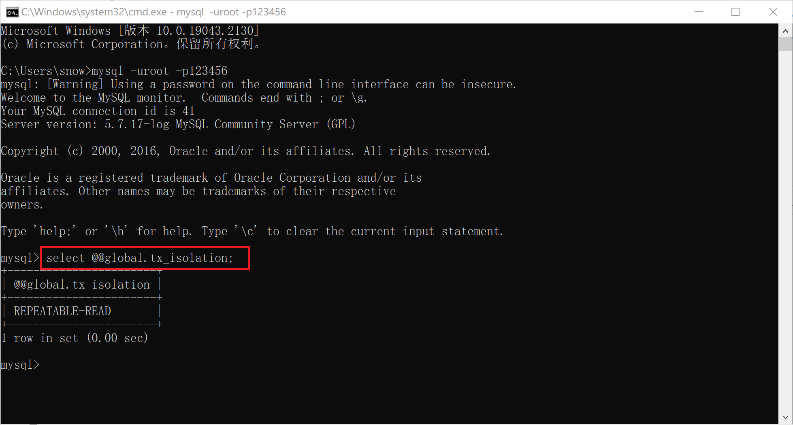
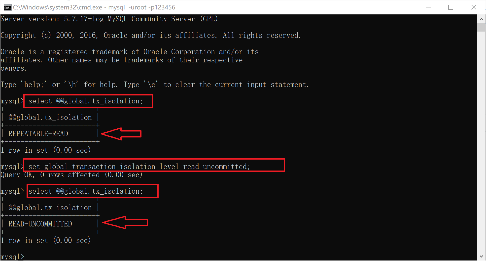
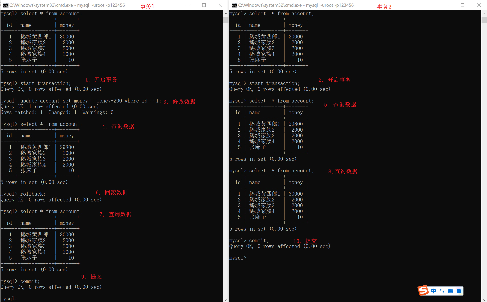
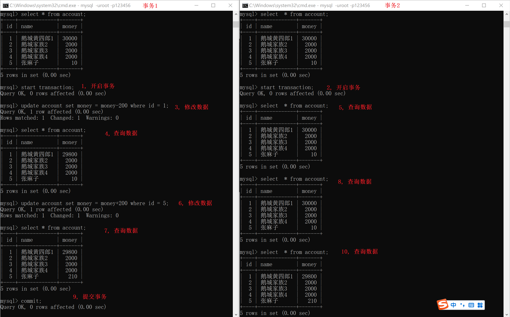
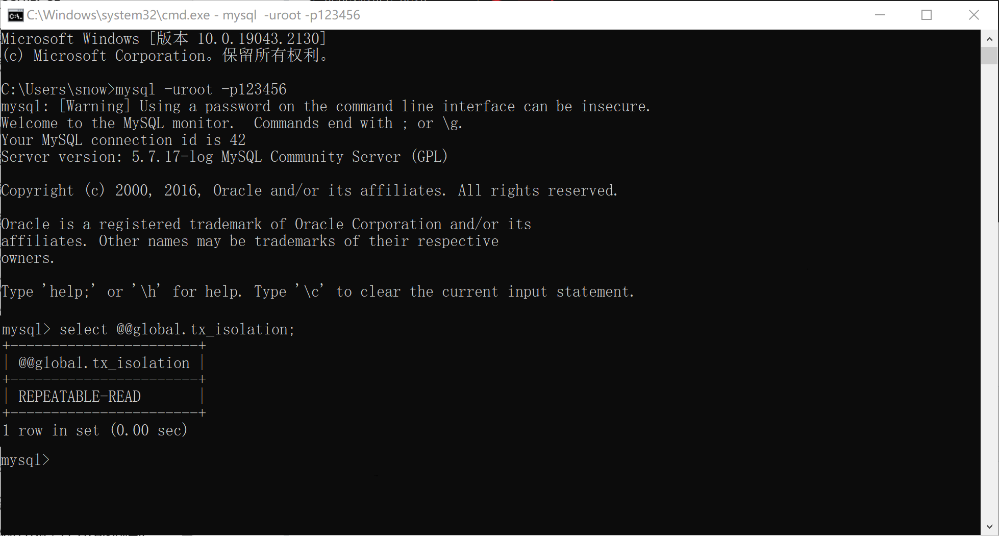
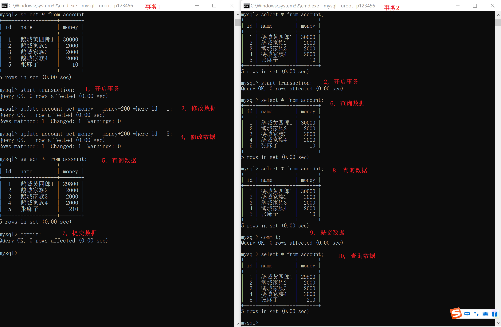
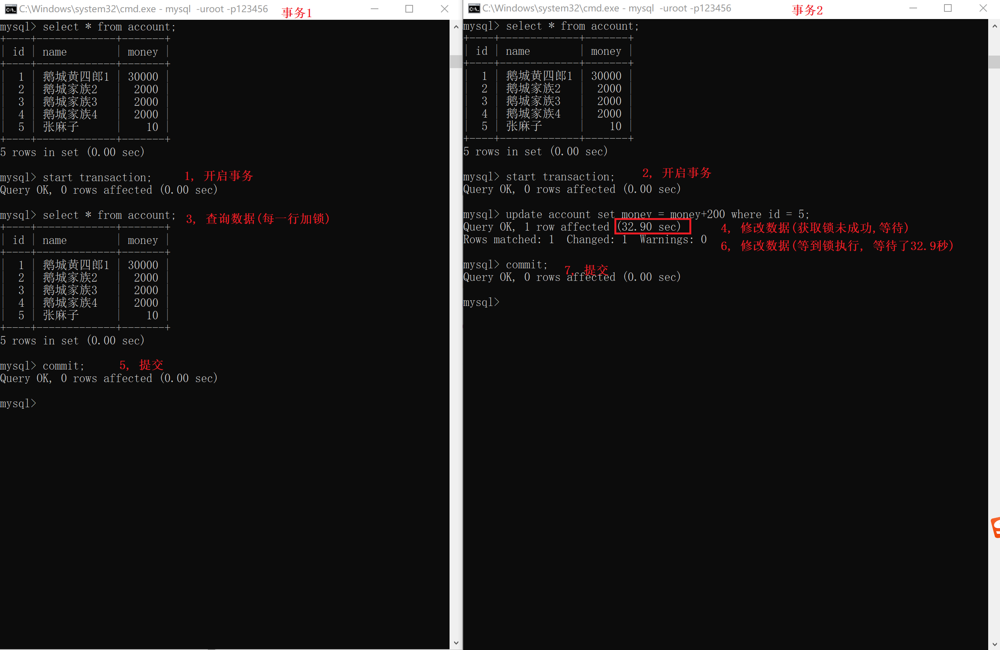

# 1, C_API

>使用C语言调用MySQL数据库涉及到使用MySQL的C API.
>
>这是一组C语言函数，提供了从C语言程序连接和操作MySQL数据库的能力。(而这个库文件是MySQL官方提供).

## 1.1 安装这个库

>我们可以通过如下命令安装这个库.
>
>```shell
> sudo apt install libmysqlclient-dev
>```
>
>注意1:
>
>- 我们可以通过: locate mysql.h 找到这个库的头文件
>- 我们可以通过: locate libmysqlclient.so 找到这个库的动态库文件
>
>注意2:
>
>- 在调用函数之前，需要包含头文件<mysql/mysql.h>
>
>- 在生成可执行程序的链接阶段时，需要加入链接选项 -lmysqlclient

## 1.2 使用流程

### 1.2.1 初始化连接

>使用`mysql_init()`初始化连接:
>
>```C
>MYSQL *mysql_init(
>    MYSQL *mysql // 一个指向MYSQL结构的指针,通常传入NULL，函数会为你分配一个新的MYSQL结构。
>    			// 如果你已经有一个MYSQL结构的空间，也可以传入该结构的指针，函数将在该结构上进行初始化。
>);
>// 返回值: 成功时，返回一个指向MYSQL结构的指针。如果内存分配失败，返回NULL。
>```
>
>ps: mysql_init函数线程不安全: 所以当在一个进程中的多个线程中准备同时创建多个数据库连接的时候, 建议先加锁(connect之后再解锁).

### 1.2.2 建立连接

>使用`mysql_real_connect()`建立到MySQL服务器的连接:
>
>```C
>MYSQL *mysql_real_connect(
>        MYSQL *mysql,//指向MYSQL结构的指针
>        const char *host,//数据库服务器的主机名或IP地址(传递NULL或"localhost"将尝试连接到本地机器上的服务器。)
>        const char *user,//用于登录数据库的用户名
>        const char *passwd,//与用户名相对应的密码 
>        const char *db,//要连接的数据库名
>        unsigned int port,//数据库服务器的端口号。如果指定为0，将使用默认端口（通常是3306）
>        const char *unix_socket,//连接本地MySQL服务器时Unix套接字文件路径。可以填NULL
>        unsigned long client_flag//用于控制连接行为的标志。填0即可。
>);
>//成功时，返回MYSQL结构的指针。失败时，返回NULL。
>```

### 1.2.3 执行SQL语句

>使用`mysql_query()`执行SQL语句:
>
>- 这个函数可以用来执行增删改查的SQL指令。
>
>```C
>int mysql_query(
>    MYSQL *mysql,//建立连接的MYSQL结构的指针
>    const char *query//要执行的SQL语句的字符串(这个SQL字符串不应以分号结尾，并且必须是以空字符结束)
>);
>// 返回值:成功返回0。失败返回非0值
>```

### 1.2.4 处理结果

>对于返回数据的查询，使用`mysql_store_result()`和`mysql_fetch_row()`等函数来处理结果:
>
>mysql_store_result: 
>
>```C
>// 获取由mysql_query()函数返回的结果: 一般给查询操作用
>MYSQL_RES *mysql_store_result(
>    	MYSQL *mysql//建立连接的MYSQL结构的指针
>);
>// 返回值:
>//		成功：返回一个指向MYSQL_RES结构的指针，该结构代表了从服务器返回的结果集。通过这个结构，可以进一步获取查询结果
>//		失败：如果SQL没有返回数据(eg:INSERT/UPDATE/DELETE操作,或者SELECT没有找到结果,或者其它错误)，则返回NULL
>```
>
>mysql_free_result:
>
>```C
>// 释放数据结构MYSQL_RES占据的内存空间
>void mysql_free_result(
>    MYSQL_RES *result//指向MYSQL_RES结构的指针
>);
>```
>
>mysql_num_rows:
>
>```c
>// SQL语句结果的行数
>my_ulonglong mysql_num_rows(
>    MYSQL_RES *result//指向MYSQL_RES结构的指针
>);
>// 返回值: 结果集的行数(my_ulonglong: 是一个无符号的64位整数); 如果result是NULL函数返回0。
>```
>
>mysql_num_fields:
>
>```C
>// SQL语句结果的列数
>unsigned int mysql_num_fields(
>    MYSQL_RES *result//指向MYSQL_RES结构的指针
>);
>// 返回值: 返回结果集中的列数; 如果result是NULL函数返回0
>```
>
>mysql_fetch_row:
>
>```C
>// 从结果当中取出一行
>MYSQL_ROW mysql_fetch_row(
>    MYSQL_RES *result//指向MYSQL_RES结构的指针
>);
>// 返回值: 
>//		返回MYSQL_ROW类型(一个字符串数组，每个元素对应结果集中一行的一个字段的值)。
>//		如果字段值为NULL，相应的数组元素也将是NULL。
>//		如果没有更多行了,或结果集为空，函数返回NULL。
>```

### 1.2.5 关闭连接

>使用`mysql_close()`关闭与MySQL的连接:
>
>```C
>void mysql_close(
>    MYSQL *mysql//建立连接的MYSQL结构的指针
>);
>```

### 1.2.6 mysql_error函数

>对于MySQL的C API库, 我们需要一种检测函数出错的机制, 而mysql_error这个函数可以帮助你诊断函数，了解为什么一个特定的MySQL操作（如连接、查询等）失败。
>
>```C
>const char *mysql_error(
>    MYSQL *mysql//MYSQL结构的指针
>);
>// 返回值: 描述最近一次API调用失败原因
>```

## 1.3 CODE

### 1.3.1 select

```C
#include <55header.h>
#include <mysql/mysql.h>

int main(int argc,char*argv[])
{
    MYSQL *conn;
    MYSQL_RES *result;
    MYSQL_ROW row;

    conn = mysql_init(NULL);
    if (!mysql_real_connect(conn, "localhost", "root", "zs123456", "test2", 0, NULL, 0)) {
        printf( "%s\n", mysql_error(conn));
        return 1;
    }
  	mysql_set_character_set(conn, "utf8mb4");
    
    if (mysql_query(conn, "SELECT * FROM student")) {
        printf("%s\n", mysql_error(conn));
        return 1;
    }

    result = mysql_store_result(conn);

    while ((row = mysql_fetch_row(result))) {
        for(int i=0; i<mysql_num_fields(result); i++){
            printf("%s \t", row[i]);
        }
        printf(" \n");
    }

    mysql_free_result(result);
    mysql_close(conn);

    return 0;
}
```

### 1.3.2 update

```C
#include <55header.h>
#include <mysql/mysql.h>

int main(int argc,char*argv[])
{
    MYSQL *conn;
    MYSQL_RES *result;

    conn = mysql_init(NULL);
    if (!mysql_real_connect(conn, "localhost", "root", "zs123456", "test2", 0, NULL, 0)) {
        printf( "%s\n", mysql_error(conn));
        return 1;
    }

    if (mysql_query(conn, "update student set motto='1223' where id=10")) {
        printf("%s\n", mysql_error(conn));
        return 1;
    }

    result = mysql_store_result(conn);

    mysql_free_result(result);
    mysql_close(conn);

    return 0;
}
```

>了解sql注入问题: 项目中讲

# 2, 事务Transaction

>理解: 记住背会 (面试问的概率比较高)

>数据基础
>
>```SQL
>CREATE TABLE `account` (
>  `id` int(10) NOT NULL PRIMARY KEY AUTO_INCREMENT,
>  `name` varchar(10) DEFAULT NULL,
>  `money` float DEFAULT NULL
>);
>```
>
>```SQL
>insert into account values(1, "鹅城黄四郎1",  30000 );
>insert into account values(2, "鹅城家族2",  2000 );
>insert into account values(3, "鹅城家族3",  2000 );
>insert into account values(4, "鹅城家族4",  2000 );
>insert into account values(5, "张麻子",  10 );
>```

## 2.1 场景

>假如我们在维护一个银行的用户表
>
>```Java
>// 可能在我们维护这个表的过程中, 比较常见的行为就是转账问题.
>// 假如在某个时刻两个用户存在相互转账的需求, 那么我们在实现这个转账逻辑中, 又有可能遇到什么问题那?(宕机?SQL错误?链接失败?....) 
>```
>
>```SQL
>eg:
>update account set money = money-200 where name like '%黄四郎%';
>
>update account set money = money-200 where name like '%家族2%';
>update account set money = money-200 where name like '%家族3%';
>update account set money = money-200 where name like '%家族4%';
>
>update account set money = money+800 where name like '张麻子';
>```
>

## 2.2 事务

### 2.2.1 事务的概念

>事务的概念: 
>
>​		组成逻辑的一组SQL操作，这个操作的各个单元/语句，要么都成功执行，要么都不成功执行.

>构成事务的三个操作:
>
>​		开启事务;
>
>​		回滚;(非必要)
>
>​		提交;
>
>```SQL
>eg:
>-- start transaction: -- 开启事务
>begin; -- 开启事务
>update account set money = money+200 where name like '%黄四郎%';
>
>update account set money = money+200 where name like '%家族2%';
>update account set money = money+200 where name like '%家族3%';
>update account set money = money+200 where name like '%家族4%';
>rollback; -- 回滚事务之后，之前所有的操作都会失效。
>
>update account set money = money-800 where name like '张麻子';
>commit; -- 提交事务之后，从开启事务到提交事务之间所有的操作才会生效。
>```
>

>注意: 开启事务之后, 要注意提交(要么rollback, 要么commit).
>

### 2.2.2 事务和C_API

>```C
>// 设置是否自动提交 (即:是否开启事务)
>bool mysql_autocommit(
>        MYSQL *mysql,// MySQL连接
>        bool mode // 1:自动提交事务.   0:非自动提交/开启事务
>)   
>// 返回值: 0表示成功, 非零表示失败
>```
>
>```C
>// 提交事务
>bool mysql_commit(
>    MYSQL *mysql// MySQL连接
>)
>// 返回值: 0表示成功, 非零表示失败
>```
>
>```C
>// 回滚事务
>bool mysql_rollback(
>    MYSQL *mysql// MySQL连接
>)
>// 返回值: 0表示成功, 非零表示失败
>```
>
>```C
>#include <header.h>
>#include <mysql/mysql.h>
>
>int main() {
>
>        MYSQL *mysql = mysql_init(NULL);
>        mysql_real_connect(mysql, "localhost", "root", "123456", "cpp61", 0, NULL, 0) ;
>
>        // 开始事务
>        mysql_autocommit(mysql, 0);
>
>        // 执行
>        mysql_query(mysql, "insert into class  VALUES (10, '11班')");
>        int ret = mysql_query(mysql, "insert into class  VALUES (NULL, '11班')");
>
>        if(ret != 0){
>            // 出现错误，回滚事务
>            mysql_rollback(mysql);  
>        }else{
>            // 提交事务
>            mysql_commit(mysql);
>        }
>
>        // 恢复自动提交模式
>        mysql_autocommit(mysql, 1);
>
>        mysql_close(mysql);
>        return 0;
>}
>```

## 2.3 事务特性ACID

>所谓的事务的特性: 我们希望一个事务具有什么特点

>原子性atomicity
>
>```Java
>一个事务, 这个事务整体的所有sql操作都要必须要被视为一个不可分割的最小单元, 整个事务中的操作要么全部提交成功, 要么全部失败回滚, 对于一个事务来说, 不可能只执行其中的一部分操作, 这就是事务的原子性.(这是从操作角度来谈失误: 操作要么都成功, 要么都失败, 不可切割)
>```
>
>一致性consistency
>
>```Java
>数据库总是从一个一致性的状态转换到定一个一致性的状态. 如前面的例子, 所谓一致性, 就是要么扣款和增加都成功, 要么未成功发生扣款的同时也未发生金额增加, 数据(金钱的总量是要前后一致的)是一致性变化的. (从事务的结果, 数据角度来谈:  数据是从一个状态, 通过事务, 要么不变, 要么一致性的演变到另外一种状态)
>```
>
>隔离性isolation
>
>```Java
>就是事务和事务之间的关联性.
>    --事务之间的关联, 有可能强, 也有可能关联性弱 (这是可以设置的)
>```
>    
>持久性durability
>
>```Java
>事务的持久性是指 一旦事务提交后或者回滚，事务对数据库的改变应该是永久性的。 (因为: 提交和回滚,  都会结束事务)
>```

## 2.4 隔离级别

>隔离级别就是为了研究这么一种情况: 存在两个数据库连接, 一个连接的事务在修改(添加/删除/修改),  另一连接中的事务在查找

### 2.1.0 数据的操作可能遇到的问题

>**场景一:** 脏读(Dirty read)现象
>
>```Java
>当我们在操作数据库, 处理一个用户的转账动作的时候: 按照正常逻辑分析, 我们在这个转账过程中总共有两个行为, 第一是扣款方扣款, 第二是收款方收款.
>    
>我们要求在这个转账过程中, 数据保持一致性(钱不能莫名其妙丢失), 所以我们需要开启事务, 在一个事务中处理这两个动作(扣款和收款), 以保证数据操作结果正确.
>
>当我们在Java代码中启动一个线程A来处理这个转账过程, 首先线程A开始事务, A开启事务之后, A让扣款方发生扣款, (但是在这一时刻A还没有来的急让收款方收款)此时有一个线程B在操作数据的时候, 发现了线程A还没有来的急提交的扣款结果(即在A未提交事务的情况下,对数据的修改/扣款, 已经被B感知到了).
>```
>
><span style="color:red">一个事务读取到了另外一个事务还没提交的数据:即脏读(读到了脏数据)</span>

>**场景二:** 不可重复读(nonrepeatable read)
>
>```Java
>如果同上的转账行为中.
>    
>当我们在Java代码中启动一个线程C用来统计汇总用户信息,  C线程开启事务, C线程在开启事务之后,(提交事务之前),  读取到的数据可能发生改变(比如: 在C事务中第一次读取zs有1000元, 第二次读取zs的时候有800元, 事务C还未结束提交, 就已经发现了自己操作的数据被别的非C事务的地方修改)
>    
>原因：在同一个事务内，读取到了另一个事务修改的数据(可能另一个事务已经提交, 也可能没提交)。
>```
>
><span style="color:red">在同一个事务内，针对同一个数据，前后读取的数据不一样: 即不可重复读</span>

>**场景三**: 虚幻读/幻读/幻影读(phantom  read)
>
>```Java
>如果同上的转账行为中.
>    
>当我们在Java代码中启动一个线程D用来统计汇总用户信息, D线程开启事务, D线程在开启事务之后,(提交事务之前),  读取到的数据内容一直没有发生改变, 读取到的数据条目数可能发生改变.(比如: 在D事务中第一次读取zs有1000元, 第二次读取zs的时候还是1000元(即使另一个事务试图修改了这个数据); 但是在D事务中, 有可能刚开始读取到的数据条目数是5条, 在这个D事务中过了一段时间之后, 有可能读到的数据是6条(也就意味着D事务中可能读取到别的事务插入的数据))
>  
>原因：在一个事务内，读取到了别的事务插入（删除）的数据
>```
>
><span style="color:red">在一个事务内，任何一条数据的内容前后读取一致, 但是数据条数前后不一定一致。</span>

##### 查看和修改隔离级别: 

>```SQL
>SELECT @@GLOBAL.TX_ISOLATION; -- 整个数据的设置
>SELECT @@GLOBAL.transaction_isolation;
>
>SELECT @@SESSION.TX_ISOLATION; -- 一个连接的隔离级别
>SELECT @@SESSION.transaction_isolation;
>
>
>SET GLOBAL TRANSACTION ISOLATION LEVEL [SERIALIZABLE | REPEATABLE READ| ...];
>SET SESSION TRANSACTION ISOLATION LEVEL [SERIALIZABLE | REPEATABLE READ| ...];
>
>eg:
>	select @@global.tx_isolation;
>	select @@session.tx_isolation;
>	set global transaction isolation level read uncommitted;
>	set global transaction isolation level repeatable read;
>```
>
>`查看隔离级别`
>
>
>
>`修改隔离级别`
>
>

### 2.1.1 读未提交

>读未提交(READ UNCOMMITTED): 在`READ UNCOMMITTED`级别, 
>
>事务中的修改, 即使没有提交, 对其他事务也都是可见的.(在一个事物中, 读取到另外一个事物的未提交的数据)
>
>会产生: 脏读, 不可重复读, 幻读
>
>```SQL
>set global transaction isolation level read uncommitted;
>select @@global.tx_isolation;
>-- select @@global.transaction_isolation;
>```
>
>`修改隔离级别`
>
>

##### 操作

>```SQL
>select * from account;
>start transaction;
>update account set money = money-200 where id = 1;
>rollback;
>commit;
>```
>
>

### 2.1.2 读已提交

>读已提交(READ COMMITTED): 在`READ COMMITTED`级别, 
>
>一个事务开始之后, 只能看到自己的修改`和`别的已经提交的事务的修改.
>
>(即: 一个事务在提交之前, 所作的修改对其它事务是不可见的)
>
>只能在当前事物中读到别的连接已经提交的事务( 别的连接没有提交的事务, 就读不到), 所以不会引发脏读问题, 但是引发了不可重复读, 幻读问题.
>
>```SQL
>set global transaction isolation level read committed;
>select @@global.tx_isolation;
>-- select @@global.transaction_isolation;
>```
>
>`修改隔离级别`
>
>

##### 操作

>```SQL
>select * from account;
>start transaction;
>update account set money = money-200 where id = 1;
>update account set money = money+200 where id = 5;
>commit;
>```
>
>

### 2.1.3 可重复读

>可重复读(REPEATABLE READ): 在`REPEATABLE READ`级别, 一个事务开始之后, 保证多次读取某同样的记录结果保持一致. 
>
>MySQL的默认隔离级别就是可重复读.
>
><span style="color:#66ff">(但是要注意的是, 可重复读存在幻读问题;  而MySQL的InnoDB存储引擎解决了部分幻读问题/可并没有完全解决幻读问题)</span>
>
>不会再有脏读问题, 不会再有不可重复读问题,  演示结果上看没有幻读问题 (实际上在MySQl的可重复读隔离级别上是存在幻读的问题)
>
>```SQL
>set global transaction isolation level repeatable read;
>select @@global.tx_isolation;
>-- select @@global.transaction_isolation;
>```
>
>`修改隔离级别`
>
>

##### 操作

>```SQL
>select * from account;
>start transaction;
>update account set money = money-200 where id = 1;
>update account set money = money+200 where id = 5;
>commit;
>
>select * from account for update; (必须在事务中使用才有意义: 在这个sql语句中 for update的作用具有查看表的当前所有真实数据, 而非当前事务的的能看到的数据, 并且给查出来的所有数据加一个排他锁)
>或者两边同时插入同一主键内容, 会有相互感知.
>
>mysql中以Innodb为表驱动引擎的表, 在可重复读的级别上, 解决了一部分的幻读问题, 但是并没有完全解决. 而它解决一部分幻读问题的手段是通过和锁机制的mvcc机制实现的.
>```
>
>

### 2.1.4 串行化/序列化

>串行化(SERIALIZABLE): 在`SERIALIZABLE`级别，它强制事务串行执行,`SERIALIZABLE`级别会在读取的每一行数据上都加上锁,  以保证事务的先后顺序，那么就不存在多个事务同时执行情况(也就没有上面的安全性问题). 
>
>```SQL
>set global transaction isolation level serializable;
>select @@global.tx_isolation; 
>```
>
>`修改隔离级别`
>
>

##### 操作

>```SQL
>select * from account;
>start transaction;
>update account set money = money+200 where id = 5;
>commit;
>```
>
>

### 对比:

>事务隔离级别对比
>
>| 隔离级别                                         | 脏读 | 不可重复读 | 虚幻读 |
>| ------------------------------------------------ | ---- | ---------- | ------ |
>| 读未提交（read uncommitted）                     | √    | √          | √      |
>| 读已提交（read committed）                       | X    | √          | √      |
>| 可重复读（repeatable read）(mysql的默认隔离级别) | X    | X          | √-×    |
>| 串行化（serializable）                           | X    | X          | X      |


#### 上课演示的代码

>```sql
>
>
>CREATE TABLE `account` (
>`id` int(10) NOT NULL PRIMARY KEY AUTO_INCREMENT,
>`name` varchar(10) DEFAULT NULL,
>`money` float DEFAULT NULL
>);
>
>insert into account values(1, "鹅城黄四郎1",  30000 );
>insert into account values(2, "鹅城家族2",  2000 );
>insert into account values(3, "鹅城家族3",  2000 );
>insert into account values(4, "鹅城家族4",  2000 );
>insert into account values(5, "张麻子",  10 );
>
>
>select * from account;
>
>-- 转账
>
>-- 一组sql
>update account set money=money-200 where id =1;
>update account set money=money-200 where id =2;
>update account set money=money-200 whre id =3;
>update account set money=money-200 where id =4;
>update account set money=money+800 where id =5;
>
>-- 需求: 有时候我们为了处理一个业务逻辑
>--           我们需要执行多条sql甚至操作多张表
>--       我们希望这一连串操作, 要么都成功, 要么都失败
>-- 事务: 把一组sql, 通过设置事务, 分为一个不可被拆分的原子
>--         要么执行都成功, 要么执行都失败  (手动操作)
>
>
>-- 用户表:  用户信息
>-- 订单表:  订单信息, 关联的用户
>
>
>-- 事务中有三个操作:  
>--     1, 开启事务
>--     2, 提交事务
>--     3, 回滚事务
>
>
>-- 举例1:  先开启事务, 
>--             执行sql/多条sql
>--             (这个过程中被执行的sql并没有真正修改 "原"数据)
>--         假设, sql执行都没问题, 提交事务
>--             ( 一旦提交事务, 刚才的修改都会作用到原数据上)
>--         数据就真正改变了
>
>-- 举例2:  先开启事务, 
>--             执行sql/多条sql
>--             (这个过程中被执行的sql并没有真正修改 "原"数据)
>--         假设, 执行过程中, 某个sql没执行成功
>--         选择回滚->  把刚在执行的sql的效果统统取消
>--         这个事务就结束了, 原数据没有被改变
>
>
>-- 开启事务
>start transaction -- 开启事务(SQL标准定义的语法)
>begin; -- 开启事务(MySQL的方言)
>
>begin;
>select * from account;
>update account set money=money-200 where id=1;
>select * from account;
>update account set money=money-200 where id=2;
>update account set money=money-200 where id=3;
>update account set money=money-200 where id=4;
>select * from account;
>update account set money=money+800 where id=5;
>-- 提交事务
>commit;
>select * from account;
>
>-- 事务开启之后: 要么提交  要么回滚
>
>--  
>begin ;
>select * from account;
>update account set money=money-200 where id=1;
>update account set money=money-200 were id=2;
>select * from account;
>-- 回滚
>rollback;
>
>
>-- 
>
>create table class (
> id int   primary key,
> class_name varchar(10)
> );
> 
>
>select * from class;
>
>insert into class values(NULL, "一班");
>
>
>-- 如果我们没有选择显式的给sql加事务
>--  那么, 一个sql发送到mysql服务中执行的时候 -> 自带事务
>select * from class;
>
>
>-- 概念: 
>
>```
>