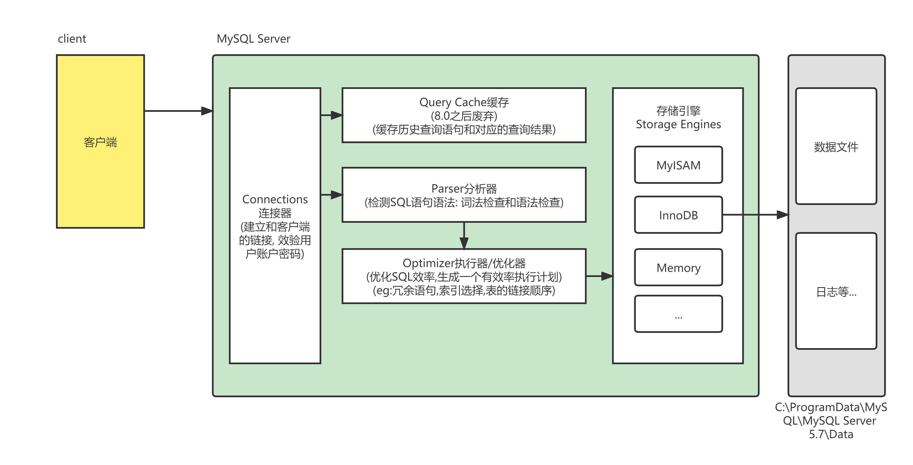
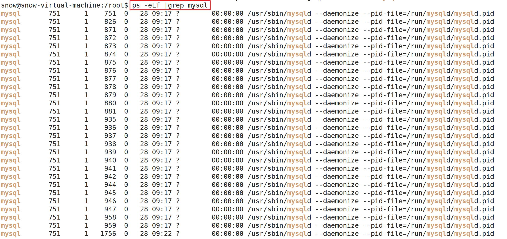
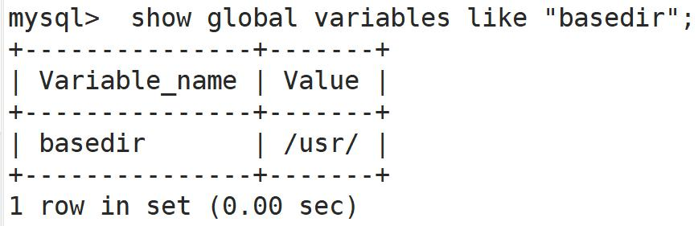
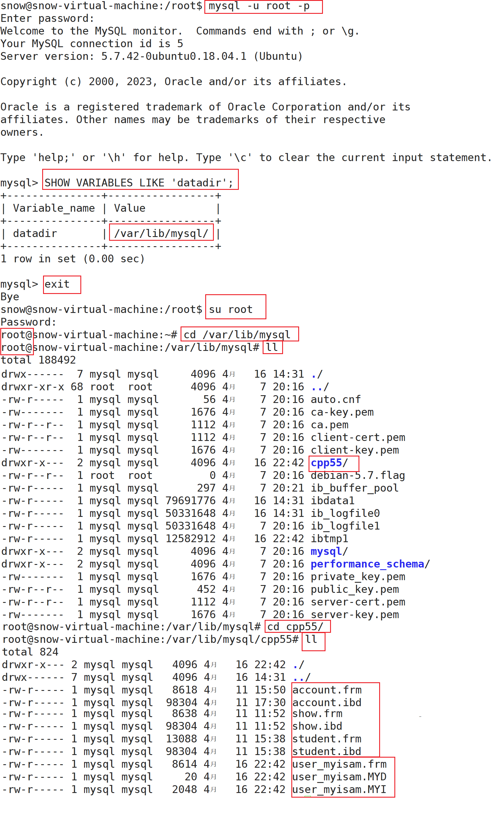
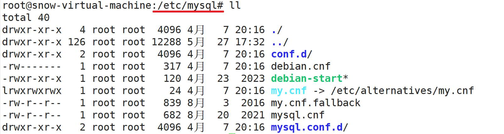
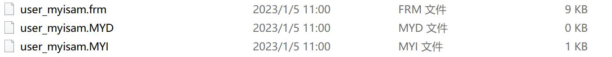
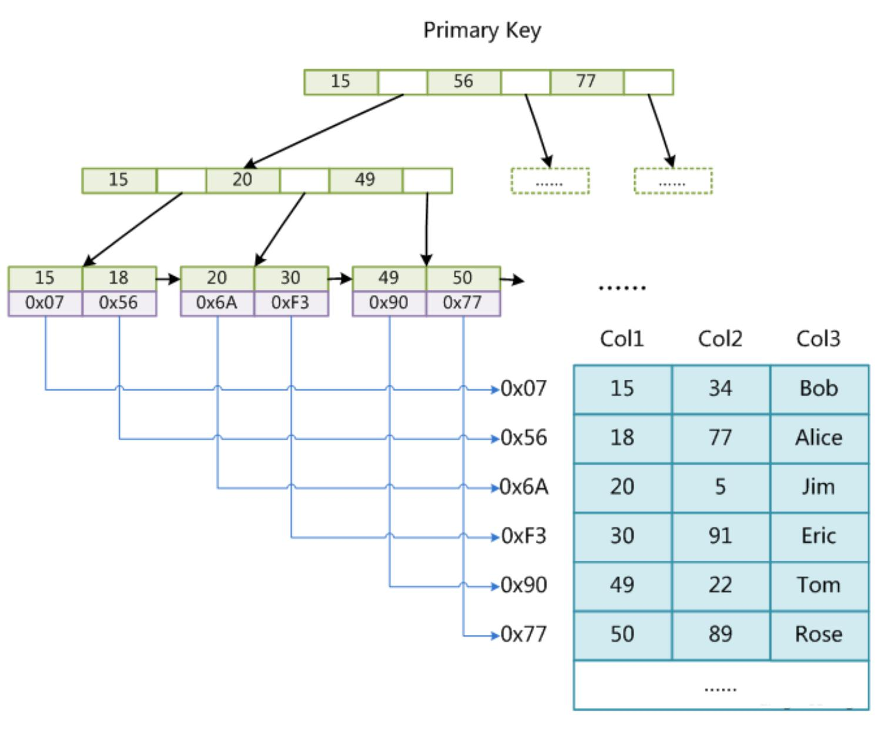
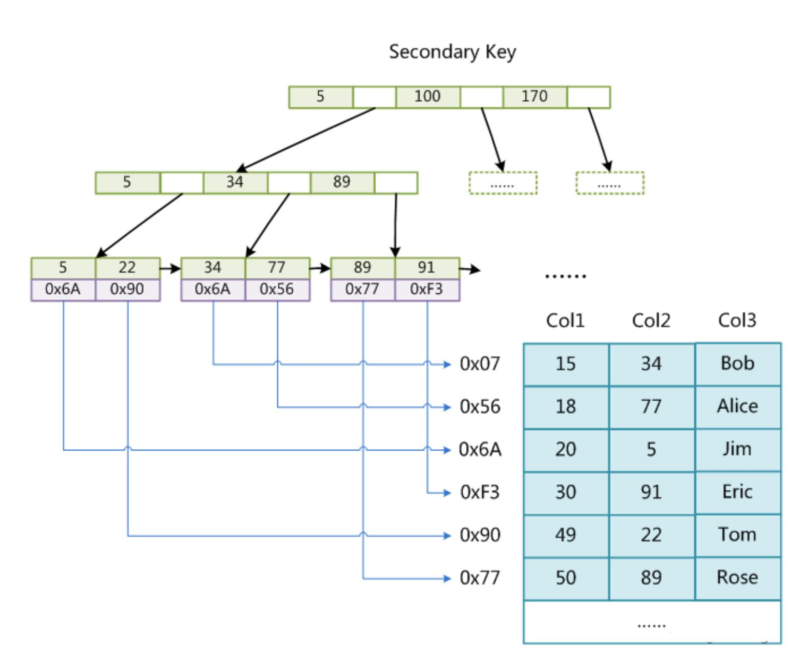
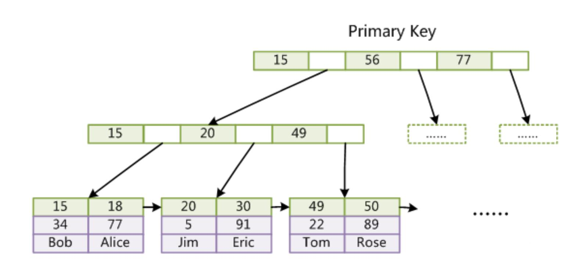
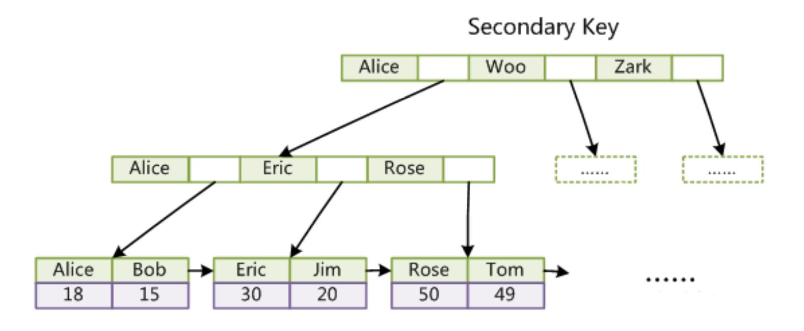

# 索引

# 1, 介绍&了解

## 1.1 数据库的内部结构

>在谈到索引之前, 我们首先要搞明白什么是MySQL的数据库引擎.
>
>而我们要研究数据库引擎, 我们更要先知道MySQL数据库系统的内部构成.
>
>
>
>从上图我们可以知道，MySQL的体系架构划分为四层。分别为：**网络接入层**、**服务层**、**存储引擎层**和**文件系统层**。

>**连接器**：提供了应用程序接入MySQL服务器的接口，其功能包管理连接，身份验证,权限的验证等。 
>
>**分析器**：首先MySQL需要知道你想做什么。因此需要对输入的SQL进行解析。首先进行词法分析，需要识别出里面的字符串代表什么意思。比如 (select id from t),  SELECT 代表查询，T 代表某张表，ID 代表某张表的列字段叫id；之后进行语法分析，根据语法规则，判断输入的 sql 语句是否符合MySQL语法。
>
>**优化器：**经过解析之后，MySQL就知道你需要做什么事情了。但是在真正执行之前还需要经过优化器处理。比如当表中存在多个索引的时候，选择哪个索引来使用。或者多表关联的时候，选择各个表的连接先后顺序。
>
>**存储引擎**:是数据库真正做数据存取操作的实现部分，在MySQL中有多种存储引擎共同组成，每个存储引擎都有自己的特点，MySQL服务器是通过调用存储引擎提供的函数接口来与存储引擎交互。而这些函数接口包含了很多底层的操作，比如开始一个事务，或者取出有特定主键的行。该接口隐藏了各个存储引擎不同的地方，对于服务层级是透明的。存储引擎不能解析SQL语句，互相之间也不能通信，仅仅是简单的响应服务器的请求

了解了MySQL的结构之后，那我们就可以知道，数据的存储和存储引擎息息相关。不同的存储引擎存储数据的方式是不一样的。

>在MySQL中，有很多种存储引擎, 主要要了解的是MyISAM和InnoDB
>
>- InnoDB（5.1之后默认的存储引擎），这个存储引擎其实一开始是以插件的形式存在的，在5.1之后，MySQL官方团队把InnoDB当成了默认的存储引擎
>- MyISAM（5.1之前默认的存储引擎），这个存储引擎是由MySQL的官方团队开发的

## 1.2 数据库的一些问题

>MySQL数据库服务器, 是由数据管理系统和数据两部分构成,  而这个管理系统的设计是一种单进程多线程架构.
>
>```C
>ps -eLf |grep mysql
>```
>
>

>mysql的安装目录
>
>```sql
>show global variables like "basedir";
>```
>
>
>
>在/user/下mysql的安装信息存在不同路径中:
>
>| 功能                           | 位置                | 其它 |
>| ------------------------------ | ------------------- | ---- |
>| mysql客户端程序目录            | /usr/bin/           |      |
>| mysqld服务器程序目录           | /usr/sbin/          |      |
>| mysql客户端头文件目录          | /usr/include/mysql/ |      |
>| mysql客户端库文件目录          | /usr/lib/mysql/     |      |
>| man帮助手册页目录              | /usr/share/man/     |      |
>| 字符集、语言相关的错误信息目录 | /usr/share/mysql/   |      |

>mysql的数据文件目录: 有必要了解一下
>
>```C
>show  variables like 'datadir';
>```
>
>
>
>在数据目录中的一些文件的作用: (仅了解)
>
>```C
>//auto.cnf: 这是MySQL自动生成的配置文件，用于存储MySQL实例的配置信息。
>//ca-key.pem: 这是用于SSL/TLS连接的CA（Certificate Authority）私钥文件。
>//ca.pem: 这是用于SSL/TLS连接的CA证书文件。
>//client-cert.pem: 这是用于SSL/TLS连接的客户端证书文件。
>//client-key.pem: 这是用于SSL/TLS连接的客户端私钥文件。
>//debian-5.7.flag: 这是Debian操作系统中的标记文件，指示系统上安装了MySQL 5.7版本。
>//ibdata1: 这是InnoDB存储引擎的数据文件，包含数据库的表数据和索引。
>//ib_buffer_pool: 这是InnoDB存储引擎的缓冲池文件，用于缓存数据和索引。
>//ib_logfile0 和 ib_logfile1: 这是InnoDB存储引擎的日志文件，用于恢复和重放数据库中的事务。
>//ibtmp1: 这是InnoDB存储引擎的临时文件。
>//mysql: 这是MySQL数据库系统的核心文件目录，包含了数据库的数据文件、系统表等。
>//performance_schema: 这是MySQL的性能监控和性能优化功能相关的文件目录。
>//private_key.pem: 这是用于SSL/TLS连接的私钥文件。
>//public_key.pem: 这是用于SSL/TLS连接的公钥文件。
>//server-cert.pem: 这是用于SSL/TLS连接的服务器证书文件。
>//server-key.pem: 这是用于SSL/TLS连接的服务器私钥文件。
>//sys: 这是MySQL 5.7引入的一个性能模式，用于提供更详细的性能监控信息。
>```

>配置文件
>
>- 当MySQL实例和各种工具程序启动时，需要通过配置文件读取各种参数用以启动程序。
>
>

>日志文件: (了解)
>
>```C
>MySQL中一些常见的日志:
>// 错误日志文件： /var/log/mysql/error.log
>// 慢查询日志文件：/var/log/mysql/mysql-slow.log
>// 主从复制文件：/var/log/mysql/mysql-bin.log
>// 服务器进程PID文件：/var/run/mysqld/mysqld.pid
>// 服务器socket文件：/var/run/mysqld/mysqld.sock
>```

>一些查看命令:
>
>```C
>// 查看MySQL的版本
>select version();
>// 查看存储引擎
>show engines;
>```

 

# 2, 索引

## 2.1 什么是索引

>MySQL官方对索引的定义是：索引是可以帮助MySQL高效获取数据的数据结构。即索引是`按照`某些`数据结构`组织`数据库数据`的一种方式。数据库在执行查询的时候，如何没有索引存在的情况下，会采用全表扫描的方式进行查找。如果存在索引，则会先去索引列表中定位到特定的行或者直接定位到数据，从而可以极大地减少查询的行数，<span style="color:red">增加查询速度。</span>

我们可以把索引类比为一部字典开头的目录。

### 2.1.1 数据结构和索引

在计算机组织数据的过程中, 常见的数据结构有:

>```Java
>链表类型线性表
>数组类型线性表
>栈
>队列
>二叉树
>二叉搜索树
>红黑树
>Hash表: key-> 计算数据存储位置; 非常不利于范围查找, hash冲突
>B树/B-树
>B+树
>...
>```

那么上述那种数据结构比较符合我们实际组织数据的需求?

#### 2.1.1.1 数据结构的简介

二叉搜索树OR红黑树

>红黑树特点
>
>```Java
>红黑树是一个二叉搜索树, 
>红黑树中每个结点颜色要么是红色要么是黑色,
>在红黑树中根结点和叶子结点是黑色的, 
>在红黑树的父子关系上不存在连续的红色结点, 
>在红黑树上每一个叶子结点到根结点的简单路径上都包含相同数目的黑色结点.
>```

>二叉搜索树OR红黑树作为索引有什么缺点?
>
>```Java
>二叉搜索树OR红黑树只有两个叉，所以如果数据库的数据量比较大，同样会导致树的高度较高，这个时候查询效率就会比较低（但是还是高于全表扫描），所以二叉树或者是红黑树不适合当索引。
>不利于范围查找。
>```

B树

>对于一颗m阶的B树而言
>
>```Java
>1. 树中的每个结点最多含有m个孩子；
>2. 除了根结点和叶子结点，其他结点至少有[ceil(m / 2)（代表是取上限的函数）]个孩子；
>3. 若根结点不是叶子结点时，则至少有两个孩子（除了没有孩子的根结点）
>4. 所有的叶子结点都出现在同一层中，叶子结点不包含任何关键字信息
>```

>B树相对于平衡二叉树或者红黑树，最大的优势在什么地方？
>
>```Java
>对于B树而言，如果节点内存储的索引数量越多，那么即便B树的高度只有三层或者四层，也可以存储千
>万条以上的数据。
>一般情况下，如果B树的高度是3，那么就需要进行三次查询，也就是需要经过三次磁盘IO，查询的限速
>步骤主要在于磁盘IO
>```
>
>B树作为索引有什么缺点?
>
>```Java
>范围查询问题, 更好的解决方案
>```

<span style="color:red">B+树</span>

>B+树它可以看成是 B 树的变种。具有以下特点：
>
>```Java
>1. 非叶子节点不存储Data，只存储Key
>2. 所有的叶子节点存储完整的一份Key信息以及Key 对应的 Data
>3. 每一个父节点都出现在子节点中，是子节点的最大或者最小的元素
>4. 每个叶子节点都有一个指针，指向下一个数据，形成一个链表
>```
>
>特点：B+树由于非叶子节点不存储数据，仅在叶子节点才存储数据，所以，单个非叶子节点可以存储更多的索引字段

<span style="color:red">Hash表</span>

>Hash表也叫散列表，根据相关的Key而直接访问的数据结构。通过Key计算一个固定的运算转换成一个数字，然后将这个数字对数组的长度取余，最终的结果就当做数组的下标。对应的数据就放在该下标处。

>如果采用Hash表作为索引，其查询效率也是很高的(可选的)。但是Hash表会普遍用于MySQL的索引上来吗？
>
>```Java
>使用Hash作为索引会存在以下问题：
>1. Hash索引仅能够查找=，in等情况的查找，无法进行范围查找
>2. Hash索引无法进行排序（因为经过Hash运算后的数字大小和原本的数字大小没有关系）
>3. Hash表这种数据结构可能会存在Hash冲突，即可能会存在不同的数据经过Hash运算后得到
>相同的hash值，因此即便找到了对应的Hash值所在的下标，仍有可能需要再次扫描表的数据
>4. 如果存在大量Hash值相等的情况，那么此时Hash索引的查询性能不一定优秀
>```

## 2.2 存储引擎在索引上的重要区别

### 2.2.1 MyISAM

>数据基础
>
>```SQL
>CREATE TABLE `test`.`user_myisam`  (
>  `id` int(11) NOT NULL PRIMARY KEY AUTO_INCREMENT,
>  `name` varchar(255) ,
>  `age` int(11),
>  `class` varchar(255),
>  `chinese` float NULL DEFAULT NULL,
>  `english` float NULL DEFAULT NULL,
>  `math` float NULL DEFAULT NULL,
>	INDEX `name_index` (`name`) 
>) ENGINE = MyISAM ;
>
>INSERT INTO `user_myisam` VALUES (1, '武松', 25, '一班', 70, 90, 60);
>INSERT INTO `user_myisam` VALUES (2, '林冲', 35, '一班', 70, 90, 90);
>INSERT INTO `user_myisam` VALUES (3, '宋江', 40,'一班', 90, 90, 20);
>INSERT INTO `user_myisam` VALUES (4, '贾琏', 20,'二班', 60, 60, 60);
>INSERT INTO `user_myisam` VALUES (5, '贾宝玉',15, '二班', 95, 80, 5);
>INSERT INTO `user_myisam` VALUES (6, '贾环', 13, '二班', 25, 25, 5);
>INSERT INTO `user_myisam` VALUES (7, '曹操', 52, '三班', 90, 90, 90);
>INSERT INTO `user_myisam` VALUES (8, '曹丕', 24,'三班', 90, 80, 80);
>INSERT INTO `user_myisam` VALUES (9, '曹植', 18, '三班', 98, 90, 80);
>INSERT INTO `user_myisam` VALUES (10, '刘备', 55, '三班', 95, 90, 80);
>INSERT INTO `user_myisam` VALUES (11, '诸葛亮',36, '三班', 98, 95, 95);
>INSERT INTO `user_myisam` VALUES (12, '孙权', 41,'三班', 80, 90, 80);
>```

>使用MyISAM存储引擎存储的表和表中数据的文件由三个文件组成： (/var/lib/mysql/)
>
>
>
>```SQl
>frm文件: 表的结构定义文件
>MYD文件: 数据文件
>MYI文件: 索引文件
>```

#### 主键索引

>所谓主键索引, 就是把主键作为索引
>
>
>
>在MyISAM中, 通过`主键索引`访问的叶子上存储结果,不是一条一条数据, 而是数据的物理地址

#### 非主键的普通索引

>所谓非主键索引, 就是把非主键设置为索引
>
>
>
>在MyISAM中, 通过`非主键索引`访问的叶子上存储结果,不是一条一条数据,  和其主键索引一样也是数据的物理地址

### 2.2.2 InnoDB

>数据基础
>
>```SQL
>CREATE TABLE `test`.`user_innodb`  (
>  `id` int(11) NOT NULL PRIMARY KEY AUTO_INCREMENT,
>  `name` varchar(255) ,
>  `age` int(11),
>  `class` varchar(255),
>  `chinese` float NULL DEFAULT NULL,
>  `english` float NULL DEFAULT NULL,
>  `math` float NULL DEFAULT NULL,
>	INDEX `name_index`(`name`) 
>) ENGINE = InnoDB ;
>
>INSERT INTO `user_innodb` VALUES (1, '武松', 25, '一班', 70, 90, 60);
>INSERT INTO `user_innodb` VALUES (2, '林冲', 35, '一班', 70, 90, 90);
>INSERT INTO `user_innodb` VALUES (3, '宋江', 40,'一班', 90, 90, 20);
>INSERT INTO `user_innodb` VALUES (4, '贾琏', 20,'二班', 60, 60, 60);
>INSERT INTO `user_innodb` VALUES (5, '贾宝玉',15, '二班', 95, 80, 5);
>INSERT INTO `user_innodb` VALUES (6, '贾环', 13, '二班', 25, 25, 5);
>INSERT INTO `user_innodb` VALUES (7, '曹操', 52, '三班', 90, 90, 90);
>INSERT INTO `user_innodb` VALUES (8, '曹丕', 24,'三班', 90, 80, 80);
>INSERT INTO `user_innodb` VALUES (9, '曹植', 18, '三班', 98, 90, 80);
>INSERT INTO `user_innodb` VALUES (10, '刘备', 55, '三班', 95, 90, 80);
>INSERT INTO `user_innodb` VALUES (11, '诸葛亮',36, '三班', 98, 95, 95);
>INSERT INTO `user_innodb` VALUES (12, '孙权', 41,'三班', 80, 90, 80);
>```

>使用InnoDB存储引擎存储的表的文件由两个个文件组成：
>
>
>
>```SQl
>frm文件: 表的结构定义文件
>ibd文件: 数据和索引共用文件: 既包含索引, 又包含了具体数据
>```

#### 主键索引

>所谓主键索引, 就是把主键作为索引
>
>
>
>在InnoDB中的主键索引 是和MyISAM中的主键索引不同的
>
>在InnoDB中 通过`主键索引`访问的最终的叶子上的结果, 是数据本身

#### 非主键的普通索引

>所谓非主键索引, 就是把非主键字段设置为索引
>
>
>
>在InnoDB中, 通过`非主键索引`访问的叶子上存储的结果, 是主键索引的值

## 2.3 索引语法: 作为了解

>不用记

>索引的操作语法
>
>```SQL
>#创建主键索引
>#MySQL常用引擎都默认使用B+树作为索引
>CREATE TABLE `user` (
>	`id` int NOT NULL,
>	`name` varchar(255) NULL,
>	PRIMARY KEY (`id`),
>	INDEX `name_index`(`name`) USING BTREE
>);
>CREATE TABLE `user` (
>	`id` int NOT NULL,
>	`name` varchar(255) NULL,
>	PRIMARY KEY (`id`),
>	INDEX `name_index`(`name`) 
>);
>#InnoDB和MyISAM引擎,用户无法手动创建哈希索引(不支持)
>CREATE TABLE `user` (
>	`id` int NOT NULL,
>	`name` varchar(255) NULL,
>	PRIMARY KEY (`id`),
>	INDEX `name_index9`(`name`) USING HASH
>) ENGINE = Memory ;
>
>
>#在创建表以后添加索引
>alter table tableName add [unique] index indexName(columnName);
>create index indexName on tableName(columnName);
>
>#删除索引
>alter table tableName drop index indexName;
>drop index indexName on tableName;
>
>#查看索引
>show index from tableName;
>```
>
>我们给一个列声明为主键，默认主键这一列就会是主键索引

# 3, 索引延伸问题

>面试问题: 重要

1, 什么是聚集索引/聚簇索引, 什么是非聚集索引/非聚簇索引?

```java
// 聚集索引
// 非聚集索引
聚集索引: 索引和数据是否是一起的. (InnoDB的主键索引满足)
     
// 聚簇索引=聚集索引
// 非聚簇索引=非聚集索引
    
// 没有任何特殊的备注(面试中), 直接说:
// InnoDB是聚集/聚簇索引
// MyISAM是非聚集/聚簇索引
```

2, Innodb表中不建立索引/没有主动设置主键, 为什么要有默认索引? 默认索引是什么?

```java
在Innodb中没有索引行不行?
// 不行, 因为在InnoDB表中, 数据是依赖于主键索引组织的, 和主键索引强绑定到一起的, 没有主键索引在InnoDB就没法存储和组织数据
在MyISAM中没有索引行不行? 
// 可以, 没问题; 因为在MyISAM中索引和数据完全分离的

假设我们没有给InnoDB建立主键索引, 会产生什么问题?
// InnoDB会自动生成一个6字节的不可见的ROW_ID的列, 作为默认的主键索引组织数据 (ROW_ID的列名为GEN_CLUST_INDEX作为索引 )    
    
// 最好创建表的时候, 加上主键
```

3, 索引性能这么好，是不是一个表建立的索引越多越好？

```java
索引越多越好?
// 不是
// 1, 索引比较占用内存
// 2, 如果索引比较多, 添加/删除/修改数据 都有可能导致索引结构变化, 效率急剧降低.
//                  (查找不会导致效率降低)
// 3, 并不是每一列都适合作为索引
```

4, 什么列适合作为索引?

```java
// 1, 重复度低的列  (如果重复度比较高, B+树作为一个根据大小比较确定延伸结点方向的数据结构, 就没办法有效的利用大小比较)
// 2, 使用率高的列(作为条件) (如果使用率比较低, 那么这个索引不但没什么意义, 而且在数据的添加/删除/修改,也会导致这个索引结构变化, 需要重新构建, 反而降低sql运行效率)
// 3, 该列的值不会频繁变化的列 (如果一个列有索引, 而且这个列经常数据变化, 就会导致索引结构经常变成/重构, 导致效率降低)
```

5, 磁盘IO思考: 补充(6字节指针4字节主键,   16k/10字节  = 16*1024/10 = 1638 --> 树层高) : 了解

​		MySQL 每次从外存加载数据, 每次加载16kb. 

​		id -> int , 4个字节

​        地址 -> 6字节  

​       10个字节 -->  1638个数据 --> 1639区间

​       B+树: 2层(都是地址和索引).   1639 * 1638 =  268万数据  

6, 索引一般在建表的时候创建，一般会设为int而且是auto_increment

```SQL
CREATE TABLE `user1` (
	`id` int NOT NULL AUTO_INCREMENT,
	`name` varchar(255) NULL,
	PRIMARY KEY (`id`)
)
```

7, 什么是回表?  如何避免回表?    什么是覆盖索引?

```java
// 回表:  在InnoDB根据某个非主键索引, 查找数据的时候, 会找到主键的值, 需要再根据主键的值再去主键索引中找到这个数据, 这种行为就叫回表 (只会发生在InnoDB根据某个非主键索操作的时候)
// 怎么避免回表: 通过一个索引查找数据的时候, 发现 这个索引的最终结尾, 就存储的有这个数据, 不用回表再找了  (不会回表: select 主键值, 这个非主键索引列的值  from  表  where 非主键索引列条件  )

// 创建一个索引,该索引包含查询中用到的所有字段,称为“覆盖索引” (不需要回表)
```


8, MyISAM和InnoDB的区别 (以及memory存储引擎)

```java
// 1, 物理存储文件不同(MyISAM三个物理文件(5.*): 索引和数据分开两个文件, memory是存储数据到内存上, InnoDB两个物理文件: 索引和数据存在一个文件中,强绑定的)
// 2, 索引结构不同
//     InnoDB支持B+树索引/hash索引
//     memory支持B+树索引/hash索引(默认为hash索引)
//     MyISAM支持B+树索引/不支持hash索引
//     ...
// 3, 事务支持不同(MyISAM不支持事务, memory也不支持事务, InnoDB支持事务)
// 4, 外键设置问题(MyISAM不支持外键, memory也不支持外键, InnoDB支持外键)
// 5, 锁问题(MyISAM和memory支持表锁, InnoDB不仅支持表锁, 还支持行锁) --> InnoDB并发性能比较高/ InnoDB锁的颗粒度比较细
```

9, 什么情况下选择使用MyISAM?    

MyISAM的问题在于它在做添加/删除/修改时锁定了表(而且会在读取的时候阻塞写入, 只有读不阻塞读)，而InnoDB在做添加/删除/修改时只是锁定了行。

```Java
1、不需要事务支持的业务（转账、充值、付款这种就不行）。
2、一般为读数据比较多的应用。读写都频繁的不适合，读多或写多都适合。
3、并发访问相对低的业务（单纯读/纯写高并发也可以）。
4、数据修改相对较少的业务（阻塞会降低）。
5、以读为主的业务，例如：官网，图片信息数据库，用户数据库。
```

什么情况下使用memory存储引擎?

```C
建议使用Redis
```

10, 最左匹配原则

```C
//组合索引: 基本都遵循最左匹配原则 (8.0在优化的时候引入了索引跳跃扫描机制)
联合主键索引: 是主键, 是聚簇索引
组合的唯一键索引: 是组合唯一, 是非聚簇索引
普通联合索引: 不要求唯一, 是非聚簇索引
```

>一个索引, 是有可能通过多个列组合而成的, 先以最左侧的列作为比较的依据, 如果一样, 再比较下一个字段
>
>如果只用右侧值作为查找数据的依据, 不会走索引

11, 全文索引

```C
MySQL中的全文索引, 是一种加速MySQL中字符串查询和匹配的索引机制. (比如类似搜索引擎这种数据存储的数据库比较适合使用)
```

