>数据准备
>
>```sql
>DROP TABLE IF EXISTS `class`;
>CREATE TABLE `class`  (
>  `id` int NOT NULL AUTO_INCREMENT,
>  `class_name` varchar(10) NULL DEFAULT NULL,
>  PRIMARY KEY (`id`) USING BTREE
>) ;
>
>INSERT INTO `class` VALUES (1, '一班');
>INSERT INTO `class` VALUES (2, '二班');
>INSERT INTO `class` VALUES (3, '三班');
>INSERT INTO `class` VALUES (4, '四班');
>-- ----------------------------
>
>DROP TABLE IF EXISTS `student`;
>CREATE TABLE `student`  (
>  `id` int NOT NULL,
>  `student_name` varchar(20) ,
>  `nick_name` varchar(20),
>  `class_id` int ,
>  `mobile` varchar(20),
>  `era` varchar(20),
>  `motto` varchar(30) ,
>  PRIMARY KEY (`id`) USING BTREE
>) ;
>
>INSERT INTO `student` VALUES (1, '武松', '行者', 1,'13440996665', '宋朝', '别胡说!难道不付你钱!再筛三碗来!');
>INSERT INTO `student` VALUES (2, '林冲', '豹子头',1, '17383945041', '宋朝', '无');
>INSERT INTO `student` VALUES (3, '宋江', '及时雨',1, '15671722818', '宋朝', '他日若遂凌云志,敢笑黄巢不丈夫');
>INSERT INTO `student` VALUES (4, '贾琏', '琏二爷', 2,'19931477852', '清朝', '无');
>INSERT INTO `student` VALUES (5, '贾宝玉', '怡红公子', 2,'13456229050', '清朝', '我要这玉又何用');
>INSERT INTO `student` VALUES (6, '贾环', '孽障', 2,'18900141462', '清朝', '无');
>INSERT INTO `student` VALUES (7, '曹操', '阿满', 3,'17273083171', '三国', '宁我负人，毋人负我');
>INSERT INTO `student` VALUES (8, '曹丕', '子桓',3, '17180453185', '三国', '无');
>INSERT INTO `student` VALUES (9, '曹植', '陈思王', 3,'19818008917', '三国', '无');
>INSERT INTO `student` VALUES (10, '孙权', '孙十万', 3,'15638204123', '三国', '无');
>INSERT INTO `student` VALUES (11, '刘备', '刘皇叔',3,'15638204378', '三国', '惟贤惟德,能服行人');
>INSERT INTO `student` VALUES (12, '诸葛亮', '诸葛武侯,卧龙', 3,'15119511196', '三国', '非淡泊无以明志，非宁静无以致远');
>
>-- ----------------------------
>DROP TABLE IF EXISTS `equip`;
>CREATE TABLE `equip`  (
>  `id` int NOT NULL,
>  `student_id` int,
>  `equip_name` varchar(255) ,
>  PRIMARY KEY (`id`) USING BTREE
>) ;
>
>INSERT INTO `equip` VALUES (1, 1, '行者套账');
>INSERT INTO `equip` VALUES (2, 2, '丈八蛇矛');
>INSERT INTO `equip` VALUES (3, 5, '通灵宝玉');
>INSERT INTO `equip` VALUES (4, 7, '七星刀');
>INSERT INTO `equip` VALUES (5, 7, '绝影马');
>INSERT INTO `equip` VALUES (6, 7, '爪黄飞电马');
>INSERT INTO `equip` VALUES (7, 7, '倚天剑');
>INSERT INTO `equip` VALUES (8, 7, '青釭剑');
>INSERT INTO `equip` VALUES (9, 11, '的卢马');
>INSERT INTO `equip` VALUES (10, 11, '双股剑');
>INSERT INTO `equip` VALUES (11, 20, '赤兔马');
>```

# 1, 慢查询

>在MySQL中提供了一种以供我们记录耗时SQL运行时间的日志文件, 即**慢查询日志**, 用以帮助我们在使用MySQL的的过程中快速定位和排查耗时SQL, 进而优化SQL语句提供了方便.
>
>在慢查询日志中我们可以设置指定的SQL执行上限时间, 用以记录耗时SQL的执行过程.

## 1.1 设置

### 默认设置

>**慢查询日志的位置:  慢查询日志默认处于未开启状态**
>
>```shell
>mysql> show variables like '%slow%'; # 获取慢查询日志的相关信息
>+-----------------------------+----------------------------------------------+
>| Variable_name               | Value                                        |
>+-----------------------------+----------------------------------------------+
>| log_slow_admin_statements   | OFF                                          |
>| log_slow_extra              | OFF                                          |
>| log_slow_replica_statements | OFF                                          |
>| log_slow_slave_statements   | OFF                                          |
>| slow_launch_time            | 2                                            |
>| slow_query_log              | OFF                                          |
>| slow_query_log_file         | /var/lib/mysql/snow-virtual-machine-slow.log |
>+-----------------------------+----------------------------------------------+
>7 rows in set (0.01 sec)
>
>mysql> 
>```
>
>```shell
>snow@snow-virtual-machine:~$ su root
>Password: 
>root@snow-virtual-machine:/home/snow# cd /var/lib/mysql/
>root@snow-virtual-machine:/var/lib/mysql# ll
>total 92544
>drwx------ 10 mysql mysql     4096  7月 13 00:00  ./
>drwxr-xr-x 76 root  root      4096  7月  4 11:22  ../
>-rw-r-----  1 mysql mysql       56  6月  4 14:41  auto.cnf
># .....
># .....
># .....
>-rw-r-----  1 mysql mysql        5  7月 12 22:55  snow-virtual-machine.pid 
>drwxr-x---  2 mysql mysql     4096  6月  4 14:41  sys/
>-rw-r-----  1 mysql mysql 16777216  7月 13 00:28  undo_001
>root@snow-virtual-machine:/var/lib/mysql# 
>```

>**慢查询SQL的时间阈值:  默认阈值为10S**
>
>```sql
>mysql> show variables like '%long_query%';
>+-----------------+-----------+
>| Variable_name   | Value     |
>+-----------------+-----------+
>| long_query_time | 10.000000 |
>+-----------------+-----------+
>1 row in set (0.00 sec)
>
>mysql> 
>```

### 修改配置

>开启慢查询文件
>
>```sql
>set global slow_query_log=on;
>-- show variables like '%slow%';
>```
>
>更改耗时SQL阈值
>
>```sql
>set global long_query_time=0.1; 
>-- show variables like '%long_query%';
>```

>修改回默认设置 (测试完成之后, 改回来)
>
>```sql
>set global slow_query_log=off;
>set global long_query_time=10; 
>```

## 1.2 使用

### 执行SQL

>执行一个运行时间较长的SQL
>
>```shell
>mysql> use cpp59;
>Reading table information for completion of table and column names
>You can turn off this feature to get a quicker startup with -A
>
>Database changed
>mysql> show tables;
>+-----------------+
>| Tables_in_cpp59 |
>+-----------------+
>| class           |
>| equip           |
>| student         |
>+-----------------+
>3 rows in set (0.00 sec)
>
>mysql> select * from student;
>
>| id | student_name | nick_name           | class_id | mobile      | era    | motto     
># .....
># .....
># .....
>|  8 | 曹丕         | 子桓                |        3 | 17180453185 | 三国   | 无                      
>|  9 | 曹植         | 陈思王              |        3 | 19818008917 | 三国   | 无                      
>| 10 | 孙权         | 孙十万              |        3 | 15638204123 | 三国   | 无                      
>| 11 | 刘备         | 刘皇叔              |        3 | 15638204378 | 三国   | 惟贤惟德,能服行人          
>| 12 | 诸葛亮       | 诸葛武侯,卧龙       |        3 | 15119511196 | 三国   | 非淡泊无以明志，非宁静无以致远 
>
>12 rows in set (0.00 sec)
>
>mysql> 
>```

>```shell
># 或者执行如下SQL
>mysql> select sleep(3);
>+----------+
>| sleep(3) |
>+----------+
>|        0 |
>+----------+
>1 row in set (3.00 sec)
>
>mysql> 
>```

### 观察日志

>观察日志: 示例
>
>```shell
># Time: 2024-07-13T01:51:00.159933Z
># User@Host: root[root] @ localhost []  Id:    13
># Query_time: 0.001112  Lock_time: 0.000010 Rows_sent: 3  Rows_examined: 12
>SET timestamp=1720835460;
>select avg(id) from student group by class_id;
>```
>
>```sql
># Time: 2024-07-12T16:52:44.464280Z
># User@Host: root[root] @ localhost []  Id:    18
># Query_time: 3.000787  Lock_time: 0.000000 Rows_sent: 1  Rows_examined: 1
>SET timestamp=1720803161;
>select sleep(3);
>```

>日志的内容:
>
>```properties
># SQL执行的时间
># 用户名 、用户的IP信息、线程ID号
># 执行花费的时间  执行获得锁的时间  获得的结果行数 扫描的数据行数
># 这SQL执行的具体时间
># 具体的SQL语句
>```

# 2, explain

>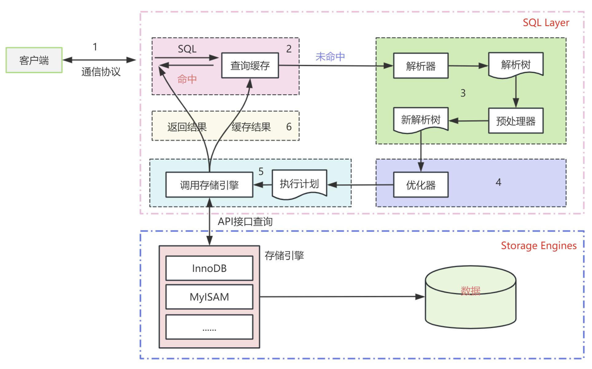

>在 MySQL 中 `EXPLAIN` 的存在具有重要的意义。
>
>`EXPLAIN` 提供了查询执行计划的大致执行信息，包括 MySQL 如何读取表、选择索引、连接表以及过滤数据等，从而使用户能够进一步了解查询的执行过程。通过 `EXPLAIN` 输出，用户可以识别查询中的性能瓶颈，例如全表扫描、索引未被使用、使用临时表或文件排序等，并采取相应的优化措施，如添加或修改索引、重写查询、调整表结构等。`EXPLAIN` 还帮助用户在优化查询之后验证优化效果，通过对比优化前后的执行计划确认优化措施是否有效。它是诊断和排查数据库性能问题的重要工具，帮助用户识别导致性能下降的原因并解决问题。
>
>**简而言之: explain以一种可视化的形式, 帮我们近似展示SQL底层执行的状态/执行计划**

>而我们使用`EXPLAIN` 只需要在待查询语句前面加上explain关键字，就可以了.
>
>```sql
>mysql> select c.class_name, st.student_name from class c inner join student st on c.id = st.class_id;
>+------------+--------------+
>| class_name | student_name |
>+------------+--------------+
>| 一班       | 武松         |
>| 一班       | 林冲         |
>| 一班       | 宋江         |
>| 二班       | 贾琏         |
>| 二班       | 贾宝玉       |
>| 二班       | 贾环         |
>| 三班       | 曹操         |
>| 三班       | 曹丕         |
>| 三班       | 曹植         |
>| 三班       | 孙权         |
>| 三班       | 刘备         |
>| 三班       | 诸葛亮       |
>+------------+--------------+
>12 rows in set (0.01 sec)
>
>mysql> explain select c.class_name, st.student_name from class c inner join student st on c.id = st.class_id;
>+----+-------------+-------+------------+--------+---------------+---------+---------+-------------------+------+--
>| id | select_type | table | partitions | type   | possible_keys | key     | key_len | ref               | rows | f
>+----+-------------+-------+------------+--------+---------------+---------+---------+-------------------+------+--
>|  1 | SIMPLE      | st    | NULL       | ALL    | NULL          | NULL    | NULL    | NULL              |   12 |  
>|  1 | SIMPLE      | c     | NULL       | eq_ref | PRIMARY       | PRIMARY | 4       | cpp59.st.class_id |    1 |  
>+----+-------------+-------+------------+--------+---------------+---------+---------+-------------------+------+--
>2 rows in set, 1 warning (0.00 sec)
>
>mysql> 
>```
>
>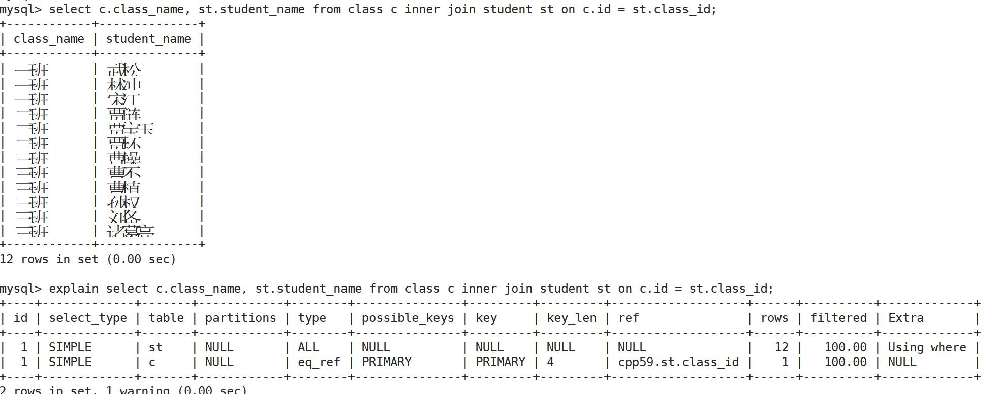

## 2.1 explain和各个结果字段

### 2.1.1 id

>id标识符。这是查询中的`SELECT`的序列号. 我们一般通过id值的大小研究查询中的逻辑顺序.   (但是需要注意的是,它不一定完全代表真实绝对的SQL执行顺序, 是一种**逻辑上的**相对顺序, 在一些特殊操作中未必按照如下说明).

>**id相同，执行顺序由上至下**
>
>```sql
>explain
>select 
>		c.class_name, st.student_name 
>from class c 
>inner join student st on c.id = st.class_id 
>where st.student_name="林冲";
>
>-- -------------------------------------------------
>explain
>select 
>		c.class_name, st.student_name 
>from class c 
>inner join student st on c.id = st.class_id 
>where c.class_name="一班";
>```
>
>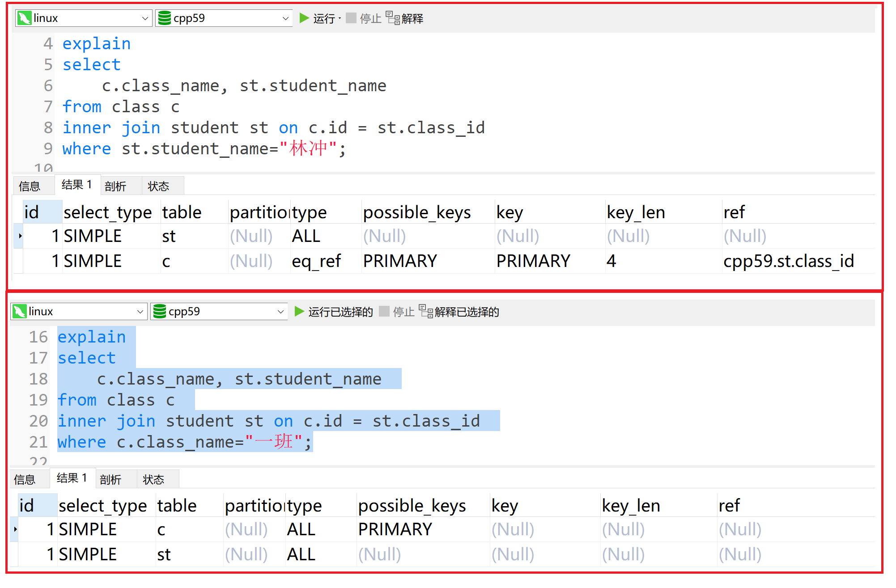

>**id不同, id值越大，优先级越高，越先被执行**
>
>```sql
>explain
>select * from student where class_id = (
>   select id from class where class_name = "一班"
>);
>
>-- -------------------------------------------
>explain
>select * from  class  where id = (
>   select class_id from student where student_name = "武松"
>);
>```
>
>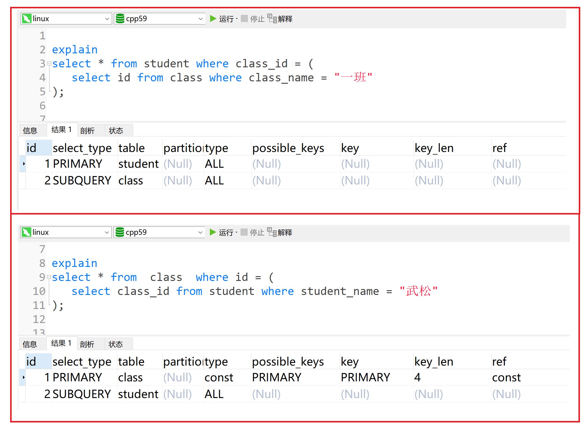

>**id既有相同又有不同，不同的id值，id值越大，优先级越高，越先被执行;  相同的id值，按照从上到下的顺序执行**
>
>```sql
>explain
>select * from student s
>inner join equip e on e.student_id = s.id
>where s.class_id = (
>   select id from class where class_name = "一班"
>);
>```
>
>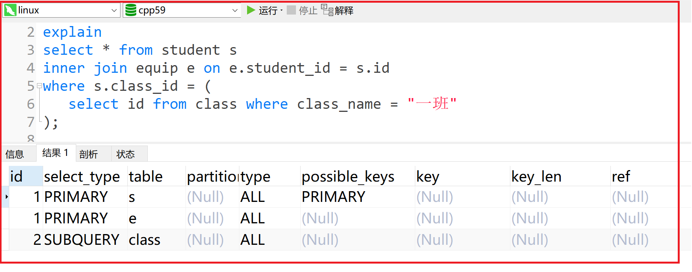

### 2.1.2 select_type

>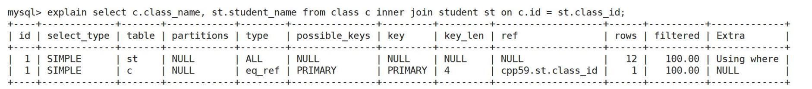
>
>select_type表示select的查询类型，主要用于区分各种复杂的查询，例如普通查询、联合查询、子查询等

>**select_type的常见类型:**
>
>| **类型**     | **描述**                                                |
>| ------------ | ------------------------------------------------------- |
>| SIMPLE       | 简单的查询   (查询中不包含子查询或者UNION)              |
>| PRIMARY      | 外层查询 (查询中若包含任何复杂的子部分)                 |
>| SUBQUERY     | 子查询                                                  |
>| DERIVED      | 派生表                                                  |
>| UNION        | 一般属于第二个SELECT,  出现在UNION之后，则被标记为UNION |
>| UNION RESULT | 从UNION表获取结果的SELECT                               |
>| ...          | ...                                                     |
>
>```sql
>explain
>select  e.* from student s
>inner join equip e on e.student_id = s.id
>where s.class_id = (
>   select id from class c where class_name = "一班"
>)
>union
>select  e2.* from student s2
>inner join equip e2 on e2.student_id = s2.id
>where s2.class_id = (
>   select id from class c2 where class_name = "二班"
>)
>```
>
>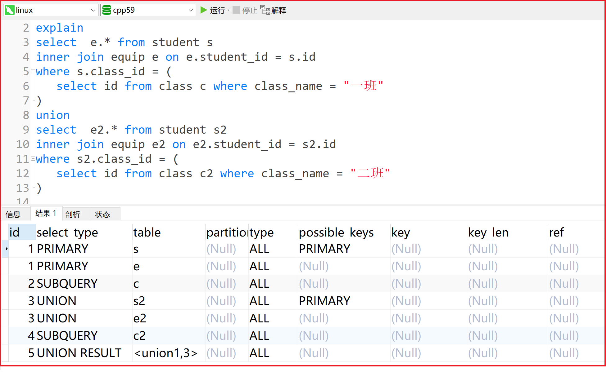

### 2.1.3  table

>
>
>table表示表名.

>```sql
>explain
>select  e.* from student s
>inner join equip e on e.student_id = s.id
>where s.class_id = (
>   select id from class c where class_name = "一班"
>)
>union
>select  e2.* from student s2
>inner join equip e2 on e2.student_id = s2.id
>where s2.class_id = (
>   select id from class c2 where class_name = "二班"
>)
>```
>
>

### 2.1.4 partitions

>
>
>partitions分区: 只对设置了分区的表有意义, 暂时忽略.

### 2.1.5 type

>
>
>type:  `type`字段的作用, 用以显示MySQL决定使用哪种方式来访问表. (eg: 访问索引? 全表扫描?...)

>对于type字段, 从性能的好坏划分, 我们可以分为:
>
>```sql
>-- system > const > eq_ref > ref > fulltext > ref_or_null > index_merge > unique_subquery > index_subquery > range > index > ALL 
>```
>
>| 常见字段   | 表示含义                                                   |
>| ---------- | ---------------------------------------------------------- |
>| **system** | 系统表，或者极少量数据，往往不需要进行磁盘IO               |
>| **const**  | 常量连接(常数级时间复杂度, 基本上是命中主键)               |
>| **eq_ref** | 多表关联查询时，主键索引或唯一索引作为关联条件进行等值扫描 |
>| **ref**    | 非主键或者非唯一索引等值扫描                               |
>| **range**  | 范围扫描                                                   |
>| **index**  | 全索引扫描 (比如修改表中数据, 导致所有索引结构变化)        |
>| **ALL**    | 全表扫描                                                   |
>| ...        | ...                                                        |
>
>```sql
>explain
>select * from  student st
>inner join class c on c.id = st.class_id
>where st.id>5; 
>
>explain
>select * from  student st where id =1
>
>-- student_name: 设置了非主键索引
>explain
>select * from  student st where student_name = "武松"
>
>-- student_name: 没有设置非主键索引
>explain
>select * from  student st where student_name = "武松"
>```
>
>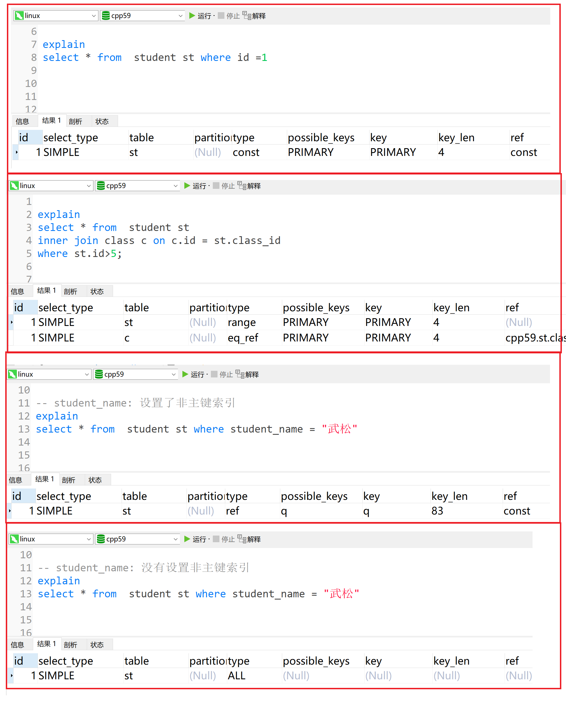

### 2.1.6 possible_keys

>
>
>possible_keys表示: 表示查询过程中有可能用到的索引( 这列数据的产生, 是SQL在优化器初步解析的时候生成，随着SQL的进一步优化有些索引可能后续优化过程发现并没有使用)

### 2.1.7 key

>
>
>key: SQL执行中实际使用到的索引，如果为 NULL ，则没有使用索引

### 2.1.8 key_len

>
>
>key_len: 这个使用到的索引,  占用的字节数(索引是int -> 4字节,  long->8字节,  float->4字节 ...   )

>需要注意的是: 变长字符串按照其最大宽度和占用字节计算
>
>```sql
>-- 以下图为例
>-- student_name列设置了非主键索引, 所以导致查询的时候,  根据student_name走了这个非主键索引
>-- 这个student_name列, 是varchar类型设置长度为 20
>-- 并且允许为null (需要注意的是, 凡是允许为null需要一个额外字节记录, 所以索引字段最好不要为null)
>-- 使用utf8mb4编码  (需要参考我们之前讲的变长和定长字符串问题)
>
>计算结果:
>      20*4  + 1(NULL) + 2(描述长度) = 83
>```
>
>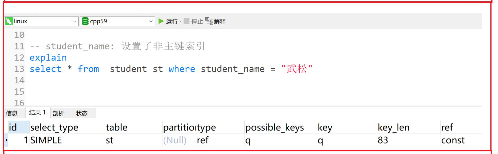

### 2.1.9 ref

>
>
>ref: 表示将哪个字段或常量和key列所使用的字段进行比较。

### 2.1.10 rows

>
>
>rows: 根据表统计信息及索引选用情况，大致估算出找到所需的记录所需要读取的行数

>```sql
>explain
>select * from  student st
>inner join class c on c.id = st.class_id
>where st.id>5; 
>```
>
>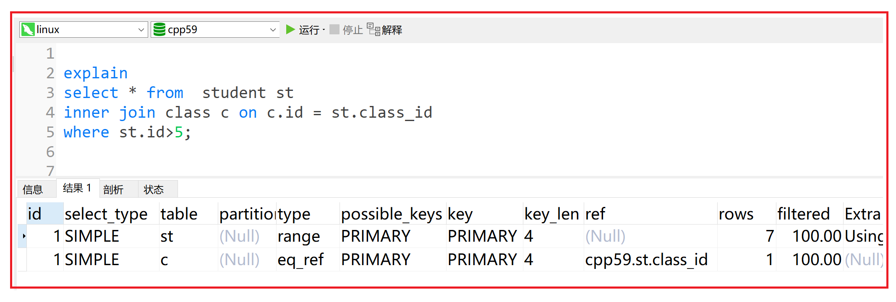

### 2.1.11 filtered

>
>
>filtered: 表示按表格条件过滤的表格行的估计百分比。预估有多少行会通过查询条件的过滤。
>
>(`rows`× `filtered`显示与下表连接的行数。例如，如果 `rows`为 1000， `filtered`为 50.00（50%），则要与下表连接的行数为 1000 × 50% = 500。)(一般它的值越大，表示索引过滤性越好；它的值越小，表示索引过滤性越差，甚至没有用到索引。)

>```sql
>explain
>select * from  student st
>inner join class c on c.id = st.class_id
>where st.id>5  and class_name = "三班"; 
>```
>
>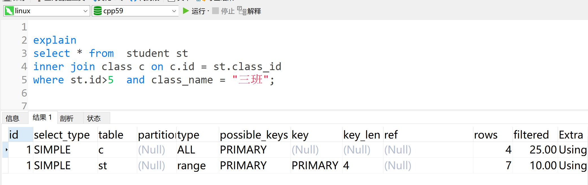

### 2.1.12 Extra

>
>
>Extra: 包含不适合在其他列中显示但十分重要的额外信息(附加信息) , 该列显示了MySQL在查询过程中的一些详细信息。

>| **值**           | **描述**                                                     |
>| ---------------- | ------------------------------------------------------------ |
>| Using filesort   | 说明mysql会对数据使用一个外部的索引排序，而不是按照表内的索引顺序进行读取, 也称为文件排序. |
>| Using temporary  | 使了用临时表保存中间结果,MySQL在对查询结果排序时使用临时表。 |
>| USING index      | 是否用了覆盖索引                                             |
>| Using where      | 表明使用了where过滤                                          |
>| Impossible where | where子句的值总是false，不能用来获取任何元组                 |
>| ...              | ...                                                          |
>
>```sql
>explain
>select * from student order by class_id;
>
>explain
>select *  from (
>		select count(*) as num from student group by class_id 
>) temp 
>where temp.num>3;
>
>-- student_name是非主键索引
>explain
>select id as num from student  where student_name = "武松";
>
>explain
>select id as num from student  where class_id = 2;
>```
>
>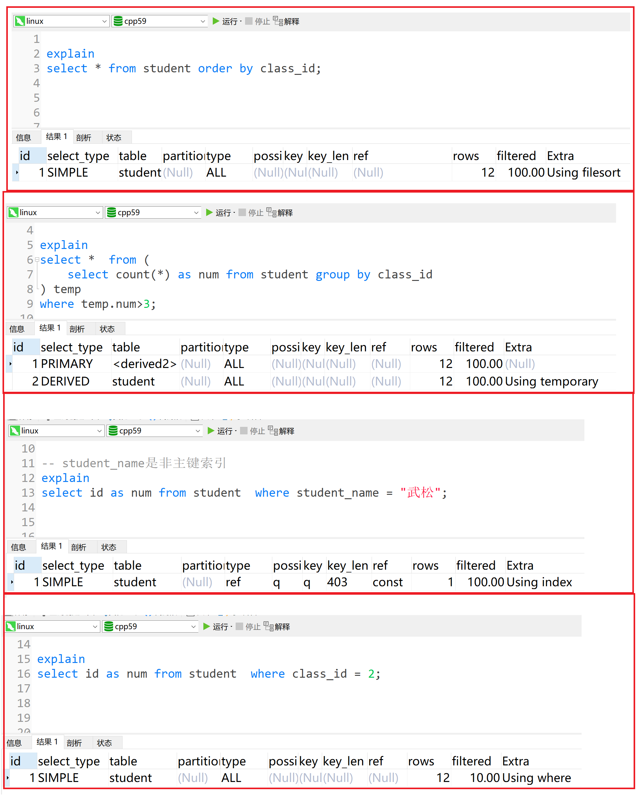