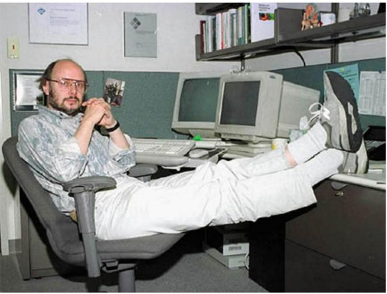
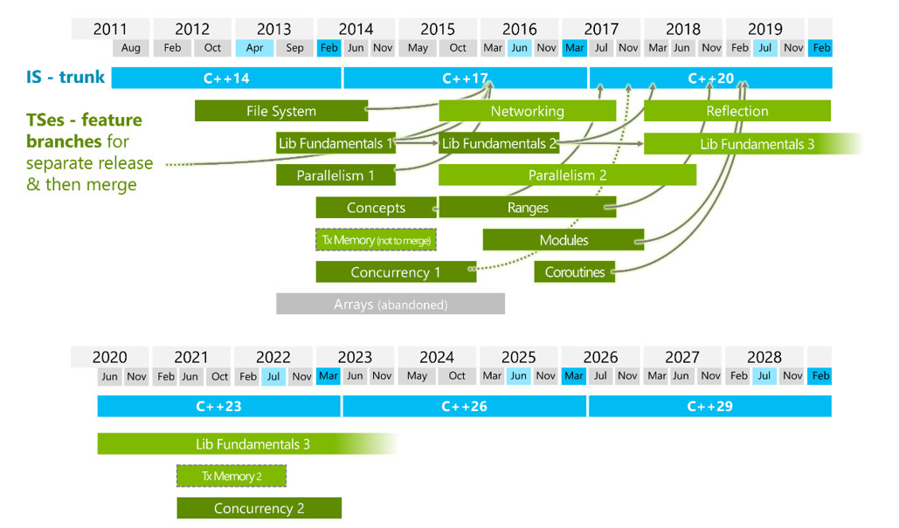
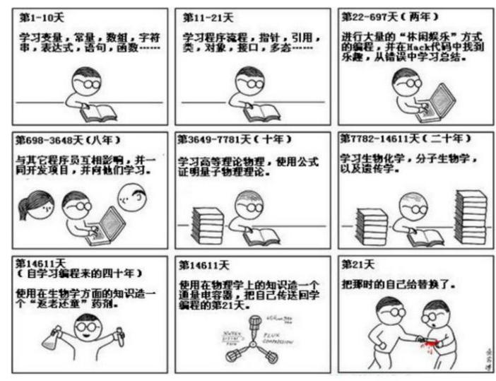
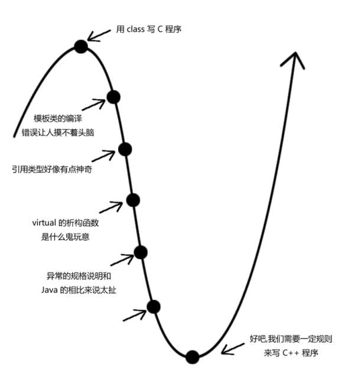

# 自我介绍

**海豹**     

- 学习        

​	大连理工大学  软件工程本科     2013-2017

​	南京大学         软件工程硕士     2018-2020

- 工作  

  瑞晟                              2020.07  -  2021.11

  浙江大学滨江研究院    2022.03  -  2023.02

  王道                              2023.03 至今

# 基本纪律要求

- 课上

​	请不要随意进出        

​	请不要玩手机、玩游戏

​	请不要睡觉        

- 课下

​	课间请不要玩游戏

​	课间尽量不要在教室睡觉      

​                         

- 自习

​	不在座位要在群里说一声  

# C++阶段课程介绍

C++基础部分

- C++与C —— 介绍C++基本语法，与C的写法做对比**（基础）**
- 类与对象 —— 面向对象思想的介绍，类的基本使用**（重点）**
- C++输入输出流 —— C++基本输入输出方式 **（基础）**
- 日志系统 —— log4cpp工具的使用（后续项目会用，对类与对象基础的综合考察）
- 运算符重载 —— C++特色语法，提供强大且灵活的特性 **（重点）**
- 继承 —— 不涉及多态的继承，面向对象的基本特征之一 （简单）
- 关联式容器 —— STL容器的使用 （很常用的标准库工具）
- 多态 —— 面向对象的基本特征之一，虚函数机制、虚拟继承、内存布局 **（重难点）**
- 模板 —— 模板的简单使用 （深入研究很难，本课程中能够进行简单使用，能够看懂基本的模板代码即可）
- 移动语义与资源管理 ——  学习C++对于右值的处理方式，学习智能指针的使用和注意事项**（常用且常考，重点）**

# C++编程范式

编程范式简单点来理解就是编码的思维方式

C语言是C++的子集，我们通常说C语言是**面向过程的编程范式**。面向过程是以程序的过程或步骤为中心。在这种范式中，问题被分解成一系列可解决的步骤或过程（通常是函数或子程序）。            

C++与C最大的一个区分，就是发展为**面向对象的编程范式**。面向对象以对象为中心，对象是包含数据和操作这些数据的函数的实体。所有的功能本质上都可视为对象之间进行消息传递。

比面向对象更抽象的是**泛型编程范式**，泛型编程是一种专注于对算法及其数据结构进行设计的编程方式，它使得这些算法即数据结构能够在不损失效率的前提下，运用到最为通用的环境中。 在C++基础阶段的最后我们会学习模板的一些基本用法，就是泛型编程范式的应用。

模板元编程，难度极高，在实现库的时候使用，甚至能创造一门新的语言。

函数式编程范式，将程序分成输入、中间函数以及输出三个模块，在C++中并不成熟。

# C++发展概述

## 三个阶段

要谈C++的发展史，就不得不谈一下C语言。 

C语言是**1972**年由美国贝尔实验室的D.M.Ritchie研制成功的。对于初学者来说，C语言并不友好，因为它是为计算机的专业人员而设计的，随着计算机的提升，软件复杂度跟需求功能的增多，而C语言作为面向过程的底层语言，要求在每一个细节都精确设计，因而用C来编写程序越来越困难，因而，面向对象的C升级版C++就诞生了。 

> C++语言发展大概可以分为三个阶段：
>
> 1. 第一阶段从1983年到1995年。这一阶段C++语言处于蓬勃发展的阶段，凭借着优于C语言的工程管理和接近C语言的效率，在工业界使用的开发语言中占据了相当大份额；
> 2. 第二阶段从1995年到2000年，这一阶段由于标准模板库(STL)和后来的Boost等程序库的出现，泛型程序设计在C++中占据了越来越多的比重性。当然同时由于Java、C#等语言的出现和硬件价格的大规模下降，C++受到了一定的冲击。在1998年，C++标准委员会推出了第一个C++标准；
>
> 3. 第三阶段从2000年至今，由于以Loki、MPL等程序库为代表的函数式编程和模板元编程的出现，C++出现了发展历史上又一个新的高峰，这些新技术的出现以及和原有技术的融合，使C++已经成为当今主流程序设计语言中最复杂的一员。

C++之父Bjarne Stroustrup于1983年发明了C++，当时的名称叫做**C with class**，这是把它当作一种C语言的有效扩充。由于当时C语言在编程界居于老大的地位，要想发展一种新的语言，最强大的竞争对手就是C语言，所以当时有两个问题最受关注 —— C++要在运行时间、代码紧凑性和数据紧凑性方面能够与C语言相媲美，但是还要尽量避免在语言应用领域的限制。

在这种情况下，一个很自然的想法就是让C++从C语言继承过来，Bjarne博士很有先见之明，他为了避免受到C语言的局限性，参考了很多的语言，例如：从Simula继承了类的概念，从Algol68继承了运算符重载、引用以及在任何地方声明变量的能力，从BCPL获得了//注释，从Ada得到了模板、命名空间，从Ada、Clu和ML取来了异常。

## C++标准的推出

由ISO/IEC JTC1/SC22/WG21进行。已经出版的标准如下：

[Current Status : Standard C++ (isocpp.org)](https://isocpp.org/std/status)

> **C++11**是自1998年C++首次被ISO标准化以来变化最大的一个新标准，它主要在以下两个方面对C++进行了革命性的改进和增强：
>
> 一方面，C++11让C++更加易于使用。C++的能力固然强大，但是它的复杂性也阻碍了C++的进一步发展。为了改变这一现状，C++11从其他主流的编程语言（Java）中借鉴吸收了很多旨在改善其**易用性**的语法特性。例如：
>
> - C++11提供了auto这种特殊的数据类型，使用它作为变量的数据类型，编译器可以根据变量的初始值自动推断其合理的数据类型，省去了程序员确定复杂变量的数据类型的繁琐；
>
> - C++11从Java中借鉴了增强for循环语句，让针对某个容器的循环遍历更加简单；
>

> 一方面，C++11让C++**性能更高**。相对于其他主流的高级编程语言而言，接近于低级语言的高性能表现，应该是C++最大的优势了。例如：
>
> - C++11提供了对右值引用、移动语义的完全支持，解决了从函数返回一个较大对象的问题；
>
> - C++11利用新的语法特性对标准库进行了大规模的改写，极大地提高了标准库的性能表现；
>
> 为了适应当今越来越普及的并行计算，充分利用主流的多核CPU的计算资源，C++11在标准库中对并行计算也提供了全面的支持。
>

虽然C++的标准已经更新到23了，但由于企业中有着大量的历史遗留项目的 ，所以还是要了解C++98 的标准的相关特性。所以在我们学习的过程中，还是从C++98出发，逐步在学习的过程中加入C++11的内容(语法糖)。

## C++擅长的领域

> - 游戏开发：
>
> ​    C++的高性能特性使其非常适合处理图形渲染、实时物理计算和其他游戏开发中的高要求任务。如Unreal、unity3D等许多游戏引擎都是用C++编写的。
>
> 
>
> - 金融科技：
>
> ​	金融行业，尤其是高频交易系统，需要极高的数据处理速度和精确的时间控制。C++提供了这些系统所需的性能和灵活性，使其成为开发股票交易软件、风险管理平台和其他金融工具的热门选择。
>
> 
>
> - 实时系统：
>
> ​	对于要求严格的实时系统，如航空航天和军事设备，C++提供了必要的性能和资源控制。它允许开发者编写响应迅速、可靠性高的应用程序。
>
> 
>
> - 计算机视觉：
>
> ​	C++在计算机视觉领域内广泛使用，比如著名的开源计算机视觉库Opencv主要的接口和实现都是基于C++.
>
> 
>
> - 仿真和建模：
>
> ​	C++常用于工程和科学领域的仿真软件开发，包括汽车、航空航天、电气工程和环境模拟。这些应用程序通常需要处理复杂的数学模型和大量的数据计算。
>
> 
>
> - 网络和通信：
>
> ​	C++用于开发高性能的网络应用程序，包括服务器、网络协议和通信系统。
>
> 
>
> - 音视频、嵌入式、腾讯 ...
>

## C++学习方法建议

1. 21天养成一个好习惯

2. 感到痛苦的时候请坚持，把困难逐步解决，在习惯了C++的语法规则后会觉得用起来顺手的。

C++学习信心曲线   

3. “囫囵吞枣”、先学主干

课程本身提取出了核心主干知识，并将实际工作常用到的知识点和面试常考点作出特别说明。知识内容上遵循循序渐进的原则，以前面所学为基础去攻克后续更难的内容。敲代码为主，不要抄作业，实际演练永远是学习C++最好的方式。

在学习中有难以理解的知识点，可以翻一翻《C++ Primer》，此书作为字典使用。但《C++ primer》上也会有一些错误，一部分原因是翻译者的问题，一部分原因在于英语和汉语的文法差异。如果发现课上的说法与本书上的内容有冲突，可与我讨论。

《C++程序设计语言》也是一本非常权威的好书，它由C++之父所编纂，有争议的说法内容可以以本书为准。

另外，为了在学习过程中养成良好的编程习惯，可以参考《Google C++编程规范》编写代码。

另附上C++参考文档 cppreference-zh-20211231.chm ，之后我们学习标准库所提供的工具时，可以参考本文档查看具体使用方式。

