# 第一章 C++与C

> 本章主要讲解C++相较于C一些独有的比较重要的知识点。
>
> C++源文件后缀名.cc/.cpp，头文件后缀名.hh/.hpp
>
> 安装g++命令：<font color=red>**sudo apt install g++**</font>
>
> <span style=color:red;background:yellow>**编译命令 g++ 文件名.cc/.cpp [-o name]**</span>
>
> 
>
> 可以按如下方式设置代码预设片段，减少一点重复性的工作
>
> 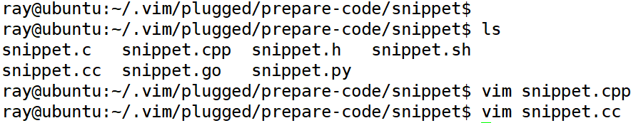


首先从我们最常见到C++的hello,world代码入手，来认识一下C++语言

```C++
#include <iostream>
using namespace std;

int main(int argc, char * argv[]){
 	cout << "hello,world" << endl;
	return 0;
}
```


可能会产生这样的一些疑问

（1）iostream是C++标准库头文件，为什么没有后缀？

​	—— 模板阶段再作讲解

（2）using namespace std是什么含义？

​	—— 命名空间的使用

（3） cout << "hello,world" << endl; 实现了输出hello,world的功能，如何理解这行代码？

​	—— C++输出流的使用

## 命名空间

###  为什么要使用命名空间

一个大型的工程往往是由若干个人独立完成的，不同的人分别完成不同的部分，最后再组合成一个完整的程序。由于各个头文件是由不同的人设计的，有可能在不同的头文件中用了相同的名字来命名所定义的类或函数，这样在程序中就会出现名字冲突。

名字冲突就是在同一个作用域中有两个或多个同名的实体，C语言中避免名字冲突，只能进行起名约定。

```C
int hw_cpp_tom_num = 100;
int wd_cpp_bob_num = 200;
```


C++为了解决命名冲突 ，引入了**命名空间**，所谓命名空间就是一个可以由用户自己定义的作用域，在不同的作用域中可以定义相同名字的变量，互不干扰，系统能够区分它们。

###  什么是命名空间

命名空间又称为名字空间，是程序员命名的内存区域，程序员根据需要指定一些有名字的空间域，把一些全局实体分别存放到各个命名空间中，从而与其他全局实体分隔开。通俗的说，每个名字空间都是一个名字空间域，存放在名字空间域中的全局实体只在本空间域内有效。名字空间对全局实体加以域的限制，从而合理的解决命名冲突。

C++中定义命名空间的基本格式如下：

```C++
namespace wd
{
int val1 = 0;
char val2;
}// end of namespace wd
```

在声明一个命名空间时，大括号内不仅可以存放变量，还可以存放以下类型：

变量、常量、函数、结构体、引用、类、对象、模板、命名空间等，它们都称为**实体**

那么命名空间中的实体如何使用呢？

### 命名空间的使用方式

命名空间一共有三种使用方式，分别是using编译指令、作用域限定符、using声明机制。

#### 作用域限定符

> 每次要使用某个命名空间中的实体时，都直接加上<span style=color:red;background:yellow>**作用域限定符::**</span>
>
> 例如：
>
> ```C++
> namespace wd
> {
> int number = 10;
> void display()
> {
> 	//cout,endl都是std空间中的实体，所以都加上'std::'命名空间
> 	std::cout << "wd::display()" << std::endl;
> }
> }//end of namespace wd
> 
> void test0()
> {
> 	std::cout << "wd::number = " << wd::number << endl;
> 	wd::display();
> }
> ```
>

> 以helloworld程序为例，可能在很多地方的范例长这个样子，也是没有问题的
>
> ``` c++
>#include <iostream>
> 
> int main(int argc, char * argv[]){
>     	std::cout << "hello,world" << std::endl;
> 		return 0;
> }
> ```
> 

<span style=color:red;background:yellow>**使用作用域限定的方式访问命名空间中的实体**</span>

**好处：**准确，只要命名空间中确实有这个实体，就能够准确调用（访问）

**坏处：**繁琐


#### using编译指令

> 如helloworld程序中的写法，其中std代表的是标准命名空间。
>
> cout和endl都是std中的实体，使用了using编译指令后，这两个实体就可以直接使用了。
>
> ```C++
> #include <iostream>
> using namespace std; //using编译指令
> 
> int main(int argc, char * argv[]){
>     cout << "hello,world" << endl;
>     return 0;
> }
> ```
>


> <span style=color:red;background:yellow>**注意1：**</span>**using编译指令尽量写在局部作用域**
>
> 
>
> ``` c++
> namespace cpp{
> int number = 100;
> }//end of namespace cpp
> 
> namespace wd
> {
> int number = 10;
> void display()
> {
> 	cout << "wd::display()" << endl;
> }
> }//end of namespace wd
> 
> using namespace wd;
> void test0()
> {
> 	cout << number << endl; 
> }
> 
> using namespace cpp;
> void test1()
> {
> 	cout << number << endl; //error，有冲突
> }
> ```
>
> 在test1函数的作用域中，直接使用number这个实体名称去访问命名空间中的实体会发生**冲突**。编译器不知道应该访问wd::number还是cpp::number,实际上在全局作用域多次使用using编译指令的语句，有极大概率存在这一隐患，称之为<font color=red>**命名空间的污染**</font>。
>
> 
>
> <span style=color:red;background:yellow>**建议：**</span>
>
> **将using编译指令写在局部作用域**，这样using编译指令的效果也会在其作用域结束时结束。
>
> 当然即使是局部作用域，如果需要在同一个作用域下使用两个命名空间中同名的实体，这种方法仍不可行，可以采用第一种方式加上命名空间的作用域限定。
>
> 
>
> ``` c++
> namespace cpp{
> int number = 100;
> }//end of namespace cpp
> 
> namespace wd
> {
> int number = 10;
> }//end of namespace wd
> 
> void test0()
> {
>     using namespace wd;
>     using namespace cpp;
> 	cout << number << endl; //error，仍然有冲突
> }
> ```
>
> 


> <span style=color:red;background:yellow>**注意2：**</span>这种方式使用命名空间中的实体时，要**注意避免命名空间中实体与全局位置实体同名**。
>
> 
>
> ``` c++
> int number = 100;
> 
> namespace wd
> {
> int number = 10;
> void display()
> {
> 	cout << "wd::display()" << endl;
> }
> }//end of namespace wd
> 
> 
> void test0()
> {
>     using namespace wd;
> 	cout << number << endl; //error,有冲突
> }
> ```


> <span style=color:red;background:yellow>**注意3：**</span> 在不清楚命名空间中实体的具体情况时，尽量不使用using编译指令
>
> 
>
> 如果一个名称空间中有多个实体，使用using编译指令，就会把该空间中的所有实体一次性引入到程序之中。
>
> 对于初学者来说，如果对一个命名空间中的实体并不熟悉时，直接使用这种方式，有可能还是会造成名字冲突的问题，而且出现错误之后，还不好查找错误的原因
>
> 
>
> ```C++
> #include <iostream>
> using namespace std;
> 
> //如果不知道std中有cout这个实体，
> //可能会去定义一个cout函数
> double cout()
> {
> 	return 1.1;
> }
> 
> int main(void)
> {
> 	cout();
> 	return 0;
> }
> ```
>

<span style=color:red;background:yellow>**使用using编译指令后访问命名空间中的实体**</span>

**好处：**使用方式简洁

**坏处：**容易引发命名空间的污染，造成访问冲突


#### using声明机制

<span style=color:red;background:yellow>**推荐使用using声明机制**</span> —— 需要什么就声明什么

> using声明机制的作用域是从using语句开始，到using所在的作用域结束。
>
> 一般的，对于自定义命名空间中的实体，建议将using声明语句写在局部作用域中。此时即使命名空间中实体与全局位置实体重名，在局部位置也遵循“就近原则”形成屏蔽
>
> 
>
> ```C++
> #include <iostream>
> using std::cout;
> using std::endl;
> 
> int number = 100;
> 
> namespace wd
> {
> int number = 10;
> void display()
> {
> 	cout << "wd::display()" << endl;
> }
> }//end of namespace wd
> 
> 
> int main(void)
> {
> 	using wd::number;
> 	using wd::display;//只写函数名
> 	cout << "wd::number = " << number << endl;   //ok，访问到wd::number
> 	display();
> 	return 0；
> }
> ```
>

> <span style=color:red;background:yellow>**注意**</span>
>
> 在同一作用域内，用using声明不同的命名空间中的同名实体，仍会发生冲突。
>
> 
>
> ``` c++
> namespace wd
> {
> int number = 10;
> void display()
> {
> 	cout << "wd::display()" << endl;
> }
> }//end of namespace wd
> 
> namespace wd2
> {
> void display()
> {
> 	cout << "wd2::display()" << endl;
> }
> }//end of namespace wd2
> 
> void test0(){
> 	using wd::display;
> 	using wd2::display; 
> 	display(); //冲突
>  	wd::display();
>  	wd2::display();
> }
> ```
>
> 
>
> **using声明机制的特点是：需要哪个实体的时候就引入到程序中，不需要的实体就不引入，尽可能减小犯错误的概率。**


###  命名空间的嵌套使用

类似于文件夹下还可以建立文件夹，命名空间中还可以定义命名空间。那么内层命名空间中的实体如何访问呢？


``` c++
namespace wd
{
int num = 100;

void func(){
    cout << "func" << endl;
}

namespace cpp
{
int num = 200;

void func(){
    cout << "cpp::func" << endl;
}
}//end of namespace cpp

}//end of namespace wd

//方式一，使用作用域限定精确访问实体
void test0(){
    cout << wd::cpp::num << endl;
    wd::cpp::func();
}

//方式二，using编译指令一次性引入cpp的实体
void test1(){
    using namespace wd::cpp;
    cout << num << endl;
    func();
}

//方式三，using声明语句
void test2(){
    using wd::cpp::num;
    using wd::cpp::func;
    cout << num << endl;
    func();
}
```


### 匿名命名空间（了解）

> 命名空间还可以不定义名字，不定义名字的命名空间称为匿名命名空间（简称匿名空间）。
>
> 通常，如果我们希望一部分实体只在本文件中起作用，那么可以将它们定义在匿名空间中。
>
> 其定义方式如下：
>
> ```C++
> namespace {
> //...
> }//end of anonymous namespace
> ```
>
> 
>
> 使用匿名空间中实体时，可以直接使用，也可以加上作用域限定符（没有空间名）
>
> ```` c++
> namespace {
> int val = 10;
> void func(){
>  cout << "func()" << endl;
> }
> }//end of anonymous namespace
> 
> //以下用法均ok
> void test0(){
>  cout << val << endl;
>  cout << ::val << endl;
>  func();
>  ::func();
> }
> ````
>
> 


<span style=color:red;background:yellow>**注意：**</span>

如果匿名空间中定义了和全局位置中同名的实体，直接访问会有冲突。

**如果使用::作用域限定符，也无法访问到匿名空间中重名的实体，只能访问到全局的实体。**

``` c++
int val = 100;
void func(){
    cout << "g_func()" << endl;
}

namespace {
int val = 10;
void func(){
    cout << "func()" << endl;
}
}//end of anonymous namespace

void test0(){
    cout << val << endl; //冲突
    cout << ::val << endl; //全局的val
    func(); //冲突
    ::func(); //全局的func
}
```

> 匿名空间注意事项：
>
> （1）匿名空间不要定义与全局空间中同名的实体；
>
> （2）匿名空间中的实体不能跨模块调用。

<font color=red>**概念：匿名空间和有名空间（具名空间）统称为命名空间（名称空间、名字空间）。**</font>

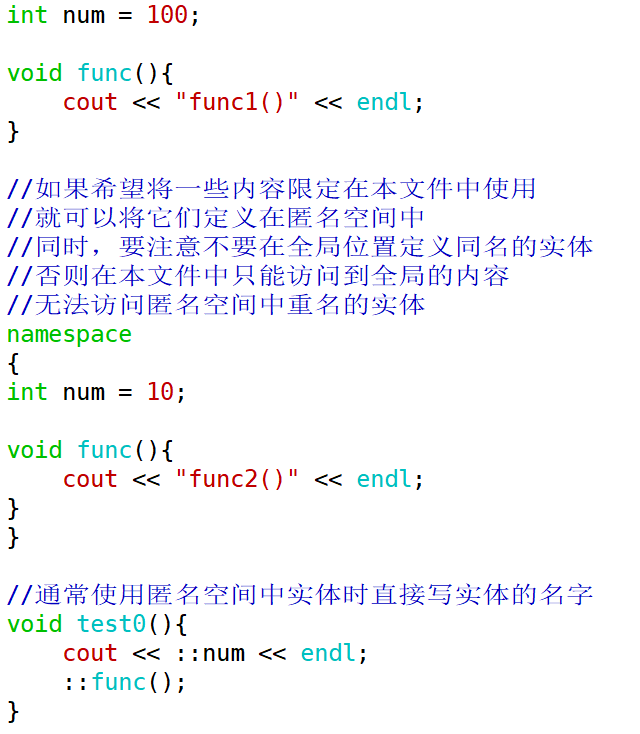


### 跨模块调用问题

一个*.c/*.cc/*.cpp的文件可以称为一个模块。

**补充：vim多窗口操作技巧**

``` c++
:e 文件名（带路径） 若文件存在就打开，不存在就创建
:bp 打开上一个窗口
:bn 打开下一个窗口
:bd 关闭当前窗口
```


> （1）全局变量和函数是可以跨模块调用的
>
> ``` c++
> //externA.cc
> int num = 100;
> 
> void print(){
> cout << "print()" << endl;
> }
> 
> //////////////////////////////
> //externB.cc
> extern int num;//外部引入声明
> extern void print();
> void test0(){
> cout << num << endl;
> print();
> }
> ```
>
> 对externA.cc和externB.cc联合编译，实现跨模块调用


> （2）有名命名空间中的实体可以跨模块调用
>
> ``` c++
> //externA.cc
> namespace wd
> {
> int val = 300;
> void display(){
> cout << "wd::display()" << endl;
> }
> }//end of namespace wd
> 
> //////////////////////////////
> //externB.cc
> namespace wd
> {
> extern int val;
> extern void display();
> }
> 
> void test0(){
> cout << wd::val << endl;
> wd::display();
> }
> ```
>
> 命名空间中的实体跨模块调用时，要在新的源文件中再次定义同名的命名空间，在其中通过extern引入实体。
>
> 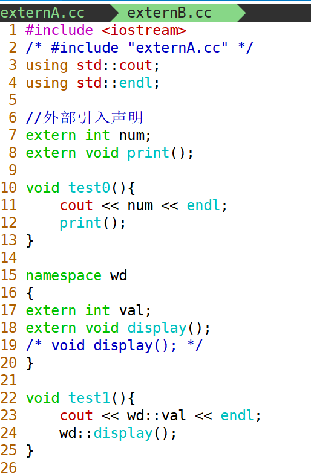
>
> 访问命名空间中的实体时，之前所学的三种方式都可以，但要注意避免冲突。
>
> <span style=color:red;background:yellow>**进行联合编译时，这两次定义被认为是同一个命名空间。**</span>


><font color=red>**易错点：**</font>
>
>上面的例子中如果在命名空间中定义与全局位置同名的实体，并且同时在externB.cc中做外部引入
>
>
>
>```` c++
>//externA.cc
>int val = 100;  //全局位置定义的变量、函数与命名空间中的实体同名
>void display(){
>	cout << "display()" << endl;
>}
>
>namespace wd
>{
>int val = 300;
>void display(){
>	cout << "wd::display()" << endl;
>}
>}//end of namespace wd
>
>//////////////////////////////
>//externB.cc
>extern int val;
>extern void display();
>
>namespace wd
>{
>extern int val;
>extern void display();
>}
>
>//访问到全局的实体
>void test0(){
>	cout << val << endl;
>	display();
>}
>
>//访问到命名空间中的实体
>void test1(){
>	cout << wd::val << endl;
>	wd::display();
>}
>
>void test2(){
>    	using namespace wd;
>	cout << val << endl; //冲突
>	display();  //冲突
>}
>
>using wd::val;//声明冲突
>using wd::display;//声明冲突
>void test3(){
>	//...
>}
>
>void test4(){
>	using wd::val;
>	using wd::display;
>	cout << val << endl; //ok，在本作用域中对全局的实体起到了屏蔽的效果
>	display();  //ok
>}
>````
>
><span style=color:red;background:yellow>**使用规则：如果需要跨模块调用命名空间中的实体，要尽量避免它们与全局位置的实体重名，在使用时尽量采取作用域限定的方式。**</span>


> （3）静态变量和函数只能在本模块内部使用
>
> （4）匿名空间的实体只能在本模块内部使用。
>
> 匿名空间中的实体只能在本文件的作用域内有效，它的作用域是从匿名命名空间声明开始到本文件结束。
>
> 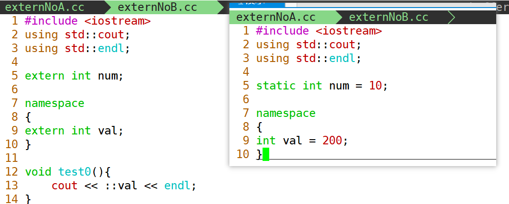


<font color=red>**extern与include的对比：**</font>

extern外部引入的方式适合管理较小的代码组织，用什么就引入什么，但是如果跨模块调用的关系不清晰，容易出错；

include头文件的方式在代码组织上更清晰，但是会一次引入全部内容，相较而言效率比较低。


### 使用命名空间的规则

> 以前我们知道，函数可以声明多次，但是只能定义一次；
>
> 而命名空间可以多次定义，却不能进行单纯的“声明”。
>
> 
>
> ``` c++
> namespace wd
> {
> int num = 100;
> void print(){
> 	cout << "print()" << endl;
> }
> }//end of namespace wd
> 
> namespace wd
> {
> int num2 = 300;
> }//end of namespace wd
> ```


> 在同一个源文件中可以多次定义同名的命名空间，被认为是同一个命名空间，所以不能在其中定义相同的实体。
>
> 
>
> ```` c++
> namespace wd
> {
> int num = 100;
> void print(){
>  	cout << "print()" << endl;
> }
> }//end of namespace wd
> 
> namespace wd
> {
> int num2 = 300;
> int num = 100;//error
> }//end of namespace wd
> 
> void test0(){
>  	cout << wd::num << endl;
>  	cout << wd::num2 << endl;
> }
> ````
>
> 


> 在命名空间中可以声明实体、定义实体，但是不能使用实体。**命名空间中的实体一定在命名空间之外使用**，可以理解为命名空间只是用来存放实体。
>
> 
>
> ```` c++
> namespace wd
> {
>  void func();
>  void func2(){
>    	cout << "func2()" << endl;
>  }
>  func2();//error，不可在此调用函数
> 
>  int num = 10;
>  num = 100;//error，不可在此访问变量
> }
> 
> void test1(){
>  	wd::func2(); 
>  	wd::num = 100;
>  	cout << wd::num << endl;
> }
> ````


### 总结

**命名空间的作用：**

1. 避免命名冲突：命名空间提供了一种将全局作用域划分成更小的作用域的机制，用于避免不同的代码中可能发生的命名冲突问题；

2. 组织代码：将相关的实体放到同一个命名空间；

3. 版本控制：不同版本的代码放到不同的命名空间中；

   总之，需要用到代码分隔的情况就可以考虑使用命名空间。

还有一个隐藏的好处：声明主权。


> 命名空间使用建议：
>
> 1. 提倡在命名空间中定义变量，而不是直接定义全局变量或者静态全局变量。
>2. **对于using 声明语句，建议将其作用域设置为局部而不是全局（*）。**
> 3. 不要在头文件中使用using编译指令，很可能造成命名空间的污染，在包含该头文件的源文件中访问命名空间定义的实体时，容易出现二义性。
>5. 包含头文件的顺序可能会影响程序的行为，如果一定要使用using编译指令，建议放在所有#include预编译指令后。

规范补充：include多个头文件，首先放自定义的头文件，再放C的头文件，再放C++的头文件，最后放第三方库的头文件。

## const关键字

###  修饰内置类型*

const修饰的变量称为const常量，之后不能修改其值。(本质还是变量，使用时也是当成变量使用，只是被赋予只读属性)

整型、浮点型数据都可以修饰，它们被称为const常量。<span style=color:red;background:yellow>**const常量在定义时必须初始化。**</span>

```C++
const int number1 = 10;
int const number2 = 20;


const int val;//error 常量必须要进行初始化
```


除了这种方式可以创建常量外，还可以使用宏定义的方式创建常量

```C++
#define NUMBER 1024
```


> 由此引出一个**面试常考题**：
>
> <span style=color:red;background:yellow>**const常量和宏定义常量的区别**</span>
>
> 1. <font color=red>**发生的时机不同**</font>：C语言中的宏定义发生时机在预处理时，做字符串的替换；
>
>    const常量是在编译时（const常量本质还是一个变量，只是用const关键字限定之后，赋予只读属性，使用时依然是以变量的形式去使用）
>
> 2. <font color=red>**类型和安全检查不同**</font>：宏定义没有类型，不做任何类型检查；**const常量有具体的类型**，在编译期会执行类型检查。
>
>    在使用中，应尽量以const替换宏定义常量，可以减小犯错误的概率。

###  修饰指针类型*

以int指针为例，用const修饰有三种形式：

`const int * p`      `int const * p1`     ` int * const p2`


> 可能有些资料上将其归类为指针常量和常量指针。我们采取C++之父的说法，参考《C++程序设计语言》给出定义
>
> ```C++
> int number1 = 10;
> int number2 = 20;
> 
> const int * p1 = &number1;//指向常量的指针
> *p1 = 100;//error 通过p1指针无法修改其所指内容的值
> p1 = &numbers;//ok 可以改变p1指针的指向
> ```
>
> 例子中p1称为指向常量的指针（pointer to const），尽管number1本身并不是一个int常量，但定义指针p1的方式决定了无法通过p1修改其指向的值。但值得注意的是，修改p1的指向是允许的。
>

> <span style=color:red;background:yellow>**补充：**</span>如果有一个const常量，那么普通的指针也无法指向这个常量（记录这个常量的地址值），只有指向常量的指针才可以。
>
> ```` c++
> const int x = 20;
> int * p = &x; //error
> const int * cp = &x; //ok
> ````
> 

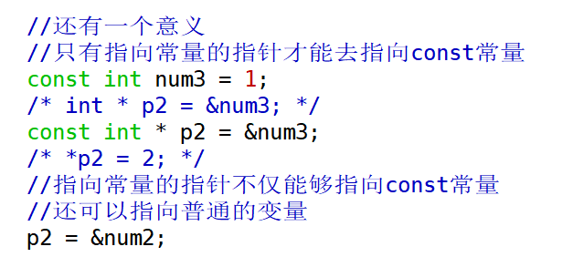


> 指向常量的指针还有第二种写法，各种特点同上，一般较少采用
>
> 
> 
> ``` c++
> int const * p2 = &number1; //常量指针的第二种写法
> ```
> 
> **总结：const在*左边，即为指向常量的指针，不能通过指针改变其指向的值，但是可以改变这个指针的指向。**


> 另一种方式定义的指针称为常量指针，从右往左读，先const后*，即常量指针（const pointer）
>
> ``` c++
> int * const p3 = &number1;//常量指针
> *p3 = 100;//ok 通过p3指针可以修改其所指内容的值
> p3 = &number2;//error 不可以改变p1指针的指向
> ```
>
> 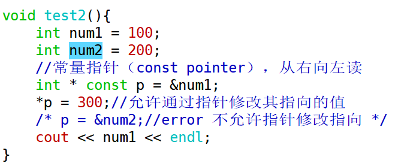
>
> **总结：const在*右边，即为常量指针，不能改变这个指针的指向，但是可以通过指针改变其指向的值。**

> 特殊：双重const限定的指针
>
> ``` c++
> const int * const p4 = &number1;//指向和指向的值皆不能进行修改
> ```


与这组概念相似的，再补充两组对比，也应该理解其含义，尝试写代码，分辨一下：

> 数组指针/指针数组
>
> 


> 函数指针/指针函数
>
> 


## new/delete表达式

### C/C++申请、释放堆空间的方式对比

**C语言中使用malloc/free函数，C++使用new/delete表达式**

new语句中可以不加参数，初始化为各类型默认值；也可加参数，参数代表要初始化的值

```C++
int * p = (int*)malloc(sizeof(int));
*p = 10;
free(p);

int * p1 = new int();//初始化为该类型的默认值
cout << *p1 << endl;

int * p2 = new int(1);
cout << *p2 << endl;
```

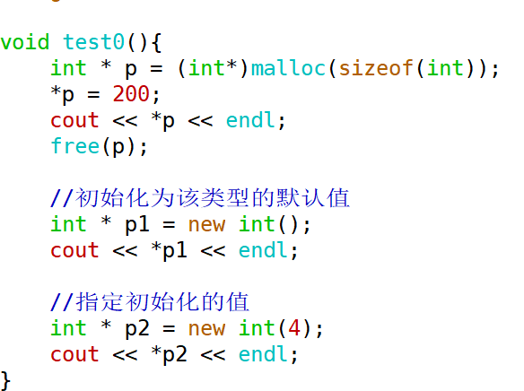


### valgrind工具集*

valgrind是一种开源工具集，它提供了一系列用于调试和分析程序的工具。其中最为常用和强大的工具就是memcheck。它是valgrind中的一个内存错误检查器，它能够对C/C++程序进行内存泄漏检测、非法内存访问检测等工作。

- <font color=red>**sudo apt install valgrind**</font>

安装完成后即可通过memcheck工具查看内存泄漏情况，编译后输入如下指令

```C++
valgrind --tool=memcheck ./a.out
```

如果想要更详细的泄漏情况，如造成泄漏的代码定位，编译时加上-g

```C++
valgrind --tool=memcheck --leak-check=full ./a.out
```

但是这么长的指令使用起来不方便，每查一次就得输入一次，可以设置一下。


- 在home目录下编辑.bashrc文件，改别名

  ```C++
  alias memcheck='valgrind --tool=memcheck --leak-check=full --show-reachable=yes'
  ```

- 重新加载 source .bashrc

- 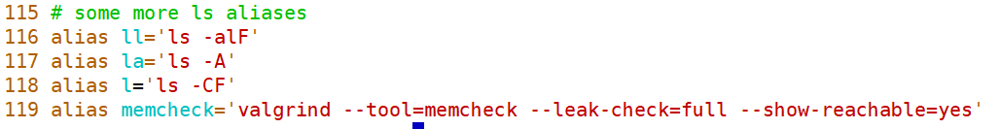

改写之后，就可以直接使用memcheck指令查看内存泄漏情况     ——  memcheck ./a.out

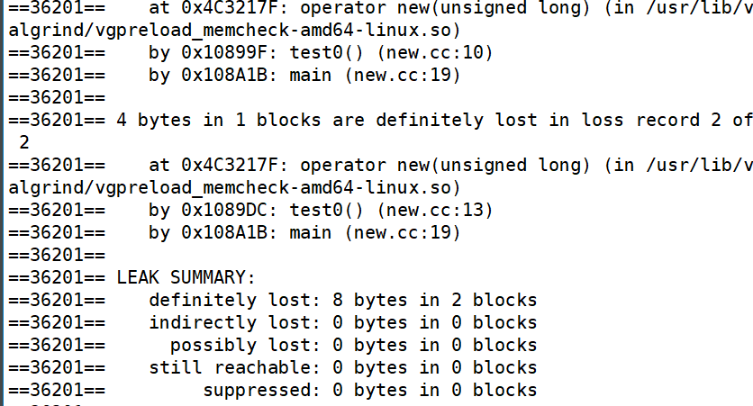

（1）绝对泄漏了；（2）间接泄漏了；（3）可能泄漏了，基本不会出现；（4）没有被回收，但是不确定要不要回收；（5）被编译器自动回收了，不用管


如上发生了两处泄漏，一共泄漏了8个字节，此时需要对new表达式申请的空间进行回收

``` c++
int * p1 = new int();
cout << *p1 << endl;
delete p1;

int * p2 = new int(4);
cout << *p2 << endl;
delete p2;
```


> 通过new表达式的使用，引申出**常考面试题**
>
> <span style=color:red;background:yellow>**malloc/free 和 new/delete 的区别**</span>
>
> 1. malloc/free是库函数；new/delete是表达式，后两者使用时不是函数的写法；
> 2. new表达式的返回值是相应类型的指针，malloc返回值是void*；
> 3. malloc申请的空间不会进行初始化，获取到的空间是有脏数据的，但new表达式申请空间时可以直接初始化；
> 4. malloc的参数是字节数，new表达式不需要传递字节数，会根据相应类型自动获取空间大小。


###  new表达式申请数组空间

new表达式还可以申请数组空间 

```C++
int * p3 = new int[10]();
for(int idx = 0; idx < 10; ++idx)
{
	p3[idx] = idx;
}

for(int idx = 0; idx < 10; ++idx){
    cout << p3[idx] << endl;
}

delete [] p3;
```


还可采用大括号的形式

``` c++
int * p4 = new int[3]{1,2,3};
for(int idx = 0; idx < 3; ++idx){
    cout << p4[idx] << endl;
}
delete [] p4;
```

**使用new语句申请数组空间需要使用delete [] p的形式回收堆空间**


> 请尝试用new表达式申请堆空间存放字符串。
>
> 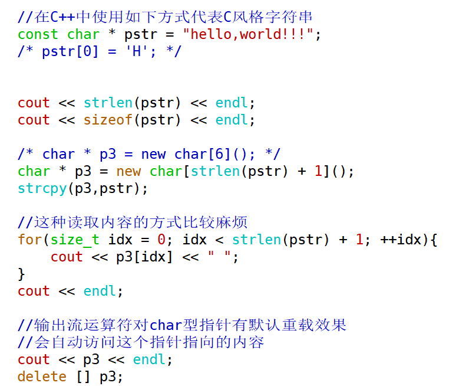


### 回收空间时的注意事项 

（1）三组申请空间和回收空间的匹配组合

```
malloc            free
    
new               delete
    
new int[5]()      delete[]
```

如果没有匹配，memcheck会报出错误匹配的信息，实际开发中有可能回收掉了预期外的数据。


（2）安全回收

 delete只是回收了指针指向的空间，但这个指针变量依然还在，指向了不确定的内容（野指针），容易造成错误。所以需要进行安全回收，将这个指针设为空指针。C++11之后使用<span style=color:red;background:yellow>**nullptr**</span>表示空指针。

``` c++
    int * p1 = new int();//初始化为该类型的默认值
    cout << *p1 << endl;
    delete p1;
    p1 = nullptr;//安全回收
```


## 引用（最重点）

### 引用的概念

在C++中，在逻辑层面上（在使用时），<span style=color:red;background:yellow>**引用是一个已定义变量的别名**</span>。

其语法是：

```C++
//定义方式：    类型 & ref = 变量；
int number = 2；
int & ref = number;
```

在使用引用的过程中，要注意以下几点：

1. &在这里不再是取地址符号，而是引用符号

2. 引用的类型需要和其绑定的变量的类型相同（目前这样使用，学习继承后这一条有所不同）
3. <font color=red>**声明引用的同时，必须对引用进行初始化，否则编译时报错**</font>
4. <span style=color:red;background:yellow>**引用一经绑定，无法更改绑定**</span>

``` c++
void test0(){
    int num = 100;
    int & ref = num;//声明ref时进行了初始化（绑定）
    //int & ref2; //error
    cout << num << endl;
    cout << ref << endl;
    cout << &num << endl;
    cout << &ref << endl;
}
```

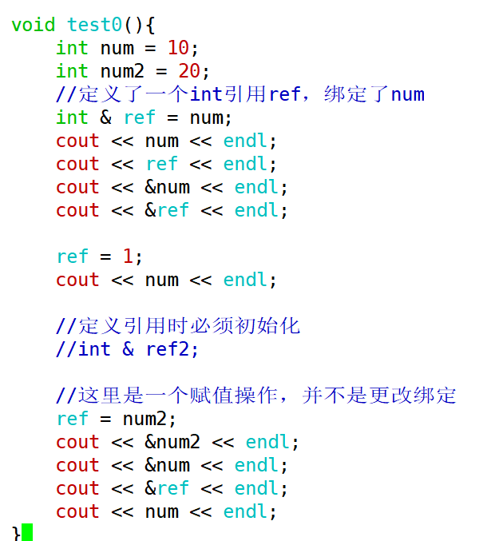


### 引用的本质

<span style=color:red;background:yellow>**C++中的引用本质上是一种被限制的指针。**</span>

通常的说法是引用不会占据内存，只是一个变量的别名。但如果从原理去理解，由于<font color=red>**引用底层是由指针实现的**</font>，所以是占据内存的，占据的大小就是一个指针的大小。

引用变量会占据内存，存放的是一个地址，但是编译器阻止对它本身的任何访问，从一而终总是指向初始的目标单元。在汇编里，引用的本质就是“间接寻址”。


可以尝试对引用取址，发现获取到的地址就是引用所绑定变量的地址。

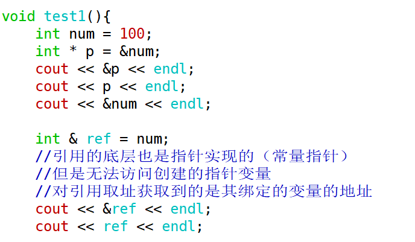


### 引用与指针的联系与区别*

这是一道非常经典的面试题，请尝试着回答一下：

联系：

1. 引用和指针都是用来间接访问变量；

2. 引用的底层还是指针来完成，可以把引用视为一个受限制的指针。（const pointer）

区别：

1. 引用必须初始化，指针可以不初始化；
2. 引用不能修改绑定，但是指针可以修改指向；
3. 在代码层面对引用本身取址取到的是变量本体的地址，但是对指针取址取到的是指针变量的地址。


###  引用的使用场景

#### 引用作为函数的参数（重点）

在没有引用之前，如果我们想通过形参改变实参的值，只有使用指针才能到达目的。但使用指针的过程中，不好操作，很容易犯错。 而引用既然可以作为其他变量的别人而存在，那在很多场合下就可以用引用代替指针，因而也具有更好的可读性和实用性。这就是引用存在的意义。

一个经典的例子就是交换两个变量的值，请实现一个函数，能够交换两个int型变量的值：

```` c++
void swap(int x, int y){//值传递，发生复制
    int temp = x;
    x = y;
    y = temp;
}

void swap2(int * px, int * py){//地址传递，不复制
    int temp = *px;
    *px = *py;
    *py = temp;
}

//在实参传给swap3时，
//其实就是发生了初始化int & x = a;
//int & y = b;
void swap3(int & x, int & y){//引用传递，不复制
    int temp = x;
    x = y;
    y = temp;
}
````


参数传递的方式包括值传递、指针传递和引用传递。

> 采用值传递时，系统会在内存中开辟空间用来存储形参变量，并将实参变量的值拷贝给形参变量。
>
> 也就是说形参变量只是实参变量的副本而已；如果函数传递的是类对象，而该对象占据的存储空间比较大，那发生复制就会造成较大的不必要开销。
>
> 这种情况下，强烈建议使用引用作为函数的形参，这样会大大提高函数的时空效率。

> 当用引用作为函数的参数时，其效果和用指针作为函数参数的效果相当。当调用函数时，函数中的形参就会被当成实参变量或对象的一个别名来使用，也就是说此时**函数中对形参的各种操作实际上是对实参本身进行操作**，而非简单的将实参变量或对象的值拷贝给形参。

> 使用指针作为函数的形参虽然达到的效果和使用引用一样，但传参时要以地址形式传入（如果使用引用则可直接传入变量或对象），也由于指针的灵活更可能导致问题的产生，<span style=color:red;background:yellow>**故在C++中推荐使用引用而非指针作为函数的参数。**</span>


如果不希望函数体中通过引用改变传入的变量，那么可以使用<span style=color:red;background:yellow>**常引用作为函数参数**</span>

（1）不会修改值        （2）不会复制（不会造成不必要的开销）


``` c++
void func(const int & x){
    x = 100; //error
}
```

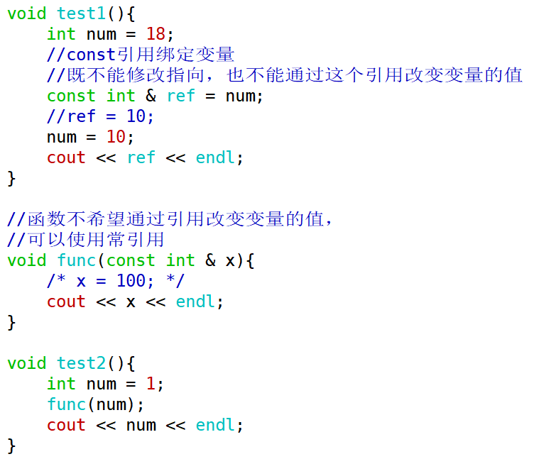


#### 引用作为函数的返回值

要求：当以引用作为函数的返回值时，<span style=color:red;background:yellow>**返回的变量其生命周期一定是要大于函数的生命周期**</span>的，即当函数执行完毕时，返回的变量还存在。

目的： 避免复制，节省开销

```C++
int func(){
    //...
    return a;   //在函数内部，当执行return语句时，会发生复制 
}   

int & func2(){
     //...
    return b;   //在函数内部，当执行return语句时，不会发生复制
}  
```

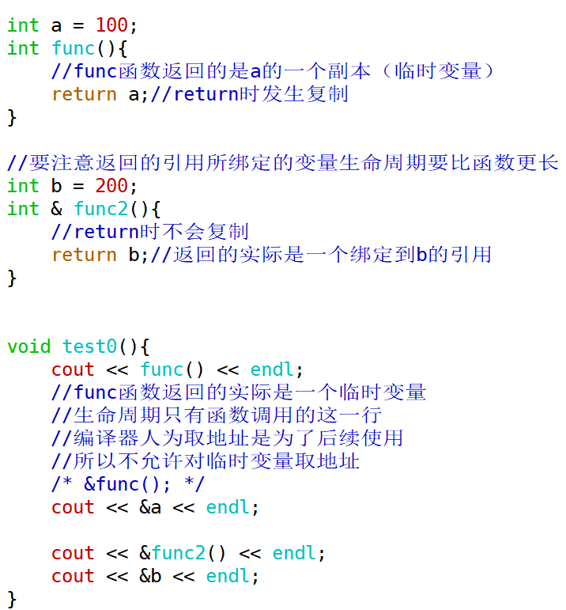


**注意事项**

1. **不要返回局部变量的引用**。因为局部变量会在函数返回后被销毁，被返回的引用就成为了"无所指"的引用，程序会进入未知状态。

```C++
int & func()
{
	int number = 1;
    return number;
}
```


2. <span style=color:red;background:yellow>**不要轻易**</span>返回一个堆空间变量的引用，非常容易造成内存泄漏。

```C++
int & func()
{
	int * pint = new int(1);
	return *pint;
}

void test()
{
	int a = 2, b = 4;
	int c = a + func() + b;//内存泄漏
}
```

如果函数返回的是一个堆空间变量的引用，那么这个函数调用一次就会new一次，非常容易造成内存泄露。所以谨慎使用这种写法，并且要有完善的回收机制。

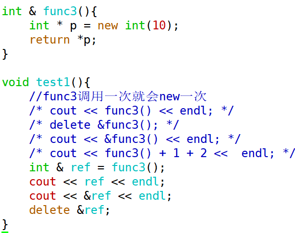


### 总结

引用总结：

1. 在引用的使用中，单纯给某个变量取个别名没有什么意义，引用的目的主要用于在函数参数传递中，解决大块数据或对象的传递效率和空间不理想的问题。
2. 用引用传递函数的参数，能保证参数传递中不产生副本，提高传递的效率，还可以通过const的使用，保证了引用传递的安全性。
3. 引用与指针的区别是，指针通过某个指针变量指向一个变量后，对它所指向的变量间接操作。程序中使用指针，程序的可读性差；引用底层仍然是指针，但是编译器不允许访问到这个底层的指针，逻辑上简单理解为——对引用的操作就是对目标变量的操作。<font color=red>**可以用指针或引用解决的问题，更推荐使用引用**</font>。


## 强制转换

C语言中的强制转换在C++代码中依然可以使用，这种C风格的转换格式非常简单

```C++
TYPE a = （TYPE）EXPRESSION;
```

但是c风格的类型转换有不少的缺点，有的时候用c风格的转换是不合适的，因为它可以在任意类型之间转换，比如你可以把一个指向const对象的指针转换成指向非const对象的指针，把一个指向基类对象的指针转换成指向一个派生类对象的指针，这两种转换之间的差别是巨大的，但是传统的c语言风格的类型转换没有区分这些。

另一个缺点就是，c风格的转换不容易查找，它由一个括号加上一个标识符组成，而这样的东西在c++程序里一大堆。c++为了克服这些缺点，引进了4个新的类型转换操作符，他们是static_cast，const_cast，dynamic_cast，reinterpret_cast.

### static_cast  

最常用的类型转换符，<font color=red>**使用形式  **</font>

``` c++
目标类型 转换后的变量 = static_cast<目标类型>(要转换的变量)
```


在正常状况下的类型转换, 用于将一种数据类型转换成另一种数据类型，如把int转换为float

```C++
int iNumber = 100；
float fNumber = 0；
fNumber = (float) iNumber；//C风格
fNumber = static_cast<float>(iNumber);
```

也可以完成指针之间的转换，例如可以将void*指针转换成其他类型的指针

```C++
void * pVoid = malloc(sizeof(int));
int * pInt = static_cast<int*>(pVoid);
*pInt = 1;
```


但<span style=color:red;background:yellow>**不能完成任意两个指针类型间的转换**</span>

```C++
int iNumber = 1;
int * pInt = &iNumber;
float * pFloat = static_cast<float *>(pInt);//error
```


好处：不允许非法的转换发生；方便查找


### const_cast        

该运算符用来修改类型的const属性，**基本不用**。

指向常量的指针被转化成普通指针，并且仍然指向原来的对象；

常量引用被转换成非常量引用，并且仍然指向原来的对象；


```C++
const int number = 100;
int * pInt = &number;//error
int * pInt2 = const_cast<int *>(&number);
```

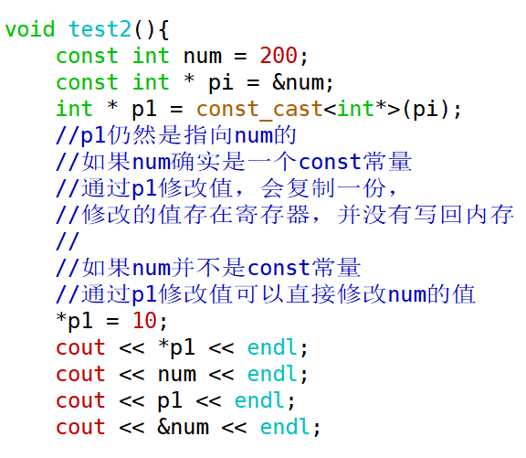


dynamic_cast：该运算符主要用于基类和派生类间的转换，尤其是向下转型的用法中（后面讲） 

reinterpret_cast：功能强大，比static_cast的可使用范围更广一些，慎用（也称为万能转换）

它可以用来处理无关类型之间的转换，即用在任意指针（或引用）类型之间的转换，以及指针与足够大的整数类型之间的转换。

由此可以看出，reinterpret_cast的效果很强大，但错误的使用reinterpret_cast很容易导致程序的不安全，<font color=red>**将转换后的类型值转换回到其原始类型，才是reinterpret_cast最正确的使用方式**</font>。

## 函数重载

在实际开发中，有时候需要实现几个功能类似的函数，只是细节有所不同。 如交换两个变量的值，但这两种变量可以有多种类型，short, int, float等。在C语言中，必须要设计出不同名的函数，其原型类似于：

```C
void swap1(short *, short *);
void swap2(int *, int *);
void swap3(float *, float *);
```

但在C++中，这完全没有必要。C++ 允许多个函数拥有相同的名字，只要它们的参数列表不同就可以，这就是函数重载（Function Overloading）。借助重载，一个函数名可以有多种用途。

<font color=red>**在同一作用域内，可以有一组具有相同函数名，不同参数列表的函数，这组函数被称为重载函数。**</font>重载函数通常用来命名一组功能相似的函数，这样做减少了函数名的数量，对于程序的可读性有很大的好处。

注意：C 语言中不支持函数重载，C++才支持函数重载。

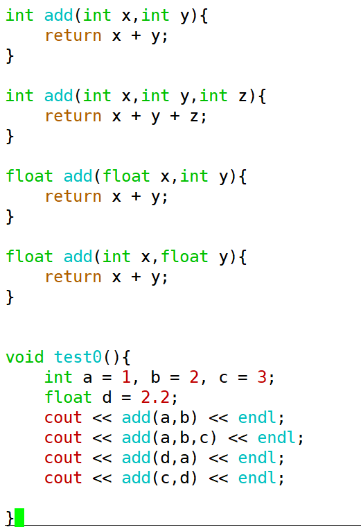


###  实现函数重载的条件

**函数参数的数量、类型、顺序任一不同则可以构成重载。**

只有返回类型不同，参数完全相同，是不能构成重载的

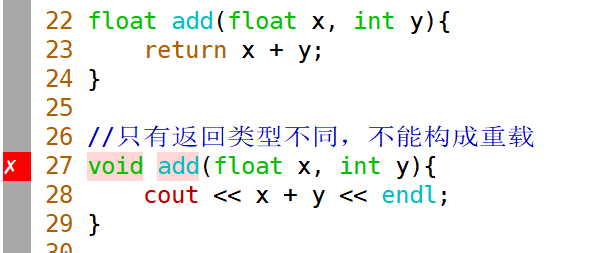


### 函数重载的实现原理

实现原理：  名字改编(name mangling)——当函数名称相同时 ，会根据参数的类型、顺序、个数进行改编

- g++ -c Overload.cc

- nm Overload.o

查看目标文件，可以发现原本的函数名都被改编成与参数相关的函数名。

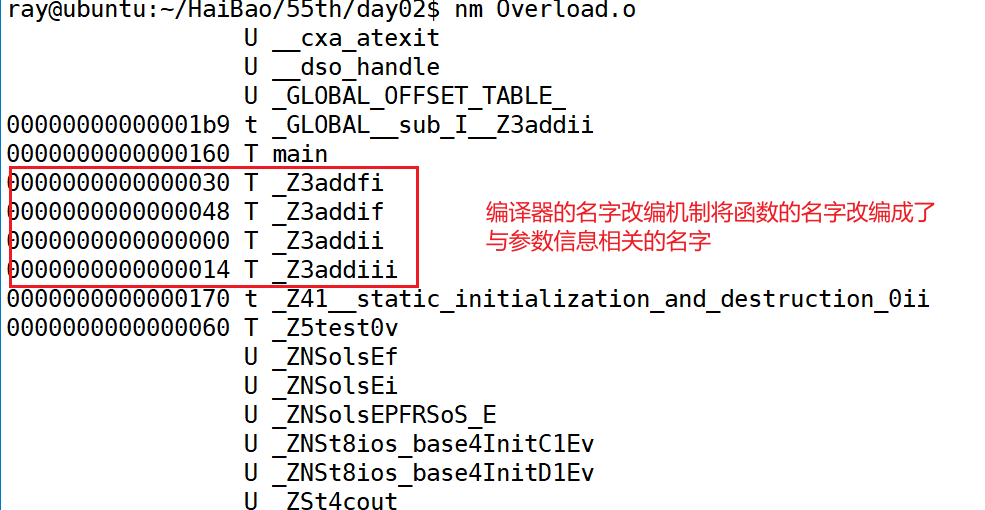

而C语言没有名字改编机制。

分析：C++的函数重载提供了一个便利，以前C语言要想实现各种不同类型参数的计算需要定义多个不同名字的函数，在调用函数时要注意参数的信息和函数名匹配。

C++有了函数重载，想要对不同类型的参数进行计算时，就可以使用同一个函数名字（代码层面的同名，编译器会处理成不同的函数名）。

缺点在于，C++编译器进行编译时比C的编译器多了一个步骤，效率有所降低。

### extern "C"

在C/C++混合编程的场景下，如果在C++代码中想要对部分内容按照C的方式编译，应该怎么办？

```C++
extern "C" void func() //用 extern"C"修饰单个函数
{

}

//如果是多个函数都希望用C的方式编译
//或是需要使用C语言的库文件
//都可以放到如下{}中
extern "C"
{
//……
}

```


## 默认参数

### 默认参数的目的

C++可以给函数定义默认参数值。通常，调用函数时，要为函数的每个参数给定对应的实参。

```C++
void func(int x, int y)
{
	cout << "x = " << x << endl;
	cout << "y = " << y << endl;
}
```

无论何时调用func1函数，都必须要给其传递两个参数。

但C++可以给参数定义默认值，如果将func1函数参数中的x定义成默认值0， y定义成默认值0

```C++
void func(int x = 0, int y = 0){
    cout << "x = " << x << endl;
	cout << "y = " << y << endl;
}

void test0(){
    func(24,30);
    func(100);
    func();
}
```

这样调用时，若不给参数传递实参，则func1函数会按指定的默认值进行工作，即<font color=red>**缺省调用**</font>。

给函数参数赋默认值后就可以进行缺省调用，但是<span style=color:red;background:yellow>**传入的参数优先级高于默认参数。**</span>

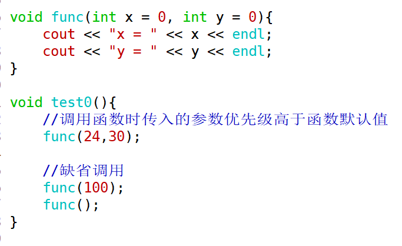


### 默认参数的声明

**一般默认参数在函数声明中提供。**当一个函数既有声明又有定义时，只需要在其中一个中设置默认值即可。<font color=red>**若在定义时而不是在声明时置默认值，那么函数定义一定要在函数的调用之前。**</font>因为声明时已经给编译器一个该函数的向导，在定义时设默认值时，编译器只有检查到定义时才知道函数使用了默认值。若先调用后定义，在调用时编译器并不知道哪个参数设了默认值。

```C++
//这样可以编译通过
void func(int x,int y);

void test0(){
   func(1,2);
}

void func(int x,int y){
    cout << x + y << endl;                                              
}
```

```C++
//这样无法缺省调用
void func(int x,int y);

void test0(){
   func();//error
}

void func(int x = 0,int y = 0){
    cout << x + y << endl;                                              
}
```

所以我们<span style=color:red;background:yellow>**通常是将默认值的设置放在声明中而不是定义**</span>中。

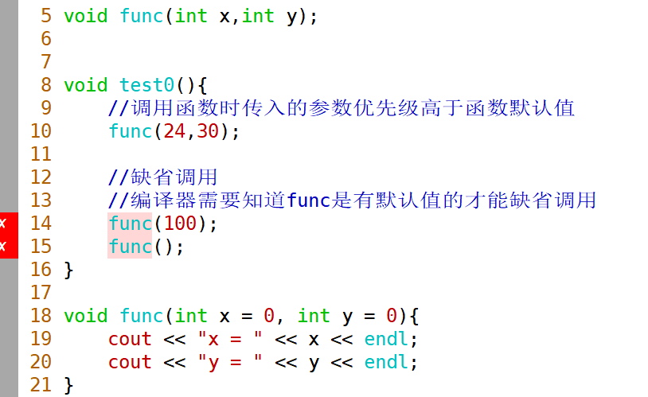


<span style=color:red;background:yellow>**注意：**</span>如果在声明中和定义中都传了默认值，会报错


### 默认参数的顺序规定

如果一个函数中有多个默认参数，则形参分布中，默认参数应从右至左逐渐定义。当调用函数时，只能从左向右匹配参数。如：

```C++
void func2(int a = 1, int b, int c = 0, int d);//error
void func2(int a, int b, int c = 0, int d = 0);//ok
```

若给某一参数设置了默认值，那么在参数表中其后所有的参数都必须也设置默认值，否则，由于函数调用时可不列出已设置默认值的参数，编译器无法判断在调用时是否有参数遗漏。

完成函数默认参数的设置后，该函数就可以按照相应的缺省形式进行调用。

<span style=color:red;background:yellow>**总结：函数参数赋默认值从右向左（严格）**</span>

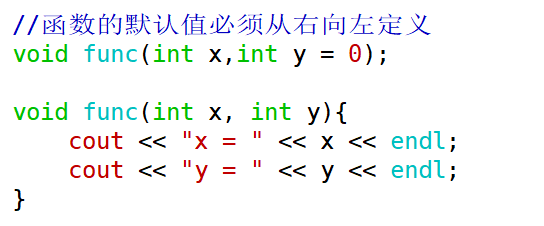

有了这样严格的要求，才能在缺省调用时完成准确的匹配。


### 默认参数与函数重载

> <font color=red>**默认参数可将一系列简单的重载函数合成为一个。**</font>例如：
>
> 
>
> ```C++
> void func3();
> void func3(int x);
> void func3(int x, int y);
> 
> //上面三个函数可以合成下面这一个
> void func3(int x = 0, int y = 0);
> ```
>
> 


如果一组重载函数（可能带有默认参数）都允许相同实参个数的调用，将会引起调用的二义性。

```C++
void func4(int x);
void func4(int x, int y = 0);

func4(1);//error,无法确定调用的是哪种形式的func4
```

<span style=color:red;background:yellow>**所以在函数重载时，要谨慎使用默认参数。**</span>

因为在缺省调用时会产生冲突。

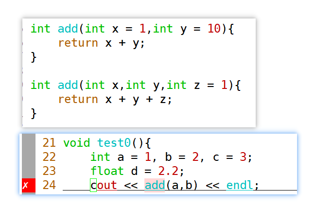

## bool类型

bool类型是在C++中一种基本类型，用来表示true和false。true和false是字面值，可以通过转换变为int类型，<font color=red>**true为1，false为0.**</font>

```C++
int x = true;// 1
int y = false;// 0
```

任何数字或指针值都可以隐式转换为bool值。

任何非零值都将转换为true，而零值转换为false（<span style=color:red;background:yellow>**注意：-1也是代表true**</span>）

```C++
bool b1 = -100;
bool b2 = 100;
bool b3 = 0;
bool b4 = 1;
bool b5 = true;
bool b6 = false;
int x = sizeof(bool);//x = 1
```

bool变量占1个字节的空间。

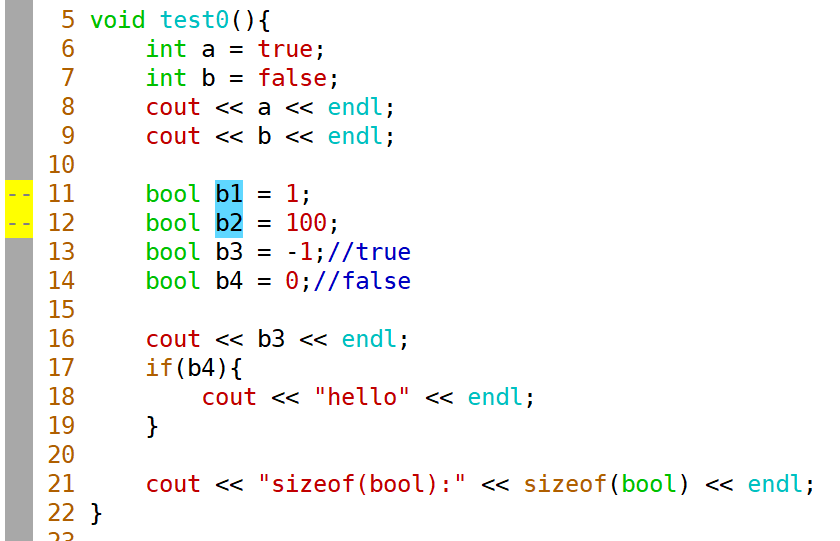

## inline函数

跟随例子对比普通函数、宏函数、inline函数（内联函数）

### 普通函数

在C++中，为了求取两个整数的最大值，通常定义以下函数来解决：

```C++
int max(int x, int y)
{
	return x > y ? x : y;
}
```

大家可能会想，直接用三目运算符得出两数之间的最大值不就好了？

> 实际上，为这么一个小的操作定义函数的好处有：
>
> (1)阅读和理解函数 max 的调用，要比读一条等价的条件表达式并解释它的含义要更容易，尤其是函数返回值参与到更复杂的表达式时;
>
> (2)如果需要做任何修改，修改函数要比找出并修改每一处等价表达式容易得多;
>
> (3)使用函数可以确保统一的行为，每个测试都保证以相同的方式实现;
>
> (4)函数可以重用，不必为其他应用程序重写代码。


虽然有这么多好处，但是写成函数有一个潜在的缺点：调用函数比求解等价表达式要慢得多。

在大多数的机器上，调用函数都要做很多工作：调用前要先保存寄存器，并在返回时恢复，复制实参，程序还必须转向一个新位置执行。简言之，对于这种简短的语句使用函数开销太大。当然，在C语言中，我们还可以使用带参数的宏定义（宏函数），借助编译器的优化技术来减少程序的执行时间。


### 宏函数

在C程序中，可以用宏代码提高执行效率。宏代码本身不是函数，但是看起来像函数。编译预处理器用拷贝宏代码的方式取代函数调用，省去了参数压栈、生成汇编语言的CALL指令、执行return等过程，从而提高了速度。

使用宏代码最大的缺点是容易出错，预处理器在拷贝宏代码时常常产生意向不到的边际效应。例如，如果使用了如下的宏定义，结果是怎样？

```C++
#define MAX(a, b) (a) > (b) ? (a) : (b) 

void test1(){
    int res = MAX(20,10) + 20;//res的值是多少？    
	int res2 = MAX(10,20) + 20;//res2的值是多少？
}

//result = MAX(i, j) + 20; 将被预处理器扩展为: result = (i) > (j) ?(i):(j)+20
```

可以修改宏代码为

```C++
#define MAX(a, b) ((a) > (b) ? (a) : (b))
```

可以解决上面的错误了，但也不是万无一失的，例如：

``` c++
int i = 4,j = 3;
res = MAX(i++,j);
cout << res << endl; //res的值是多少？
cout << i << endl; //i的值是多少？

//使用MAX的代码段经过预处理器扩展后，result = ((i++) > (j) ? (i++):(j));
```

由此可以发现，宏函数的替换机制不够“聪明”，不会有安全检查的过程。

那么在C++中有没有相同的技术或者更好的实现方法呢？答案是有的，那就是内联(inline)函数。内联函数作为编译器优化手段的一种技术，在降低运行时间上非常有用。


**宏**的另一个缺点就是**不可调试**，但内联函数是可以调试的。内联函数不是也像宏一样进行代码展开吗？怎么能够调试呢？其实内联函数的”可调试“不是说展开后还能调试，而是在程序的调试（Debug）版本里它根本就没有真正内联，编译器像普通函数那样为它生成含有调试信息的可执行代码。在程序的发行（Release)版本里，编译器才会实施真正的内联。

### inline函数

inline函数即内联函数，是C++的增强特性之一，用来降低程序的运行时间。

在代码中在一个函数的定义之前加上inline关键字，就是对编译器提出了<span style=color:red;background:yellow>**内联的建议**</span>。如果建议通过，就会进行内联展开。

当内联函数收到编译器的指示时，即可发生内联：编译器将使用函数的定义体来**替代**函数调用语句，**这种替代行为发生在编译阶段。**


```C++
inline int max(int x, int y)
{
	return x > y ? x : y;
}
```

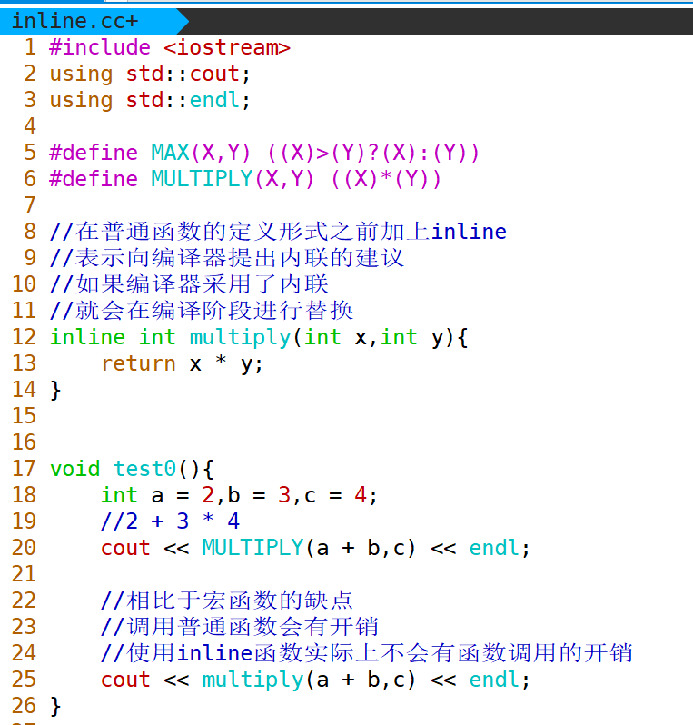


—— 使用inline函数没有问题

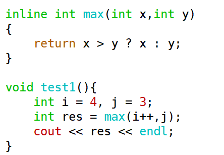


> 那C++的内联函数是如何工作的呢？（了解）
>
> 对于任何内联函数，编译器在符号表（符号表是编译器用来收集和保存字面常量和某些符号常量的地方）里放入函数的声明，包括名字、参数类型、返回值类型。如果编译器没有发现内联函数存在错误，那么该函数的代码也会被放入符号表里。在调用一个内联函数时，编译器首先检查调用是否正确（进行类型安全检查，或者进行自动类型转换）。如果正确，内联函数的代码就会直接替换函数调用语句，于是省去了函数调用的开销。这个过程与预处理有显著的不同，因为预处理器不能执行类型安全检查和自动类型转换。
>
> 相比于宏函数不可调试的缺点，内联函数是可以调试的。内联函数不是也像宏一样进行代码展开吗？怎么能够调试呢？其实内联函数的”可调试“不是说展开后还能调试，而是在程序的调试（Debug）版本里它根本就没有真正内联，编译器像普通函数那样为它生成含有调试信息的可执行代码。在程序的发行（Release)版本里，编译器才会实施真正的内联。


<font color=red>**—— 在普通函数定义之前加上inline关键字**</font>

（1）inline是一个建议，并不是强制性的

（2）inline的建议如果有效，就会在<span style=color:red;background:yellow>**编译时**</span>展开，**可以理解为是一种更高级的代码替换机制**

（3）函数体内容如果太长或者有循环之类的结构，不建议inline，以免造成代码膨胀；**比较短小并且比较常用的代码适合用inline。**

比如函数体中有循环结构，那么执行函数体的开销比调用函数的开销大得多，设为内联函数只能减少函数调用的开销，没有太大意义。


> <span style=color:red;background:yellow>**对比总结：**</span>
>
> - 宏函数 
>
>   优点：只是进行字符串的替换，并没有函数的开销，对于比较短小的代码适合使用；
>
>   缺点：没有类型检查，存在安全隐患，而且比较容易写错。
>
>   
>
> - 普通函数
>
>   优点：可调试，有类型检查，比宏函数更安全；
>
>   缺点：函数的调用会增加开销。
>
>   
>
> - 内联函数
>
>   既具备宏代码的效率，又增加了安全性，<font color=red>**所以在C++中应尽可能的用内联函数取代宏函数。**</font>


### 内联函数注意事项

1. 内联函数采用声明和实现分离的写法


调用一个函数时，是采取内联函数的方式还是普通函数的方式，<font color=red>**取决于该函数的实现**</font>—— 下面两种写法都会按照内联函数的方式展开。

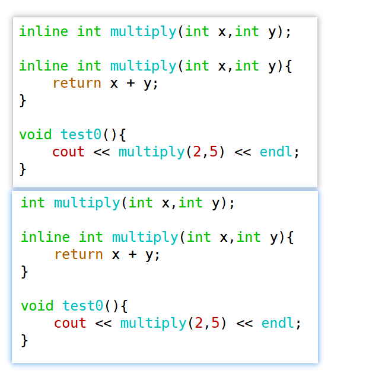


2. <font color=red>**如果要把inline函数声明在头文件中，则必须把函数定义也写在头文件中。**</font>若头文件中只有声明没有实现，被认为是没有定义替换规则。

如下，foo函数不能成为内联函数：

``` c++
inline void foo(int x, int y);//该语句在头文件中

void foo(int x, int y)//实现在.cpp文件中
{ //... }
```

因为编译器在调用点内联展开函数的代码时，必须能够找到 inline函数的定义才能将调用函数替换为函数代码，而对于在头文件中仅有函数声明是不够的。

当然内联函数定义也可以放在源文件中，但此时只有定义的那个源文件可以用它，而且需要为每个源文件拷贝一份内联函数的定义(每个源文件里的定义必须是完全相同的)。相比之下，放在头文件中既能够确保调用函数的定义是相同的，又能够保证在调用点能够找到函数定义从而完成内联(替换)。

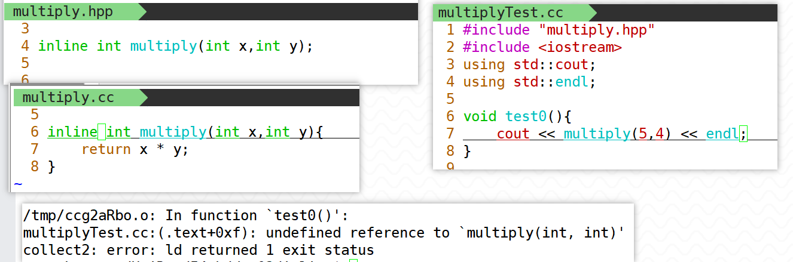

从测试文件出发，找到头文件，发现此函数是inline函数，那么要展开替换，必须要有明确的替换规则，但是在头文件中并没有发现替换规则，所以报错未定义问题。

<font color=red>**inline函数在头文件必须有定义。**</font>


3. **谨慎使用内联**

内联能提高函数的执行效率，为什么不把所有的函数都定义成内联函数？事实上，内联函数以代码膨胀为代价，仅仅省去了函数调用的开销（即参数压栈、跳转、退栈和返回等操作），从而提高程序的执行效率。

如果执行函数体内代码的时间比函数调用的开销大得多，那么 inline 的效率收益会很小。另外，每一处内联函数的调用都要拷贝代码，将使程序的总代码量增大，消耗更多的内存空间。以下情况不宜使用内联：

- 如果函数体内的代码比较长，使用内联将导致可执行代码膨胀过大。

- 如果函数体内出现循环或其他复杂的控制结构，那么执行函数体内代码的时间将比函数调用开销大得多，因此内联的意义并不大。


实际上，inline 在实现的时候就是对编译器的一种请求，因此编译器完全有权利取消一个函数的内联请求。一个好的编译器能够根据函数的定义体，自动取消不值得的内联，或自动地内联一些没有inline 请求的函数。因此编译器往往选择那些短小而简单的函数来内联。


## 异常处理（了解）

异常是程序在执行期间产生的问题。C++ 异常是指在程序运行时发生的特殊情况，比如尝试除以零的操作。异常提供了一种转移程序控制权的方式。C++ 异常处理涉及到三个关键字：try、catch、throw.


抛出异常即检测是否产生异常，在 C++ 中，其采用 **throw 语句**来实现，如果检测到产生异常，则抛出异常。该语句的格式为：

``` c++
throw 表达式;
```

- 先定义抛出异常的规则（throw）,异常是一个表达式，它的值可以是基本类型，也可以是类；

```C++
double division(double x, double y)
{
	if(y == 0)
		throw "Division by zero condition!";
	return x / y;
}
```


**try-catch语句块**的语法如下：

``` c++
try {
//语句块
    
    
} catch(异常类型) {
//具体的异常处理...
} ...
catch(异常类型) {
//具体的异常处理...
}
```

 try-catch语句块的catch可以有多个，至少要有一个，否则会报错。

- 执行 try 块中的语句，如果执行的过程中没有异常拋出，那么执行完后就执行最后一个 catch块后面的语句，所有 catch 块中的语句都不会被执行；
- 如果 try 块执行的过程中拋出了异常，那么拋出异常后立即跳转到第一个“异常类型”和拋出的异常类型匹配的 catch 块中执行（称作异常被该 catch 块“捕获”），执行完后再跳转到最后一个catch 块后面继续执行。

注意：<font color=red>**catch的是类型，不是具体信息**</font>。


``` c++
double division(double x,double y){
    if(y == 0){
        throw "Deivision by zero";
    }
    return x/y;
}

void test0(){
    double x = 100, y = 0;
    try{
        cout << division(x,y) << endl;
    }catch(const char *){ //catch匹配的是异常的类型
     	cout << "hello，there is an error" << endl;
    }catch(double x){
        cout << "double " << x << endl;
    }
}
```


## 内存布局（重要）

64位系统，理论空间达到16EB（2^64），但是受硬件限制，并不会达到这么多；

以32位系统为例，一个进程在执行时，能够访问的空间是**虚拟地址空间**。理论上为2^32，即4G，有1G左右的空间是内核态，剩下的3G左右的空间是用户态。从高地址到低地址可以分为五个区域：

- 栈区：操作系统控制，由高地址向低地址生长，编译器做了优化，显示地址时栈区和其他区域保持一致的方向。(同一个区域，先定义的内容在较低的地址)

- 堆区：程序员分配，由低地址向高地址生长，堆区与栈区没有明确的界限。

- 全局/静态区：读写段（数据段），存放全局变量、静态变量。

- 文字常量区：只读段，存放程序中直接使用的文字常量和全局的常量，如const char * p = "hello";  hello这个内容就存在文字常量区。

- 程序代码区：只读段，存放函数体的二进制代码。

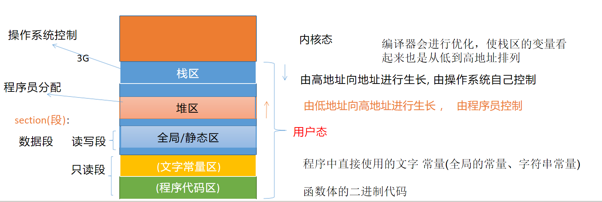

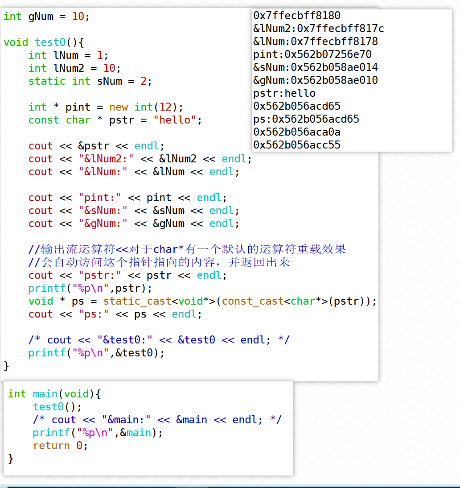


## C风格字符串

C风格字符串即以空字符结尾的字符数组。

> 如果用数组形式保存字符串，注意留出终止符，当然也可以用上语法糖来初始化字符数组；
>
> 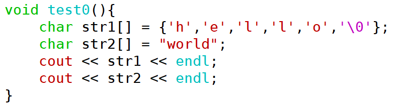


> 如果用指针形式，直接定义为const char * ，C++代码中标准C风格字符串的写法。
>
> 字符串常量存放在内存的只读区，如果用普通的char*指针保存其地址，可能会尝试通过指针修改内容，进而引发错误。如果用const char *指针，则可避免这种风险。
>
> 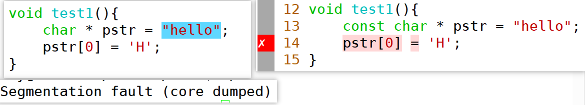

> 若只进行读操作不会出错，但仍会有warning
>
> 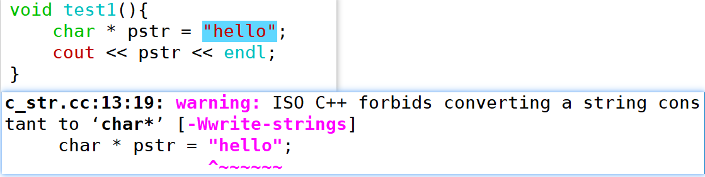


当然，如果想动态分配空间保存字符串内容，可以使用new表达式的做法。

<span style=color:red;background:yellow>**注意：**</span>输出流运算符具有默认重载效果，接char*时会进行自动的访问，输出的是字符串内容，而不是地址。


