# 移动语义与智能指针

## 移动语义

为什么要用移动语义？

我们回顾一下之前模拟的String.cc


``` c++
#include <string.h>
#include <iostream>

using std::cout;
using std::endl;


class String
{
public:
    String()
    /* : _pstr(nullptr) */
    : _pstr(new char[1]())
    {
        cout << "String()" << endl;
    }

    String(const char *pstr)
    : _pstr(new char[strlen(pstr) + 1]())
    {
        cout << "String(const char *)" << endl;
        strcpy(_pstr, pstr);
    }

    String(const String & rhs)
    : _pstr(new char[strlen(rhs._pstr) + 1]())
    {
        cout << "String(const String &)" << endl;
        strcpy(_pstr, rhs._pstr);
    }

    String & operator=(const String & rhs)
    {
        cout << "String &operator=(const String &)" << endl;
        if(this != &rhs)
        {
             delete [] _pstr;  
            _pstr = new char[strlen(rhs._pstr) + 1]();
            strcpy(_pstr, rhs._pstr);
        }
        return *this;
    }

    size_t length() const
    {
        size_t len = 0;
        if(_pstr)
        {
            len = strlen(_pstr);
        }

        return len;

    }

    const char * c_str() const
    {
        if(_pstr)
        {
            return _pstr;
        }
        else
        {
            return nullptr;
        }
    }


    ~String()
    {
        cout << "~String()" << endl;
        if(_pstr)
        {
            delete [] _pstr;
            _pstr = nullptr;
        }
    }

    void print() const
    {
        if(_pstr)
        {
            cout << "_pstr = " << _pstr << endl;
        }else{
            cout << endl;
        }
    }

private:
    char * _pstr;
};

void test0(){
    String s1("hello");
    //拷贝构造
    String s2 = s1;
    //先构造，再拷贝构造
    //利用"hello"这个字符串创建了一个临时对象
    //并复制给了s3
    //这一步实际上new了两次
    String s3 = "hello"; 
}
```

创建s3的过程中实际创建了一个临时对象，也会在堆空间上申请一片空间，然后把字符串内容复制给s3的pstr，这一行结束时临时对象的生命周期结束，它申请的那片空间被回收。这片空间申请了，又马上被回收，实际上可以视作一种不必要的开销。我们希望能够少new一次，可以直接将s3能够复用临时对象申请的空间。

这其实也可以视为是一种隐式转换。


### 左值与右值

左值和右值是针对表达式而言的，**左值**是指表达式执行结束后依然存在的持久对象，**右值**是指表达式执行结束后就不再存在的临时对象。

那如何进行区分呢？其实也简单，<span style=color:red;background:yellow>**能对表达式取地址的，称为左值；不能取地址的，称为右值。**</span>

在实际使用过程中，字面值常量、临时对象（匿名对象）、临时变量（匿名变量），都称为右值。右值又被称为即将被销毁的对象。

字面值常量，也就是10， 20这样的数字，属于右值，不能取地址。

字符串常量，“world"，是属于左值的，位于内存中的文字常量区。


> 关于存储区域
>
> 右值的存储位置
>
> 关于右值的存储位置，它们可以存储在内存中，也可以仅存在于寄存器中，这取决于具体的实现和上下文。编译器优化策略在很大程度上影响了这一点：
>
> - **在内存中存储：** 尽管右值通常被视为临时的，但它们可以在内存中创建并存储，尤其是当它们是较大的对象或者编译器决定这样做更高效时。例如，一个复杂的右值对象（比如一个大的临时结构体或对象）可能会在内存中分配空间，以便存储其状态。
> - **仅存在于寄存器中：** 对于简单的右值（如基本数据类型的算术表达式结果），编译器可能会选择将其存储在寄存器中以优化性能。寄存器的使用减少了内存访问的需要，可以加快程序的执行速度。当一个右值用于简单表达式或作为函数参数传递时，这种情况更常见。
>
> 优化和存储决策
>
> C++标准并没有具体规定对象必须存储在内存还是寄存器中，这留给了编译器作为实现细节。现代编译器使用复杂的优化策略来决定何时在内存中分配空间以及何时使用寄存器。这些决策基于减少程序的总运行时间和内存使用，同时还要满足程序的语义要求。
>
> 因此，是否一个右值会短暂存储在内存中或只会存在寄存器中，取决于多种因素，包括但不限于右值的类型、大小、上下文以及编译器的优化策略。在实际编程中，除非在性能调优阶段需要深入了解这些细节，否则开发者通常不需要过分关注这一点。


试试看下面这些取址操作和引用绑定操作是否可行：

``` c++
void test1() {
	int a = 1, b = 2;
	&a;  
	&b;
	&(a + b);
	&10;
	&String("hello");
    
    //非const引用尝试绑定
	int & r1 = a;
	int & r2 = 1;
    
    //const引用尝试绑定
	const int & r3 = 1;
	const int & r4 = a;
    
	String s1("hello");
	String s2("wangdao");
	&s1;
	&s2;
	&(s1 + s2);
}
```

> 如上定义的`int & r1 ` 和 `const int & r3` 叫作左值引用与const左值引用
>
> 非const左值引用只能绑定到左值，不能绑定到右值，也就是非const左值引用只能识别出左值。
>
> const左值引用既可以绑定到左值，也可以绑定到右值，也就是表明const左值引用不能区分是左值还是右值。
>
> 
>
> ——希望能够区分出右值，并且还要进行绑定
>
> 就是为了实现String s3 = "hello"的空间复用需求。


###  右值引用

> C++11提出了新特性<span style=color:red;background:yellow>**右值引用**</span>
>
> 右值引用不能绑定到左值，但是**可以绑定到右值**，也就是右值引用可以**识别出右值**
>
> ``` c++
> 	//非const左值引用不能绑定右值
> 	int & r1 = a;
> 	int & r2 = 1; //error
> 
>     //const左值引用既可以绑定左值，又可以绑定右值
> 	const int & r3 = 1;
> 	const int & r4 = a;
> 
> 	//右值引用只能绑定右值
> 	int && r_ref = 10;
> 	int && r_ref2 = a; //error
> ```
>
> 右值引用本身是左值还是右值？ 
>
> —— 对r_ref取地址是可行的，r_ref本身是一个左值。但这并不代表右值引用本身一定是左值。
>
> <span style=color:red;background:yellow>**实际上，右值引用既可以是左值（比如：作为函数的参数、有名字的变量），也可以是右值（函数的返回类型）**</span>
>
> 这个问题，我们留到1.1.6章节再做讨论。


### 移动构造函数（重要）

有了右值引用后，实际上再接收临时对象作为参数时就可以分辨出来。

之前String str1 = String("hello");这种操作调用的是拷贝构造函数，形参为const String & 类型，既能绑定右值又能绑定左值。为了确保右值的复制不出错，拷贝构造的参数设为const引用；为了确保进行左值的复制时不出错，一律采用重新开辟空间的方式。有了能够分辨出右值的右值引用之后，我们就可以定义一个新的构造函数了 —— <span style=color:red;background:yellow>**移动构造函数**</span>。

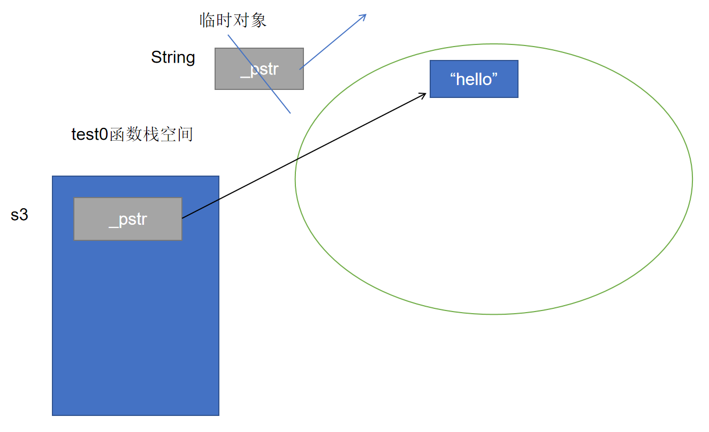


给String类加上移动构造函数，在初始化列表中完成浅拷贝，使s3的pstr指向临时对象的pstr所指向的空间（复用），还不能忘记要将右操作数（临时对象）的pstr设为空指针，因为这个临时对象会马上销毁（要避免临时对象调用析构函数回收掉这片堆空间）


``` c++
    String(String && rhs)
    : _pstr(rhs._pstr)
    {
        cout << "String(String&&)" << endl;
        rhs._pstr = nullptr;
    }
```

再运行代码String s3 = "hello";

<font color=red>**加上编译器的去优化参数 -fno-elide-constructors**</font>

发现没有再调用拷贝构造函数，而是调用了移动构造函数。

<span style=color:red;background:yellow>**注意：**</span>C++17标准的强制拷贝省略会影响这一结果，如果编译器版本过高，仍想以C++11标准进行编译，可在编译时再加上参数<font color=red>**-std=c++11**</font>看到演示效果。


> 对比函数形参的三种写法：
>
> 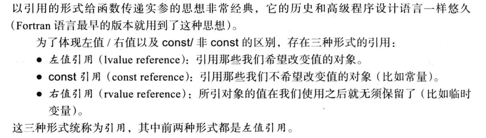


> 移动构造函数的特点：
>
> 1.如果没有显式定义构造函数、拷贝构造、赋值运算符函数、析构函数，编译器会自动生成移动构造，**对右值的复制会调用移动构造。**
>
> 2.如果显式定义了拷贝构造，而没有显式定义移动构造，那么对右值的复制会调用拷贝构造。
>
> 3.如果显式定义了拷贝构造和移动构造，那么对右值的复制会调用移动构造。
>
> <span style=color:red;background:yellow>**总结：移动构造函数优先级高于拷贝构造函数。**</span>
>
> 可以理解为：如果显式定义了拷贝构造和移动构造，利用一个已存在的对象创建一个新对象时，会先尝试调用移动构造，如果这个对象是右值，就使用移动构造函数创建出新对象，如果这个对象是左值，移动构造使用不了，就会调用拷贝构造。


###  移动赋值函数（重要）

有了移动构造函数的成功经验，很容易想到原本的赋值运算符函数。

比如，我们进行如下操作时

``` c++
String s3("hello");
s3 = String("wangdao");
```

原本赋值运算符函数的做法

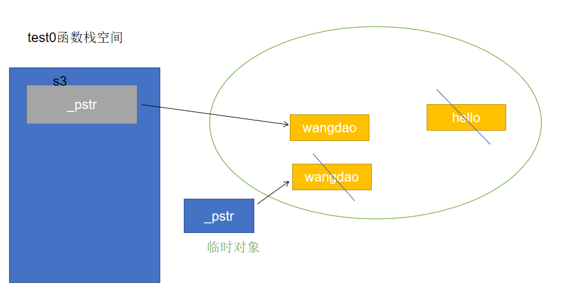


我们希望复用临时对象申请的空间，那么也同样需要赋值运算符函数能够分辨出接收的参数是左值还是右值，同样可以利用右值引用

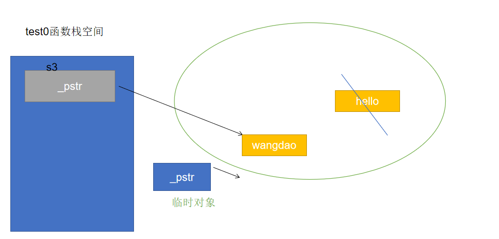


> 再写出移动赋值函数（移动赋值运算符函数）
>
> ``` c++
> String & operator=(String && rhs){
>      if(this != &rhs){
>          delete [] _pstr;
>          //浅拷贝
>          _pstr = rhs._pstr;
>          rhs._pstr = nullptr;
>          cout << "String& operator=(String&&)" << endl;
>      }
>      return *this;
>  }
> ```
>
> 移动赋值函数的特点：
>
> 1.如果没有显式定义构造函数、拷贝构造、赋值运算符函数、析构函数，编译器会自动生成移动赋值函数。使用右值的内容进行赋值会调用移动赋值函数。
>
> 2.如果显式定义了赋值运算符函数，而没有显式定义移动赋值函数，那么使用右值的内容进行赋值会调用赋值运算符函数。
>
> 3.如果显式定义了移动赋值函数和赋值运算符函数，那么使用右值的内容进行赋值会调用移动赋值函数。
>
> <span style=color:red;background:yellow>**移动赋值函数优先级也是高于赋值运算符函数**</span>


> 总结：
>
> 将拷贝构造函数和赋值运算符函数称为具有复制控制语义的函数；
>
> 将移动构造函数和移动赋值函数称为具有移动语义的函数<span style=color:red;background:yellow>**(移交控制权)**</span>；
>
> <font color=red>**具有移动语义的函数优于具有复制控制语义的函数执行。**</font>


思考：移动赋值函数中的自赋值判断是否还有必要？

```` c++
    String s1("hello");
    //右值给左值赋值，肯定不是同一个对象
    s1 = String("world");
    //创建了两个内容相同的临时对象，也不是同一对象
    String("wangdao") = String("wangdao");
````


似乎去掉自复制判断不会造成问题，但是c++11提出了一种方式，将左值转为右值，就是std::move函数


###  std::move函数

在一些使用移动语义的场景下，有时需要将左值转为右值。std::move函数的作用是显式的将一个左值转换为右值，<span style=color:red;background:yellow>**其实现本质上就是一个强制转换**</span>。

当将一个左值转换为右值后，如果利用右值引用绑定std::move的返回值，并进行修改操作，那么原来的左值对象也会随之修改，可能无法正常工作了，需要重新赋值才可以继续使用。


``` c++
void test() {
    int a = 1;
    &(std::move(a)); //error，左值转成了右值
    
	String s1("hello");
	cout << "s1:" << s1 << endl;
	String s2 = std::move(s1);
	cout << "s1:" << s1 << endl;
	cout << "s2:" << s2 << endl;
}
```

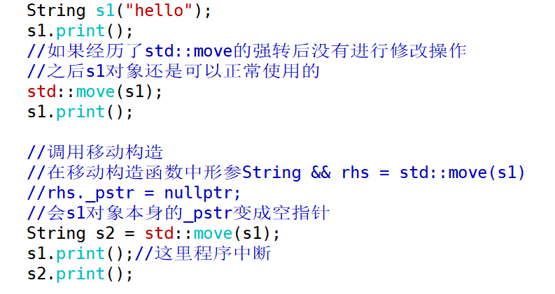


如果将移动赋值函数的自赋值判断去除，如下情况依然会调用移动赋值函数，但是s1的pstr所指向的空间被回收，且被设为了空指针，会出错

``` c++
String s1("hello");
s1 = std::move(s1);
s1.print();
```


验证：将移动赋值函数中的浅拷贝去掉，让左操作数s1 的 `_pstr`重新指向一片空间，后面对右操作数的 `_pstr`设为空指针，

但是通过输出流运算符输出s1的 `_pstr`依然造成了程序的中断，所以说明对std::move(s1)的内容进行修改，会导致s1的内容也被修改。

**std::move的本质是在底层做了强制转换（并不是像名字表面的意思一样做了移动）**

``` c++
    String & operator=(String && rhs){
            delete [] _pstr;
            _pstr = new char[1]();
            rhs._pstr = nullptr;
            cout << "String& operator=(String&&)" << endl;
        return *this;
    }
```

—— 所以移动赋值函数的自赋值判断不应该省略。


### 右值引用本身的性质

我们来定义一个返回值是右值引用的函数

``` c++
int gNum = 10;
int && func(){
    return std::move(gNum);
}

void test1(){
    // &func();  //无法取址，说明返回的右值引用本身也是一个右值
    int && ref = func();
    &ref;  //可以取址，此时ref是一个右值引用，其本身是左值
}
```

**右值引用本身是左值还是右值，取决于是否有名字，有名字就是左值，没名字就是右值。**


值得一提的是，如果我们写出如下的代码，func的返回值是一个匿名右值引用，其绑定的内容是一个即将销毁的右值，这是一个不安全的操作，因为func2的返回值，这个没有名字的右值引用无法持续有效地延长这个临时变量的生命周期，这个临时变量本体销毁后，返回值真实的性质是一个”悬空引用“。接下来虽然还能用右值引用绑定这个返回值，但是任何尝试访问的行为都可能导致未定义的错误。

``` c++
int && func(int a,int b){
    return a + b;
}

void test1(){
    // &func(1,2);  //无法取址
    int && ref = func(1,2);
    &ref; 
}
```


### 对拷贝构造调用时机的补充


``` c++
String func2(){
    String str1("wangdao");
	str1.print();
    return str1;
}

void test2(){
    func2();
    //&func2(); //error,右值
}
```

> 这里func2的调用按以前的理解会调用拷贝构造函数，但是发现结果是调用了移动构造函数。
>
> <font color=red>**当返回的对象其本身生命周期即将结束，就不再调用拷贝构造函数，而是调用移动构造函数。**</font>
>
> 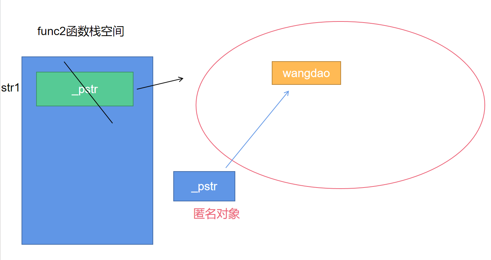


> <font color=red>**如果返回的对象其本身生命周期大于func3函数，执行return语句时还是调用拷贝构造函数**</font>
>
> ``` c++
> String s10("beijing");
> String func3(){
>     	s10.print();
>     	return s10;
> }
> 
> void test3(){
>     func3();   //调用拷贝构造函数
> }
> ```
>
> 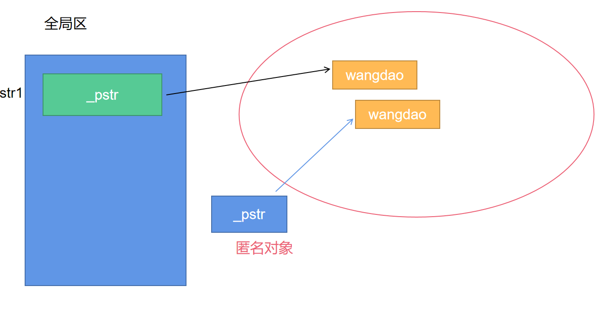


总结：当类中同时定义移动构造函数和拷贝构造函数，需要对以前的规则进行补充，<span style=color:red;background:yellow>**调用哪个函数还需要取决于返回的对象本体的生命周期**</span>。


## 资源管理

C语言在进行资源管理的时候，比如文件指针，由于分支较多，或者由于写代码的人与维护的人不一致，导致分支没有写的那么完善，从而导致文件指针没有释放。

```C
void UseFile(char const* fn) {
	FILE* f = fopen(fn, “r”); //1. 获取资源
	//…… //2.使用资源
	//回收资源有很多分支
	if (!g()) { fclose(f); return; }
	// ...
	if (!h()) { fclose(f); return; }
	// ...
	fclose(f); // 释放资源
}
```


根据之前单例对象自动释放的经验，我们可以想到利用对象的生命周期去管理资源。那么就可以尝试实现一个安全回收文件的程序了。


``` c++
class SafeFile
{
public:
    //在构造函数中初始化资源（托管资源）
    SafeFile(FILE * fp)
    : _fp(fp)
    {
        cout << "SafeFile(FILE*) " << endl;
    }
    //提供方法访问资源
    void write(const string & msg){
        fwrite(msg.c_str(),1,msg.size(),_fp);
    }
    //利用析构函数释放资源
    ~SafeFile(){
        cout << "~SafeFile()" << endl;
        if(_fp){
            fclose(_fp); 
            cout << "fclose(_fp)" << endl;
        }
    }
private:
    FILE * _fp;
};

void test0(){
    string msg = "hello,world";
    SafeFile sf(fopen("wd.txt","a+"));
    sf.write(msg);
}
```


###  RAII技术*

以上例子其实已经用到了RAII的技术。所谓RAII，是C++提出的资源管理的技术，全称为Resource Acquisition Is Initialization，由C++之父Bjarne Stroustrup提出。其本质是利用对象的生命周期来管理资源（内存资源、文件描述符、文件、锁等），因为当对象的生命周期结束时，会自动调用析构函数。

#### RAII类的常见特征

> RAII技术，具备以下基本特征：
>
> - 在构造函数中托管资源；（在给构造函数传参时初始化资源）
>
> - 在析构函数中释放资源；
>
> - 一般不允许进行复制或者赋值（对象语义）；
>
> - 提供若干访问资源的方法（如：读写文件）。


> 与对象语义相反的就是值语义。
>
> **值语义：可以进行复制或赋值**（两个变量的值可以相同）
>
> ``` c++
> int a = 10; int b = a;  int c = 20;     
> 
> c = a; //赋值
> 
> int d = c; //复制
> ```
>
> 
>
> **对象语义：不允许复制或者赋值**
>
> （全世界不会有两个完全一样的人，程序世界中也不会有两个完全一样的对象）
>
> **常用手段：**
>
> 1. 将拷贝构造函数与赋值运算符函数设置为私有的
> 2. 将拷贝构造函数与赋值运算符函数=delete
> 3. 使用继承的思想，将基类的拷贝构造函数与赋值运算符函数删除（或设为私有），让派生类继承基类。


#### RAII类的模拟

我们可以实现以下的一个类模板，模拟RAII的思想

``` c++
template <class T>
class RAII
{
public:
    //1.在构造函数中初始化资源（托管资源）
    RAII(T * data)
    : _data(data)
    {
        cout << "RAII(T*)" << endl;
    }

    //2.在析构函数中释放资源
    ~RAII(){
        cout << "~RAII()" << endl;
        if(_data){
            delete _data;
            _data = nullptr;
        }
    }

    //3.提供若干访问资源的方法
    T * operator->(){
        return _data;
    }
    
    T & operator*(){
        return *_data;
    }

    T * get() const{
        return _data;
    }

    void set(T * data){
        if(_data){
            delete _data;
            _data = nullptr;
        }
        _data = data;
    }

    //4.不允许复制或赋值
    RAII(const RAII & rhs) = delete;
    RAII& operator=(const RAII & rhs) = delete;
private:
    T * _data;
};
```


如下，raii不是一个指针，而是一个对象，但是它的使用已经和指针完全一致了。这个对象可以托管堆上的Point对象，而且不用考虑delete.

``` c++
void test0() {
	Point * pt = new Point(1, 2);
	//智能指针的雏形
	RAII<Point> raii(pt);
	raii->print();
	(*raii).print();
}
```

> <span style=color:red;background:yellow>**RAII技术的本质：**</span>利用**栈对象**的生命周期管理资源，因为栈对象在离开作用域时候，会执行析构函数。


###  智能指针

c++11提供了以下几种智能指针，位于头文件&lt;memory&gt;，它们都是类模板。

```C++
//std::auto_ptr         c++0x

//std::unique_ptr    c++11

//std::shared_ptr     c++11

//std::weak_ptr        c++11
```

#### auto_ptr的使用

auto_ptr是最简单的智能指针，使用上存在缺陷，已经被C++17弃用了。

auto_ptr是有复制、赋值函数的。


``` c++
void test0(){
    int * pInt = new int(10);
    //创建auto_ptr对象接管资源
    auto_ptr<int> ap(pInt);
    cout << "*pInt:" << *pInt << endl;
    cout << "*ap:" << *ap << endl;
}
```

尽管会有warning提示，代码仍可通过。发现不用对pInt进行delete，也没有内存泄露。


auto_ptr可以进行复制，但是存在隐患

``` c++
    auto_ptr<int> ap2(ap);
    cout << "*ap2:" << *ap2 << endl; //ok
    cout << "*ap:" << *ap << endl;  
```

当ap2复制了ap后，对ap2管理的资源进行访问没有问题，但是对ap解引用会导致段错误。

通过阅读源码的实现，ap的指针被置为了空指针。

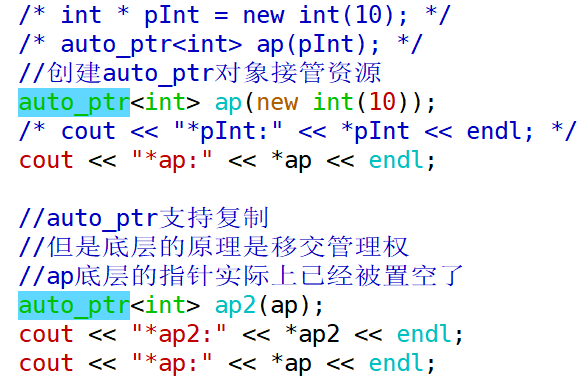


``` c++
template <class _Tp> 
class auto_ptr {
public:
    //拷贝构造
   auto_ptr(auto_ptr& __a) __STL_NOTHROW 
   //ap2的_M_ptr 被赋值为 ap调用release函数的返回值
   : _M_ptr(__a.release()) 
   {}

    //ap调用release函数
   _Tp* release() __STL_NOTHROW 
   {
     //用局部的指针__tmp接管ap的指针所指向的资源
    _Tp* __tmp = _M_ptr;
    _M_ptr = nullptr; //将ap底层的指针设为空指针
    return __tmp;//返回的就是原本ap管理的资源的地址
  }
    
private:
  _Tp* _M_ptr;
};
```


也就是说，`auto_ptr<int> ap2(ap)； `这一步表面上执行了拷贝操作，但是底层已经将右操作数ap所托管的堆空间的控制权交给了新对象ap2，并且将ap底层的指针数据成员置空，该拷贝操作存在隐患，所以auto_ptr被弃用了。


#### unique_ptr的使用（重要）

unique_ptr对auto_ptr进行了改进。

**特点1：不允许复制或者赋值**

具备对象语义。

**特点2：独享所有权的智能指针**

``` c++
void test0(){
    unique_ptr<int> up(new int(10));
    cout << "*up:" << *up << endl;
    cout << "up.get(): " << up.get() << endl;

    cout << endl;
    //独享所有权的智能指针，对托管的空间独立拥有
    //拷贝构造已经被删除
    unique_ptr<int> up2 = up;//复制操作 error
    
    //赋值运算符函数也被删除
    unique_ptr<int> up3(new int(20));
    up3 = up;//赋值操作 error
}
```

将auto_ptr的缺陷摒弃了，具有对象语义，语法层面不允许复制、赋值。

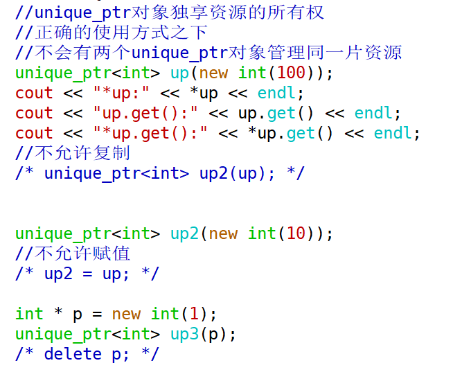


**特点3：作为容器元素**

要利用**移动语义**的特点，可以直接传递右值属性的unique_ptr作为容器的元素。如果传入左值形态的unique_ptr，会进行复制操作，而unique_ptr是不能复制的。

构建右值的方式有

1、std::move的方式

2、可以直接使用unique_ptr的构造函数，创建匿名对象（临时对象），构建右值

``` c++
	vector<unique_ptr<Point>> vec;
    unique_ptr<Point> up4(new Point(10,20));
    //up4是一个左值
    //将up4这个对象作为参数传给了push_back函数，会调用拷贝构造
    //但是unique_ptr的拷贝构造已经删除了
    //所以这样写会报错
    vec.push_back(up4);  //error
    
    vec.push_back(std::move(up4));  //ok
    vec.push_back(unique_ptr<Point>(new Point(1,3))); //ok
```

> 说明：根据我们对vector的了解，vector的元素一定在堆上，而up4是在栈上的智能指针对象，这里是发生了复制吗？
>
> ——并不是复制，unique_ptr的拷贝构造是被删除的。这里实际上要理解为移交管理权，up4不再拥有(10,20)这个Point对象的管理权。
>
> 
>
> ``` c++
> up4->print(); //error
> vec[0]->print(); //ok
> ```
>
> 

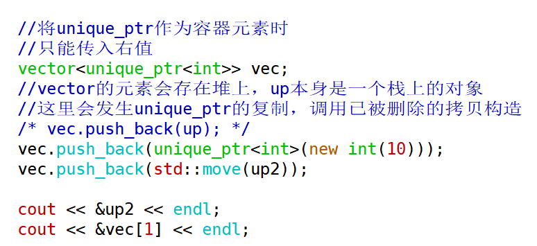


#### shared_ptr的使用（重要）

智能指针独享资源的控制权固然是一种需求，但有些场景下也需要允许共享控制权。

shared_ptr就是共享所有权的智能指针，可以进行复制或赋值，但复制或赋值时，并不是真正拷贝了被管理的对象，而只是将引用计数加1了。即shared_ptr引入了引用计数，其思想与COW技术类似，又称为是强引用的智能指针。


**特征1：共享所有权的智能指针**

可以使用**引用计数**记录对象的个数。

**特征2：可以进行复制或者赋值**

表明具备值语义。

**特征3：也可以作为容器的元素**

作为容器元素的时候，即可以传递左值，也可以传递右值。（区别于unique_ptr只能传右值）

**特征4：也具备移动语义**

表明也有移动构造函数与移动赋值函数。


``` c++
shared_ptr<int> sp(new int(10));
    cout << "sp.use_count(): " << sp.use_count() << endl;

    cout << endl;
    cout << "执行复制操作" << endl;
    shared_ptr<int> sp2 = sp;
    cout << "sp.use_count(): " << sp.use_count() << endl;
    cout << "sp2.use_count(): " << sp2.use_count() << endl;

    cout << endl;
    cout << "再创建一个对象sp3" << endl;
    shared_ptr<int> sp3(new int(30));
    cout << "sp.use_count(): " << sp.use_count() << endl;
    cout << "sp2.use_count(): " << sp2.use_count() << endl;
    cout << "sp3.use_count(): " << sp3.use_count() << endl;

    cout << endl;
    cout << "执行赋值操作" << endl;
    sp3 = sp;
    cout << "sp.use_count(): " << sp.use_count() << endl;
    cout << "sp2.use_count(): " << sp2.use_count() << endl;
    cout << "sp3.use_count(): " << sp3.use_count() << endl;

	cout << endl;
	cout << "作为容器元素" << endl;
	vector<shared_ptr<int>> vec;
	vec.push_back(sp);
	vec.push_back(std::move(sp2));
```

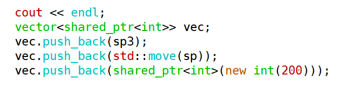


#### shared_ptr的循环引用

shared_ptr还存在一个问题 —— 循环引用问题。

> 我们建立一个Parent和Child类的一个结构
>
> ``` c++
> class Child;
> 
> class Parent
> {
> public:
> 	Parent()
> 	{ cout << "Parent()" << endl; }
> 	~Parent()
> 	{ cout << "~Parent()" << endl; }
> 	//只需要Child类型的指针，不需要类的完整定义
> 	shared_ptr<Child> _spChild;
> };
> 
> class Child
> {
> public:
> 	Child()
> 	{ cout << "child()" << endl; }
> 	~Child()
> 	{ cout << "~child()" << endl; }
> 	shared_ptr<Parent> _spParent;
> };
> ```
>
> 


> 由于shared_ptr的实现使用了引用计数，那么如果进行如下的创建
>
> 
>
> ``` c++
> shared_ptr<Parent> parentPtr(new Parent());
> shared_ptr<Child> childPtr(new Child());
> //获取到的引用计数都是1
> cout << "parentPtr.use_count():" << parentPtr.use_count() << endl;
> cout << "childPtr.use_count():" << childPtr.use_count() << endl;
> ```
>
> 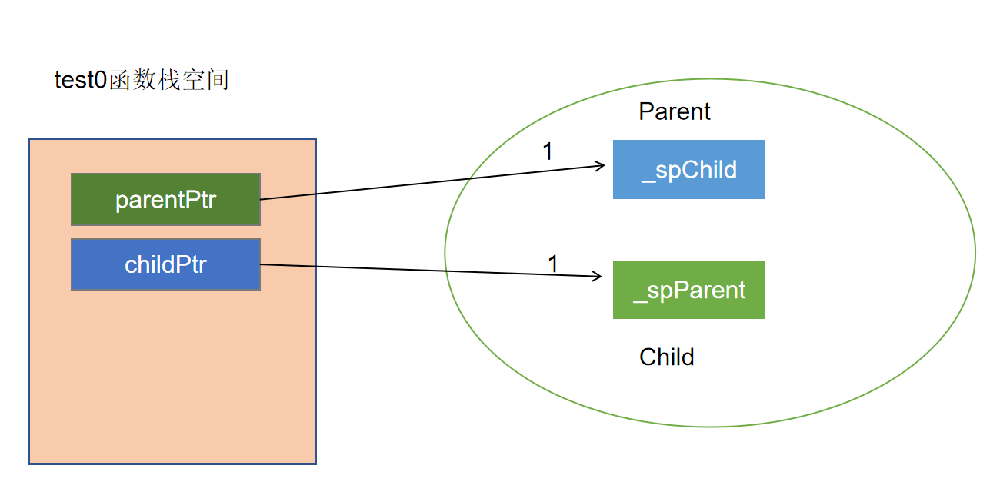
>
> 
>
> 


> ``` c++
> parentPtr->_spChild = childPtr;
> childPtr->spParent = parentPtr;
> //获取到的引用计数都是2
> cout << "parentPtr.use_count():" << parentPtr.use_count() << endl;
> cout << "childPtr.use_count():" << childPtr.use_count() << endl;
> ```
>

实际上形成了这样的结构

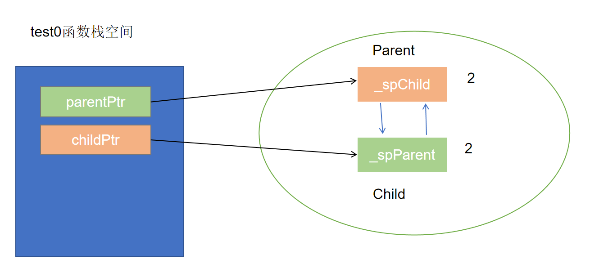

——程序结束时，发现Parent和child的析构函数都没有被调用

因为childPtr和parentPtr会先后销毁，但是堆上的Parent对象和Child对象的引用计数都变成了1，而不会减到0，所以没有回收


解决思路：

——希望某一个指针指向一片空间，能够指向，但是不会使引用计数加1，那么堆上的Parent对象和Child对象必然有一个的引用计数是1，栈对象再销毁的时候，就可以使引用计数减为0

shared_ptr无法实现这一效果，所以引入了weak_ptr.


> weak_ptr是一个弱引用的智能指针，不会增加引用计数。
>
> shared_ptr是一个强引用的智能指针。
>
> 强引用，指向一定会增加引用计数，只要有一个引用存在，对象就不能释放；
>
> 弱引用并不增加对象的引用计数，但是它知道所托管的对象是否还存活。


——循环引用的解法，将Parent类或Child类中的任意一个shared_ptr换成weak_ptr类型的智能指针

比如：将Parent类中的shared_ptr类型指针换成weak_ptr

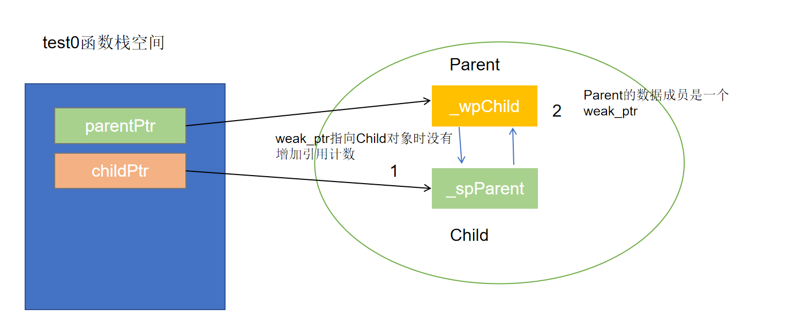


栈上的childPtr对象先销毁，会使堆上的Child对象的引用计数减1，因为这个Child对象的引用计数本来就是1，所以减为了0，回收这个Child对象，造成堆上的Parent对象的引用计数也减1

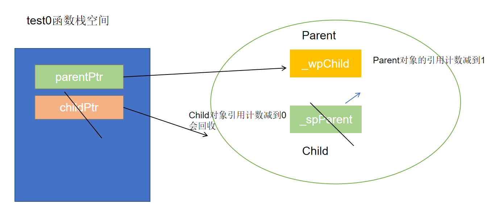


再当parentPtr销毁时，会再让堆上的Parent对象的引用计数减1，所以也能够回收。

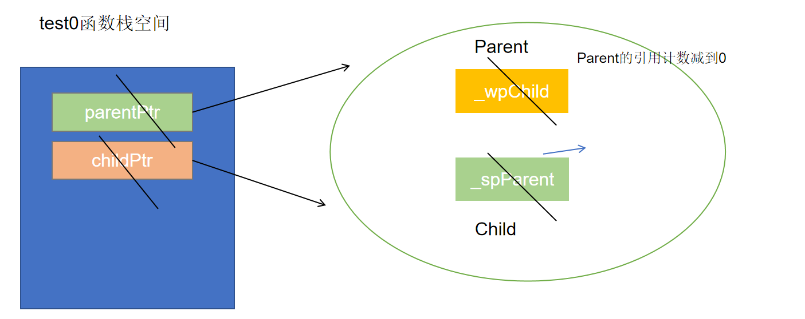


#### weak_ptr的使用

weak_ptr是弱引用的智能指针，它是shared_ptr的一个补充，使用它进行复制或者赋值时，并不会导致引用计数加1，是为了解决shared_ptr的问题而诞生的。

weak_ptr知道所托管的对象是否还存活，如果存活，必须要提升为shared_ptr才能对资源进行访问，不能直接访问。


> **初始化**
>
> ``` c++
> weak_ptr<int> wp;//无参的方式创建weak_ptr
> 
> //也可以利用shared_ptr创建weak_ptr 
> weak_ptr<int> wp2(sp);
> ```
>
> 


> **判断关联的空间是否还在**
>
> **1.可以直接使用use_count函数**
>
> 如果use_count的返回值大于0，表明关联的空间还在
>
> 
>
> **2.将weak_ptr提升为shared_ptr**
>
> ``` c++
> shared_ptr<int> sp(new int(10));
> weak_ptr<int> wp;//无参的方式创建weak_ptr
> wp = sp;//赋值
> ```
>
> 这种赋值操作可以让wp也能够托管这片空间，但是它作为一个weak_ptr仍不能够去管理，甚至连访问都不允许（weak_ptr不支持直接解引用）
>
> 想要真正地去进行管理需要使用lock函数将weak_ptr提升为shared_ptr
>
> ``` c++
> shared_ptr<int> sp2 = wp.lock();
> if(sp2){
>   cout << "提升成功" << endl;
>   cout << *sp2 << endl;
> }else{
>   cout << "提升失败，托管的空间已经被销毁" << endl;
> }
> ```
>
> 如果托管的资源没有被销毁，就可以成功提升为shared_ptr，否则就会返回一个空的shared_ptr（空指针）
>
> 
>
> **——查看lock函数的说明**
>
> ```` c++
> std::shared_ptr<T> lock() const noexcept;
> //将weak_ptr提升成一个shared_ptr，然后再来判断shared_ptr,进而知道weak_ptr指向的空间还在不在
> ````


> 3.**可以使用expired函数**
>
> > ```C++
> > bool expired() const noexcept;
> > //weak_ptr去判断托管的资源有没有被回收
> > ```
> >
> > 该函数返回true等价于use_count() == 0.
> >
> > 
> >
> > ``` c++
> > bool flag = wp.expired();
> > if(flag){
> > cout << "托管的空间已经被销毁" << endl;
> > }else{
> > cout << "托管的空间还在" << endl;
> > }
> > ```
> >
> > 


### 删除器

很多时候我们都用new来申请空间，用delete来释放。库中实现的各种智能指针，默认也都是用delete来释放空间。

但如果我们是用fopen打开文件，这时智能指针的默认处理方式就不能解决了，<font color=red>**必须为智能指针定制删除器**</font>，也就是定制化释放资源的方式。

#### unique_ptr对应的删除器

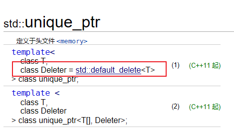

定义unique_ptr时，如果没有指定删除器参数，就会使用默认的删除器。点开std::default_delete的说明

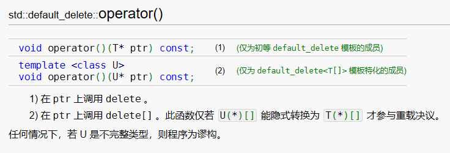

默认删除器类型重载了函数调用运算符，底层是利用函数对象实现资源回收。

根据参考文档的说明，无论接管的是什么类型的资源，回收时都是会执行delete语句或delete [ ]


> 看下面这个例子
>
> ``` c++
> //文件指针原本的用法，ok
> void test0(){
> string msg = "hello,world\n";
> FILE * fp = fopen("res1.txt","a+");
> fwrite(msg.c_str(),1,msg.size(),fp);
> fclose(fp);
> }
> ```
>
> 
>
> 如果使用unique_ptr托管文件资源
>
> ``` c++
> //用unique_ptr托管文件资源，回收时有问题
> void test1(){
> string msg = "hello,world\n";
> unique_ptr<FILE> up(fopen("res2.txt","a+"));
> //get函数可以从智能指针中获取到裸指针
> fwrite(msg.c_str(),1,msg.size(),up.get());
> //fclose(up.get()); 
> }
> ```
>
> 
>
> 一般地，智能指针的特点就是可以自动回收托管的资源，所以在接管资源后应该可以不用手动fclose
>
> 但是这样做会有<font color=red>**一个问题**</font> —— 内容msg并没有写到文件中去。
>
> 回顾一下fclose函数，如果没有fclose的调用，msg的内容存在缓冲区中，并不会刷新到文件流中。
>
> 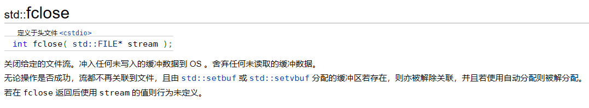
>
> —— 如果显式进行fclose，则会出现double free的问题。
>
> 已回收的文件资源，由默认的删除器又会尝试进行一次回收。


> 问题的根本原因：接管文件资源时，智能指针在析构时也是使用delete语句来回收资源，导致错误
>
> ——需要自定义删除器
>
> 仿照参考文档上默认删除器的示例，创建一个代表删除器的struct，定义operator()函数
>
> ``` c++
> struct FILECloser{
>  void operator()(FILE * fp){
>      if(fp){
>          fclose(fp);
>          cout << "fclose(fp)" << endl;
>      }
>  }
> };
> ```
>

> 创建unique_ptr接管文件资源时，删除器参数使用我们自定义的删除器
>
> ``` c++
> void test1(){
>  string msg = "hello,world\n";
>  unique_ptr<FILE，FILECloser> up(fopen("res2.txt","a+"));
>  //get函数可以从智能指针中获取到裸指针
>  fwrite(msg.c_str(),1,msg.size(),up.get());
> }
> ```
>


> 或者这样使用，与default_delete保持一致
>
> 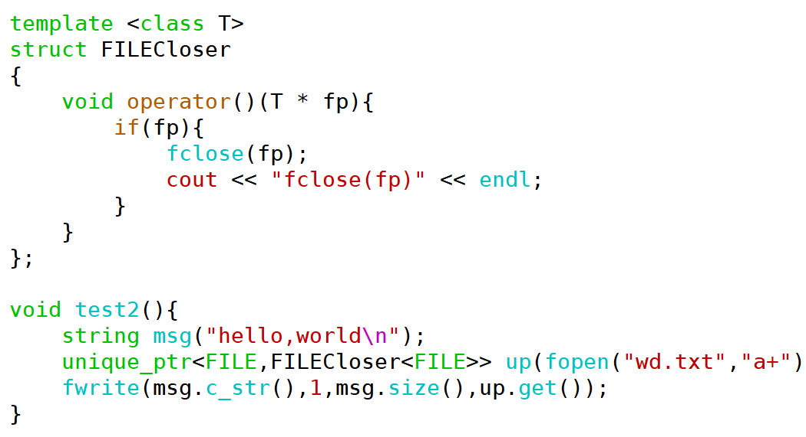


> <span style=color:red;background:yellow>**总结：**</span>
>
> 如果管理的是普通的资源，不需要写出删除器，就使用默认的删除器即可，只有针对FILE或者socket这一类创建的资源，才需要改写删除器，使用fclose之类的函数。

#### shared_ptr对应的删除器

> <span style=color:red;background:yellow>**unique_ptr 和 shared_ptr区别：**</span>
>
> 对于unique_ptr，删除器是模板参数
>
> 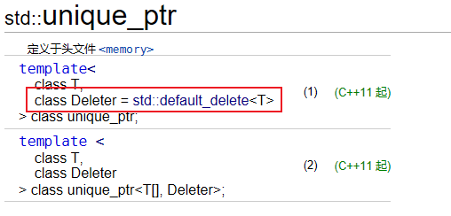

> 对于shared_ptr，删除器是构造函数参数
>
> 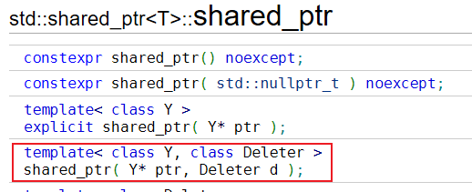


所以传入删除器参数的位置不同

``` c++
void test1(){
    string msg = "hello,world\n";
    //在unique_ptr的模板参数中加入删除器类
    unique_ptr<FILE，FILECloser> up(fopen("res2.txt","a+"));
    fwrite(msg.c_str(),1,msg.size(),up.get());
}


void test2(){
    string msg = "hello,world\n";
    FILECloser fc;
    //在shared_ptr的构造函数参数中加入删除器对象
    shared_ptr<FILE> sp(fopen("res3.txt","a+"),fc);
    fwrite(msg.c_str(),1,msg.size(),sp.get());
}
```

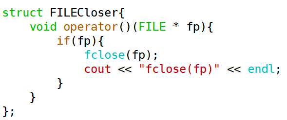


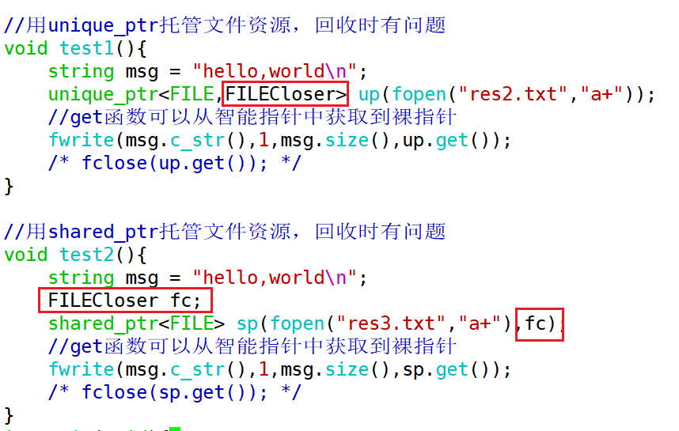


###  智能指针的误用

智能指针被误用的情况，<span style=color:red;background:yellow>**原因都是将一个原生裸指针交给了不同的智能指针进行托管，而造成尝试对一个对象销毁两次**</span>。


对于shared_ptr与unique_ptr都会产生这个问题。

> —— unique_ptr要注意的误用
>
> ``` c++
>void test0(){
> //需要人为注意避免
> Point * pt = new Point(1,2);
> unique_ptr<Point> up(pt);
> unique_ptr<Point> up2(pt);
> }
> 
> void test1(){
> unique_ptr<Point> up(new Point(1,2));
> unique_ptr<Point> up2(new Point(1,2));
> //让两个unique_ptr对象托管了同一片空间
> up.reset(up2.get());
> }
> ```
> 
> 


> ——shared_ptr要注意的误用
>
> 使用不同的智能指针托管同一片堆空间,只能通过shared_ptr开放的接口——拷贝构造、赋值运算符函数
>
> 如果是用裸指针的形式将一片资源交给不同的智能指针对象管理，即使是shared_ptr也是不行的。
>
> <span style=color:red;background:yellow>**之前进行的shared_ptr的复制、赋值的参数都是shared_ptr的对象，不能直接多次把同一个裸指针传给它的构造。**</span>
>
> 
>
> ``` c++
> void test2(){
> Point * pt = new Point(10,20);
> shared_ptr<Point> sp(pt);
> shared_ptr<Point> sp2(pt);
> }
> 
> void test3(){
> //使用不同的智能指针托管同一片堆空间
> shared_ptr<Point> sp(new Point(1,2));
> shared_ptr<Point> sp2(new Point(1,2));
> sp.reset(sp2.get());
> }
> ```
>
> 


—— **还有一种不那么明显的误用**

> 给Point类加入了这样的成员函数
>
> ``` c++
>Point * addPoint(Point * pt){
> 	_ix += pt->_ix;
> 	_iy += pt->_iy;
> 	return this;
> }
> ```
> 
> 
>
> 使用时，这样还是使得sp3和sp同时托管了同一个堆对象
>
> ```` c++
>shared_ptr<Point> sp(new Point(1,2));    
> shared_ptr<Point> sp2(new Point(3,4));
> 
> //创建sp3的参数实际上是sp所对应的裸指针
> //效果还是多个智能指针托管了同一块空间
> shared_ptr<Point> sp3(sp->addPoint(sp2.get()));
> cout << "sp3 = ";
> sp3->print();
> ````
> 
> 
>
> ——需要给sp3的构造函数传入`shared_ptr<Point>` 对象，而不是裸指针


> <span style=color:red;background:yellow>**解决思路：**</span>
>
> **通过this指针获取本对象的shared_ptr**
>
> 可以修改Point中的addPoint函数
>
> ``` c++
> shared_ptr<Point> addPoint(Point * pt){
> 	_ix += pt->_ix;
> 	_iy += pt->_iy;
> 	return shared_ptr<Point>(this); //匿名的shared_ptr对象与sp共用同一个裸指针
> }
> 
> /////////////////
> shared_ptr<Point> sp(new Point(1,2));    
> shared_ptr<Point> sp2(new Point(3,4));
> 
> shared_ptr<Point> sp3(sp->addPoint(sp2.get()));
> cout << "sp3 = ";
> sp3->print();
> 
> ```
>
> 但是这样写，在addPoint函数中创建的匿名智能指针对象接收的还是sp对应的裸指针，那么这个匿名对象和sp所托管的空间还是同一片空间。匿名对象在函数return时调用移动构造创建出副本，副本与sp还是共用一个裸指针。
>
> addPoint函数返回值销毁时会delete一次，sp销毁时又会尝试delete一次。
>
> 
>
> **验证方式**
>
> ``` c++
> sp->addPoint(sp2.get())；
> delete sp.get(); //double free，因为addPoint函数返回值在销毁时已经回收了sp所管理的Point对象的空间了
> ```


<span style=color:red;background:yellow>**解决方法：**</span>

> ——使用智能指针辅助类enable_shared_from_this的成员函数shared_from_this
>
> 
>
> 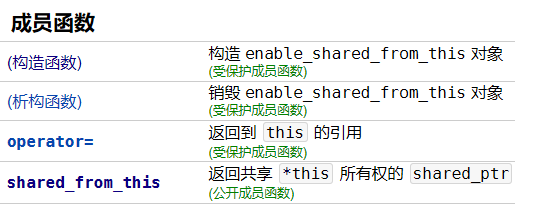
>
> 在Point的addPoint函数中需要使用shared_from_this函数返回的shared_ptr作为返回值，要想在Point类中调用enable_shared_from_this的成员函数，最佳方案可以让Point类继承enable_shared_from_this类。
>
> 这样修改addPoint函数后，问题解决。
>
> ``` c++
> class Point 
> : public std::enable_shared_from_this<Point> 
> {
> public:
> 	//...
> 	shared_ptr<Point> addPoint(Point & pt) {
> 		_ix += pt._ix;
> 		_iy += pt._iy;
> 		return shared_from_this();
> 	}
> };
> ```
>
> 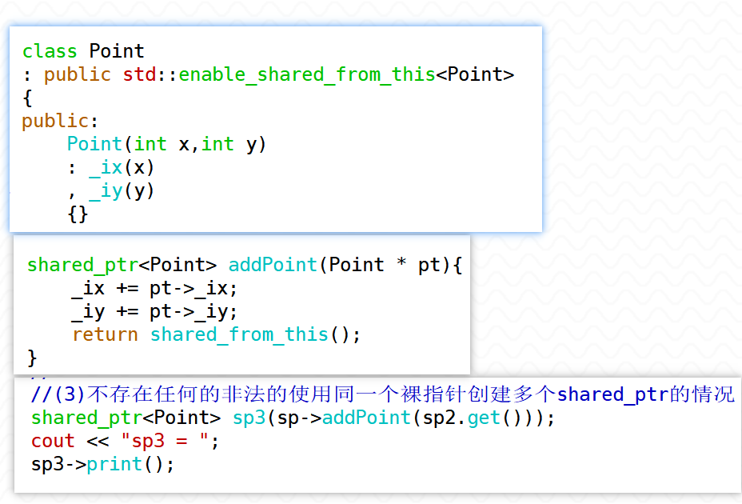
>
> 
>
> **总结：智能指针的误用全都是使用了不同的智能指针托管了同一块堆空间（同一个裸指针）。**


