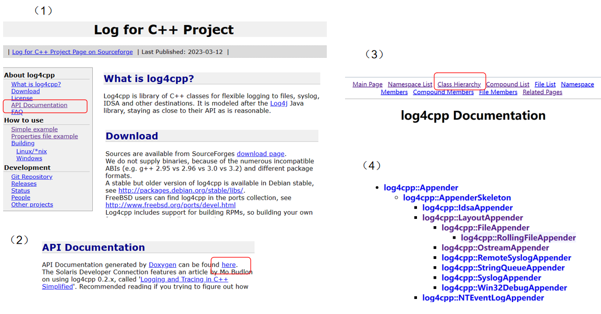
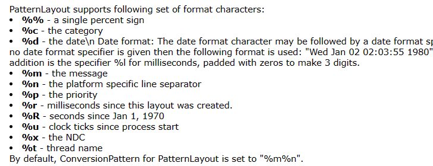

# 第四章 日志系统

日志系统在整个系统架构中的重要性可以称得上基础的基础，但是这一点，都容易被大多数人所忽视。因为日志在很多人看来只是printf，在系统运行期间，很难一步一步地调试，只能根据系统的运行轨迹来推断错误出现的位置，而日志往往也是最重要的参考资料。


日志系统主要解决的问题就是记录系统的运行轨迹，在这个基础上，进行跟踪分析错误，审计系统运行流程。一般在高可靠的系统中，是不允许系统运行终止的，所以也会产生海量的日志。

日志系统的内容可以分为两类：

1. 业务级别的日志，主要供终端用户来分析他们业务过程；
2. 系统级别的日志，供开发者维护系统的稳定。

由于日志系统的数据输出量比较大，所以不能不考虑对整个系统性能的影响。从另外一方面来看，海量的日志内容有时候并不件好事，因为，很容易覆盖真实问题的蛛丝马迹，也增加日志阅读者信息检索的困难。所以日志系统的设计需要挑选一个合适的工具，并进行合理的设计。


在github上有一个项目叫awesome-cpp，其中收录了与cpp有关的各种项目，在其中有一个logging分类，列举了各种常用的日志系统工具。

我们的课程中学习log4cpp，之后的项目阶段将会使用到。

[fffaraz/awesome-cpp: A curated list of awesome C++ (or C) frameworks, libraries, resources, and shiny things. Inspired by awesome-... stuff. (github.com)](https://github.com/fffaraz/awesome-cpp?tab=readme-ov-file#logging)


##  日志系统的设计

日志系统的设计，一般而言要抓住最核心的一条，就是**日志从产生到到达最终目的地期间的处理流程**。一般而言，为了设计一个灵活可扩展，可配置的日志库，主要将日志库分为4个部分去设计，分别是：记录器、过滤器、格式化器、输出器四部分。

**记录器（日志来源）**：负责产生日志记录的原始信息，比如（原始信息，日志优先级，时间，记录的位置）等等信息。

**过滤器（日志系统优先级）**：负责按指定的过滤条件过滤掉我们不需要的日志。

**格式化器（日志布局）**：负责对原始日志信息按照我们想要的格式去格式化。

**输出器（日志目的地）**：负责将将要进行记录的日志（一般经过过滤器及格式化器的处理后）记录到日志目的地（例如：输出到文件中）。


下面以一条日志的生命周期为例说明日志库是怎么工作的。

一条日志的生命周期：

1.  产生：info(“log information.”)；
2.  经过记录器，记录器去获取日志发生的时间、位置、线程信息等等信息；
3.  经过过滤器，决定是否记录；
4.  经过格式化器处理成设定格式后传递给输出器。例如输出“2018-3-22 10:00:00 [info] log information.”这样格式的日志到文件中。日志的输出格式由格式化器实现，输出目的地则由输出器决定；
5.  这条日志信息生命结束。


##  log4cpp的安装

下载压缩包

下载地址：https://sourceforge.net/projects/log4cpp/files/

安装步骤

```C++
$ tar xzvf log4cpp-1.1.4rc3.tar.gz

$ cd log4cpp

$ ./configure  //进行自动化构建，自动生成makefile

$ make

$ sudo make install //安装  把头文件和库文件拷贝到系统路径下
    
//安装完后
//默认头文件路径：/usr/local/include/log4cpp
//默认lib库路径：/usr/local/lib
```

打开log4cpp官网[Log for C++ Project (sourceforge.net)](https://log4cpp.sourceforge.net/)

拷贝simple example的内容，编译运行

编译指令：<span style=color:red;background:yellow>** g++ log4cppTest.cc -llog4cpp -lpthread**</span>


<font color=red>**可能报错：找不到动态库**</font>

解决方法：

**cd  /etc**


<span style=color:red;background:yellow>**sudo vim ld.so.conf**</span>

将默认的lib库路径写入，再重新加载


**sudo ldconfig**

让动态链接库为系统所共享

ld.so.cache 执行了sudo ldconfig之后，会更新该缓存文件，会将所有动态库信息写入到该文件。当可执行程序需要加载相应动态库时，会从这里查找。

完成这些操作后，再使用上面的编译指令去编译示例代码


##  log4cpp的核心组件

官网的simple example中包含了四个核心组件，这个代码需要完全理解其用法。

利用已学过的类与对象的知识对这段示例代码进行解读和推测。

```C++
// main.cpp

#include "log4cpp/Category.hh"
#include "log4cpp/Appender.hh"
#include "log4cpp/FileAppender.hh"
#include "log4cpp/OstreamAppender.hh"
#include "log4cpp/Layout.hh"
#include "log4cpp/BasicLayout.hh"
#include "log4cpp/Priority.hh"

int main(int argc, char** argv) {
	log4cpp::Appender *appender1 = new log4cpp::OstreamAppender("console", &std::cout);
	appender1->setLayout(new log4cpp::BasicLayout());

	log4cpp::Appender *appender2 = new log4cpp::FileAppender("default", "program.log");
	appender2->setLayout(new log4cpp::BasicLayout());

	log4cpp::Category& root = log4cpp::Category::getRoot();
	root.setPriority(log4cpp::Priority::WARN);
	root.addAppender(appender1);

	log4cpp::Category& sub1 = log4cpp::Category::getInstance(std::string("sub1"));
	sub1.addAppender(appender2);

	// use of functions for logging messages
	root.error("root error");
	root.info("root info");
	sub1.error("sub1 error");
	sub1.warn("sub1 warn");

	// printf-style for logging variables
	root.warn("%d + %d == %s ?", 1, 1, "two");

	// use of streams for logging messages
	root << log4cpp::Priority::ERROR << "Streamed root error";
	root << log4cpp::Priority::INFO << "Streamed root info";
	sub1 << log4cpp::Priority::ERROR << "Streamed sub1 error";
	sub1 << log4cpp::Priority::WARN << "Streamed sub1 warn";

	// or this way:
	root.errorStream() << "Another streamed error";

	return 0;
}
```


### 日志目的地（Appender）

通过log4cpp官网查看常用类的信息




我们关注这三个目的地类，点开后查看它们的构造函数

**• OstreamAppender                        C++通用输出流(如 cout)**

**• FileAppender                                  写到本地文件中**

**• RollingFileAppender                     写到回卷文件中**


> - OstreamAppender的构造函数传入两个参数：目的地名（随便写）、输出流指针
>
> - FileAppender的构造函数传入两个参数：目的地名、保存日志的文件名（后面两个参数使用默认值即可，分别表示以结尾附加的方式的保存日志，当前用户读写-其他用户只读）
>
> 
>
> 
>
> - RollingFileAppender稍复杂一些，如果没有回卷文件，将所有的日志信息都保存在一个文件中，那么随着系统的运行，产生越来越多的日志，本地日志文件会越变越大，若不加限制，则会大量占用存储空间。所以通常的做法是使用回卷文件，比如只给日志文件1G的空间，对于这1G的空间可以再次进行划分，比如使用10个文件存储日志信息，每一个文件最多100M.
>
> RollingFileAppender构造函数的参数如上图，其中要注意的是回卷文件个数，如果这一位传入的参数是9，那么实际上会有10个文件保存日志。
>
> 回卷的机制是：先生成一个wd.log文件，该文件存满后接着写入日志，那么wd.log文件改名为wd.log.1，然后再创建一个wd.log文件，将日志内容写入其中，wd.log文件存满后接着写入日志，wd.log.1文件改名为wd.log.2，wd.log改名为wd.log.1，再创建一个wd.log文件，将最新的日志内容写入。以此类推，直到wd.log和wd.log.1、wd.log.2、... wd.log.9全都存满后再写入日志，wd.log.9（其中实际上保存着最早的日志内容）会被舍弃，编号在前的回卷文件一一进行改名，再创建新的wd.log文件保存最新的日志信息。


### 日志布局（Layout）

示例代码中使用的是BasicLayout，也就是默认的日志布局，这样一条日志最开始的信息就是日志产生时距离1970.1.1的秒数，不方便观察。

实际使用时可以用<span style=color:red;background:yellow>**PatrrenLayout**</span>对象来定制化格式，类似于printf的格式化输出




使用new语句创建日志布局对象，通过指针调用setConversionPattern函数来设置日志布局


``` c++
PatternLayout * ptn1 = new PatternLayout();
ptn1->setConversionPattern("%d %c [%p] %m%n"); 
```

setConversionPattern函数接收一个string作为参数，格式化字符的意义如下：

**%d %c [%p] %m%n**

**时间 模块名 优先级 消息本身 换行符**


<span style=color:red;background:yellow>**注意（极易出错）：**</span>

> 当日志系统有多个日志目的地时，每一个目的地Appender都需要设置一个布局Layout（一对一关系）


### 日志记录器（Category）

创建Category对象时，可以用getRoot先创建root模块对象，对root模块对象设置优先级和目的地；

再用getInstance创建叶模块对象，叶模块对象会继承root模块对象的优先级和目的地，可以再去修改优先级、目的地

补充：如果没有创建根对象，直接使用getInstance创建叶对象，会先隐式地创建一个Root对象。

**子Category可以继承父Category的信息：优先级、目的地**


官网示例代码中Category对象的创建：先创建根对象，再创建叶对象

``` c++
log4cpp::Category& root = log4cpp::Category::getRoot();
root.setPriority(log4cpp::Priority::WARN);
root.addAppender(appender1);

log4cpp::Category& sub1 = log4cpp::Category::getInstance(std::string("sub1")); //传入的字符串sub1就会是日志中记录下的日志来源
sub1.addAppender(appender2);
```


也可以一行语句创建叶对象

``` c++
log4cpp::Category& sub1 = log4cpp::Category::getRoot().getInstance("salesDepart"); //记录的日志来源会是salesDepart
sub1.setPriority(log4cpp::Priority::WARN);
sub1.addAppender(appender1);
```


这里需要注意的是，例子中sub1本质上是绑定Category对象的引用，在代码中利用sub1去进行设置优先级、添加目的地、记录日志等操作；

getInstance的参数salesDepart表示的是日志信息中记录的Category名称，也就是日志来源 —— 对应了布局中的%c

所以一般在使用时这两者的名称取同一个名称，统一起来，能够更清楚地知道该条日志是来源于salesDepart这个模块


### 日志优先级（Priority）

对于 log4cpp 而言，有两个优先级需要注意，一个是日志记录器的优先级，另一个就是某一条日志的优先级。Category对象就是日志记录器，在使用时须设置好其优先级；某一行日志的优先级，就是Category对象在调用某一个日志记录函数时指定的级别，如 logger.debug("this is a debug message") ，这一条日志的优先级就是DEBUG级别的。简言之：

**日志系统有一个优先级A，日志信息有一个优先级B**

**只有B高于或等于A的时候，这条日志才会被输出（或保存），当B低于A的时候，这条日志会被过滤；**

```C++
class LOG4CPP_EXPORT Priority {
public:
	typedef enum {
			EMERG = 0,
			FATAL = 0,
			ALERT = 100,
			CRIT = 200,
			ERROR = 300,
			WARN = 400,
			NOTICE = 500,
			INFO = 600,
			DEBUG = 700,
			NOTSET = 800 //这个不代表可以使用的优先级
	} PriorityLevel;
	//......
};  //数值越小，优先级越高；数值越大，优先级越低
```


##  定制日志系统

模仿示例代码的形式去设计定制化的日志系统


在设计日志系统时多次使用了new语句，这些核心组件的构造函数具体细节我们也并不清楚，但可以知道的是这个过程必然会申请资源，所以规范的写法在日志系统退出时要调用shutdown回收资源。

## log4cpp的单例实现

留下一个比较有挑战性的作业：

用所学过的类和对象的知识，封装log4cpp，实现一个单例的效果。能够输出到终端，还能保存到文件。让其使用起来更方便，要求：可以像printf一样，同时输出的日志信息中最好能有文件的名字，函数的名字及其所在的行号(这个在C/C++里面有对应的宏，可以查一下)

代码模板：

```C++
class Mylogger
{
public:
	void warn(const char *msg);
	void error(const char *msg);
	void debug(const char *msg);
	void info(const char *msg);
	
private:
	Mylogger();
	~Mylogger();
    
private:
	//...
};

void test0()
{
    //第一步，完成单例模式的写法
    Mylogger *log = Mylogger::getInstance();

    log->info("The log is info message");
    log->error("The log is error message");
    log->fatal("The log is fatal message");
    log->crit("The log is crit message");
    
    //规范使用单例模式的写法
    Mylogger::getInstance()->info("The log is info message");
}

void test1() 
{
    printf("hello,world\n");
    //第二步，像使用printf一样
    //只要求能输出纯字符串信息即可，不需要做到格式化输出
    LogInfo("The log is info message");
    LogError("The log is error message");
    LogWarn("The log is warn message");
    LogDebug("The log is debug message");
}

//最终希望的效果
 //LogDebug("The log is debug message");
//日期 记录器名字 [优先级] 文件名 函数名 行号 日志信息
```


## log4cpp配置文件读取

如果想要更灵活地使用log4cpp，可以使用读取配置文件的方式


配置文件

``` c++
//log4cpp.properties
log4cpp.rootCategory=DEBUG, rootAppender
log4cpp.category.sub1=DEBUG, A1, A2
log4cpp.category.sub1.sub2=DEBUG, A3

log4cpp.appender.rootAppender=ConsoleAppender
log4cpp.appender.rootAppender.layout=PatternLayout
log4cpp.appender.rootAppender.layout.ConversionPattern=%d [%p] %m%n 

log4cpp.appender.A1=FileAppender
log4cpp.appender.A1.fileName=A1.log
log4cpp.appender.A1.layout=BasicLayout

log4cpp.appender.A2=FileAppender
log4cpp.appender.A2.threshold=WARN
log4cpp.appender.A2.fileName=A2.log
log4cpp.appender.A2.layout=PatternLayout
log4cpp.appender.A2.layout.ConversionPattern=%d [%p] %m%n 

log4cpp.appender.A3=RollingFileAppender
log4cpp.appender.A3.fileName=A3.log
log4cpp.appender.A3.maxFileSize=200
log4cpp.appender.A3.maxBackupIndex=1
log4cpp.appender.A3.layout=PatternLayout
log4cpp.appender.A3.layout.ConversionPattern=%d [%p] %m%n 
```


读取代码

``` c++
#include <log4cpp/Category.hh>
#include <log4cpp/PropertyConfigurator.hh>

int main(int argc, char* argv[])
{
	std::string initFileName = "log4cpp.properties";
	log4cpp::PropertyConfigurator::configure(initFileName);

	log4cpp::Category& root = log4cpp::Category::getRoot();

	log4cpp::Category& sub1 = 
		log4cpp::Category::getInstance(std::string("sub1"));

	log4cpp::Category& sub2 = 
		log4cpp::Category::getInstance(std::string("sub1.sub2"));

	root.warn("Storm is coming");

	sub1.debug("Received storm warning");
	sub1.info("Closing all hatches");

	sub2.debug("Hiding solar panels");
	sub2.error("Solar panels are blocked");
	sub2.debug("Applying protective shield");
	sub2.warn("Unfolding protective shield");
	sub2.info("Solar panels are shielded");

	sub1.info("All hatches closed");

	root.info("Ready for storm.");

	log4cpp::Category::shutdown();

	return 0;
}
```


