# 第五章 运算符重载

## 友元

- 什么叫友元？

一般来说，类的私有成员只能在类的内部访问，类之外是不能访问它们的。但如果将其他类/函数设置为类的友元，那么友元类/函数就可以在前一个类的类定义之外访问其私有成员了。<span style=color:red;background:yellow>**用friend关键字声明友元**</span>。

将类比作一个家庭，类的private 成员相当于家庭的秘密，一般的外人当然不允许探听这些秘密的，只有 friend 才有资格探听这些秘密。


友元的三种形式：**普通函数、成员函数、友元类**

### 友元之普通函数形式

示例：程序中有Point类，需要求取两个点的距离。按照设想，我们定义一个普通函数distance，接收两个Point对象作为参数，通过公式计算这两个点之间的距离。但Point的_ix和 _iy是私有成员，在类外不能通过对象访问，那么可以将distance函数声明为Point类的友元函数，之后就可以在distance函数中访问Point的私有成员了。

``` c++
class Point{
public:
    Point(int x, int y)
    : _ix(x)
    , _iy(y)
    {}

    friend
    float distance(const Point & lhs, const Point & rhs);
private:
    int _ix;
    int _iy;
};

float distance(const Point & lhs, const Point & rhs){
    return sqrt((lhs._ix - rhs._ix)*(lhs._ix - rhs._ix) +
                (lhs._iy - rhs._iy)*(lhs._iy - rhs._iy));
}
```

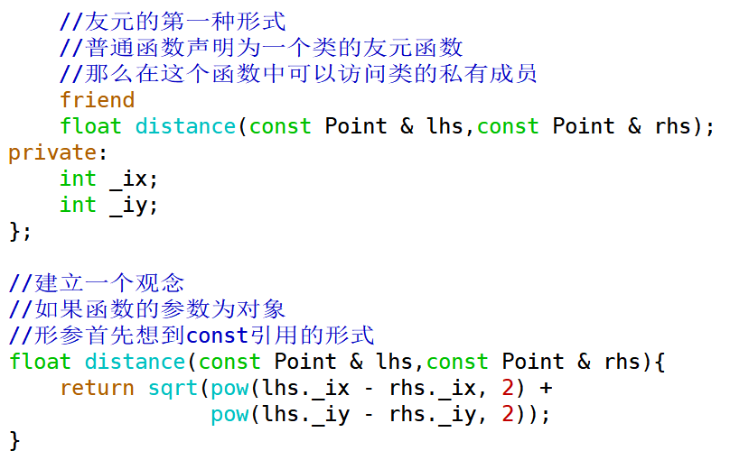

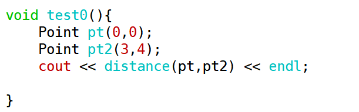


### 友元之成员函数形式

假设类A有一个成员函数，该成员函数想去访问另一个类B类中的私有成员变量。这时候则可以在第二个类B中，声明第一个类A的那个成员函数为类B的友元函数，这样第一个类A的某个成员函数就可以访问第二个类B的私有成员变量了。


我们试验一下，以另一种方式实现上面的需求，如果distance函数不再是一个普通函数，而是Line类的一个成员函数，也就是说需要在一个类（Line）的成员函数中访问另一个类（Point）的私有成员，那么又该如何实现呢？

- 如果将Point类定义在Line类之前，Line类的成员函数要访问Point类的私有成员，需要在Point类中将Line的这个成员函数设为友元函数——此时编译器并不认识Line类；

- 如果将Line类定义在Point类之前，那么distance函数需要接受两个const Point &作为参数——此时编译器不认识Point类；


解决方法：

——在Line前面做一个Point类的前向声明；

——但如果将distance的函数体写在Line类中，编译器虽然知道了有一个Point类，但并不知道Point类具体有什么成员，所以此时在函数体中访问_ix、 _iy都会报错，编译器并不认识它们；

思考一下，有什么办法可以解决这个问题呢？

``` c++
//前向声明
class Point;

class Line{
public:
	float distance(const Point & lhs, const Point & rhs){
        return sqrt((lhs._ix - rhs._ix)*(lhs._ix - rhs._ix) +   //error，有问题，不知道Point的具体实现
                (lhs._iy - rhs._iy)*(lhs._iy - rhs._iy));
    }
};

class Point{
public:
    Point(int x, int y)
    : _ix(x)
    , _iy(y)
    {}

    friend float Line::distance(const Point & lhs, const Point & rhs);
private:
    int _ix;
    int _iy;
};

```


补充：

前向声明的用处：进行了前向声明的类，可以以引用或指针的形式作为函数的参数，只要不涉及到对该类对象具体成员的访问，编译器可以通过。

（让编译器认识这个类，但是注意如果只进行前向声明，这个类的具体实现没有的话，无法使用这个类的对象，无法创建）


```` c++
//前向声明
class Point;

class Line{
public:
	float distance(const Point & lhs, const Point & rhs)；

};

class Point{
public:
    Point(int x, int y)
    : _ix(x)
    , _iy(y)
    {}

    friend float Line::distance(const Point & lhs, const Point & rhs);
private:
    int _ix;
    int _iy;
};

	float Line::distance(const Point & lhs, const Point & rhs){
        return sqrt((lhs._ix - rhs._ix)*(lhs._ix - rhs._ix) +  
                (lhs._iy - rhs._iy)*(lhs._iy - rhs._iy));
    }
````


<span style=color:red;background:yellow>**注意：友元的声明要注意和函数的形式完全对应上。**</span>

### 友元类

如上的例子，假设类 Line 中不止有一个 distance 成员函数，还有其他成员函数，它们都需要访问Point 的私有成员，如果还像上面的方式一个一个设置友元，就比较繁琐了，可以直接将 Line 类设置为 Point 的友元类，在工作中这也是更常见的方法。

``` c++
class Point {
	//...
	friend class Line;
	//...
};
```

在Point类中声明Line类是本类的友元类，那么Line类中的所有成员函数中都可以访问Point类的私有成员。一次声明，全部解决。

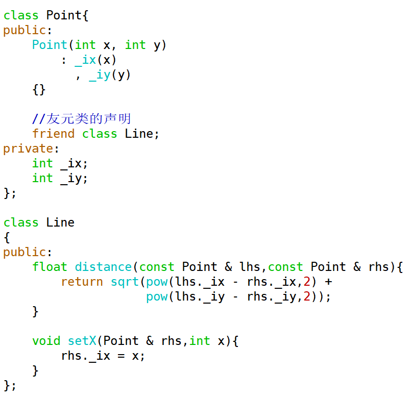

不可否认，友元将类的私有成员暴露出来，在一定程度上破坏了信息隐藏机制，似乎是种“副作用很大的药”，但俗话说“良药苦口”。好工具总是要付出点代价的，拿把锋利的刀砍瓜切菜，总是要注意不要割到手指的。

友元的存在，使得类的接口扩展更为灵活，使用友元进行运算符重载从概念上也更容易理解一些，而且， C++ 规则已经极力地将友元的使用限制在了一定范围内。


### 友元的特点

1. **友元不受类中访问权限的限制**——可访问私有成员
2. **友元破坏了类的封装性**
3. **不能滥用友元 ，友元的使用受到限制**
4. **友元是单向的**——A类是B类的友元类，则A类成员函数中可以访问B类私有成员；但并不代表B类是A类的友元类，如果A类中没有声明B类为友元类，此时B类的成员函数中并不能访问A类私有成员
5. **友元不具备传递性**——A是B的友元类，B是C的友元类，无法推断出A是C的友元类
6. **友元不能被继承**——因为友元破坏了类的封装性，为了降低影响，设计层面上友元不能被继承


## 运算符重载

### 运算符重载的介绍

C++ 预定义中的运算符的操作对象只局限于基本的内置数据类型，但是对于自定义的类型是没有办法操作的。当然我们可以定义一些函数来实现这些操作，但考虑到用运算符表达含义的方式很简洁易懂，当定义了自定义类型时，也希望这些运算符能被自定义类类型使用，以此提高开发效率，增加代码的可复用性。为了实现这个需求，C++提供了运算符重载。其指导思想是：<span style=color:red;background:yellow>**希望自定义类类型在操作时与内置类型保持一致**</span>。


能够重载的运算符有42个

| +    | -    | *    | /      | %     | ^        |
| ---- | ---- | ---- | ------ | ----- | -------- |
| &    | \|   | ~    | !      | =     | <        |
| >    | +=   | -=   | *=     | /=    | %=       |
| ^=   | &=   | \|=  | >>     | <<    | >>=      |
| <<=  | ==   | !=   | >=     | <=    | &&       |
| \|\| | ++   | --   | ->*    | ->    | ,        |
| []   | ()   | new  | delete | new[] | delete[] |

不能重载的运算符包括

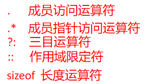

记法：**带点的运算符不能重载，加上sizeof**


### 运算符重载的规则与形式（重点）

- **运算符重载有以下规则**

1. 运算符重载时 ，<font color=red>**其操作数类型必须要有自定义类类型或枚举类型**</font> ——不能全都是内置类型

2. 其优先级和结合性还是固定不变的       a ==   b + c

3. <font color=red>**操作符的操作数个数是保持不变的**</font>

4. <font color=red>**运算符重载时 ，不能设置默认参数**</font>     ——如果设置了默认值，其实也就是改变了操作数的个数

5. 逻辑与 && 逻辑或 || 就不再具备短路求值特性 ，进入函数体之前必须完成所有函数参数的计算, 不推荐重载

6. 不能臆造一个并不存在的运算符         @ $ 、

   

- **运算符重载的形式**

运算符重载的形式有三种：

1. <span style=color:red;background:yellow>**采用友元函数的重载形式**</span>
2. 采用普通函数的重载形式
3. <span style=color:red;background:yellow>**采用成员函数的重载形式**</span>

以加法运算符为例，认识这三种形式。

### +运算符重载

需求：实现一个复数类，复数分为实部和虚部，重载+运算符，使其能够处理两个复数之间的加法运算（实部加实部，虚部加虚部）

#### 友元函数实现

我们可以定义一个普通函数，接收两个复数类对象，在这个函数中定义计算逻辑。因为要在类外访问Complex的私有成员，故可以将这个普通函数设为Complex的友元函数

``` c++
class Complex{
    //...
    friend Complex add(const Complex & lhs, const Complex & rhs);
    //...
};

Complex add(const Complex & lhs, const Complex & rhs){
    //...
}

void test0(){
    Complex cx(1,2);
    Complex cx2(3,4);
    Complex cx3 = add(cx,cx2); //这样就可以计算两个Complex对象的加法了
}
```


还想要更直观、更简洁一些，那么可以定义一个相应的运算符重载函数（operator+），就可以直接使用+完成这两个对象的加法运算了

``` c++
class Complex{
    //...
    friend Complex operator+(const Complex & lhs, const Complex & rhs);
    //...
};

Complex operator+(const Complex & lhs, const Complex & rhs){
    //...
}

void test0(){
    Complex cx(1,2);
    Complex cx2(3,4);
    Complex cx3 = cx + cx2; //看上去和内置类型的计算一样了
    //Complex cx3 = operator+(cx,cx2);   //本质上是调用了operator+函数
}
```

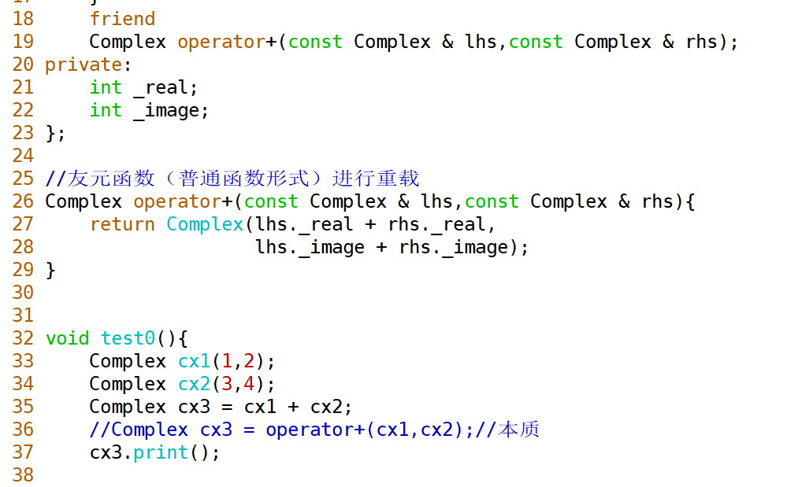


> **运算符重载的本质是定义一个运算符重载函数，定义的步骤如下**
>
> 1. 先确定这个函数的返回值是什么类型（加法运算返回值应该是一个临时的Complex对象，所以此处返回类型为Complex）
> 2. 再写上函数名（operator + 运算符，此处就是**operator+**）
> 3. 再补充参数列表（考虑这个运算符有几个操作数，此处加法运算应该有两个操作数，分别是两个Complex对象，因为加法操作不改变操作数的值，可以用const引用作为形参）
> 4. 最后完成函数体的内容（此处直接调用Complex构造函数创建一个新的对象作为返回值）。
>
> 
>
> ——在定义的operator+函数中需要访问Complex类的私有成员，要进行友元声明
>
> <span style=color:red;background:yellow>**像加号这一类不会修改操作数的值的运算符，倾向于采用友元函数的方式重载。**</span>


#### 普通函数实现

在一个普通函数中想要访问一个类的私有成员，也可以给这个类添加一些公有的get系列函数，因为这些成员函数是可以访问私有成员的，而在类外可以通过对象直接调用这些成员函数，也就能获取到私有成员了。

**实际工作中不推荐使用，因为这样做几乎完全失去了对私有成员的保护。**

``` c++
class Complex {
public:
	//...
	double getReal() const { return _real; }
	double getImage() const { return _image; }
	//...
};

Complex operator+(const Complex & lhs, const Complex & rhs)
{
	return Complex(lhs.getReal() + rhs.getReal(),
			lhs.getImage() + rhs.getImage());
}

void test0()
{
	Complex c1(1, 2), c2(3, 4);
	Complex c3 = c1 + c2;//ok
}
```

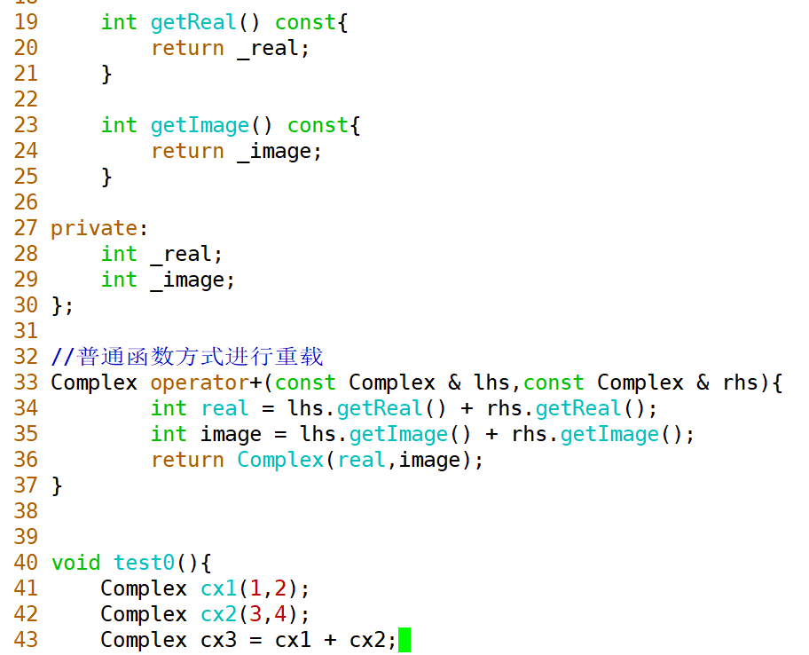


#### 成员函数实现

还可以将运算符重载函数定义为Complex类的成员函数

``` c++
class Complex{
public:
	//...
	Complex operator+(const Complex & rhs)
	{
		return Complex(_real + rhs._real, _image + rhs._image);
	}
};
```


**这种写法要注意的是，加法运算符的左操作数实际上就是this指针所指向的对象，在参数列表中只需要写上右操作数**

```C++
Complex cp1(1,2);
Complex cp2(3,4);
Complex cp = cp1 + cp2;  //本质是Complex cp = cp1.operator+(cp2)  
```

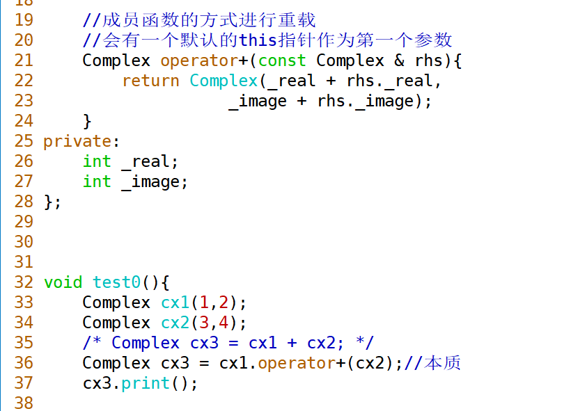


——思考，如果我们写出了这样的代码，是否可以通过呢？ —— 可以通过，但是要避免

``` c++
class Complex{
public:
	//...
	Complex operator+(const Complex & rhs)
	{
		return Complex(_real - rhs._real, _image - rhs._image);
	}
};
```

明明是加操作符，但函数内却进行的是减法运算，这是合乎语法规则的，不过却有悖于人们的直觉思维，会引起不必要的混乱。

因此，除非有特别的理由，**尽量使重载的运算符与其内置的、广为接受的语义保持一致**。


### +=运算符重载

如果要让Complex对象能够使用+=运算符进行计算，需要对+=运算符进行重载。

<span style=color:red;background:yellow>**像+=这一类会修改操作数的值的运算符，倾向于采用成员函数的方式重载。**</span>

同样按照上述步骤来定义运算符重载函数，请尝试实现

> 0. 确定用什么方式重载
> 1. 确定函数的返回值
> 2. 再写上函数名（operator运算符）
> 3. 再补充参数列表（友元的普通函数——运算需要多少操作数就准备多少个参数；成员函数——考虑第一个操作数是this指针所指向的对象）
> 4. 最后完成函数体的内容（结合实际）。

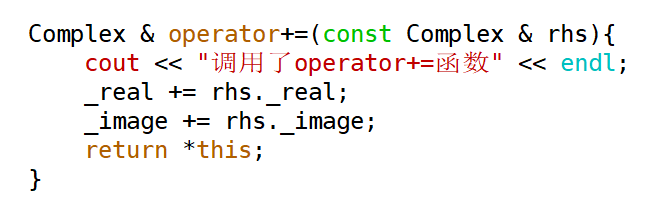


### 重载形式的选择（重要）

* 不会修改操作数的值的运算符，倾向于采用友元函数的方式重载
* 会修改操作数的值的运算符，倾向于采用成员函数的方式重载
* **赋值=、下标[ ]、调用()、成员访问->、成员指针访问->* 运算符必须是成员函数形式重载**
* 与给定类型密切相关的运算符，如递增、递减和解引用运算符，通常应该是成员函数形式重载
* 具有对称性的运算符可能转换任意一端的运算对象，例如相等性、位运算符等，通常应该是友元形式重载


### ++运算符重载

自增运算符有前置++和后置++两种形式，依然按照内置类型先分析计算逻辑，再类比这个计算逻辑去定义运算符重载函数

int a = 5; 

 a++的操作是使a的值增为6，但是这个表达式的返回值却是一个临时变量（a的值改变前的副本，即5）

++a则是使a的值增加到6，直接返回变量a本身

类比Complex，写出++运算符重载函数。按照我们目前的认知，前置++和后置++都应该选择成员函数的形式进行重载。

但是前置形式和后置形式都是只有一个操作数（本对象），参数完全相同的情况下，只有返回类型不同不能构成重载。前置形式和后置形式的区分只能通过设计层面人为地加上区分。

``` c++
	//前置++的形式
    Complex& operator++(){
        cout << "Complex & operator++()" << endl;
        ++_real;
        ++_image;
        return *this;
    }

    //后置++的形式
    //参数列表中要多加一个int
    //与前置形式进行区分
    Complex operator++(int){
        cout << "Complex operator++(int)" << endl;
        Complex tmp(*this);
        ++_real;
        ++_image;
        return tmp;
    }
```

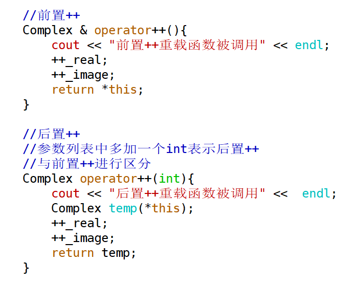

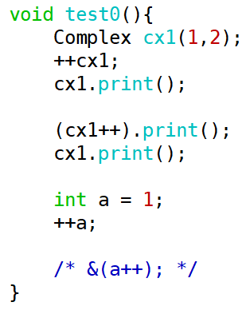

—— 以内置类型的使用作为参考


### [ ]运算符重载

需求：定义一个CharArray类，模拟char数组，需要通过下标访问运算符能够对对应下标位置字符进行访问。

- 分析[ ]运算符重载函数的返回类型，因为通过下标取出字符后可能进行写操作，需要改变CharArray对象的内容，所以应该用char引用；

- [ ]运算符的操作数有两个，一个是CharArray对象，一个是下标数据，ch[0]的本质是ch.operator[] (0)；

函数体实现需要考虑下标访问越界情况，若未越界则返回对应下标位置的字符，若越界返回终止符。

``` c++
class CharArray{
public:
    CharArray(const char * pstr)
    : _capacity(strlen(pstr) + 1)
    , _data(new char[_capacity]())
    {
        strcpy(_data,pstr);
    }

    ~CharArray(){
        if(_data){
            delete [] _data;
            _data = nullptr;
        }
    }

    //"hello"来创建
    //capacity = 6
    //下标只能取到 4
    char & operator[](size_t idx){
        if(idx < _capacity - 1){
            return _data[idx];
        }else{
            cout << "out of range" << endl;
            static char nullchar = '\0';
            return nullchar;
        }
    }

    void print() const{
        cout << _data << endl;
    }
private:
    size_t _capacity;
    char * _data;
};

CharArray ca("hello");
ca[0];
```


思考，如果要禁止CharArray对象通过下标访问修改字符数组中的元素，应该怎么办？

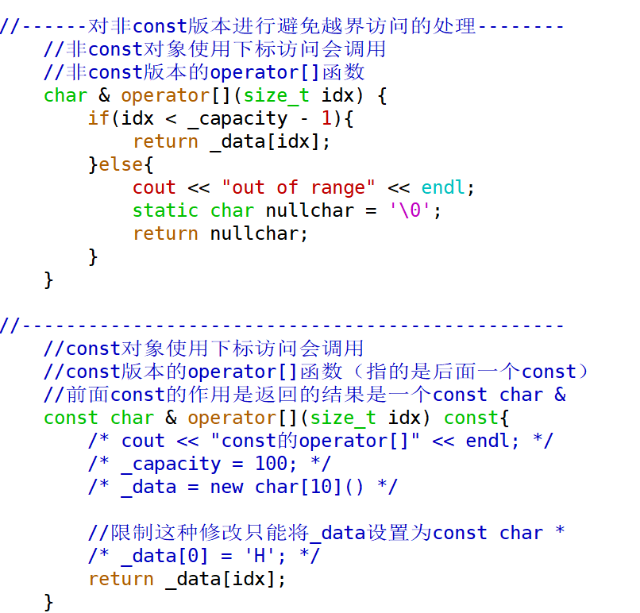


### 输入输出流运算符重载（重要）

#### 输出流运算符 <<

在之前的例子中，我们如果想打印一个对象时，常用的方法是通过定义一个 print 成员函数来完成，但使用起来不太方便。我们希望打印一个对象，与打印一个整型数据在形式上没有差别(如下例子)，那就必须要重载 << 运算符。

需求：

对于Complex对象，希望像内置类型数据一样，使用输出流运算符可以对其进行输出

分析：

- 输出流运算符有两个操作数，左操作数是输出流对象，右操作数是Complex对象。如果将输出流运算符函数写成Complex的成员函数，会带来一个问题，成员函数的第一个参数必然是this指针，也就是说Complex对象必须要作为左操作数。这种方式完成重载函数后，只能cx << cout这样来使用，与内置类型的使用方法不同，所以<span style=color:red;background:yellow>**输出流运算符的重载采用友元形式。**</span>

- cout << cx这个语句的返回值是cout对象，因为cout是全局对象，不允许复制，所以返回类型为ostream &；

- 参数列表中第一个是左操作数（cout对象），写出类型并给出形参名；第二个是右操作数（Complex对象），因为不会在输出流函数中修改它的值，采用const引用；

- 将Complex的信息通过连续输出语句全部输出给os，最终返回os（注意，使用cout输出流时通常会带上endl，那么在函数定义中就不加endl，以免多余换行）


``` c++
class Point {
public:
	//...
	friend ostream & operator<<(ostream & os, const Point & rhs);

private:
	int _x;
	int _y;
};

ostream & operator<<(ostream & os, const Point & rhs)
{
	os << "(" << rhs._x << "," << rhs._y << ")";
	return os;
}

void test0(){
    Point pt(1,2);
    cout << pt << endl; //本质形式： operator<<(cout,pt) << endl;
}
```

——为了和内置类型的使用方式保持一致，输出流运算符重载采用友元形式

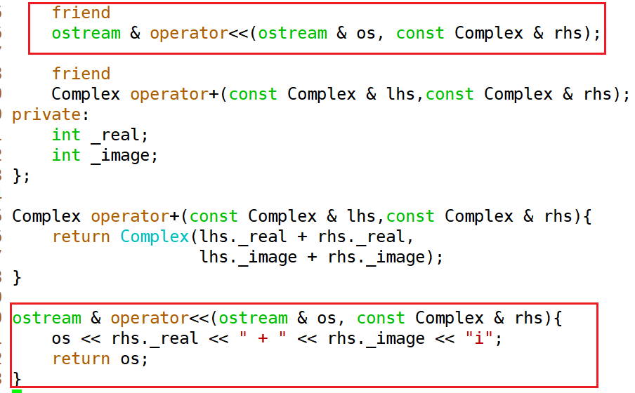

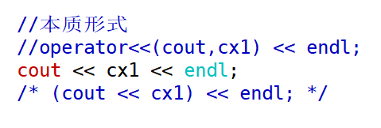


——如果采用成员形式进行运算符重载，那么自定义类型对象必然会作为第一个参数

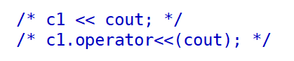

#### 输入流运算符 >>

需求：对于Complex对象，希望像内置类型数据一样，使用输入流运算符可以对其进行输入

实现过程与输出流类似

```` C++
class Complex {
public:
	//...
	friend istream & operator>>(istream & is, Complex & rhs);
private:
	int _real;
	int _image;
};

istream & operator>>(istream & is, Complex & rhs)
{
	is >> rhs._real;
	is >> rhs._image;
	return is;
}
````


——如果不想分开输出实部和虚部，也可以直接连续输入，空格符、换行符都能作为分隔符

``` c++
istream & operator>>(istream & is, Point & rhs)
{
	is >> rhs._x >> rhs._y;
	return is;
}
```


但是还有个问题需要考虑，使用输入流时需要判断是否是合法输入

——可以封装一个函数判断接收到的是合法的int数据，在>>运算符重载函数中调用，请结合前面输入流的知识试着实现

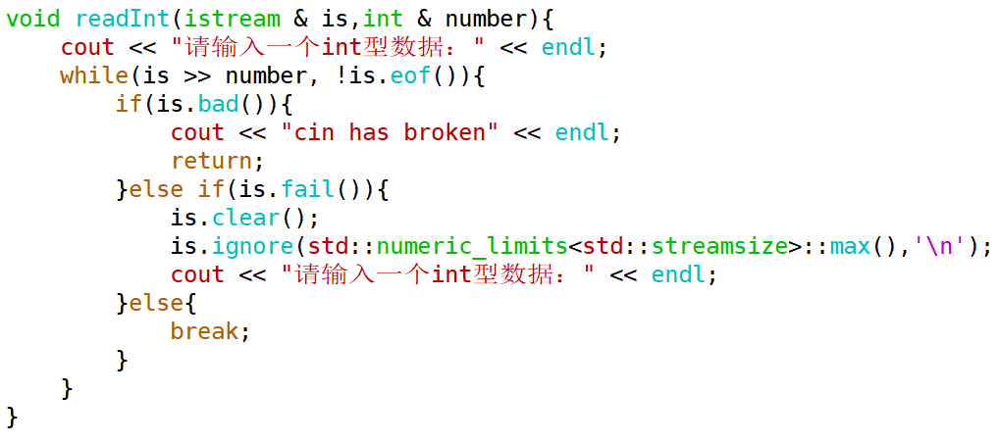

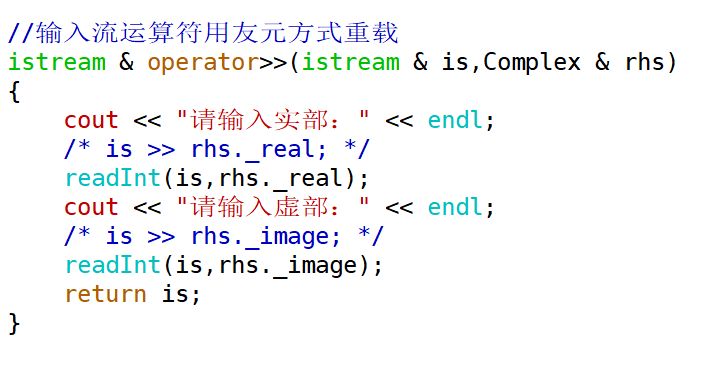


### 成员访问运算符重载

**成员访问运算符包括`.`和`->`，其中`.`这个运算符是不能重载的，`->`运算符是可以重载的。**

箭头访问运算符 -> 和解引用运算符 * ，它们是指针操作最常用的两个运算符。我们先来看箭头运算符 -> 

箭头运算符只能以成员函数的形式重载，其返回值必须是一个指针或者重载了箭头运算符的对象。来看下例子：

#### 两层结构下的使用

例子：建立一个双层的结构，MiddleLayer含有一个Data*型的数据成员


``` c++
class Data
{
public:
    Data(){}
    ~Data(){}

    int getData() const{ return _data; }
private:
    int _data = 10;
};

class MiddleLayer
{
public:
    MiddleLayer(Data * p)
    : _pdata(p)
    {}

    ~MiddleLayer(){
        if(_pdata){
            delete _pdata;
            _pdata = nullptr;
        }
    }
private:
    Data * _pdata;
};
```


Data*原生指针的用法如下，需要关注堆空间资源的回收

``` c++
Data * p = new Data();
p->getData();
(*p).getData();
delete p;
p = nullptr;
```


> 如果用这种方式创建MiddleLayer对象，我们发现不需要手动delet pdata，并没有发生内存泄露，反而手动delet pdata后会有double free的问题
>
> 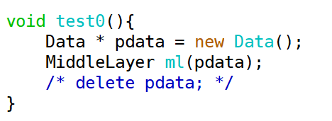
>
> 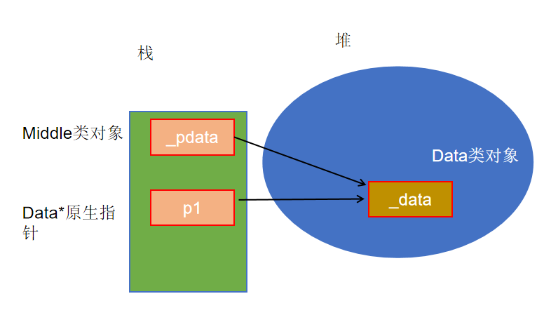
>
> 因为MiddleLayer对象实际上对堆上Data对象形成了接管。


当然，也可以让Middlelayer对象自己管理一个Data对象

> 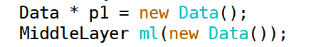
>
> 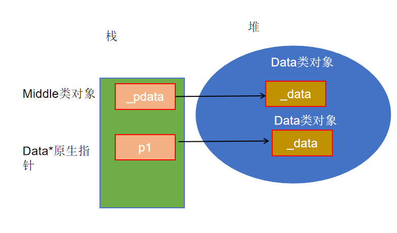


> 需求：希望实现一个这样的效果，创建MiddleLayer对象ml，让ml对象可以使用箭头运算符去调用Data类的成员函数getData
>
> ``` c++
> MiddleLayer ml(new Data);
> cout << ml->getData() << endl;
> ```
>
> 这个需求很合理，因为MiddleLayer的数据成员只有一个Data*类型的指针


箭头运算符无法应对MiddleLayer对象，那么可以定义箭头运算符重载函数。

- 首先不用考虑重载形式，箭头运算符必须以成员函数形式重载；
- 然后考虑返回类型，返回值需要使用箭头运算符调用getData函数，而原生的用法只有Data* 才能这么用，所以返回值应该是一个Data* ，此时应该直接返回   _pdata；

``` c++
Data* operator->(){
    return _pdata;
}
```

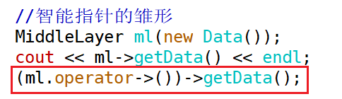


思考，解引用运算符应该如何重载能够实现同样的效果呢？直接使用MiddleLayer对象模仿Data*指针去访问getData函数

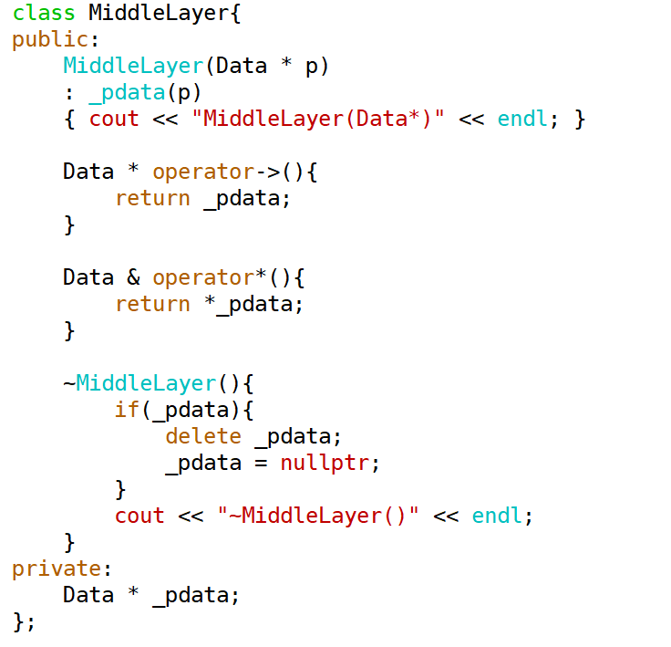


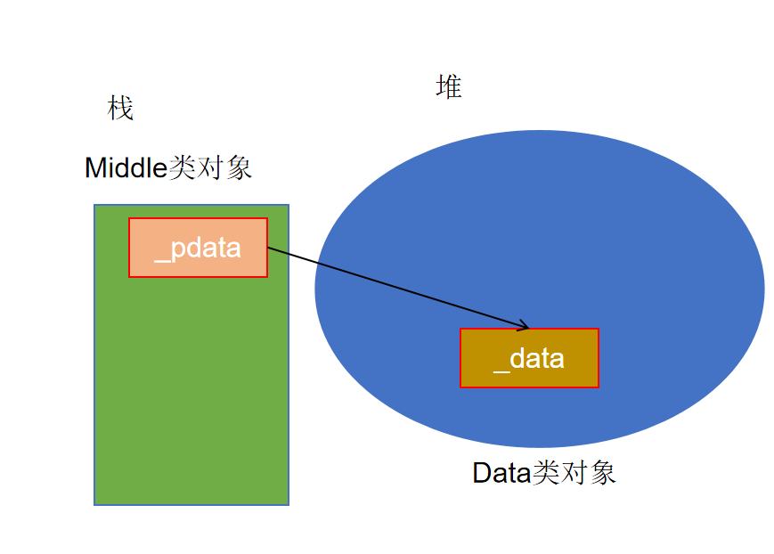

当我们完成了以上的需求后，还有一件“神奇”的事情，使用的语句中有new没有delete，但是检查发现并没有内存泄漏

**原因：ml本身是一个局部对象，因为重载了箭头运算符和解引用运算符，所以看起来像个指针，也可以像指针一样进行使用，但是这个对象在栈帧结束时会自动销毁，自动调用析构函数回收了它的数据成员所申请的堆空间**

**实际上，这就是智能指针的雏形：其思想就是通过对象的生命周期来管理资源。**


#### 三层结构下的使用（难点）

- **拓展思考：那么如果结构再加一层，引入一个ThirdLayer类**

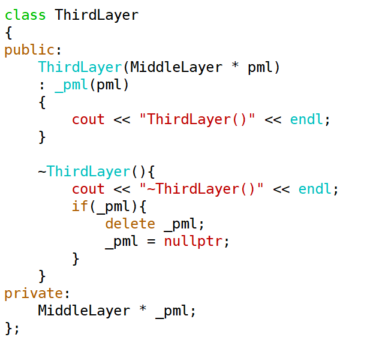


创建ThirdLayer对象时注意避免这样的错误

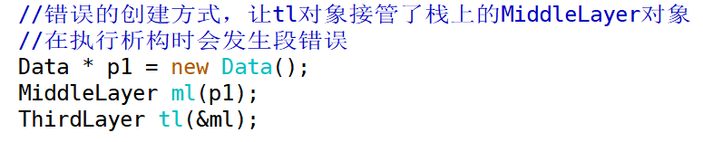

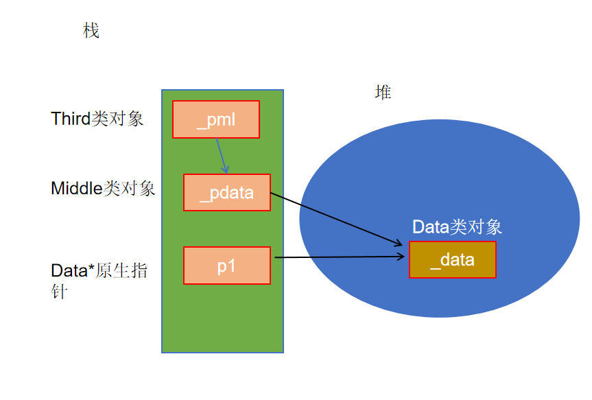

<span style=color:red;background:yellow>**注意：应该让ThirdLayer底层的指针管理一个堆上的MiddleLayer对象**</span>

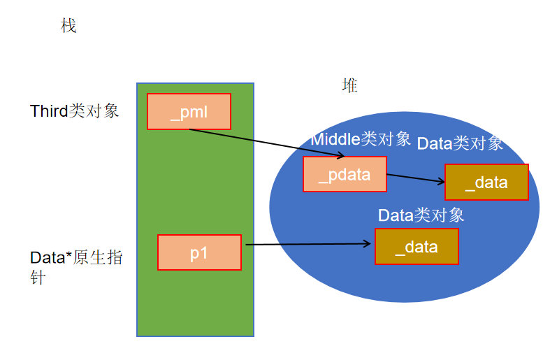

希望实现如下使用方式，思考一下应该如何对ThirdLayer进行对应的运算符重载

``` c++
ThirdLayer tl(new MiddleLayer(new Data));
cout << tl->getData() << endl;
cout << (*(*tl)).getData() << endl;
```


> 在ThirdLayer类中定义这两个成员函数
>
> 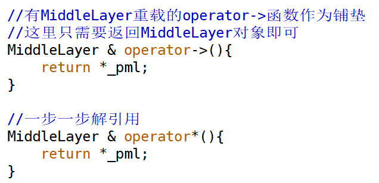
>
> —— 在使用时就可以这样用
>
> 箭头运算符的使用：
>
> 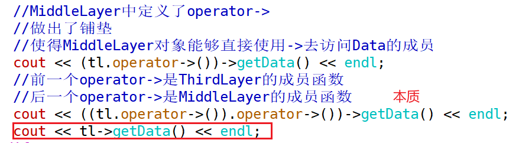
>
> 解引用运算符的使用：
>
> 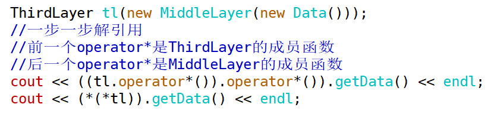


- 拓展思考：如果解引用的使用也希望和箭头运算符一样，一步到位，又该如何实现

``` c++
ThirdLayer tl(new MiddleLayer(new Data));
cout << (*tl).getData() << endl;
```

<font color=red>**如下三种return的形式都可以实现。**</font>

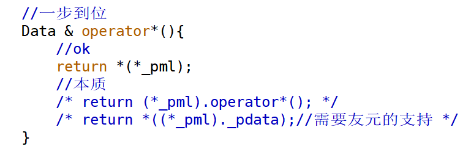

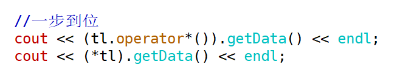

#### 内存分析

三层的结构比较复杂，我们可以通过内存图的方式进行分析。

ThirdLayer对象的创建

``` c++
ThirdLayer tl(new MiddleLayer(new Data()));
```

实际上的内存结构如图

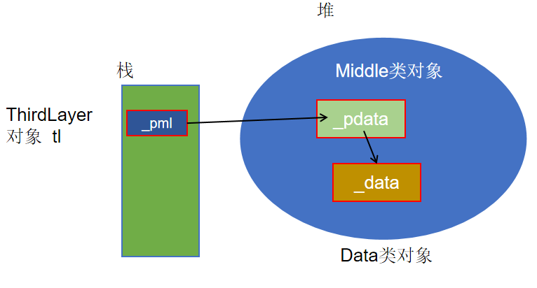


> <span style=color:red;background:yellow>**创建和销毁的过程：**</span>
>
> 创建tl对象时，调用ThirdLayer的构造函数，在ThirdLayer构造函数的参数初始化过程中调用MiddleLayer的构造函数，在ThirdLayer构造函数的参数初始化过程调用Data的构造。
>
> Data构造完才能完成MiddleLayer的指针数据成员初始化，MiddleLayer创建完毕，才能完成ThirdLayer的指针数据成员初始化。
>
> tl销毁时，马上调用ThirdLayer的析构，执行delete _pml时，第一步调用MiddleLayer的析构，在这个过程中，会delete _pdata，会调用Data的析构函数。
>
> <font color=red>**由于构造函数打印信息语句只能在函数体中，所以呈现出如下结果**</font>
>
> 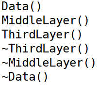


##  函数调用运算符重载

讲到调用这个词，我们首先能够想到**普通函数**和**函数指针**，它们都被称为<font color=red>**可调用对象**</font>。

普通函数执行时，有一个特点就是无记忆性。一个普通函数执行完毕，它所在的函数栈空间就会被销毁，所以普通函数执行时的状态信息，是无法保存下来的，这就让它无法应用在那些需要对每次的执行状态信息进行维护的场景。大家知道，我们学习了类与对象以后，有了对象的存在，对象执行某些操作之后，只要对象没有销毁，其状态就是可以保留下来的。

### 函数对象

想让对象像一个函数一样被调用

``` c++
class FunctionObject{
    //...
};

void test0(){
    FunctionObject fo;
    fo();  //让对象像一个函数一样被调用
}
```


上面的代码看起来很奇怪，如果我们从运算符的视角出发，就是函数调用运算符()要处理FunctionObject对象，只需要实现一个<font color=red>**函数调用运算符重载**</font>函数即可。

**函数调用运算符必须以成员函数的形式进行重载**

``` c++
class FunctionObject{
    void operator()(){
        cout << "void operator()()" << endl;
    }
};

void test0(){
    FunctionObject fo;
    fo();  //ok
}
```


> 在定义 "()" 运算符的语句中，第一对小括号总是空的，因为它代表着我们定义的运算符名称，第二对小括号就是函数参数列表了，它与普通函数的参数列表完全相同。对于其他能够重载的运算符而言，操作数个数都是固定的，<font color=red>**但函数调用运算符不同，它的参数是根据需要来确定的， 并不固定**</font>。
>
> <span style=color:red;background:yellow>**重载了函数调用运算符的类的对象称为函数对象**</span>，由于参数列表可以随意扩展 ，所以可以有很多重载形式（对应了普通函数的多种重载形式）
>
> **函数对象也称为仿函数，与普通函数、函数指针都属于可调用对象。**
>
> 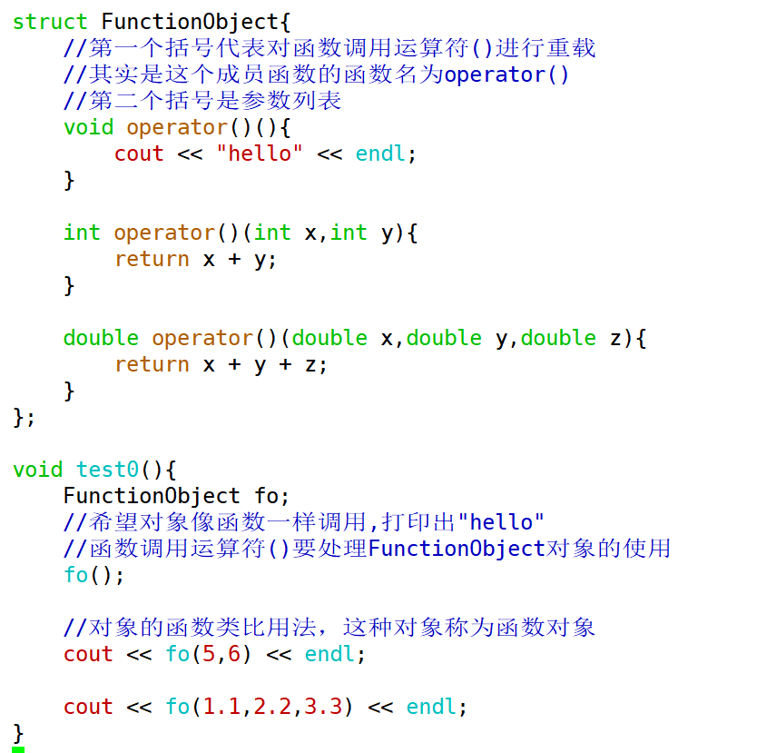


> <font color=red>**函数对象相比普通函数的优点：**</font>
>
> 可以携带状态（函数对象可以封装自己的数据成员、成员函数，具有更好的面向对象的特性）
>
> 如上，可以记录函数对象被调用的次数，而普通函数只能通过全局变量做到（但全局变量不够安全）。
>
> 
>
> ``` c++
> class FunctionObject{
> public:
>     void operator()(){
>         cout << "FunctionObject operator()()" << endl;
>         ++ _count;
>     }
> 
>     int operator()(int x, int y){
>         cout <<"operator()(int,int)" << endl;
>         ++ _count;
>         return x + y;
>     }
>     
>     int _count = 0;//携带状态
> };
> 
> void test0(){
>     FunctionObject fo;
>   
>     cout << fo() << endl;
>     cout << fo.operator()() << endl;//本质
> 
>     cout << fo(5,6) << endl;
>     cout << fo.operator()(5,6) << endl;//本质
> 
>     cout << "fo._count:" << fo._count << endl;//记录这个函数对象被调用的次数
> }
> ```
>
> 

> 除此之外，函数对象作为STL的六大组件之一而存在，可以做很多定制化的行为。后面的章节中会学到。


### 函数指针

既然对象可以像一个函数一样去调用，那函数可不可以像一个对象一样去组织？

如果可以，那函数类型由什么决定呢，也就是说，如果把函数看作对象，如何从这些“对象”抽象出类来？       

在C的阶段就学习过函数指针，定义函数指针时要明确使用这个指针指向一个什么类型的函数（返回类型、参数类型都要确定）

``` c++
void print(int x){
    cout << "print:" << x << endl;
}

void display(int x){
    cout << "display:" << x << endl;
}

int main(void){
    //省略形式
    void (*p)(int) = print;
    p(4);
    p = display;
    p(9);
    
    //完整形式
    void (*p2)(int) = &print;
    (*p2)(4);
    p2 = &display;
    (*p2)(9);
}
```


定义函数指针p后，可以指向print函数，也可以再指向display函数，并通过函数指针调用函数（两种方式——完整/省略）；

——那么其实可以抽象出一个函数指针类，这个类的对象就是这个特定类型的函数指针

p和p2可以抽象出一个函数指针类型**void(*)(int)**  —— <font color=red>**逻辑类型，不能在代码中直接以这种形式写出**</font>


以前我们使用typedef可以定义类型别名，这段程序中函数指针p、p2的类型是void (*) (int)，但是C++中是没有这个类的（我们可以这样理解，但是代码不能这么写）

可以使用typedef定义这样的一个新类型

可以理解为是给void ( * ) (int) 取类型别名为Function

``` c++
typedef void(*Function)(int);
```


Function类的“对象”可以这样使用，这个类的“对象”都是特定类型的函数指针，只能指向一种函数（这种函数的类型在定义函数指针类型时就决定了）

``` c++
    Function f;
    f = print;
    f(19);
    f = display;
    f(27);
```

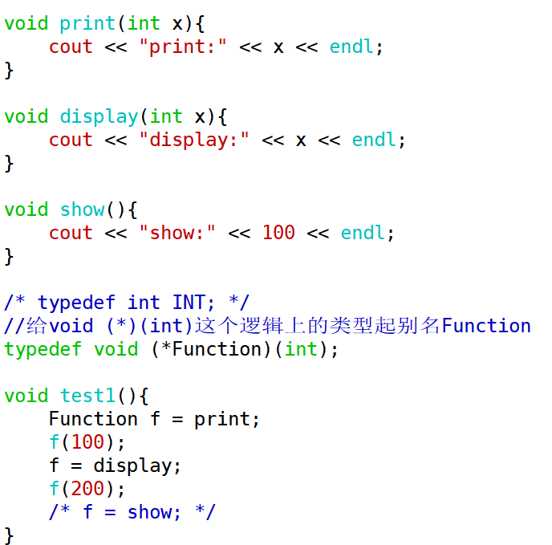


### 成员函数指针

函数指针的用法熟悉后，顺势思考一个问题：成员函数能否也使用这种形式？如果可以，应该怎样定义一个成员函数指针

比如有这样一个类FFF，包含两个成员函数

```` c++
class FFF
{
public:
    void print(int x){
        cout << "FFF::print:" << x << endl;
    }

    void display(int x){
        cout << "FFF::display:" << x << endl;
    }
};
````


定义一个函数指针要明确指针指向的函数的返回类型、参数类型，**定义一个成员函数指针还需要确定的是这个成员函数是哪个类的成员函数（类的作用域）**

与普通函数指针不一样的是，成员函数指针的定义和使用都需要使用完整写法，不能使用省略写法，定义时要完整写出指针声明，使用时要完整写出解引用（解出成员函数后接受参数进行调用）。

另外，成员函数需要通过对象来调用，**成员函数指针也需要通过对象来调用**。

```` c++
void (FFF::*p)(int) = &FFF::print;
FFF ff;
(ff.*p)(4);
````


> 类比来写，也可以使用typedef来定义这种成员函数指针类,使用这个成员函数指针类的”对象“调用FFF类的成员函数print
>
> <font color=red>**这里有一个要求 —— 成员函数指针指向的成员函数需要是FFF类的公有函数**</font>
>
> ``` c++
> typedef void (FFF::*MemberFunction)(int); //定义成员函数类型MemberFunction
> 
> MemberFunction mf = &FFF::print; //定义成员函数指针
> FFF fff;  
> (fff.*mf)(15);//通过对象调用成员函数指针
> ```
>
> 此时就出现了一个新的运算符 **".*"** —— <span style=color:red;background:yellow>**成员指针运算符的第一种形式。**</span>


> FFF类对象还可以是一个堆上的对象
>
> ``` c++
> FFF * fp = new FFF();
> 
> (fp->*mf)(65);//通过指针调用成员函数指针
> ```
>
> 又引出了新的运算符 **"->*"** —— <span style=color:red;background:yellow>**成员指针运算符的第二种形式。**</span>

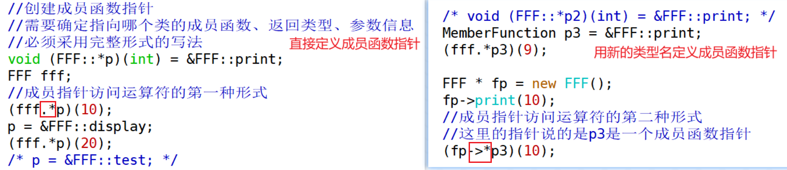


### 空指针的使用（了解）

接着上面的例子，我们来看一段比较奇怪的代码

``` c++
fp = nullptr;
(fp->*mf)(34);
```

发现竟然是可以通过的并输出了正常的结果。难道空指针去调用成员函数指针没有问题吗？

事实上，空指针去调用成员函数也好、成员函数指针也好，只要不涉及到访问该类数据成员，都是可以的。

``` c++
class Bar{
public:
    void test0(){ cout << "Bar::test0()" << endl; }
    void test1(int x){ cout << "Bar::test1(): " << x << endl; }
    void test2(){ cout << "Bar::test2(): " << _data << endl; }

    int _data = 10;
};

void test0(){
    Bar * fp = nullptr;
    fp->test0();//ok
    fp->test1(3);//ok
    fp->test2(); //error
}
```


结合内存图来分析

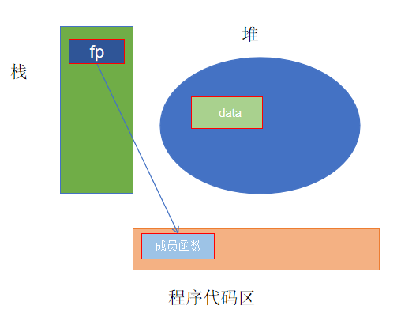

空指针没有指向有效的对象。对于不涉及数据成员的成员函数，不需要实际的对象上下文，因此就算是空指针也可以调用成功。对于涉及数据成员的成员函数，空指针无法提供有效的对象上下文，因此导致错误。

自己写代码别这么写，看到这样的代码知道为什么不报错就行了。


## 类型转换函数

以前我们认识了普通变量的类型转换，比如说 int 型转换为 long 型， double 型转换为 int 型，接下来我们要讨论下类对象与其他类型的转换。转换的方向有:

由其他类型向自定义类型转换

由自定义类型向其他类型转换


- **由其他类型向自定义类型转换**

由其他类型向自定义类型转换是由构造函数来实现的，只有当类中定义了合适的构造函数时，转换才能通过。这种转换，一般称为**隐式转换**。

之前我们见识了隐式转换，当时的例子中能够进行隐式转换的前提是Point类中有相应的构造函数，编译器会看用一个int型数据能否创建出一个Point对象，如果可以，就创建出一个临时对象，并将它的值复制给pt 

``` c++
Point pt = 1;
//等价于Point pt = Point(1);
```

这种隐式转换是比较奇怪的，一般情况下，不希望这种转换成立，所以可以在相应的构造函数之前加上explicit关键字，禁止这种隐式转换。


而有些隐式转换使用起来很自然，比如：

``` c++
string s1("hello,world");
string s1 = "hello,world";//隐式转换
```

这行语句其实也是隐式转换，利用C风格字符串构造一个临时的string对象，再调用string的拷贝构造函数创建s1


> - **由自定义类型向其他类型转换——类型转换函数**
>
> 类型转换函数的形式是固定的：<span style=color:red;background:yellow>**operator 目标类型(){        }**</span>
>
> 它有着如下的特征：
>
> **1.必须是成员函数**
>
> **2.没有返回类型**
>
> **3.没有参数**
>
> **4.在函数执行体中必须要返回目标类型的变量**


> <font color=red>**(1)自定义类型向内置类型转换**</font>
>
> 在Point类中定义这样的类型转换函数
>
> ``` c++
> class Point{
> public:
> //...
>  operator int(){
>      cout << "operator int()" << endl;
>      return _ix + _iy;
>  }
> 	//...
> };
> ```
>
> 使用时就可以写出这样的语句（与隐式转换的方向相反）
>
> ``` c++
> Point pt(1,2);
> int a = 10;
> //将Point类型对象转换成int型数据
> a = pt;
> cout << a << endl;
> ```
>

> 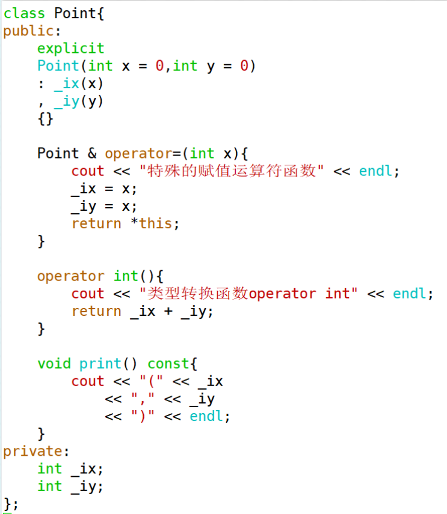
>
> 


> <font color=red>**（2）自定义类型向自定义类型转换**</font>
>
> 自定义类型可以向内置类型转换，还可以向自定义类型转换，但要<span style=color:red;background:yellow>**注意将类型转换函数设为谁的成员函数**</span>
>
> 
>
> ``` c++
> Point pt(1,2);
> Complex cx(3,4);
> pt = cx;
> cx.print();
> ```
>
> 如上，想要让Complex对象转换成Point对象，并对pt赋值，应该在Complex类中添加目标类型的类型转换函数
>
> ```` c++
> class Complex
> {
>  //...
>  operator Point(){
>      cout << "operator Complex()" << endl;
>      return Point(_real,_image);
>  }
> };
> 
> pt = cx;
> ````
>
> 


思考，可否用隐式转换的思路（即调用特定形式的构造函数），实现这种转换？

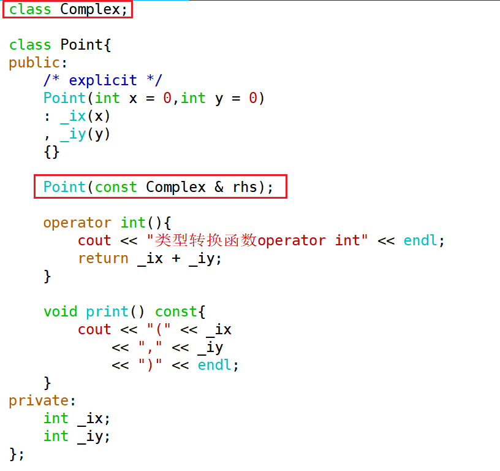

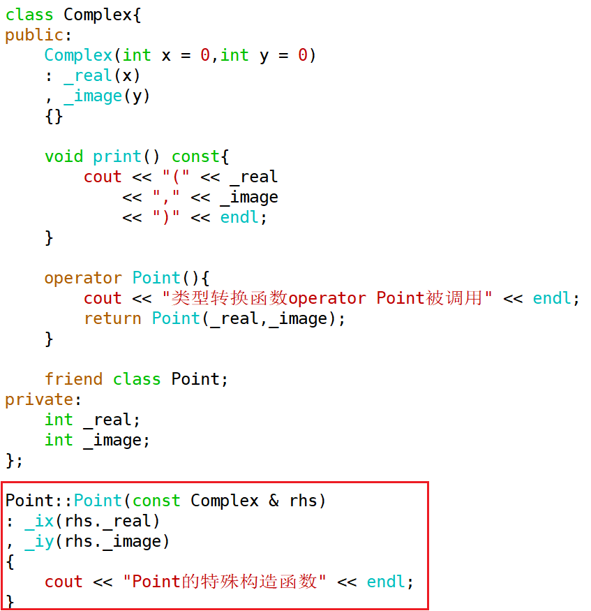

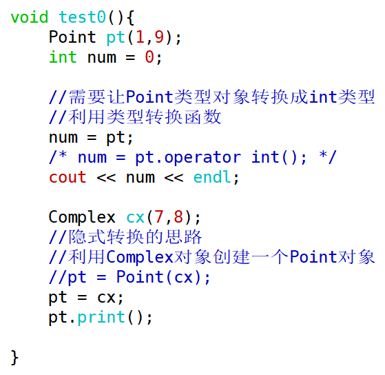

总结：使用类型转换函数（Complex的成员函数operator Point）和特殊的构造函数(Point的构造函数)都可以实现上述的需求。

还可以给Point类添加特殊的赋值运算符函数，当三种方式同时存在时，会优先调用赋值运算符函数（**赋值操作本身就支持**），其次类型转换的优先级高于隐式转换。

**—— 重点掌握类型转换函数。**

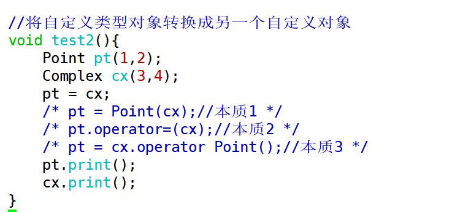

<span style=color:red;background:yellow>****优先级： 2 > 3 > 1</span>**

**赋值运算符函数 > 类型转换函数 > 隐式转换（特殊的构造函数）**


用一个Complex对象给Point对象赋值

编译器会先到Point类中找有没有合适的赋值运算符函数（Point& operator=(const Complex & rhs)），如果有的话，编译器就知道了怎样去进行赋值操作，不需要任何的转换；如果没有，编译器再到Complex类中找有没有合适的类型转换函数（operator Point()），如果有的话，就可以让cx对象调用类型转换函数，返回一个临时的Point对象，然后再用这个临时的Point对象给pt赋值。

如果前两种方式都行不通，编译器再会到Point类中找有没有合适的构造函数，可以利用一个Complex对象创建出一个Point对象（隐式转换的途径）。


## 附录：C++运算符优先级排序与结合性


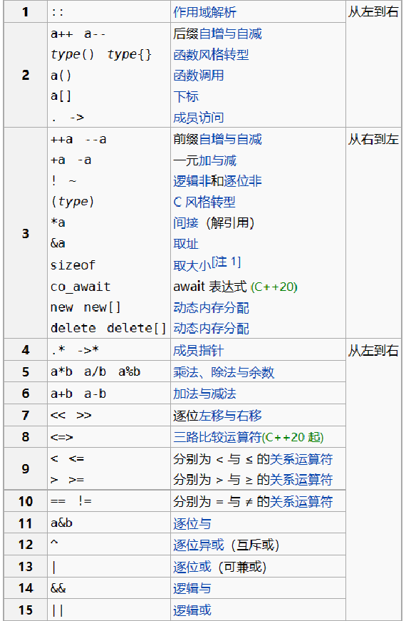

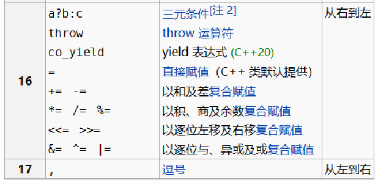

## 嵌套类

### 嵌套类的定义

首先介绍两个概念：

- 类作用域（Class Scope）

类作用域是指在类定义内部的范围。在这个作用域内定义的成员（包括变量、函数、类型别名等）可以被该类的所有成员函数访问。类作用域开始于类定义的左花括号，结束于类定义的右花括号。**在类作用域内，成员可以相互访问，无论它们在类定义中的声明顺序如何。**


- 类名作用域（Class Name Scope）

类名作用域指的是可以通过类名访问的作用域。这主要用于访问类的**静态成员**、**嵌套类型**。类名必须用于访问静态成员或嵌套类型，除非在类的成员函数内部，因为它们不依赖于类的任何特定对象。以静态成员为例：

``` c++
class MyClass
{
public:
    void func(){
        _b = 100;//类的成员函数内访问_b
    }
    static int _a;
    int _b;
};
int MyClass::_a = 0;

void test0(){
    MyClass::_a = 200;//类外部访问_a
}
```


在函数和其他类定义的外部定义的类称为**全局类**，绝大多数的 C++ 类都是全局类。我们在前面定义的所有类都在全局作用域中，全局类具有全局作用域。

与之对应的，一个类A还可以定义在另一类B的定义中，这就是<span style=color:red;background:yellow>**嵌套类**</span>结构。A类被称为B类的<font color=red>**内部类**</font>，B类被称为A类的<font color=red>**外部类**</font>。

以Point类和Line类为例

``` c++
class Line
{
public:
    class Point{
    public:
        Point(int x,int y)
        : _ix(x)
        , _iy(y)
        {}
    private:
        int _ix;
        int _iy;
    };
public:
    Line(int x1, int y1, int x2, int y2)
    : _pt1(x1,y1)
    , _pt2(x2,y2)
    {}
private: 
    Point _pt1;
    Point _pt2;
};
```


Point类是定义在Line类中的内部类，无法直接创建Point对象，需要在Line类名作用域中才能创建

``` c++
Point pt(1,2);//error
Line::Point pt2(3,4);//ok
```

> Point类是Line类的内部类，并不代表Point类的数据成员会占据Line类对象的内存空间，<span style=color:red;background:yellow>**在存储关系上并不是嵌套的结构**</span>。
>
> 只有当Line类有Point类类型的对象成员时，Line类对象的内存布局中才会包含Point类对象（成员子对象）。
>
> 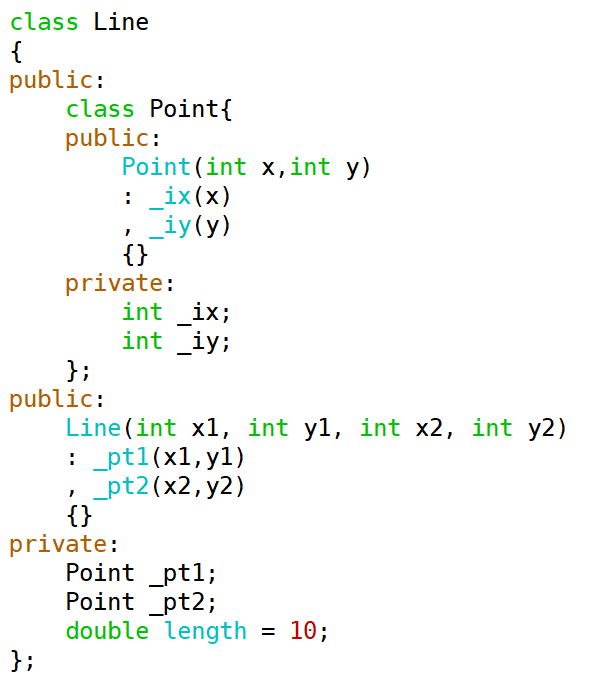
>
> （1）如果Line类中没有Point类的对象成员，sizeof(Line) = 8;
>
> （2）如果Line类中有两个Point类的对象成员，sizeof(Line) = 24;
>
> 


> 思考，如果想要使用输出流运算符输出Line对象，应该怎么实现？**（重要）**
>
> 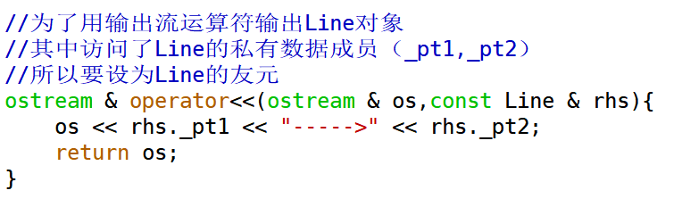
>
> 最直观的实现方式是定义一个运算符重载函数，但在函数体中需要让输出流运算符处理Point类型对象，所以还需要为Point类准备一个输出流运算符重载函数。


> 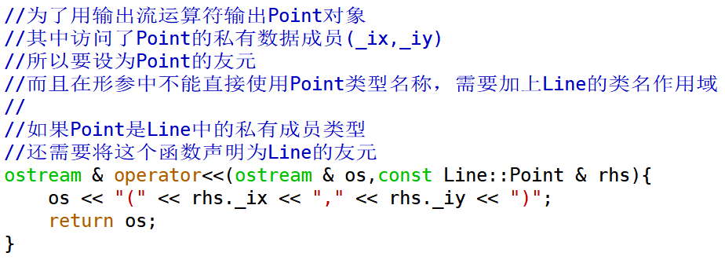
>
> —— 如果Point定义在Line的私有区域
>
> 那么还需要将operator<<函数声明为Line的友元函数


### 嵌套类结构的访问权限

外部类对内部类的成员进行访问

内部类对外部类的成员进行访问

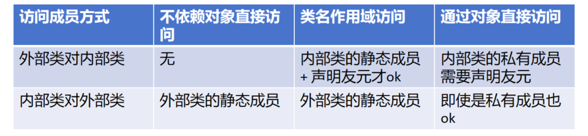

**内部类相当于是定义在外部类中的外部类的友元类**

类A定义在类B中，那么类A访问类B的成员时，就相当于默认的是类B的友元类。


### pimpl模式（了解）

实际项目的需求：希望Line的实现全部隐藏，在源文件中实现，再将其打包成库文件，交给第三方使用。

（1）头文件只给出接口：

``` c++
//Line.hpp
class Line{
public:
    Line(int x1, int y1, int x2, int y2);
    ~Line();
    void printLine() const;//打印Line对象的信息
private:
    class LineImpl;//类的前向声明
    LineImpl * _pimpl;
};
```


（2）在实现文件中进行具体实现，使用嵌套类的结构（LineImpl是Line的内部类，Point是LineImpl的内部类），Line类对外公布的接口都是使用LineImpl进行具体实现的

​		 在测试文件中创建Line对象（最外层），使用Line对外提供的接口，但是不知道具体的实现

``` c++
//LineImpl.cc
class Line::LineImpl
{
    class Point{
    public:
        Point(int x,int y)
            : _ix(x)
              , _iy(y)
        {}
		//...
    private:
        int _ix;
        int _iy;
    };
    //...
};

//Line.cc
void test0(){
    Line line(10,20,30,40);
    line.printLine();
}
```


（3）打包库文件，将库文件和头文件交给第三方

```C++
sudo apt install build-essential
g++ -c LineImpl.cc
ar rcs libLine.a LineImpl.o

生成libLine.a库文件
编译：g++ Line.cc(测试文件) -L(加上库文件地址) -lLine(就是库文件名中的lib缩写为l，不带后缀)
此时的编译指令为 g++ Line.cc -L. -lLine
```


内存结构


**pimpl模式是一种减少代码依赖和编译时间的C++编程技巧，其基本思想是将一个外部可见类的实现细节（一般是通过私有的非虚成员）放在一个单独的实现类中，在可见类中通过一个私有指针来间接访问该类型。**

好处：

1. 实现信息隐藏；
2. 只要头文件中的接口不变，实现文件可以随意修改，修改完毕只需要将新生成的库文件交给第三方即可；
3. 可以实现库的平滑升级。


##  单例对象自动释放（重点*）

在类与对象的章节，我们学习了单例模式。单例对象由静态指针_pInstance保存，最终通过手动调用destroy函数进行释放。

现实工作中，单例对象是需要进行自动释放。程序在执行的过程中 ，需要判断有哪些地方发生了内存泄漏 ，此时需要工具valgrind的使用来确定。假设单例对象没有进行自动释放 ，那么valgrind工具会认为单例对象是内存泄漏。程序员接下来还得再次去确认到底是不是内存泄漏 ，增加了程序员的额外的工作。

那么如何实现单例对象的自动释放呢？

—— 看到自动就应该想到当对象被销毁时，析构函数会被自动调用。

### 方式一：利用另一个对象的生命周期管理资源

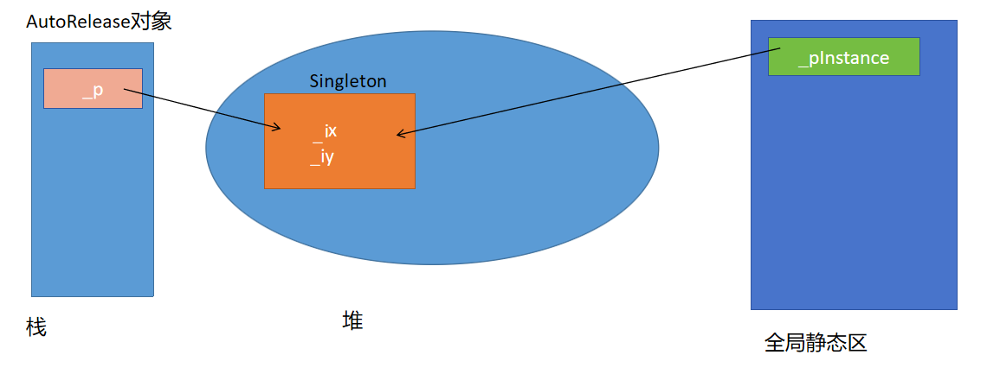

利用对象的生命周期管理资源——析构函数（在析构函数中会执行delete _p），当对象被销毁时会自动调用。

> 要注意：
>
> (1)如果还手动调用了Singleton类的destroy函数，会导致double free问题，所以可以删掉destroy函数，将回收堆上的单例对象的工作完全交给AutoRelease对象
>
> (2)不能用多个AutoRelease对象托管同一个堆上的单例对象。


``` c++
class AutoRelease{
public:
    AutoRelease(Singleton * p)
    : _p(p)
    { cout << "AutoRelease(Singleton*)" << endl; }

    ~AutoRelease(){
        cout << "~AutoRelease()" << endl;
        if(_p){
            delete _p;
            _p = nullptr;
        }
    }
private:
    Singleton * _p;
};

void test0(){
    AutoRelease ar(Singleton::getInstance());
    Singleton::getInstance()->print();
}
```


### 方式二：嵌套类 + 静态对象（重点）

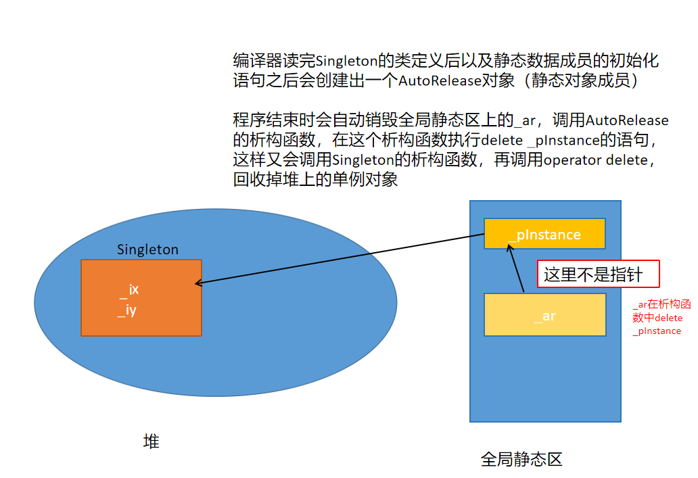


AutoRelease类对象_ar是Singleton类的对象成员，创建Singleton对象，就会自动创建一个AutoRelease对象（静态区），它的成员函数可以直接访问 _pInstance

``` c++
class Singleton
{
    class AutoRelease{
    public:
        AutoRelease()
        {}
        ~AutoRelease(){
          if(_pInstance){
              delete _pInstance;
              _pInstance = nullptr;
          }
        }
    };
    //...
private:
   //...
    int _ix;
    int _iy;
    static Singleton * _pInstance;
    static AutoRelease _ar;
};
Singleton* Singleton::_pInstance = nullptr;
//使用AutoReleas类的无参构造对_ar进行初始化
Singleton::AutoRelease Singleton::_ar;


void test1(){
    Singleton::getInstance()->print();
    Singleton::getInstance()->init(10,80);
    Singleton::getInstance()->print();
}
```


程序结束时会自动销毁全局静态区上的_ar，调用AutoRelease的析构函数，在这个析构函数执行delete _pInstance的语句，这样又会调用Singleton的析构函数，再调用operator delete，回收掉堆上的单例对象。

我们利用嵌套类实现了一个比较完美的方案，不用担心手动调用了destroy函数。


### 方式三：atexit + destroy

很多时候我们需要在程序退出的时候做一些诸如释放资源的操作，但程序退出的方式有很多种，比如main()函数运行结束、在程序的某个地方用exit()结束程序、用户通过Ctrl+C操作来终止程序等等，因此需要有一种与程序退出方式无关的方法来进行程序退出时的必要处理。

方法就是用atexit函数来注册程序正常终止时要被调用的函数（C/C++通用）。

如果注册了多个函数，先注册的后执行。


``` c++
class Singleton
{
public:
    static Singleton * getInstance(){
        if(_pInstance == nullptr){
            atexit(destroy);  
            _pInstance = new Singleton(1,2);
        }
        return _pInstance;
    }
    //...
}；
```

atexit注册了destroy函数，相当于有了一次必然会进行的destroy（程序结束时），即使手动调用了destroy，因为安全回收的机制，也不会有问题。


> 但是还遗留了一个问题，就是以上几种方式都无法解决<font color=red>**多线程安全**</font>问题。以方式三为例，当多个线程同时进入if语句时，会造成单例对象被创建出多个，但是最终只有一个地址值会由_pInstance指针保存，因此造成内存泄漏。
>
> 可以使用<font color=red>**饿汉式解决**</font>，但同时也可能带来内存压力（即使不用单例对象，也会被创建）
>
> ``` c++
> //对于_pInstance的初始化有两种方式
> 
> //饱汉式（懒汉式）—— 懒加载，不使用到该对象，就不会创建
> Singleton* Singleton::_pInstance = nullptr; 
> 
> //饿汉式 —— 最开始就创建（即使不使用这个单例对象）
> Singleton* Singleton::_pInstance = getInstance();
> ```
>
> 饿汉式可以确保getInstance函数的第一次调用一定是在_pInstance的初始化时，之后再调用getInstance函数的时候,都不会进入if分支创建出对象。
>
> 同时，还有一个要考虑的问题——如果多线程环境下手动调用了destroy函数，那么又会让_pInstance变为空指针，之后再调用getInstance函数还是有可能造成内存泄露，
>
> 故而应该将destroy函数私有。


### 方式四：atexit + pthread_once

Linux平台可以使用的方法（能够保证创建单例对象时的多线程安全）

pthread_once函数可以确保初始化代码只会执行一次。

传给pthread_once函数的第一个参数比较特殊，形式固定；第二个参数需要是一个静态函数指针，pthread_once可以确保这个函数只会执行一次。

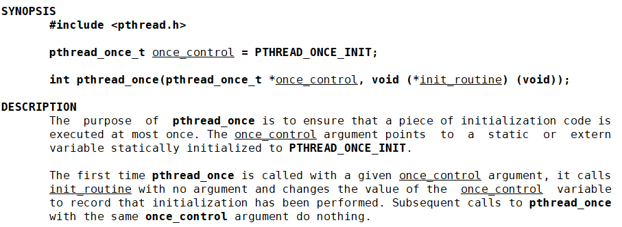


``` c++
class Singleton
{
public:
    static Singleton * getInstance(){
        pthread_once(&_once,init_r);
        return _pInstance;
    }
    

    void init(int x,int y)
    {
        _ix = x;
        _iy = y;
    }

    void print(){
        cout << "(" << this->_ix
            << "," << this->_iy
            << ")" << endl;
    }
private:
    static void init_r(){
        _pInstance = new Singleton(1,2);
        atexit(destroy);
    }

    static void destroy(){
        if(_pInstance){
            delete _pInstance;
            _pInstance = nullptr;
        }
    }
    Singleton() = default;//C++11

    Singleton(int x,int y)
    : _ix(x)
    , _iy(y)
    {
        cout << "Singleton(int,int)" << endl;
    }

    ~Singleton(){
        cout << "~Singleton()" << endl;
    }

    Singleton(const Singleton & rhs) = delete;
    Singleton & operator=(const Singleton & rhs) = delete;
private:
    int _ix;
    int _iy;
    static Singleton * _pInstance;
    static pthread_once_t _once;
};
Singleton * Singleton::_pInstance = nullptr;
pthread_once_t Singleton::_once = PTHREAD_ONCE_INIT;
```

> <font color=red>**注意：**</font>
>
> (1)如果手动调用init_r创建对象，没有通过getInstance创建对象，实际上绕开了pthread_once的控制，必然造成内存泄露 —— <span style=color:red;background:yellow>**需要将init_r私有**</span>
>
> (2)如果手动调用了destroy函数，之后再使用getInstance来尝试创建对象，因为pthread_once的控制效果，不会再执行init_r函数，所以无法再创建出单例对象。所以不能允许手动调用destroy函数。
>
> 同时因为会使用atexit注册destroy函数实现资源回收，所以也不能将destroy删掉，应该<span style=color:red;background:yellow>**将destroy私有**</span>，避免在类外手动调用。
>
> 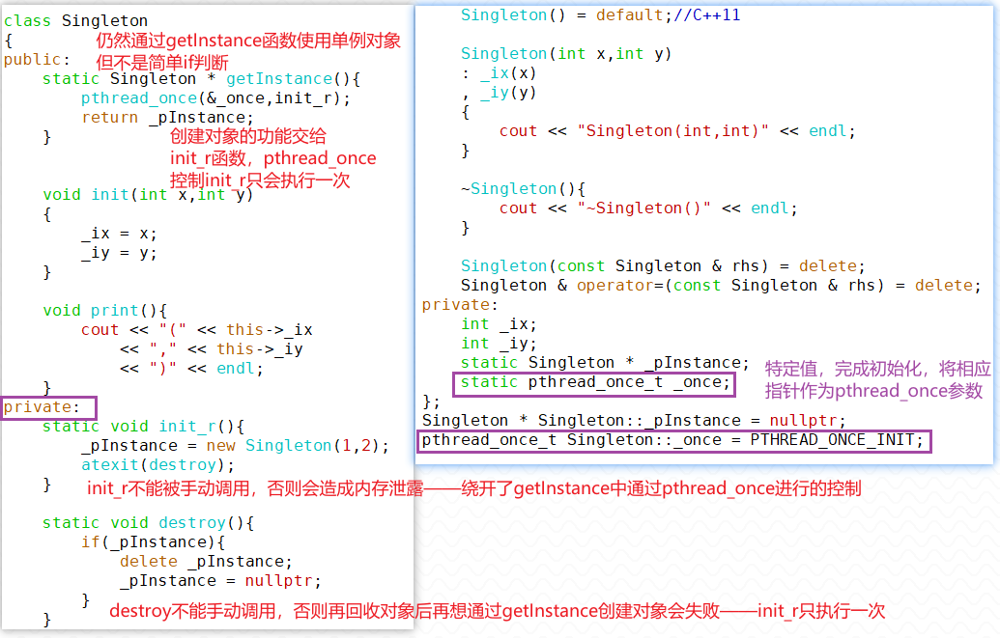


##  std::string的底层实现*

我们都知道， std::string的一些基本功能和用法了，但它底层到底是如何实现的呢? 其实在std::string的历史中，出现过几种不同的方式。

我们可以从一个简单的问题来探索，一个std::string对象占据的内存空间有多大，即sizeof(std::string)的值为多大？如果我们在不同的编译器（VC++, GCC, Clang++）上去测试，可能会发现其值并不相同；即使是GCC，不同的版本，获取的值也是不同的。

虽然历史上的实现有多种，但基本上有三种方式：

- Eager Copy(深拷贝)

- COW（Copy-On-Write 写时复制）

- SSO(Short String Optimization 短字符串优化)

  <font color=red>**std::string的底层实现是一个高频考点**</font>，虽然目前std::string是根据SSO的思想实现的，但是我们最好能够掌握其发展过程中的不同设计思想，在回答时会是一个非常精彩的加分项。

  

  首先，最简单的就是深拷贝。无论什么情况，都是采用拷贝字符串内容的方式解决，这也是我们之前已经实现过的方式。这种实现方式，在不需要改变字符串内容时，对字符串进行频繁复制，效率比较低下。所以需要对其实现进行优化，之后便出现了下面的COW的实现方式。

  ``` c++
  //如果string的实现直接用深拷贝
  String str1("hello,world");
  String str2 = str1;
  ```

  如上，str2保存的字符串内容与str1完全相同，但是根据深拷贝的思想，一定要重新申请空间、复制内容，这样效率较低、开销较大。


### 写时复制原理探究

**Q1: 当字符串对象进行复制控制时，可以优化为指向同一个堆空间的字符串，接下来的问题就是何时回收堆空间的字符串内容呢？**  

 引用计数 refcount当字符串对象进行复制操作时，引用计数+1；当字符串对象被销毁时，引用计数-1；只有当引用计数减为0时，才真正回收堆空间上字符串   


``` c++
string str2("hello,wuhan");
string str3 = str2;
```


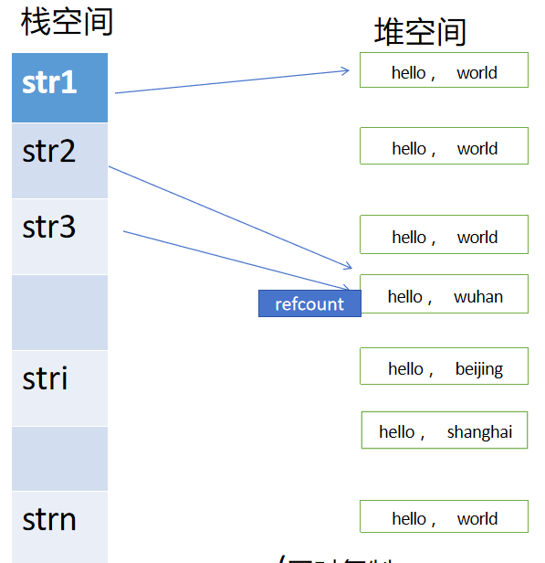


补充：如果是如下创建对象，能不能共用空间，存放"hello"

—— 单独创建对象没有优化的空间，每一个string对象需要一片独立的空间存放自己的字符串

``` c++
string s1("hello");
//在创建s2之前可能有很多String对象
//不可能遍历这些对象
//看看哪个对象保存的内容是hello
//s2再去共用空间 —— 只有确保内容一致时，才能共用空间 —— 复制或赋值时
string s2("hello");
```


**Q2: 引用计数应该放到哪里？**

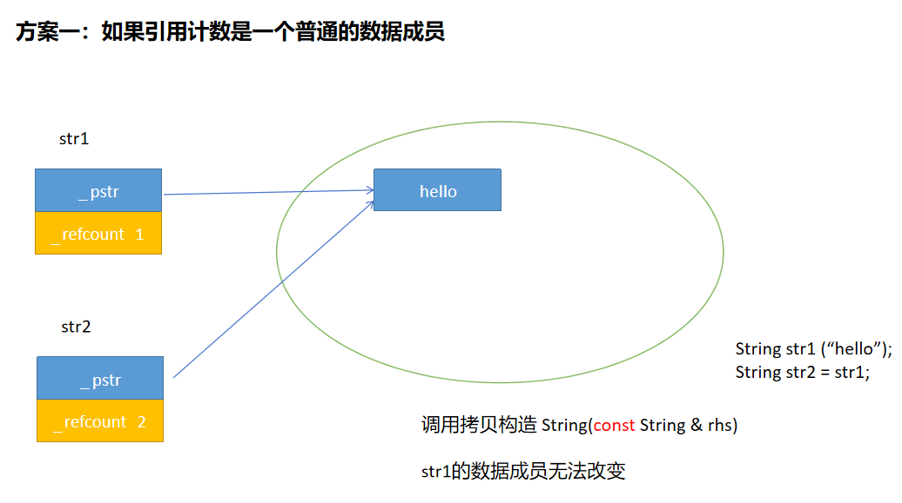

—— 需要改变str1的数据成员，不合理。


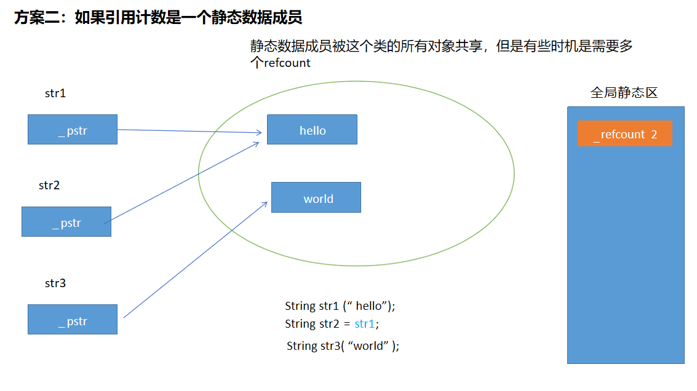

—— 静态数据成员被该类所有对象共享，但此时str1和str2的引用计数应该都是2，但是str3的引用计数应该是1.


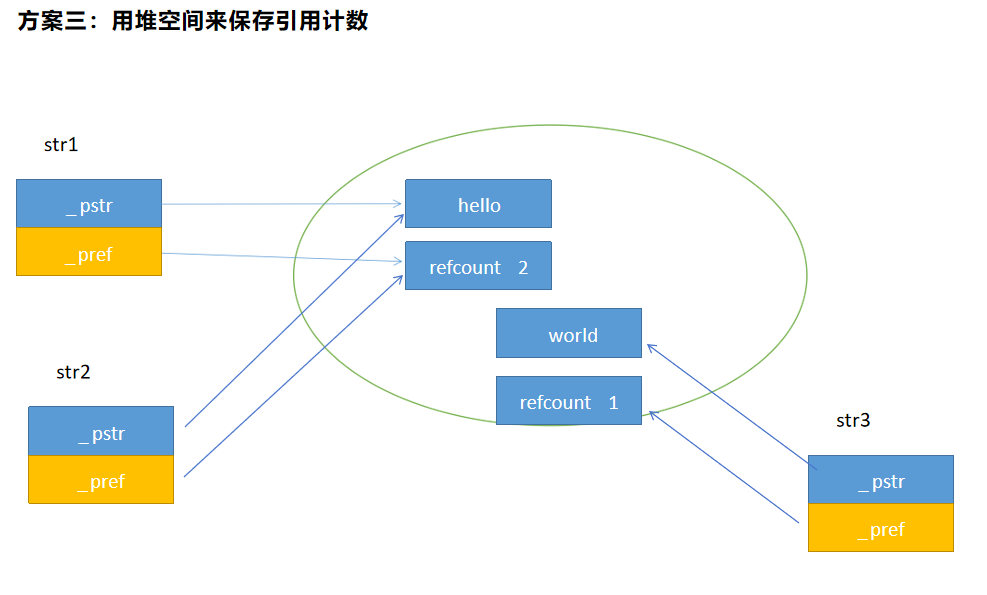

方案三可行，还可以优化一下

按常规的思路，需要使用两次new表达式（字符串、引用计数）；可以优化成只用一次new表达式，因为申请堆空间的行为一定会涉及系统调用，程序员要尽量少使用系统调用，提高程序的执行效率。

—— 优化方向：把引用计数和字符串内容保存到一起。


> <font color=red>**引用计数保存到字符串内容的前面，方便访问。**</font>
>
> 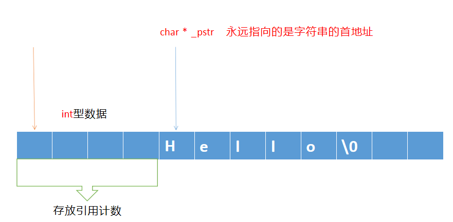


除了复制操作，赋值操作也可以确定两个string对象保存的字符串内容是相同的，也可以复用空间，引用计数随之改变。

但相比复制操作，还需要考虑string对象原本用来保存字符串的堆空间是否需要回收。

（1）原本空间的引用计数-1，引用计数减到0，才真正回收堆空间

（2）让自己的指针指向新的空间，并将新空间的引用计数+1

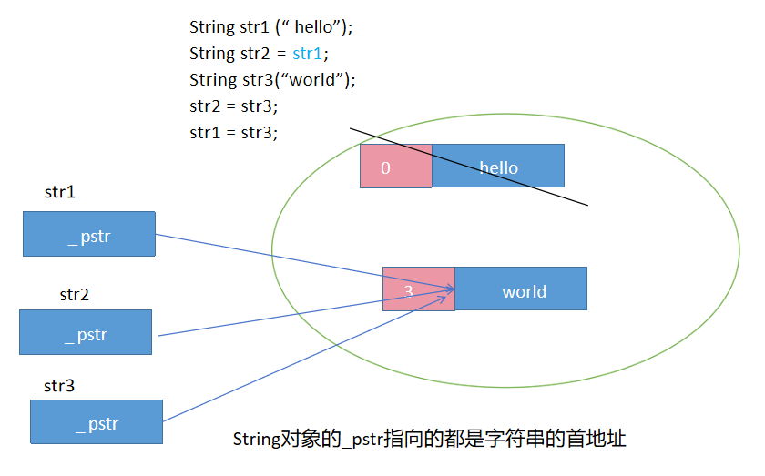


### CowString代码初步实现

根据写时复制的思想来模拟字符串对象的实现，这是一个非常有难度的任务（源码级），理解了COW的思想后可以尝试实现一下

> 重点关注一下赋值运算符函数，赋值运算符函数此时也需要考虑要不要回收空间了。
>
> 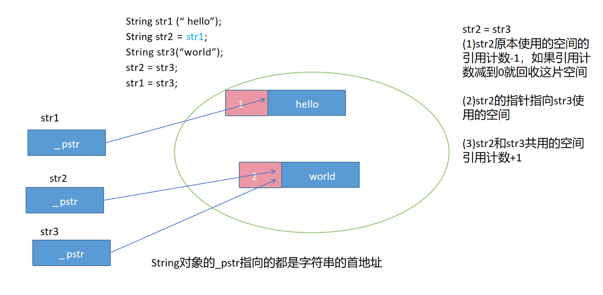


> 下标访问运算符函数也不能沿用以前的做法，直接返回对应位置的字符
>
> 
>
> **这就是写时复制的意义。**


在我们建立了基本的写时复制字符串类的框架后，发现了一个<span style=color:red;background:yellow>**遗留的问题。**</span>

> 如果str1和str3共享一片空间存放字符串内容。如果进行读操作，那么直接进行就可以了，不用进行复制，也不用改变引用计数；如果进行写操作，那么应该让str1重新申请一片空间去进行修改，不应该改变str3的内容。
>
> cout << str1[0] << endl; //读操作
>str1[0] = 'H';         //写操作
> cout << str3[0] << endl;//发现str3的内容也被改变了
> 
> 我们首先会想到运算符重载的方式去解决。但是str1[0]返回值是一个char类型变量。
>
> 读操作 cout << char字符 << endl;
>
> 写操作 char字符 = char字符；
>
> 无论是输出流运算符还是赋值运算符，操作数中没有自定义类型对象，无法重载。而CowString的下标访问运算符的操作数是CowString对象和size_t类型的下标，也没办法判断取出来的内容接下来要进行读操作还是写操作。
>
> —— 思路：创建一个CowString类的内部类，让CowString的operator[]函数返回是这个新类型的对象，然后在这个新类型中对<<和=进行重载，让这两个运算符能够处理新类型对象，从而分开了处理逻辑。

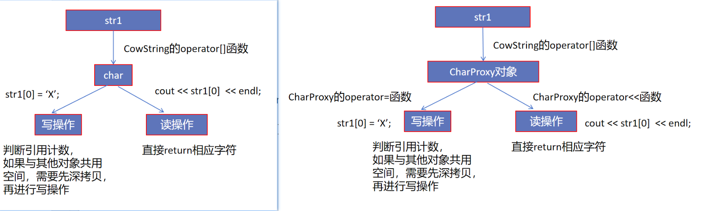

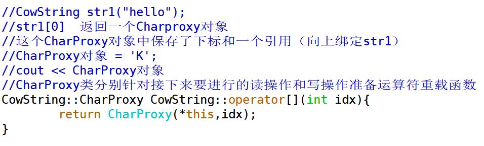


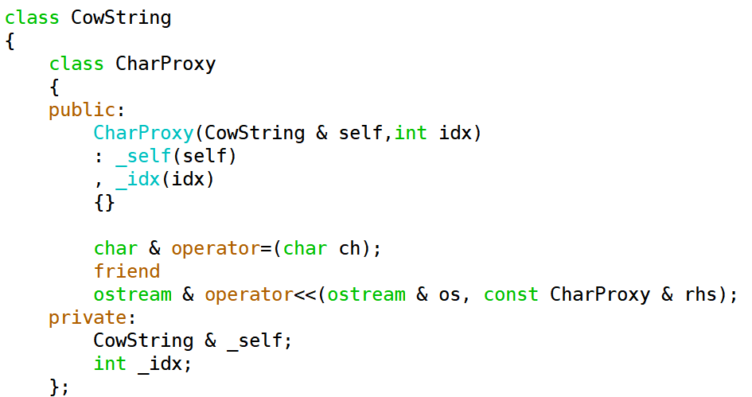

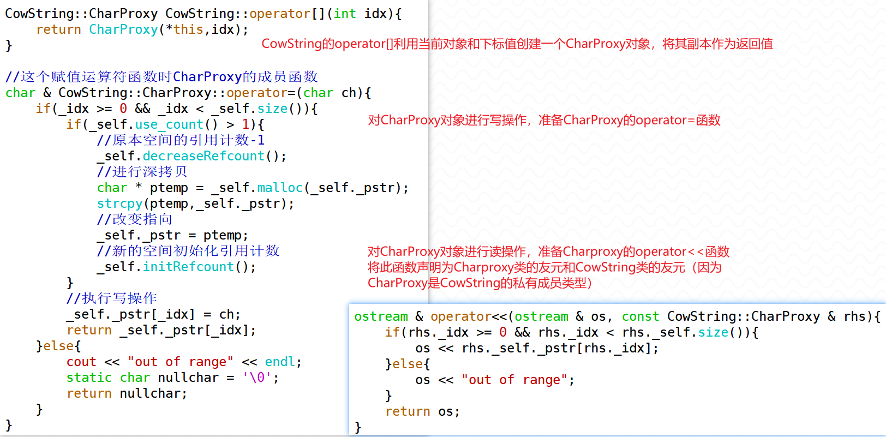

因为CharProxy定义在CowString的私有区域，为了让输出流运算符能够处理CharProxy对象，需要对此operator<<函数进行两次友元声明（内外都需要）。


> 对于读操作，还可以给CharProxy类定义类型转换函数来进行处理 —— 稍稍实现了一定的简化。
>
> 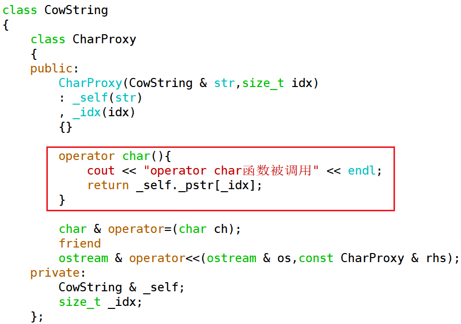


总结：当运算符需要处理自定义类型对象时，先看一看这个自定义类型有没有相应的运算符重载函数，如果有，那么这个运算符就可以处理这个自定义类型对象；

如果没有运算符重载，就无法直接处理，需要进行转换。先看看这个自定义类型中有没有类型转换函数，转换成一个该运算符可以直接处理的类型的数据。如果没有类型转换函数，会再看看有没有隐式转换的途径。（一般，大多数情况谨慎使用隐式转换）


### 短字符串优化（SSO）

当字符串的字符数小于等于15时，  buffer直接存放整个字符串；当字符串的字符数大于15时，  buffer 存放的就是一个指针，指向堆空间的区域。这样做的好处是，当字符串较小时，直接拷贝字符串，放在 string内部，不用获取堆空间，开销小。

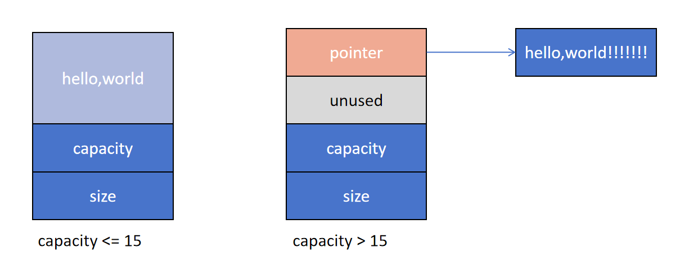


union表示共用体，允许在同一内存空间中存储不同类型的数据。共用体的所有成员共享一块内存，但是每次只能使用一个成员。

```C++
class string {
	union Buffer{
		char * _pointer;
		char _local[16];
	};
	
	size_t _size;
	size_t _capacity;
    Buffer _buffer;
};
```


### 最佳策略

Facebook提出的最佳策略，将三者进行结合：

因为以上三种方式，都不能解决所有可能遇到的字符串的情况，各有所长，又各有缺陷。综合考虑所有情况之后，facebook开源的folly库中，实现了一个fbstring, 它根据字符串的不同长度使用不同的拷贝策略， 最终每个fbstring对象占据的空间大小都是24字节。

1. 很短的（0~22）字符串用SSO，23字节表示字符串（包括'\0'）,1字节表示长度

2. 中等长度的（23~255）字符串用eager copy，8字节字符串指针，8字节size，8字节capacity.
3. 很长的(大于255)字符串用COW, 8字节指针（字符串和引用计数），8字节size，8字节capacity.


