# 第六章 继承

## 继承的基本概念

在学习类和对象时，我们知道对象是基本，我们从对象上抽象出类。但是，世界可并不是一层对象一层类那么简单，对象抽象出类，在类的基础上可以再进行抽象，抽象出更高层次的类。

而C++ 中模拟这种结构发展的方式就是继承，它也是代码重用的方式之一。通过继承，我们可以用原有类型来定义一个新类型，定义的新类型既包含了原有类型的成员，也能自己添加新的成员，而不用将原有类的内容重新书写一遍。原有类型称为“基类”或“父类”，在它的基础上建立的类称为“派生类”或“子类”。


定义派生类时，需要要在派生类的类派生列表中明确的指出它是从哪个基类继承而来的。

```C++
class 基类
{}；

class 派生类
: public/protected/private 基类 //继承方式
{};
```

如上述代码所示，有三种继承方式，其“继承效果”如图：

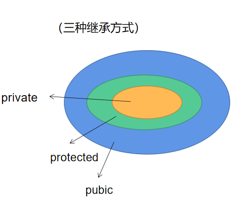


**定义一个派生类的过程：**

1. 吸收基类的成员
2. 添加新的成员（非必须）
3. 隐藏基类的成员（非必须）


``` c++
class Point3D
: public Point
{
public:
    Point3D(int x, int y, int z)
    : Point(x,y)
    , _iz(z)
    {
        cout << "Point3D(int*3)" << endl;
    }

    void display() const{  //添加新的成员函数
       	print();
        cout << _iz << endl;
    }
private:
    int _iz;  //添加新的数据成员
};
```


如果定义一个派生类只写了继承关系，没有写任何的自己的内容，那么也会吸收基类的成员，这个情况叫做空派生类（其目的是在特定的场景建立继承关系，为将来的拓展留出空间）


### **三种继承方式的访问权限**

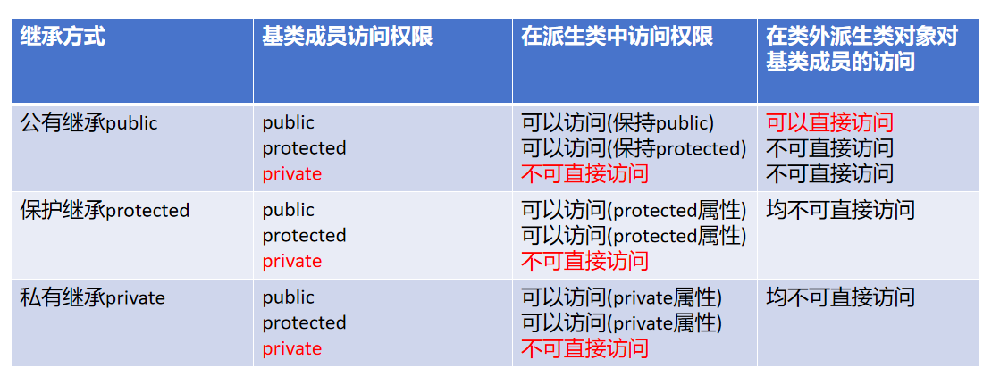

总结：派生类的访问权限如下：

1. 不管什么继承方式，派生类内部都不能访问基类的私有成员；
2. 不管什么继承方式，派生类内部除了基类的私有成员不可以访问，其他的都可以访问；
3. 不管什么继承方式，派生类对象在类外除了公有继承基类中的公有成员可以访问外，其他的都不能访问。

**(记忆：1.私有的成员在类外无法直接访问； 2.继承方式和基类成员访问权限做交集)**


根据上面的总结，很容易感受到公有继承和另外两种继承方式的区别，但是<span style=color:red;background:yellow>**保护继承和私有继承之间有什么区别呢？**</span>

—— 如果再往下派生一层，试着在最底层的派生类中访问顶层基类的成员，看看效果。


**以三层继承为例，如果中间层采用保护继承的方式继承顶层基类，那么在底层派生类中也能访问到顶层基类的公有成员和保护成员。**

**如果中间层采用私有继承的方式继承顶层基类，那么底层派生类中对顶层基类的任何成员都无法访问了。**


**私有继承的特性：**

在多层继承的关系中，如果有一层采用了私有继承的方式，那么再往下进行派生的类就没法访问更上层的基类的成员了。（访问直接基类的非私有成员仍然是可以的）

``` c++
class A
{ 
public: 
	int a;
};

class B
: private A
{};

class C
: private B
{
    void func(){
        a;//error，无法访问a
    }
};
```

> —— 多写几层继承结构，体会各种成员在派生类中的访问权限
>
> 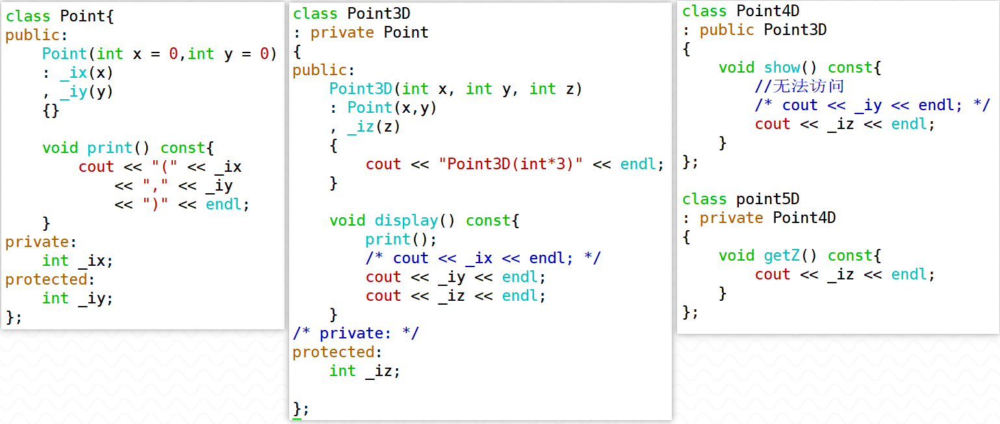
>
> 


<span style=color:red;background:yellow>**常考题总结**</span>

**Q1：派生类在类之外对于基类成员的访问 ，具有什么样的限制？**

  只有公有继承自基类的公有成员，可以通过派生类对象直接访问，其他情况一律都不可以进行访问

**Q2：派生类在类内部对于基类成员的访问 ，具有什么样的限制？**

对于基类的私有成员，不管以哪种方式继承，在派生类内部都不能访问；

对于基类的非私有成员，不管以哪种方式继承，在派生类内部都可以访问；

**Q3：保护继承和私有继承的区别？**

如果继承层次中都采用的是保护继承，任意层次都可以访问顶层基类的非私有成员；但如果采用私有继承之后，这种特性会被打断。


—— 公有继承被称为接口继承，保护继承、私有继承称为实现继承。

### 继承关系的局限性*

创建、销毁的方式不能被继承 —— 构造、析构

复制控制的方式不能被继承 —— 拷贝构造、赋值运算符函数

空间分配的方式不能被继承 —— operator new 、 operator delete

友元不能被继承（友元破坏了封装性，为了降低影响，不允许继承）


##  单继承下派生类对象的创建和销毁

### 简单的单继承结构

有这样一种说法：创建派生类对象时，先调用基类构造函数，再调用派生类构造函数，对吗？

**错误，创建派生类对象，一定会先调用派生类的构造函数，在此过程中会先去调用基类的构造**


- <span style=color:red;background:yellow>**创建派生类对象时调用基类构造的机制**</span>

1.当派生类中没有显式调用基类构造函数时，会自动调用基类的默认无参构造（或者所有参数都有默认值的有参构造）；

``` c++
class Base {
public:
	Base(){ cout << "Base()" << endl; }
private:
	long _base;
};

class Derived
: public Base 
{
public:
	Derived(long derived)
    // : Base()  //自动调用Base的默认无参构造
	: _derived(derived)
	{ cout << "Derived(long)" << endl; }
    
	long _derived;
};

void test() {
	Derived d(1);
}
```

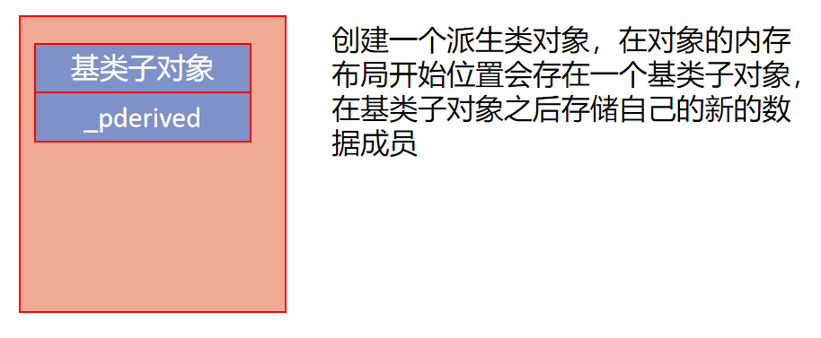


2.此时如果基类中没有默认无参构造，Derived类的构造函数的初始化列表中也没有显式调用基类构造函数，编译器会报错

——不允许派生类对象的创建；

``` c++
class Base {
public:
	Base(long base){ cout << "Base(long)" << endl; }
private:
	long _base;
};

class Derived
: public Base 
{
public:
    Derived(long base, long derived)//error
	：_derived(derived)
	{ cout << "Derived(long)" << endl; }
private:   
	long _derived;
};
```


3.当派生类对象调用基类构造时，希望使用非默认的基类构造函数，必须显式地在初始化列表中写出。

```` c++
class Base {
public:
	Base(long base){ cout << "Base(long)" << endl; }
private:
	long _base;
};

class Derived
: public Base 
{
public:
    Derived(long base, long derived)
    : Base(base)  //显式调用基类的构造函数
	，_derived(derived)
	{ cout << "Derived(long)" << endl; }
private:   
	long _derived;
};

void test() {
	Derived d;//error
}
````

注意与对象成员的初始化做区分。

> <font color=red>**构造函数的调用顺序：**</font>
>
> 创建派生类对象会马上调用派生类的构造函数，但在初始化列表的最开始调用基类的构造函数。


- <span style=color:red;background:yellow>**派生类对象的销毁**</span>

当派生类析构函数执行完毕之后，会自动调用基类析构函数，完成基类部分所需要的销毁（回收数据成员申请的堆空间资源）。

**记忆：创建一个对象，一定会马上调用自己的构造函数；一个对象被销毁，也一定会马上调用自己的析构函数。**

如果基类、派生类各自的数据成员申请了堆空间，那么回收顺序如下：

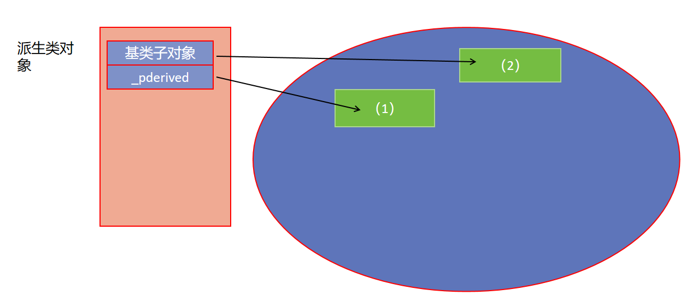


### 当派生类对象中包含对象成员

在派生类的构造函数中，初始化列表里调用基类的构造，写的是类名；

初始化列表中调用对象成员的构造函数，写的是对象成员的名字。

``` c++
class Test{
public:
    Test(long test)
    : _test(test)
    { cout << "Test()" << endl; }
    ~Test(){ cout << "~Test()" << endl; }
private:
    long _test;
};

class Derived
: public Base
{
public:
    Derived(long base,long test,long b2,long derived)
    : Base(base)//创建基类子对象
    , _derived(derived)
    , _t1(test)//创建Test类的成员子对象
    {
        cout << "Derived()" << endl;
    }

    ~Derived(){
        cout << "~Derived()" << endl;
    }
private: 
    long _derived;
    Test _t1;
};
```


显式调用基类构造函数，写的是基类类名；显式调用对象成员的构造函数，写的是对象成员的名字。

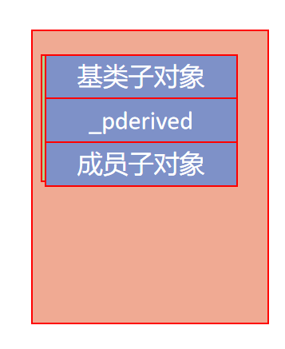


思考： 如果再给派生类中加上一个基类的对象成员，派生类的构造函数应该怎么写呢？

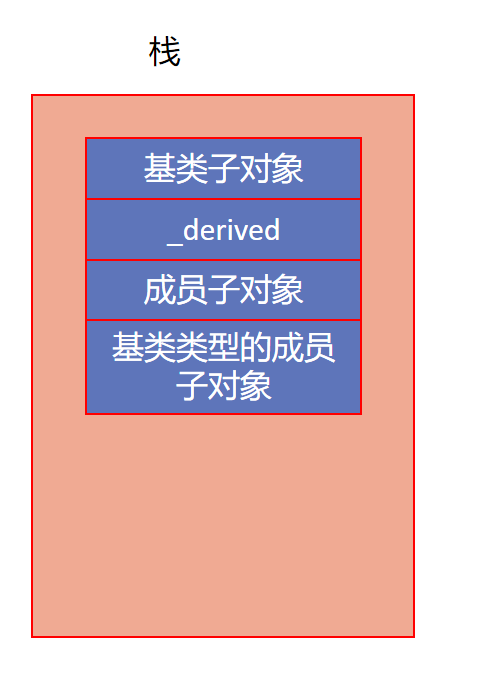


**创建一个派生类对象时，会马上调用自己的构造函数，在此过程中，还是会先调用基类的构造函数创建基类子对象，然后根据对象成员的声明顺序去调用对象成员的构造函数，创建出成员子对象；**

**一个派生类对象销毁时，调用自己的析构函数，析构函数执行完后，按照对象成员的声明顺序的逆序去调用对象成员的析构函数，最后调用基类的析构函数（基类子对象调用）。**

> 如果Base/Test/Derived都有自己的指针成员，申请了堆空间，那么对于堆空间的回收顺序如图
>
> 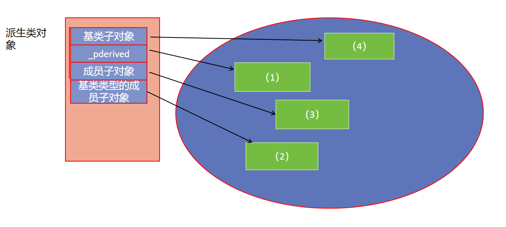
>
> 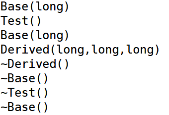


### 对基类成员的隐藏

#### 基类数据成员的隐藏

派生类中声明了和基类的数据成员<span style=color:red;background:yellow>**同名**</span>的数据成员，就会对基类的这个数据成员形成隐藏。

派生类对象无法通过数据成员的名字直接访问基类的这个数据成员。

```` c++
class Base{
public:
    Base(long x)
    : _base(x)
    {
        cout << "Base()" << endl;
    }
    
    long _data = 100;
private:
    long _base;
};

class Derived
: public Base
{
public:
    Derived(long base,long derived)
    : Base(base)//初始化基类子对象
    , _derived(derived)
    {
        cout << "Derived()" << endl;
    }
    
    long _data = 19;
private:
    long _derived;

};

void test0(){
    Derived dd(1,2);
    cout << dd._data << endl;
    cout << dd.Base::_data << endl;
}

````


<span style=color:red;background:yellow>**隐藏不代表改变了基类的这个数据成员**</span>

从内存的角度上也能验证

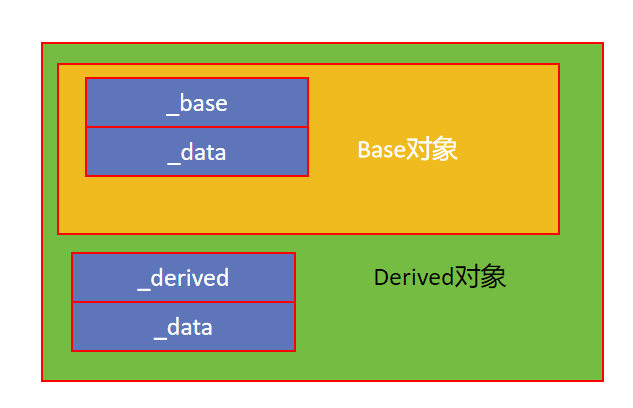

（这里与嵌套类做区分——派生类对象中一定包含基类子对象，但嵌套类并不意味着内存结构上也是嵌套，除非外部类包含内部类类型的对象成员）


如果一定要访问基类的这个数据成员，需要加上作用域，<font color=red>**但是这种写法不符合面向对象的原则，不推荐实际使用**</font>。

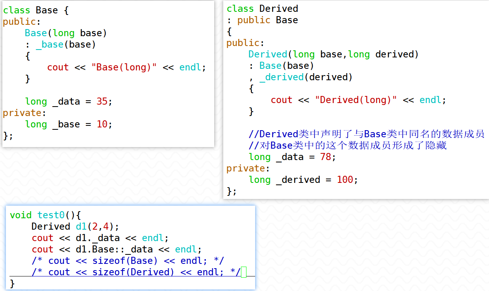


#### 基类成员函数的隐藏

当派生类声明了与基类同名的成员函数时，只要名字相同，即使参数列表不同，也只能看到派生类部分的，无法通过派生类对象直接调用基类的同名函数。

看一个例子：

Base中定义一个不传参的print函数，Derived类中不定义print函数

``` c++
    void print() const{
        cout << "Base::_base:" << _base << endl;
        cout << "Base::_data:" << _data  << endl;
    }
```

Derived对象调用print(),输出的基类的_data

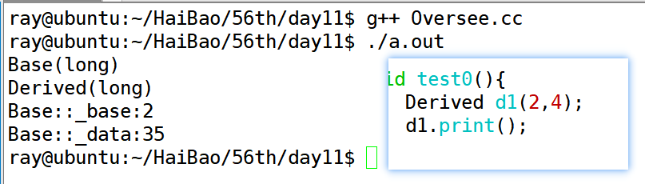


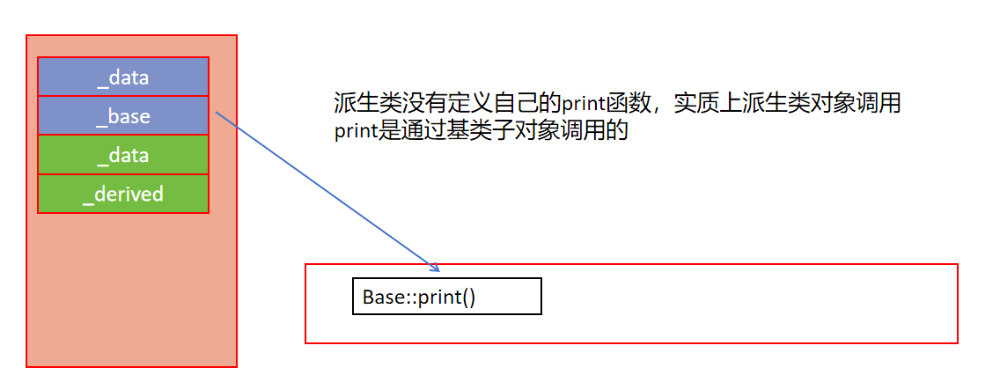


> Derived类中定义一个print函数，再通过Derived对象调用print函数会调用到自己的print
>
> 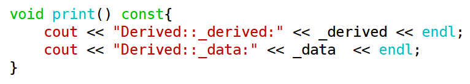
>
> 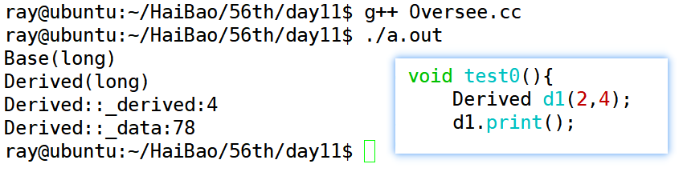


Derived中print函数需要传入一个int型参数

````c++
    void print(int x) const{
        cout << "Derived::_derived:" << _derived << endl;
        cout << "Derived::_data:" << _data  << endl;
    }
````

使用Derived对象调用print时，只能通过传入一个int参数的形式去调用，说明Base类中的print函数也发生了隐藏。

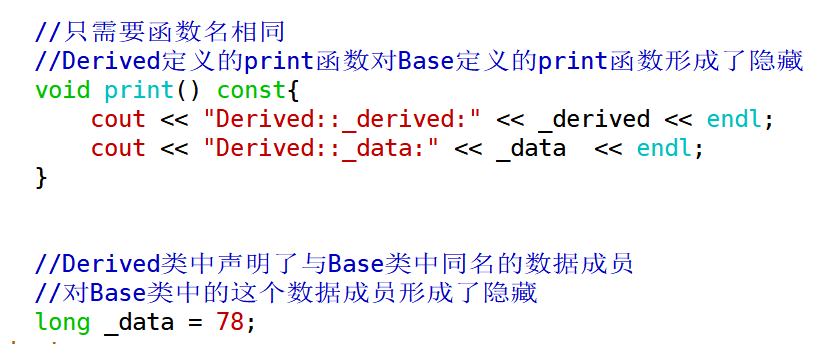

<span style=color:red;background:yellow>**派生类对基类的成员函数构成隐藏，只需要派生类中定义一个与基类中成员函数同名的函数即可（函数的返回类型、参数情况都可以不同，依然能隐藏）。**</span>


如果一定要调用基类的这个成员函数，需要加上作用域，但是这种写法不符合面向对象的原则，不推荐实际使用。


##  多继承

C++ 除了支持单继承外，还支持多重继承。那为什么要引入多重继承呢？其实是因为在客观现实世界中，我们经常碰到一个人身兼数职的情况，如在学校里，一个同学可能既是一个班的班长，又是学生中某个部门的部长；在创业公司中，某人既是软件研发部的 CTO ，又是财务部的 CFO ；一个人既是程序员，又是段子手。诸如此类的情况出现时，单一继承解决不了问题，就可以采用多继承（多基继承、多基派生）了。

继承关系本质上是一个IS A的关系。

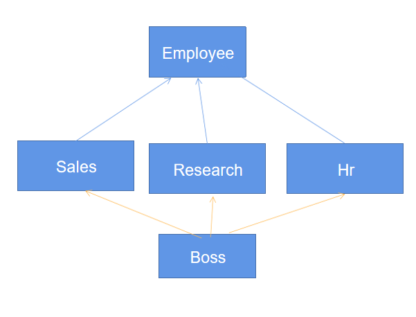

### 多重继承的派生类对象的构造和析构

多继承的定义方式

``` c++
class A
{
public:
    A(){ cout << "A()" << endl; }
    ~A(){ cout << "~A()" << endl; }
    void print() const{
        cout << "A::print()" << endl;
    }
};

class B
{
public:
    B(){ cout << "B()" << endl; }
    ~B(){ cout << "~B()" << endl; }
    void show() const{
        cout << "B::show()" << endl;
    }
};

class C
{
public:
    C(){cout << "C()" << endl; }
    ~C(){ cout << "~C()" << endl; }
    void display() const{
        cout << "C::display()" << endl;
    }
};

class D
: public A,B,C
{
public:
    D(){ cout << "D()" << endl; }
    ~D(){ cout << "~D()" << endl; }
    //void print() const{
    //    cout << "D::print()" << endl;
    //}
};
```

<font color=red>**如果这样定义，那么D类公有继承了A类，但是对B/C类采用的默认的继承方式是private**</font>


如果想要公有继承A/B/C三个类

``` c++
class D
: public A
, public B
, public C
{
public:
    D(){ cout << "D()" << endl; }
    ~D(){ cout << "~D()" << endl; }
    //void print() const{
        //cout << "D::print()" << endl;
    //}
};
```


**此结构下创建D类对象时，这四个类的构造函数调用顺序如何？**

马上调用D类的构造函数，在此过程中会根据继承的声明顺序，依次调用A/B/C的构造函数，创建出这三个类的基类子对象

**D类对象销毁时，这四个类的析构函数调用顺序如何？**

马上调用D类的析构函数，析构函数执行完后，按照继承的声明顺序的逆序，依次调用A/B/C的析构函数

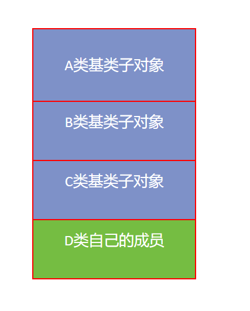


### 多重继承可能引发的问题

#### 成员名访问冲突的二义性

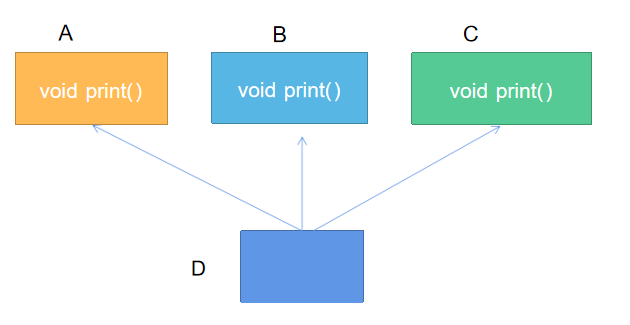

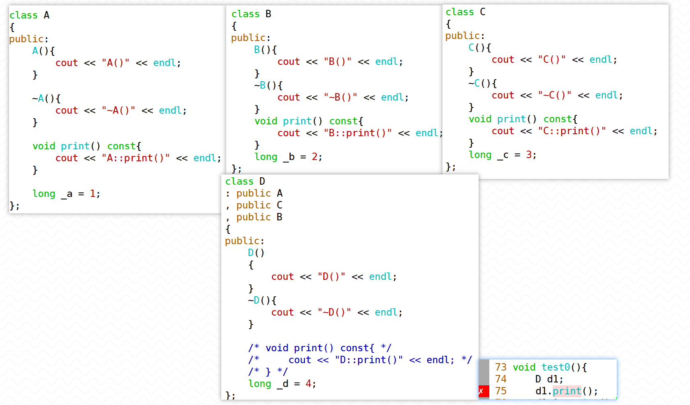

解决成员名访问冲突的方法：加类作用域（不推荐）—— 应该尽量避免。

同时，<span style=color:red;background:yellow>**如果D类中声明了同名的成员，可以对基类的这些成员造成隐藏效果**</span>，那么就可以直接通过成员名进行访问。

``` c++
    D d;
    d.A::print();
    d.B::print();
    d.C::print();
    d.print(); //ok
```


#### 存储二义性的问题（重要）

菱形继承结构

``` c++
class A
{
public:
    void print() const{
        cout << "A::print()" << _a << endl;
    }
    double _a;
};

class B
: public A
{
public:
    double _b;
};

class C
: public A
{
public:
    double _c;
};

class D
: public B
, public C
{
public:
    double _d;
};
```


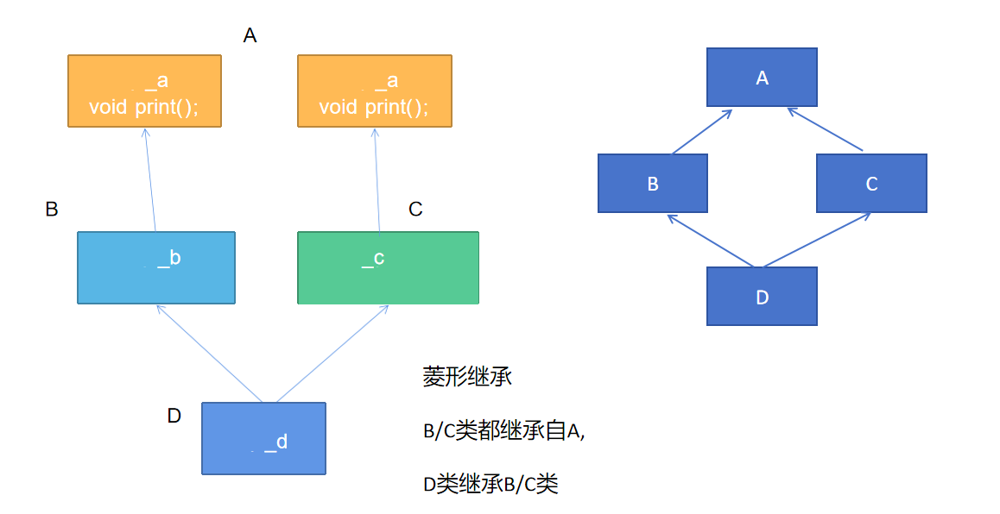


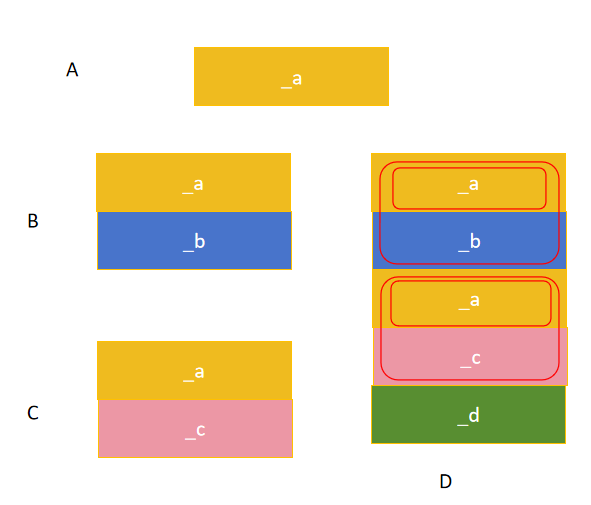


菱形继承情况下，D类对象的创建会生成一个B类子对象，其中包含一个A类子对象；还会生成一个C类子对象，其中也包含一个A类子对象。所以D类对象的内存布局中有多个A类子对象，访问继承自A的成员时会发生二义性**(无论是否涉及A类的数据成员，单纯访问A类的成员函数也会冲突)**

因为编译器需要通过基类子对象去调用，但是不知道应该调用哪个基类子对象的成员函数。

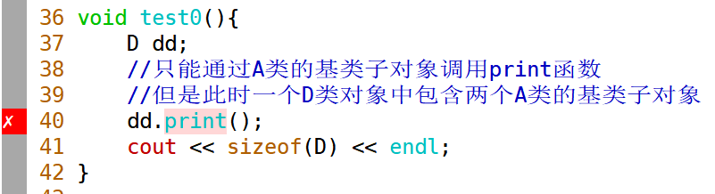

当然，D类如果再写一个同名成员函数，会发生隐藏。


<span style=color:red;background:yellow>**解决存储二义性的方法：中间层的基类采用虚继承顶层基类的方式解决存储二义性**</span>


``` c++
class A
{
public:
    void print() const{
        cout << "A::print()" << endl;
    }
    double _a;
};

class B
: virtual public A
{
public:
    double _b;
};

class C
: virtual public A
{
public:
    double _c;
};

class D
: public B
, public C
{
public:
    double _d;
};
```


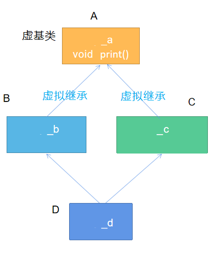


采用虚拟继承的方式处理菱形继承问题，实际上改变了派生类的内存布局。B类和C类对象的内存布局中多出一个虚基类指针，位于所占内存空间的起始位置，同时继承自A类的内容被放在了这片空间的最后位置。D类对象中只会有一份A类的基类子对象。


> 通过VS可以验证，查看D类的布局：
>
> 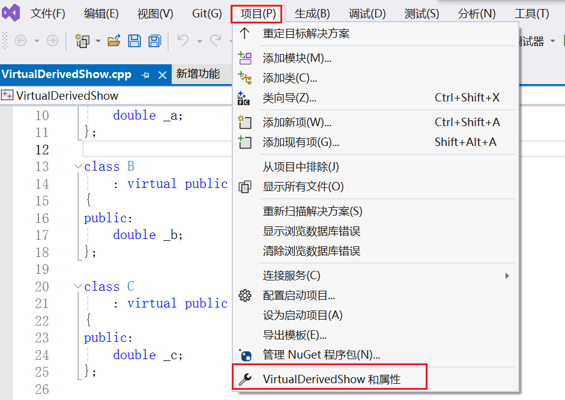
>
> 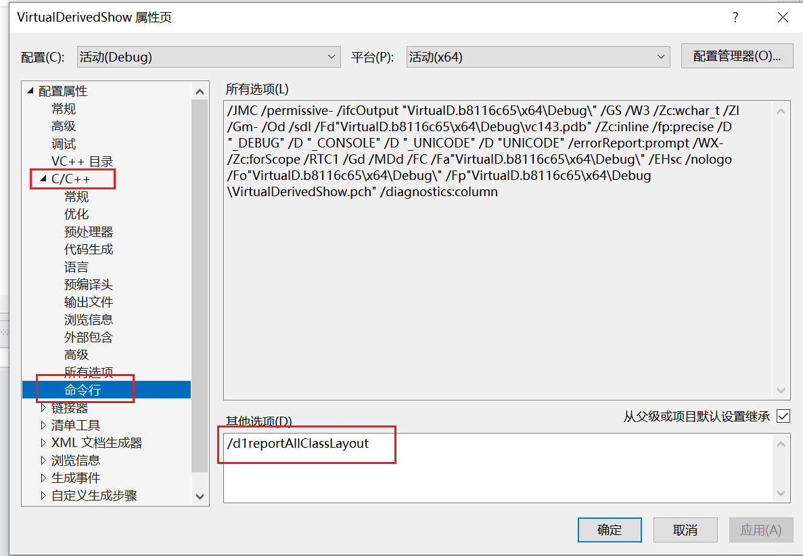
>
> 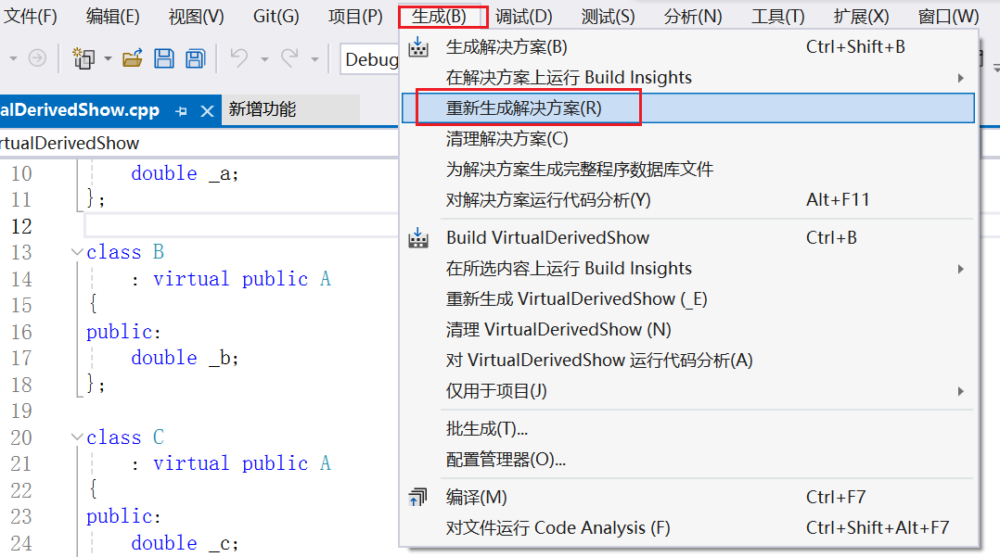
>
> 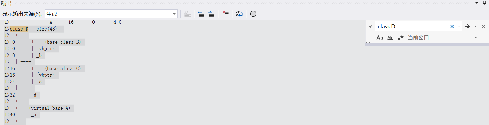
>
> 
>
> 验证得到的结果：
>
> 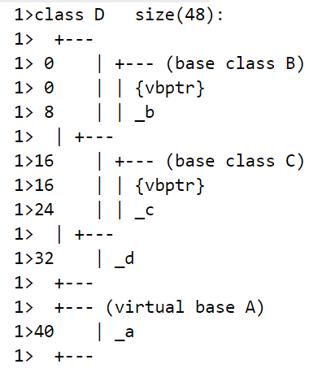


##  基类与派生类之间的转换

**一般情况下，基类对象占据的空间小于派生类对象。**

（空继承时，有可能相等）


1：可否用一个基类对象给一个派生类对象赋值？可否用一个派生类对象给一个基类对象赋值？

2：可否将一个基类指针指向一个派生类对象？可否将一个派生类指针指向一个基类对象？

3：可否将一个基类引用绑定一个派生类对象？可否将一个派生类引用绑定一个基类对象？

### 派生类向基类转换


``` c++
class Base {
public:
	Base(long base)
	: _base(base)
	{}

	void display(){
		cout << "Base::display() " << _base << endl;
	}
    
	long _base;
};

class Derived
: public Base 
{
public:
	Derived(long base,long derived)
	: Base(base)
	, _derived(derived)
	{}
    
	void display(){
		cout << "Derived::display() " << _derived << endl;
	}
    
	long _derived;
};
```

``` c++
Base base(1);
Derived d1(2,5);

base = d1; //ok
d1 = base; //error

Base * pbase = &d1; //ok
Derived * pderived = &base //error
    
Base & rbase = d1; //ok
Derived & rderived = base; //error
```

> 以上三个ok的操作，叫做向上转型（从右往左看，往基类方向就是向上），直接进行向上转型是可行的
>
> **反之，基类向派生类转型称为向下转型，直接进行向下转型都会报错。**
>
> - 用基类对象接受派生类对象的赋值（ok）
> - 用基类引用绑定派生类对象（ok）
> - 用基类指针指向派生类对象（ok）
>
> **—— 体现派生类向基类的转型。**

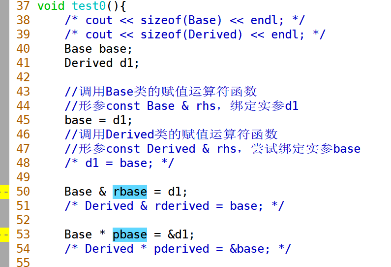


> 为什么向上转型可以直接进行，而向下转型不能呢？
>
> **因为向下转型有风险 —— 以指针为例**
>
> 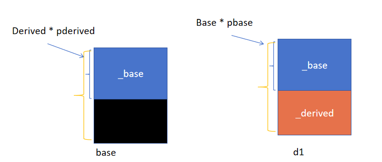
>
> Base类的指针指向Derived类的对象，d1对象中存在一个Base类的基类子对象，这个Base类指针所能操纵只有继承自Base类的部分；
>
> Derived类的指针指向Base对象，除了操纵Base对象的空间，还需要操纵一片空间，只能是非法空间，所以会报错。
>
> 
>
> <font color=red>**验证方式：基类指针指向派生类对象后，利用基类指针调用被隐藏的成员函数，仍然只能调用到基类自己定义的函数。**</font>
>
> 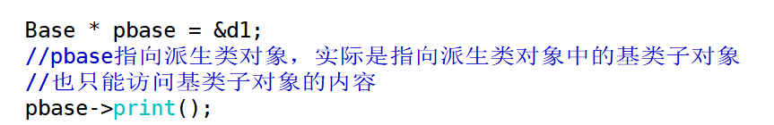

> <span style=color:red;background:yellow>**补充：**</span>基类对象和派生类对象之间的转换没有太大的意义，**基类指针指向派生类对象（基类引用绑定派生类对象）重点掌握，其共同特点是只能访问到基类的部分。**


### 基类向派生类转换

> 有些场景下，向下转型是合理的。
>
> 即基类向派生类的转型，我们看看这样的例子
>
> ``` c++
>Base base;
> Derived d1;
> 
> Base * pbase = &d1;
> Derived * pderived = pbase;//这种转型是合理的，但是不能直接转型，会报错
> ```
> 
> 
> 
> 

上述的转换是合理的，相当于将一个`Derived*`转成`Base*`，然后再转回`Derived*`，但仍然不能直接进行向下的转型。


#### C语言方式转换

可以进行如下的转换

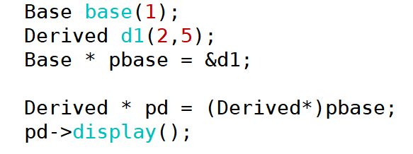

转换能够成功，得到的派生类指针成功调用派生类定义的display函数。但是，C方式的类型转换缺点在于，无论这种向下转型是否合理，都会得到一个普通的派生类指针，也就是说实实在在地允许了新的指针操作非法空间。

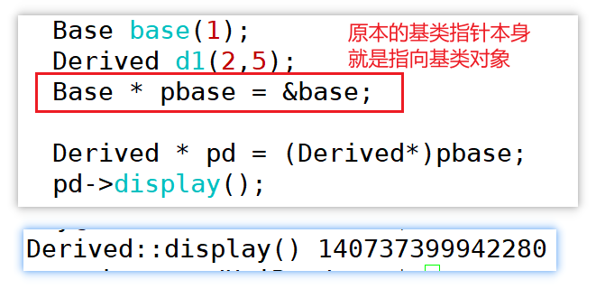

因此，用C语言的方式进行向下的类型转换存在隐患。


#### C++方式转换

在第一章我们介绍了四种强制转换，其中static_cast/reinterpret_cast的转换效果与C语言的转换效果相同

这里可以使用dynamic_cast进行转换。

> 注意：在使用dynamic_cast时还<span style=color:red;background:yellow>**需要有多态的内容**</span>，我们需要加上一个虚函数。
>
> ``` c++
> class Base {
> public:
> 	Base(long base)
> 	: _base(base)
> 	{}
> 
>     virtual
> 	void display(){
> 		cout << "Base::display() " << _base << endl;
> 	}
>     
> 	long _base;
>    };
>  
>     class Derived
> : public Base 
> {
> public:
> 	Derived(long base,long derived)
> 	: Base(base)
> 	, _derived(derived)
> 	{}
>     
> 	void display(){
> 		cout << "Derived::display() " << _derived << endl;
> 	}
>        
>  	long _derived;
> };
> ```
>    

> ``` c++
> void test0(){	
> Base base(1);
> Derived d1(2,5);
> Base * pbase = &d1;
> 
> //向下转型
> Derived * pd = dynamic_cast<Derived*>(pbase);
> if(pd){
>   cout << "转换成功" << endl;
>   pd->display();
> }else{
>   cout << "转换失败" << endl;
> }
> }
> ```
>
> 这里可以转换成功，因为pbase本身就是指向一个Derived对象。
>
> 如果是不合理的转换，dynamic_cast会返回一个空指针。


> <span style=color:red;background:yellow>**结论：**</span>
>
> **可以用派生类对象赋值给基类对象（用基类对象接受派生类对象的赋值），可以用基类指针指向派生类对象，可以用基类引用绑定派生类对象。**
>
> **反之则均不可，需要有类型转换的过程。**


## 派生类对象间的复制控制（重点）

<font color=red>**复制控制函数就是 拷贝构造函数、赋值运算符函数**</font>

原则：基类部分与派生类部分要单独处理

**（1）当派生类中没有显式定义复制控制函数时，就会自动完成基类部分的复制控制操作；**

**（2）当派生类中有显式定义复制控制函数时，不会再自动完成基类部分的复制控制操作，需要显式地调用；**


> 对于拷贝构造，如果显式定义了派生类的拷贝构造，在其中不去显式调用基类的拷贝构造，那么无法通过复制初始化基类的部分，只能尝试用Base无参构造初始化基类的部分。如果Base没有无参构造，编译器就会报错。
>
> 对于赋值运算符函数，如果显式定义了派生类的赋值运算符函数，在其中不去显式调用基类的赋值运算符函数，那么基类的部分没有完成赋值操作。

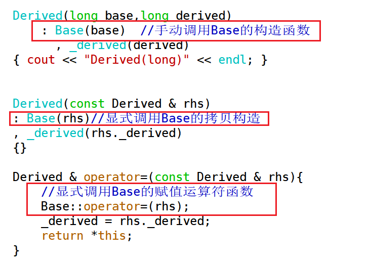


**如下，Derived对象没有指针成员申请堆空间，不需要显式定义拷贝构造函数和赋值运算符函数。编译器会自动完成基类部分的复制工作。**

但是如果在Derived类中显式写出了复制控制的函数，就需要显式地调用基类的复制控制函数。

``` c++
class Base{
public:
    Base(long base)
    : _base(base)
    {}

protected:
    long _base = 10;
};


class Derived
: public Base
{
public:
    Derived(long base, long derived)
    : Base(base)
    , _derived(derived)
    {}

    Derived(const Derived & rhs)
    : Base(rhs)//调用Base的拷贝构造
    , _derived(rhs._derived)
    {
        cout << "Derived(const Derived & rhs)" << endl;
    }

    Derived &operator=(const Derived & rhs){
        //调用Base的赋值运算符函数
        Base::operator=(rhs);
        _derived = rhs._derived;
        cout << "Derived& operator=(const Derived &)" << endl;
        return *this;
    }

private:
    long _derived = 12;
};
```


如果Derived类的数据成员申请了堆空间，那么必须手动写出Derived类的复制控制函数，此时就要考虑到基类的复制控制函数的显式调用。

（如果只是Base类的数据成员申请了堆空间，那么Base类的复制控制函数必须显式定义，Derived类自身的数据成员如果没有申请堆空间，不用显式定义复制控制函数）


> <font color=red>**练习：**</font>**将Base类的数据成员换成char *类型，体验一下派生类的复制。**
>
> —— 如果派生类中没有指针数据成员，不需要显式写出复制控制函数。<font color=red>**编译器会自动进行基类部分的复制控制。**</font>


### 拷贝构造函数

> - <span style=color:red;background:yellow>**对于派生类的拷贝构造函数**</span>
>
> 如果给Derived类中添加一个char * 成员，依然不显式定义Derived的复制控制函数。
>
> 那么进行派生类对象的复制时，基类的部分会完成正确的复制，派生类的部分只能完成浅拷贝。
>
> 若派生类合理地定义了析构函数，那么对象在销毁时会出现double free问题<font color=red>**（三合成原则）**</font>
>
> ``` c++
> Derived d1("hello","world");
> Derived d2 = d1;
> ```
>
> 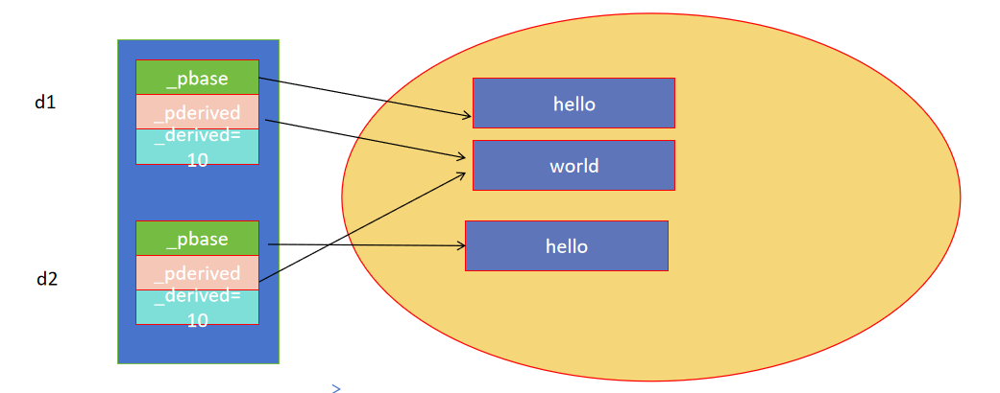

> 如果接下来给Derived类显式定义了拷贝构造，但是没有在这个拷贝构造中显式调用基类的拷贝构造（没有写任何的基类子对象的创建语句），会直接报错。
>
> （—— 在派生类的构造函数的初始化列表中没有显式调用基类的任何的构造函数，编译器会自动调用基类的无参构造，此时基类没有无参构造，所以报错）
>
> 因为无法对d2对象的基类子对象进行初始化，<font color=red>**需要在derived的拷贝构造函数中显式调用Base的拷贝构造。**</font>
>
> 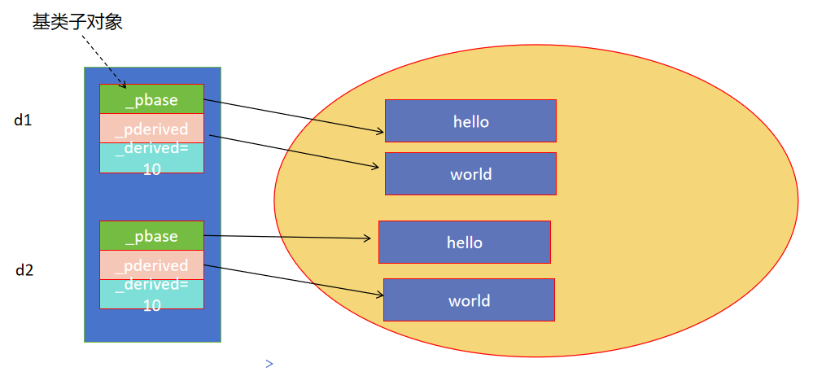
>
> 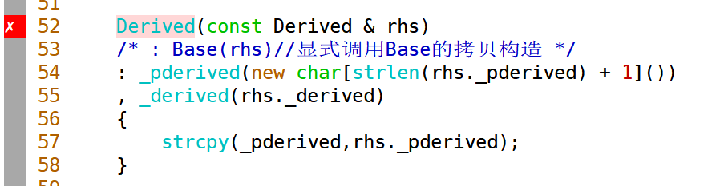


### 赋值运算符函数

> - <span style=color:red;background:yellow>**对于派生类的赋值运算符函数**</span>
>
> 如果接下来给Derived显式定义赋值运算符函数，但是没有在其中显式调用基类的赋值运算符函数
>
> ```` c++
> Derived d1("hello","world");
> Derived d2 = d1;
> Derived d3("beijing","shanghai");
> 
> d2 = d3;  //派生类对象的部分完成了复制，但是基类部分没有完成复制
> ````
>
> 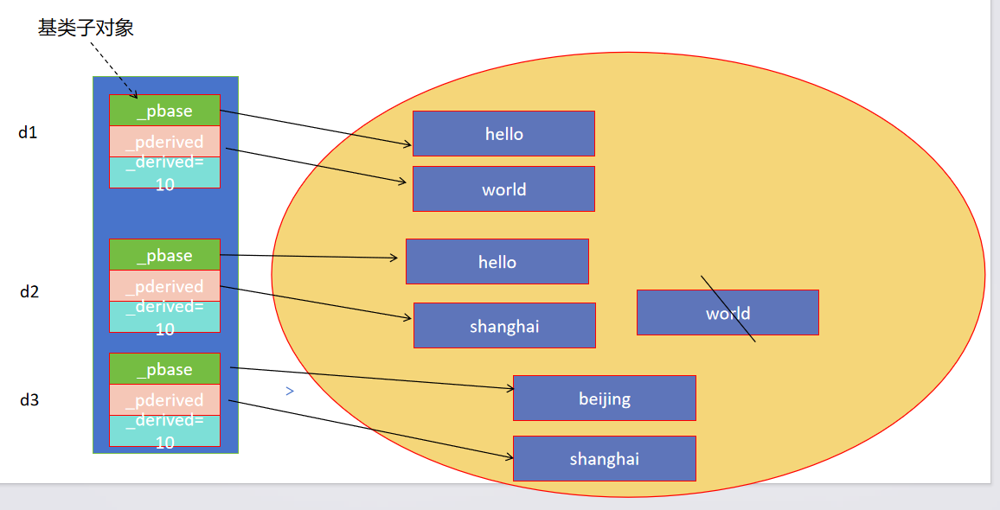

> 基类的部分不会自动完成赋值，<font color=red>**需要在Derived的赋值运算符函数中显式调用Base的赋值运算符函数**</font>，才能完成正确的赋值
>
> 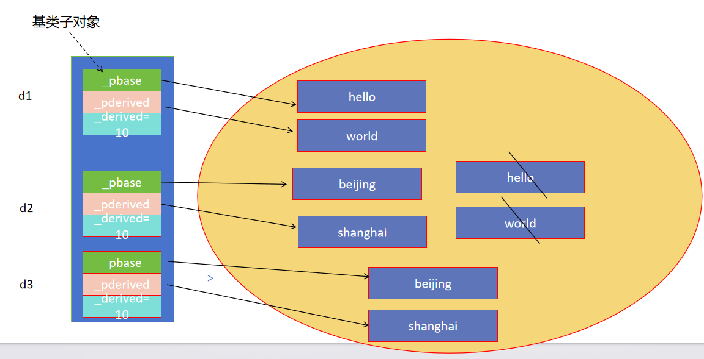


<span style=color:red;background:yellow>**总结：**</span>

**给Derived类手动定义复制控制函数，注意在其中显式调用相应的基类的复制控制函数**

**（注意：派生类对象进行复制时一定会马上调用派生类的复制控制函数，在进行复制时会首先复制基类的部分，此时调用基类的复制控制函数）**


``` c++
Derived(const Derived & rhs)
    : Base(rhs)//显式调用基类的拷贝构造
    , _pderived(new char[strlen(rhs._pderived) + 1]())
    {
        strcpy(_pderived, rhs._pderived);
        cout << "Derived(const Derived &)" << endl;
    }

Derived & operator=(const Derived & rhs){
    cout << "Derived & operator=(const Derived &)" << endl;
    if(this != &rhs){
    //显式调用基类的赋值运算符函数
    Base::operator=(rhs);//关键
    delete [] _pderived;
    _pderived = new char[strlen(rhs._pderived) + 1]();
    strcpy(_pderived,rhs._pderived);
    _derived = rhs._derived;
    }
    return *this;
}
```


