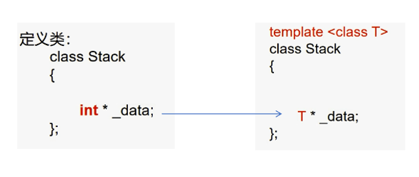

# 第九章 模板

模板是一种通用的描述机制，使用模板允许使用通用类型来定义函数或类。在使用时，通用类型可被具体的类型，如 int、double 甚至是用户自定义的类型来代替。模板引入一种全新的编程思维方式，称为“**泛型编程**”或“**通用编程**”。

##  为什么要定义模板

像C/C++/Java等语言，是**编译型语言**，先编译后运行。它们都有一个强大的类型系统，也被称为**强类型语言**，希望在程序执行之前，尽可能地发现错误，防止错误被延迟到运行时。所以会对语言本身的使用造成一些限制，称之为**静态语言**。

与之对应的，还有**动态语言**，也就是**解释型语言**。如javascript/python/Go，在使用的过程中，一个变量可以表达多种类型，也称为**弱类型语言**。因为没有编译的过程，所以相对更难以调试。

如图，变量a表达了int数据，然后又去表达了字符串，python中允许这样的做法。


强类型程序设计中，参与运算的所有对象的类型在编译时即确定下来，并且编译程序将进行严格的类型检查。为了解决强类型的严格性和灵活性的冲突，也就是在严格的语法要求下尽可能提高灵活性，有以下方式：


**例如，想要实现能够处理各种类型参数的加法函数**

> 以前我们需要进行函数重载（函数名相同，函数参数不同）
>
> 
>
> ``` c++
> int add(int x, int y)
> {
>     return x + y;
> }
> 
> double add(double x, double y)
> {
>     return x + y;
> }
> 
> long add(long x, long y)
> {
>     return x + y;
> }
> 
> string add(string x, string y)
> {
>     return x + y;
> }
> ```
>
> 在使用时看起来只需要调用add函数，传入不同类型的参数就可以进行相应的计算了，很方便。
>
> 但是程序员为了这种方便，实际上要定义很多个函数来处理各种情况的参数。


>  <span style=color:red;background:yellow>**模板（将数据类型作为参数）**</span>
>
>  上面的问题用函数模板的方式就可以轻松解决：
>
>  ```C++
>//希望将类型参数化
>  //使用class关键字或typename关键字都可以
>  template <class T>
>  T add(T x, T y)
>  {
>   	return x + y;
>  }
>    
>  int main(void){
>  	cout << add(1,2) << endl;
>   	cout << add(1.2,3.4) << endl;
>  	return 0;
>    }
>    ```
>  
>  函数模板的优点：
>
>  不需要程序员定义出大量的函数，在调用时实例化出对应的模板函数，更“智能”


## 模板的定义

模板作为实现代码重用机制的一种工具，**它可以实现类型参数化，也就是把类型定义为参数**，从而实现了真正的代码可重用性。

模板可以分为两类，一个是**函数模版**，另外一个是**类模板**。通过参数实例化定义出具体的函数或类，称为**模板函数**或**模板类**。模板的形式如下：


模板参数是一个更大的概念，包含了类型参数和非类型参数，这里的T1/T2属于类型参数，代表了类型。


> <span style=color:red;background:yellow>**模板发生的时机是在编译时**</span>
>
> 模板本质上就是一个代码生成器，它的作用就是让编译器根据实际调用来生成代码。
>
> 编译器去处理时，实际上由函数模板生成了多个模板函数，或者由类模板生成了多个模板类。


### 函数模板

> 由函数模板到模板函数的过程称之为<span style=color:red;background:yellow>**实例化**</span>
>
> **函数模板 --》 生成相应的模板函数 --》编译 ---》链接 --》可执行文件**

下图中实际上可以理解为生成了四个模板函数


``` c++
template <class T>
T add(T t1,T t2)
{ return t1 + t2; }

void test0(){
    short s1 = 1, s2 = 2;
    int i1 = 3, i2 = 4;
    long l1 = 5, l2 = 6;
    double d1 = 1.1, d2 = 2.2;
    
    cout << "add(s1,s2): " << add(s1,s2) << endl;
    cout << "add(i1,i2): " << add(i1,i2) << endl;
    cout << "add(l1,l2): " << add(l1,l2) << endl;
    cout << "add(d1,d2): " << add(d1,d2) << endl;  
}
```


上述代码中在进行模板实例化时，并没有指明任何类型，**函数模板在生成模板函数时通过传入的参数类型确定出（推导出）模板类型**，这种做法称为<span style=color:red;background:yellow>**隐式实例化**</span>。

我们在使用函数模板时还可以在函数名之后直接写上模板的类型参数列表，指定类型，这种用法称为<span style=color:red;background:yellow>**显式实例化**</span>。


``` c++
template <class T>
T add(T t1,T t2)
{ return t1 + t2; }

void test0(){
    int i1 = 3, i2 = 4;
    cout << "add(i1,i2): " << add<int>(i1,i2) << endl;  //显式实例化
}
```


#### 函数模板的重载

函数模板的重载分为：

（1）函数模板与函数模板重载**（谨慎使用）**

（2）函数模板与普通函数重载


##### 函数模板与函数模板重载

> 如果源文件中只有这个函数模板，在使用函数模板时传入两个不同类型的参数，会出错，因为该函数模板要求两个参数是同类型的数据。
>
> <span style=color:red;background:yellow>**此时可以进行显式实例化**</span>。
>
> 如下，指定了类型T为int型，虽然s1是short型数据，但会发生类型转换。这个转换没有问题，因为int肯定能存放short型数据的所有内容。
>
> ``` c++
> template <class T>
>    T add(T t1,T t2)
> { return t1 + t2; }    
> 
> void test0(){
>        short s1 = 1;
> 	int i2 = 4;
> 	cout << "add(s1,s2): " << add(s1,i2) << endl;//error
> 	cout << "add(s1,s2): " << add<int>(s1,i2) << endl;//ok
> }
> ```
> 
>
> 
>但如果是以下这种转换，实际上就会损失数据精度。此时的d2会转换成int型。
> 
>``` c++
> int i1 = 4；
> double d2 = 5.3;
> cout << "add(i1,d2): " << add<int>(i1,d2) << endl;//可以通过，但损失了精度
> ```


>   如果一个函数模板无法实例化出合适的模板函数（去进行显式实例化也有一些问题）的时候，可以再给出另一个函数模板
>
>   ``` c++
>   //函数模板与函数模板重载
>   //模板参数个数不同,ok
>   template <class T> //模板一
>   T add(T t1,T t2)
>   { 
>   return t1 + t2;
>   }
>   
>   
>   template <class T1, class T2>  //模板二
>   T1 add(T1 t1, T2 t2)
>   {
>   return t1 + t2;
>   }
>   
>   
>   double x = 9.1;
>   int y = 10;
>   cout << add(x,y) << endl;   //会调用模板二生成的模板函数，不会损失精度
>   
>   //猜测一下，这种调用方式返回的结果是什么呢？
>   cout << add(y,x) << endl; 
>   ```
>
>   上面输出的结果会是19，调用的仍然是模板二，但返回类型和函数的第一个参数类型相同，采用隐式实例化时根据参数推导类型，推导出返回类型应该是int型。


>    如果仍然采用显式实例化
>
>    - 可以传入两个类型参数，那么**一定会调用模板二生成的模板函数**。传入的两个类型参数会作为T1、T2的实例化参数。
>
>      因为只有模板二才支持在模板参数列表中传入两个参数，模板一的模板参数列表中只有一个参数。
>
>    
>
>    - 也可以传入一个类型参数，那么这个参数会作为模板参数列表中的第一个类型参数进行实例化。
>
>      ``` c++
>      double x = 9.1;
>      int y = 10;
>      cout << add<int,int>(x,y) << endl; //模板二  （1）
>      cout << add<int>(x,y) << endl; //模板一   （2）
>      cout << add<int>(y,x) << endl; //模板二   （3）
>      ```
>
>      第(2)次调用时，指定了返回类型和第一个参数类型为int，那么x会经历一次类型转换变成int型，而y本身就是int，可以匹配模板一；
>
>      第(3)次调用时，同样指定了返回类型和第一个参数类型为int，y本身就是int，x是double类型，匹配模板二，可以不需要进行任何类型转换，所以优先匹配模板二。
>

上面的各种情况是不是让人感觉头大了？事实上，**在一个源文件中定义多个通用模板的写法应该谨慎使用（尽量避免）**，<font color=red>**如果实在需要也尽量使用隐式实例化的方式进行调用**</font>，编译器会选择参数类型最匹配的模板（通常是参数类型需要更少转换的模板）。


<font color=red>**函数模板与函数模板重载：**</font>

> （1）首先，名称必须相同（显然）

> （2）模板参数列表中的模板参数在函数中所处位置不同 —— <span style=color:red;background:yellow>**但不建议进行这样的重载**</span>。
>
> 这样进行重载时，要注意，隐式实例化可能造成冲突，需要显式实例化。（有时候即使是显式实例化也很难避免冲突）
>
> **选择的参考标准也是尽量少地进行类型转换。**
>
> ``` c++
> template <class T1, class T2>  
> T1 add(T1 t1, T2 t2)
> {
> 	cout << "模板一" << endl;
> 	return t1 + t2;
> } 
> 
> template <class T1, class T2>  
> T1 add(T2 t2, T1 t1)
> {
> 	cout << "模板二" << endl;
> 	return t1 + t2;
> }
> 
> int a = 10;
> double b = 1.2;
> cout << add(a,b) << endl; //error
> cout << add<int>(a,b) << endl; //模板一
> cout << add<double>(a,b) << endl;  //模板二
> ```
>

> （3）模板参数的个数不一样时，可以构成重载（相对常见）
>
> ``` c++
>template <class T2, class T1>
> T1 add(T2 t2, T1 t1)
> {
> return t1 + t2;
> }
> 
> template <class T1, class T2, class T3>
> T1 add(T1 t1, T2 t2, T3 t3)
> {
> return t1 + t2 + t3;
> }
> ```
> 
> 


##### 函数模板与普通函数重载

> <span style=color:red;background:yellow>**普通函数优先于函数模板执行——因为普通函数更快**</span>
>
> 编译器扫描到函数模板的实现时并没有生成函数，只有扫描到下面调用add函数的语句时，给add传参，知道了参数的类型，这才生成一个相应类型的模板函数——模板参数推导。所以使用函数模板一定会增加编译的时间。
>
> 此处，就直接调用了普通函数，而不去采用函数模板，因为更直接，效率更高。
>
> 
>
> ``` c++
> //函数模板与普通函数重载
> template <class T1, class T2>
> T1 add(T1 t1, T2 t2)
> {
> return t1 + t2;
> }
> 
> short add(short s1, short s2){
> cout << "add(short,short)" << endl;
> return s1 + s2;
> }
> 
> void test1(){
> short s1 = 1, s2 = 2;
> cout << add(s1,s2) << endl;   //调用普通函数
> }
> ```
>
> 如果没有普通函数，就会调用上面的函数模板，实例化出相应的模板函数。尽管s1/s2的类型相同，也是可以使用该模板的。
>
> <font color=red>**—— T1/T2并不一定非得是不同类型，能推导出即可。**</font>
>
> 当然，如果采用显示实例化的方式调用，肯定是调用函数模板。


#### 头文件与实现文件形式（重要）

为什么C++标准头文件没有所谓的.h后缀？

在一个源文件中，函数模板的声明与定义分离是可以的，即使把函数模板的实现放在调用之下也是ok的，与普通函数一致。

``` c++
//函数模板的声明
template <class T>
T add(T t1, T t2)；


void test1(){ 
    int i1 = 1, i2 = 2;
	cout << add(i1,i2) << endl;
}

//函数模板的实现
template <class T>
T add(T t1, T t2)
{
    return t1 + t2;
}
```


> **如果在不同文件中进行分离**
>
> 如果像普通函数一样去写出了头文件、实现文件、测试文件，编译时会出现未定义报错
>
> ``` c++
> //add.h
> template <class T>
> T add(T t1, T t2);
> 
> //add.cc
> #include "add.h"
> template <class T>
> T add(T t1, T t2)
> {
> return t1 + t2;
> }
> 
> //testAdd.cc
> #include "add.h"
> void test0(){
> int i1 = 1, i2 = 2;
> cout << add(i1,i2) << endl;
> }
> ```
>
> 


> - 单独编译“实现文件”，使之生成目标文件，查看目标文件，会发现没有生成与add名称相关的函数。
>
> 
>
> 

> - 单独编译测试文件，发现有与add名称相关的函数，但是没有地址，这就表示只有声明。
>
> 


看起来和普通函数的情况有些不一样。

从原理上进行分析，函数模板定义好之后并不会直接产生一个具体的模板函数，只有在调用时才会实例化出具体的模板函数。

> 解决方法 ——  **在”实现文件“中要进行调用，因为有了调用才有推导，才能由函数模板生成需要的函数**
>
> ``` c++
> //add.cc
> template <class T>
> T add(T t1, T t2)
> {
> return t1 + t2;
> }
> 
> //在这个文件中如果只是写出了函数模板的实现
> //并没有调用的话，就不会实例化出模板函数
> void test1(){ 
> cout << add(1,2) << endl;
> }
> ```
>
> 
>
> 此时单独编译实现文件，发现生成了对应的函数
>
> 


但是在“实现文件”中对函数模板进行了调用，这种做法不优雅 。


设想：如果在测试文件调用时，在推导的过程中，<font color=red>**看到的是完整的模板的代码**</font>，那么应该可以解决问题

``` c++
//add.h
template <class T>
T add(T t1, T t2);

#include "add.cc"
```

可以在头文件中加上#include "add.cc"，即使实现文件中没有调用函数模板，单独编译testAdd.cc，也可以发现问题已经解决。

因为本质上相当于把函数模板的定义写到了头文件中。


> <span style=color:red;background:yellow>**总结：**</span>
>
> **对模板的使用，必须要拿到模板的全部实现，如果只有一部分，那么推导也只能推导出一部分，无法满足需求。**
>
> **换句话说，就是模板的使用过程中，其实没有了头文件和实现文件的区别，在头文件中也需要获取模板的完整代码，不能只有一部分。**


C++的标准库都是由模板开发的，所以经过标准委员会的商讨，<font color=red>**将这些头文件取消了后缀名，与C的头文件形成了区分；这些实现文件的后缀名设为了tcc**</font>


#### 模板的特化

在函数模板的使用中，有时候会有一些通用模板处理不了的情况，我们可以定义普通函数或特化模板来解决。虽然普通函数的优先级更高，但有些场景下是必须使用特化模板的。它的形式如下：

1. template后直接跟 <> ，里面不写类型
2. 在函数名后跟 <> ，其中写出要特化的类型

比如，add函数模板在处理C风格字符串相加时遇到问题，如果只是简单地让两个C风格字符串进行+操作，会报错。

可以利用特化模板解决：

```` c++
//特化模板
//这里就是告诉编译器这里是一个模板
template <>
const char * add<const char *>(const char * p1,const char * p2){
    //先开空间
    char * ptmp = new char[strlen(p1) + strlen(p2) + 1]();
    strcpy(ptmp,p1);
    strcat(ptmp,p2);
    return ptmp;
}

void test0(){
    //通用模板无法应对如下的调用
    const char * p = add("hello",",world");
    cout << p << endl;
    delete [] p;
}
````

**注意**

> <font color=red>**使用模板特化时，必须要先有基础的函数模板**</font>
>
> 如果没有模板的通用形式，无法定义模板的特化形式。因为特化模板就是为了解决通用模板无法处理的特殊类型的操作。
>
> 特化版本的函数名、参数列表要和原基础的函数模板相同，避免不必要的错误。


#### 模板的参数类型

> 1. 类型参数
>
>    之前的T/T1/T2等等称为模板参数，也称为类型参数，类型参数T可以写成任何类型
>
> 2. 非类型参数       
>
>    **需要是整型数据， char/short/int/long/size_t等**
>
>    不能是浮点型，float/double不可以


> 定义模板时，在模板参数列表中除了类型参数还可以加入非类型参数。
>
> 此时，<font color=red>**调用模板时需要传入非类型参数的值**</font>
>
> ``` c++
> template <class T,int kBase>
> T multiply(T x, T y){
> 	return x * y * kBase;
> }
> 
> void test0(){
> int i1 = 3,i2 = 4;
> //此时想要进行隐式实例化就不允许了，因为kBase无法推导
> cout << multiply(i1,i2) << endl;  //error
> cout << multiply<int,10>(i1,i2) << endl;   //ok
> }
> ```
>
> 
>
> 可以给非类型参数赋默认值，有了默认值后调用模板时就可以不用传入这个非类型参数的值
>
> ``` c++
> template <class T,int kBase = 10>
> T multiply(T x, T y){
> 	return x * y * kBase;
> }
> 
> void test0(){
> 	int i1 = 3,i2 = 4;
> 	cout << multiply<int,10>(i1,i2) << endl;
> 	cout << multiply<int>(i1,i2) << endl;
> 	cout << multiply(i1,i2) << endl;
> }
> ```
>


> 函数模板的模板参数赋默认值与普通函数相似，从右到左，右边的非类型参数赋了默认值，左边的类型参数也可以赋默认值
>
> ``` c++
> template <class T = int,int kBase = 10>
> T multiply(T x, T y){
> return x * y * kBase;
> }
> 
> void test0(){
> 	double d1 = 1.2, d2 = 1.2;
> 	cout << multiply<int>(d1,d2) << endl;    //ok
> 	cout << multiply(d1,d2) << endl;        //ok
> }
> ```
>
> 第一次的调用T代表了int，这个很好理解，因为使用模板时指定了类型参数。那么第二次也会代表int吗？
>
> —— 结果发现返回的结果是double型的。

我们可以得出结论

**优先级：指定的类型  >  推导出的类型  > 类型的默认参数**


> 那么什么时候才会用上类型参数的默认值呢？—— 既没有指定，又推导不出来的类型
>
> 比如
>
> ``` c++
> template <class T1,class T2 = double,int kBase = 10>
> T1 multiply(T2 t1, T2 t2){
> 	return t1 * t2 * kBase;
> }
> ```
>
> 上面的T1类型无法根据传入的参数推导而出，如果不通过显式实例化进行指定，这个函数模板就无法使用
>
> 
>
> ``` c++
> cout << multiply(1.2,1.2) << endl;         //error
> cout << multiply<double>(1.2,1.2) << endl; //ok
> ```
>
> 如果给T1也赋予默认值，那么就可以进行隐式实例化
>
> 
>
> ``` c++
> template <class T1 = double,class T2 = double,class kBase = 10>
> T1 multiply(T2 t1, T2 t2){
> return t1 * t2 * kBase;
> }
> 
> cout << multiply(1.2,1.2) << endl; //ok
> ```
>
> 总结：在没有指定类型时，模板参数的默认值（不管是类型参数还是非类型参数）只有在没有足够的信息用于推导时起作用。当存在足够的信息时，编译器会按照实际参数的类型去调用，不会受到默认值的影响。


#### 成员函数模板

> 上面我们认识了普通的函数模板，实际上，在一个普通类中也可以定义成员函数模板，如下：
>
> ```` c++
> class Point
> {
> public:
> 	Point(double x,double y)
> 	: _x(x)
> 	, _y(y)
> 	{}
> 
> 	//定义一个成员函数模板
> 	//将_x转换成目标类型
> 	template <class T>
> 	T convert()
> 	{
> 		return (T)_x;
> 	}
> private:
> 	double _x;
> 	double _y;
> };
> 
> 
> void test0(){
> 	Point pt(1.1,2.2);
> 	cout << pt.convert<int>() << endl;
> 	cout << pt.convert() << endl;  //error
> }
> ````
>
> ——此时调用这个成员函数模板，不能采用隐式实例化的方式，不知道要将pt._x转换成什么类型

> ——可以给成员函数模板中类型参数赋默认值，有了默认值后才可以进行隐式实例化
>
> ``` c++
> //定义一个成员函数模板
> //将_x转换成目标类型
> template <class T = int>
> T convert()
> {
> 	return (T)_x;
> }
> 
> cout << pt.convert() << endl;//ok
> ```
>
> 


> 在Point类中定义一个add函数模板
>
> ``` c++
> class Point
> {
> public:
> 	Point(double x,double y)
> 	: _x(x)
> 	, _y(y)
> 	{}
> 
> 	template <class T>
> 	T add(T t1)
> 	{
> 		return _x + _y + t1;
> 	}
> private:
> 	double _x;
> 	double _y;
> };
> 
> void test0(){
> Point pt(1.5,3.8);
> cout << pt.add(8.8) << endl;
> }
> ```

> 在add函数模板中可以访问Point的数据成员，说明成员函数模板的使用原理同普通函数模板一样，在调用时会实例化出一个模板成员函数。普通的成员函数会有隐含的this指针作为参数，这里生成的模板成员函数中也会有。如果定义一个static的成员函数模板，那么在其中就不能访问非静态数据成员。
>
> 但是要注意：<span style=color:red;background:yellow>**成员函数模板不能加上virtual修饰**</span>，否则编译器报错。
>
> 因为函数模板是在编译时生成函数，而虚函数机制起作用的时机是在运行时。

> —— 如果要将成员函数模板在类之外进行实现，需要<span style=color:red;background:yellow>**注意带上模板的声明**</span>
>
> 
>
> ``` c++
> class Point
> {
> public:
> 	Point(double x,double y)
> 	: _x(x)
> 	, _y(y)
> 	{}
> 
> 	template <class T>
> 	T add(T t1);
> 
> private:
> 	double _x;
> 	double _y;
> };
> 
> template <class T>
> T Point::add(T t1)
> {
> 	return _x + _y + t1;
> }
> ```
>
> 


#### 使用模板的规则

1. **在一个模块中定义多个通用模板的写法应该谨慎使用；**
2. **调用函数模板时尽量使用隐式调用，让编译器推导出类型；**
3. **无法使用隐式调用的场景只指定必须要指定的类型；**


###  类模板

> 一个类模板允许用户为类定义个一种模式，使得类中的某些数据成员、默认成员函数的参数，某些成员函数的返回值，能够取任意类型(包括内置类型和自定义类型)。
>
> 如果一个类中的数据成员的数据类型不能确定，或者是某个成员函数的参数或返回值的类型不能确定，就需要将此类声明为模板，它的存在不是代表一个具体的、实际的类，而是代表一类类。
>
> **类模板**的定义形式如下：
>
> ``` c++
> template <class/typename T, ...>
> class 类名{
> //类定义．．．．．．
> };
> ```
>
> 实际上，我们之前已经多次见到了类模板，打开c++参考文档，发现vector、set、map等等都是使用类模板定义的。

#### 类模板定义

示例，用类模板的方式实现一个Stack类，可以存放任意类型的数据

——使用函数模板实例化模板函数使用类模板实例化模板类



``` c++
template <class T, int kCapacity = 10>
class Stack
{
public:
    Stack()
    : _top(-1)
    , _data(new T[kCapacity]())
    {
        cout << "Stack()" << endl;
    }
    ~Stack(){
        if(_data){
            delete [] _data;
            _data = nullptr;
        }
        cout << "~Stack()" << endl;
    }
    bool empty() const;
    bool full() const;
    void push(const T &);
    void pop();
    T top();
private:
    int _top;
    T * _data;
};
```


类模板的成员函数如果放在类模板定义之外进行实现，需要注意

（1）需要带上template模板形参列表（如果有默认参数，此处不要写，写在声明时就够了）

（2）在添加作用域限定时需要写上完整的类名和模板实参列表

``` c++
template <class T, int kCapacity>
bool Stack<T,kCapacity>::empty() const{
    return _top == -1;
}
```


定义了这样一个类模板后，就可以去创建存放各种类型元素的栈


###  可变参数模板

> 可变参数模板(variadic templates)是 C++11 新增的最强大的特性之一，它对参数进行了高度泛化，它能表示0到任意个数、任意类型的参数。由于可变参数模板比较抽象，使用起来需要一定的技巧，所以它也是 C++11 中最难理解和掌握的特性之一。
>
> 
>
> 回想一下C语言中的printf函数，其实是比较特殊的。printf函数的参数个数可能有很多个，用...表示，参数的个数、类型、顺序可以随意，可以写0到任意多个参数。
>
> 


> 可变参数模板和普通模板的语义是一样的，只是写法上稍有区别，声明可变参数模板时需要在typename 或 class 后面带上省略号 “...” 
>
> 
>
> ``` c++
> template <class ...Args>  
> void func(Args ...args);
> 
> //普通函数模板做对比
> template <class T1,class T2>
> void func(T1 t1, T2 t2);
> ```
>
> Args叫做模板参数包，相当于将 T1/T2/T3/...等类型参数打了包
>
> args叫做函数参数包，相当于将 t1/t2/t3/...等函数参数打了包
>
> <span style=color:red;background:yellow>**省略号写在参数包的左边，代表打包**</span>


例如，我们在定义一个函数时，可能有很多个不同类型的参数，不适合一一写出，就可以使用可变参数模板的方法。

利用可变参数模板输出参数包中参数的个数

```` c++
template <class ...Args>//Args 模板参数包
void display(Args ...args)//args 函数参数包
{
    //输出模板参数包中类型参数个数
    cout << "sizeof...(Args) = " << sizeof...(Args) << endl;
    //输出函数参数包中参数的个数
    cout << "sizeof...(args) = " << sizeof...(args) << endl;
}

void test0(){
    display();
    display(1,"hello",3.3,true,5);
}
````


> ——试验：希望打印出传入的参数的内容
>
> 就需要对参数包进行解包。每次解出第一个参数，然后递归调用函数模板，直到<span style=color:red;background:yellow>**递归出口**</span>
>
> 
>
> ```` c++
> //递归的出口
> void print(){
> 	cout << endl;
> }
> 
> //重新定义一个可变参数模板，至少得有一个参数
> template <class T,class ...Args>
> void print(T x, Args ...args)
> {
> 	cout << x << " ";
> 	print(args...);  //省略号在参数包右边
> }
> ````
>
> <span style=color:red;background:yellow>**省略号写在参数包的右边，代表解包**</span>
>
> 
>
> 如下所示，各种调用的步骤：
>
> ```` c++
> void test1(){
> //调用普通函数
> //不会调用函数模板，因为函数模板至少有一个参数
> print();
> 
> //cout << 2.3 << " ";
> //cout << endl;
> print(2.3);
> 
> //cout << 1 << " ";
> //print("hello",3.6,true);
> //  cout << "hello" << " ";
> //  print(3.6,true);
> //    ...
> print(1,"hello",3.6,true);
> }
> ````
>
> 
>
> <font color=red>**如果没有准备递归的出口，那么在可变参数模板中解包解到print()时，不知道该调用什么，因为这个模板至少需要一个参数。**</font>


**——还可以设置不同的递归出口**

``` c++
void print(){
    cout << endl;
}

void print(int x){
    cout << x << endl;
}

template <class T,class... Args>
void print(T x, Args... args)
{
    cout << x << " ";
    print(args...);
}

print(1,"hello",3.6,true,100);
```

只剩下一个int型参数的时候，也不会使用函数模板，而是通过普通函数结束了递归。

**除了使用普通函数，还可以使用普通函数模板作为递归出口。**


> 递归的出口可以使用普通函数或者普通的函数模板，但是<span style=color:red;background:yellow>**规范操作是使用普通函数**</span>。
>
> （1）尽量避免函数模板之间的重载；
>
> （2）普通函数的优先级一定高于函数模板，更不容易出错。


——如果想要获取所有的参数类型

``` c++
void printType(){
    cout << endl;
}

//重新定义一个可变参数模板，至少得有一个参数
template <class T,class... Args>
void printType(T x, Args... args)
{
    cout << typeid(x).name() << " ";
    printType(args...);
}

printType(1,"hello",3.6,true,100);
```


